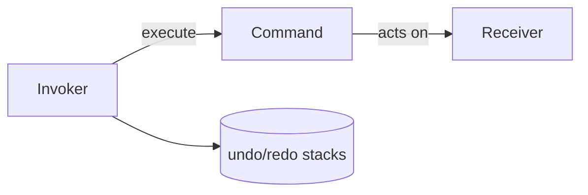
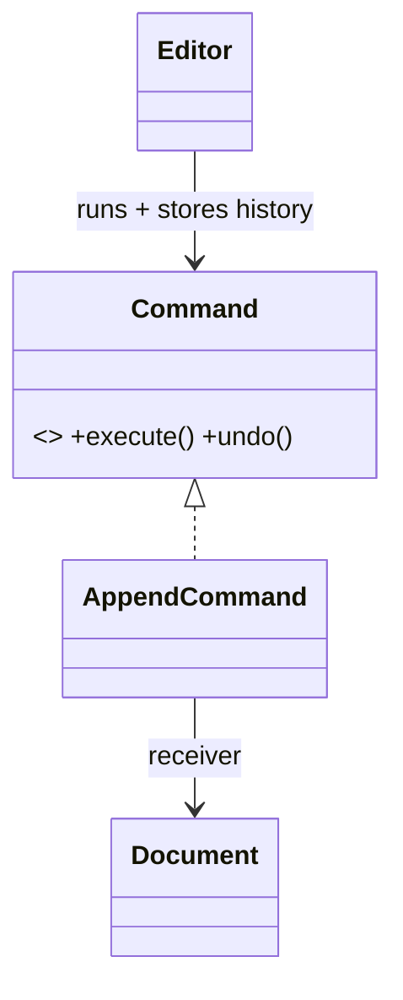

# Command Pattern

> Command turns a request into a standalone object — capturing the action, its parameters, and (often) how to undo it — enabling queues, logs, undo/redo, and decoupling of invoker from receiver.

## Introduction

Command encapsulates "do X" as an object with an `execute()` (and often `undo()`). The invoker triggers commands without knowing what they do; the command knows its receiver and parameters. This enables undo/redo, macro recording, queuing, and transactional operations.

## Why this concept exists

Sometimes an action must be **reified** — stored, queued, logged, undone, or replayed. A plain method call can't be any of those. Wrapping it as a Command object makes actions first-class: schedule them, keep a history, reverse them.

## Real-world analogy

A **restaurant order ticket**: the waiter (invoker) writes an order (command) and hands it to the kitchen (receiver). The ticket can be queued, re-fired, or voided (undo). The waiter doesn't cook; the ticket carries all the info.

## Problem Statement

A text editor needs undo/redo for actions like insert and delete. You'll model each action as a Command with `execute`/`undo`, and keep an undo/redo stack in an invoker.

## Internal Working



- **Command interface:** `execute()` and optionally `undo()`.
- **Concrete command:** holds the receiver + params; implements do/undo.
- **Invoker:** runs commands and maintains history (stacks) for undo/redo.
- **Receiver:** the object the command operates on.
- Dart-friendly: a command can be a pair of closures (`do`, `undo`).

## Memory Representation

Command objects + a history stack retain state needed to undo; unbounded history grows memory — cap it.

## Compiler Behavior / Runtime Behavior

Not special; `execute`/`undo` run at invocation; history push/pop manages reversibility.

## Flutter Engine Behavior

Not applicable. (Flutter `Intent`/`Action`/`Shortcuts` is a Command-like system; undo/redo stacks in editors use Command.)

## Dart VM Behavior

Not applicable.

## Examples

```dart
abstract interface class Command {
  void execute();
  void undo();
}

class Document {
  final StringBuffer _buf = StringBuffer();
  String get text => _buf.toString();
  void append(String s) => _buf.write(s);
  void removeLast(int n) {
    final t = text;
    _buf
      ..clear()
      ..write(t.substring(0, t.length - n));
  }
}

class AppendCommand implements Command {
  final Document doc;
  final String textToAdd;
  AppendCommand(this.doc, this.textToAdd);
  @override
  void execute() => doc.append(textToAdd);
  @override
  void undo() => doc.removeLast(textToAdd.length); // reverse
}

class Editor {
  final _undo = <Command>[];
  final _redo = <Command>[];

  void run(Command c) {
    c.execute();
    _undo.add(c);
    _redo.clear();
  }
  void undo() {
    if (_undo.isEmpty) return;
    final c = _undo.removeLast()..undo();
    _redo.add(c);
  }
  void redo() {
    if (_redo.isEmpty) return;
    final c = _redo.removeLast()..execute();
    _undo.add(c);
  }
}

void main() {
  final doc = Document();
  final editor = Editor();
  editor.run(AppendCommand(doc, 'Hello '));
  editor.run(AppendCommand(doc, 'World'));
  print(doc.text); // Hello World
  editor.undo();
  print(doc.text); // Hello
  editor.redo();
  print(doc.text); // Hello World
}
```

## Diagrams



## Common Mistakes

| Mistake | Why | Fix |
|---------|-----|-----|
| Command without enough state to undo | Undo impossible/incorrect | Capture what's needed to reverse |
| Unbounded history | Memory growth | Cap history size |
| Business logic in the invoker | Coupling | Keep invoker generic; logic in commands/receivers |
| Non-idempotent redo | Corrupts state | Ensure execute/undo are exact inverses |

## Best Practices

- Make `execute`/`undo` **exact inverses**; capture the minimal state to reverse.
- Keep the **invoker generic** (runs any command + manages history).
- Cap history to bound memory.
- Consider closure-pair commands for lightweight cases.

## Performance

History retains state; cap it. Command dispatch itself is cheap.

## Advantages / Disadvantages

- **+** Undo/redo, queuing, logging, macros, decoupled invoker/receiver, transactional actions.
- **−** Many command classes; undo state management; memory from history.

## Interview Questions

1. **🟢 What does Command encapsulate?** — A request as an object: the action, its parameters, and (often) how to undo it.
2. **🟢 What capabilities does Command enable?** — Undo/redo, queuing, logging/replay, macros, and decoupling invoker from receiver.
3. **🟡 What's needed to support undo?** — The command must capture enough state to reverse its effect (`undo()` is the inverse of `execute()`).
4. **🟡 Who are the invoker and receiver?** — Invoker triggers commands and manages history; receiver is the object the command acts on.
5. **🟡 How is Command done idiomatically in Dart?** — Often as a pair of closures (`execute`, `undo`) rather than a full class per action.
6. **🔴 How do undo/redo stacks interact?** — Executing pushes to undo (clears redo); undo pops to redo; redo pops back to undo.
7. **🔴 Where does Flutter use Command-like structures?** — The `Actions`/`Intent`/`Shortcuts` system maps intents to actions (commands).

## Senior Engineer Tips

- For editors/drawing/forms, model each user action as a command from day one — retrofitting undo later is painful.
- Prefer capturing inverse *data* (e.g., removed text) over recomputing it; recomputation is error-prone.
- Bound and possibly serialize history for crash recovery in production editors.

## Architect Perspective

Command reifies actions, enabling undo/redo, offline action queues (record commands, replay on reconnect — [Module 19](../19%20Offline%20First/README.md)), audit logs, and macro systems. It cleanly separates "what to do" from "when/whether to do it," which is powerful for resilient, user-forgiving apps.

## Summary

- Command wraps an action (+undo) as an object; invoker runs and records it.
- Enables undo/redo, queuing, logging, macros; keep execute/undo exact inverses; cap history.
- Use closure pairs in Dart for lightweight commands.

## Revision Notes

- Command = request-as-object (`execute`/`undo`); invoker + receiver.
- Enables undo/redo, queue, log, macros; capture inverse state; cap history.
- Dart: closure-pair commands. Flutter: Actions/Intents.

## Practice Questions

1. What state must an `AppendCommand` capture to undo?
2. How do the undo and redo stacks stay consistent?
3. When is a closure-pair command better than a class?

## Coding Questions

1. Add a `DeleteCommand` (with undo) to the editor.
2. Implement a `MacroCommand` that groups several commands into one undoable unit.
3. Build a queued command runner that records and replays commands.

## Mini Project

**Undoable text editor (pure Dart):** Implement `Command` with `Append`/`Delete`/`Replace`, an `Editor` invoker with bounded undo/redo, and a macro command. Test undo/redo correctness across sequences. Acceptance: execute/undo are exact inverses; history bounded; invoker generic; `dart analyze` clean.
