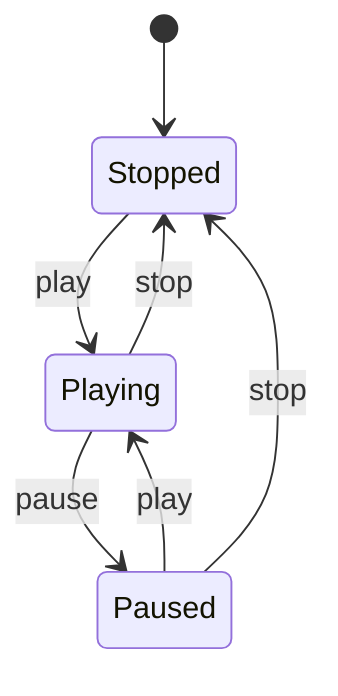
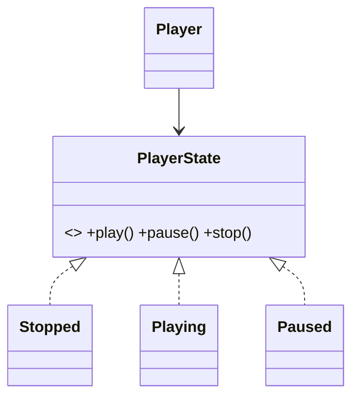

# State Pattern

> State lets an object change its behavior when its internal state changes — as if it changed class — replacing sprawling state-checking conditionals with polymorphic state objects.

## Introduction

State encapsulates each state of an object as its own class implementing a shared interface; the context delegates behavior to its current state object, which can also trigger transitions. It turns a tangled state machine of `if (state == ...)` into clean, self-contained states.

## Why this concept exists

Objects with modal behavior (a document that's Draft/Moderated/Published, a media player that's Stopped/Playing/Paused) accumulate conditionals in every method (`if (state == playing) ... else if ...`). State replaces that with polymorphism: each state class knows its own behavior and valid transitions.

## Real-world analogy

A **traffic light**: in "Green" it behaves one way and transitions to "Yellow"; "Yellow" → "Red"; "Red" → "Green." Each color (state) defines what happens next. The intersection (context) just delegates to the current light.

## Problem Statement

A media player behaves differently for `play`/`pause`/`stop` depending on whether it's Stopped, Playing, or Paused, and only certain transitions are valid. You'll model each state as a class handling those actions and transitions.

## Internal Working



- **State interface** declares the actions (`play`, `pause`, `stop`).
- **Concrete states** implement behavior + set the context's next state.
- **Context** holds the current state and delegates; states call back to switch it.
- Dart 3 alternative: a **sealed class** of states + exhaustive `switch` in the context (data-oriented state machine).

## Memory Representation

The context holds one current-state reference; states are usually stateless (shareable/`const`).

## Compiler Behavior / Runtime Behavior

Delegation + transition at runtime. With sealed states, the compiler enforces exhaustive handling.

## Flutter Engine Behavior

Not applicable, but modeling UI/BLoC state as sealed states + exhaustive `switch` is idiomatic Flutter ([Module 11](../11%20State%20Management/README.md)).

## Dart VM Behavior

Not applicable.

## Examples

```dart
abstract interface class PlayerState {
  void play(Player p);
  void pause(Player p);
  void stop(Player p);
  String get name;
}

class Stopped implements PlayerState {
  const Stopped();
  @override
  String get name => 'Stopped';
  @override
  void play(Player p) { print('start'); p.state = const Playing(); }
  @override
  void pause(Player p) => print('cannot pause when stopped');
  @override
  void stop(Player p) => print('already stopped');
}
class Playing implements PlayerState {
  const Playing();
  @override
  String get name => 'Playing';
  @override
  void play(Player p) => print('already playing');
  @override
  void pause(Player p) { print('pause'); p.state = const Paused(); }
  @override
  void stop(Player p) { print('stop'); p.state = const Stopped(); }
}
class Paused implements PlayerState {
  const Paused();
  @override
  String get name => 'Paused';
  @override
  void play(Player p) { print('resume'); p.state = const Playing(); }
  @override
  void pause(Player p) => print('already paused');
  @override
  void stop(Player p) { print('stop'); p.state = const Stopped(); }
}

class Player {
  PlayerState state = const Stopped();
  void play() => state.play(this);
  void pause() => state.pause(this);
  void stop() => state.stop(this);
}

void main() {
  final p = Player();
  p.play();  // start   (Stopped -> Playing)
  p.pause(); // pause   (Playing -> Paused)
  p.play();  // resume  (Paused -> Playing)
  p.stop();  // stop    (Playing -> Stopped)
  p.pause(); // cannot pause when stopped
}
```

## Diagrams



## Common Mistakes

| Mistake | Why | Fix |
|---------|-----|-----|
| `if (state == ...)` in every method | The problem State solves | Delegate to state objects |
| States mutating shared context data unsafely | Hidden coupling | Keep transitions explicit and localized |
| Illegal transitions unhandled | Invalid states reachable | Each state defines/blocks its transitions |
| Stateful state objects | Surprising reuse bugs | Keep states stateless (`const`) |

## Best Practices

- One class per state; each defines behavior + valid transitions.
- Keep states **stateless/`const`** (shareable); put mutable data in the context.
- Handle/deny invalid transitions explicitly.
- Consider **sealed classes + exhaustive `switch`** for a data-oriented alternative (great with Dart 3 and BLoC).

## Performance

Negligible; stateless states are shared singletons.

## Advantages / Disadvantages

- **+** Removes conditional sprawl, localizes per-state behavior + transitions, easy to add states.
- **−** More classes; transition logic spread across states can be harder to see at a glance (a state diagram helps).

## Interview Questions

1. **🟢 What is the State pattern?** — Encapsulating each state as an object so an object's behavior changes with its internal state, replacing conditionals with polymorphism.
2. **🟢 State vs Strategy?** — Same structure; Strategy's algorithm is chosen by the client and independent of state; State's behavior depends on internal state and states often trigger transitions.
3. **🟡 How are transitions handled?** — The current state performs the action and sets the context's next state.
4. **🟡 Dart 3 alternative to classic State?** — A `sealed` class of states + exhaustive `switch` in the context (data-oriented state machine).
5. **🟡 Why keep states stateless?** — So they're reusable/shareable (`const`) and free of cross-use state bugs.
6. **🔴 How does State prevent invalid transitions?** — Each state only implements the transitions valid from it (others are no-ops or errors), making illegal moves explicit.
7. **🔴 How does State relate to BLoC?** — BLoC often models states as a sealed family and transitions via events — the data-oriented cousin of the State pattern.

## Senior Engineer Tips

- Draw the state diagram first; it maps 1:1 to states/transitions and reveals illegal moves.
- For UI, prefer sealed-class states + exhaustive `switch` (compiler-enforced completeness) over classic State classes.
- Keep transition rules with the state that owns them; centralizing them re-creates the conditional sprawl.

## Architect Perspective

State turns implicit, bug-prone modal logic into explicit, testable state machines — critical for flows like auth, checkout, onboarding, and media. The Dart 3 sealed-class variant integrates directly with modern state management, making the full state space explicit and exhaustively handled ([Modules 11, 01](../11%20State%20Management/README.md)).

## Summary

- State encapsulates per-state behavior + transitions as objects; context delegates.
- Removes conditional sprawl; keep states stateless; deny invalid transitions.
- Distinct from Strategy (internal-state vs client-chosen); Dart 3 sealed classes are the modern variant.

## Revision Notes

- State = behavior varies by internal state; states define transitions.
- Context delegates to current state; keep states stateless (`const`).
- State (internal, self-transitioning) vs Strategy (client-chosen algorithm).
- Dart 3: sealed states + exhaustive `switch`; ties to BLoC.

## Practice Questions

1. How does State differ from Strategy?
2. Why keep state objects stateless?
3. When would you use sealed classes instead of State classes?

## Coding Questions

1. Add a `Buffering` state to the media player with valid transitions.
2. Model a `Turnstile` (Locked/Unlocked) with coin/push events.
3. Reimplement the player as a sealed-class state machine with exhaustive `switch`.

## Mini Project

**Order lifecycle state machine (pure Dart):** Model `Draft → Placed → Shipped → Delivered` (+ `Cancelled`) as State classes with valid transitions and denied illegal ones; then reimplement with sealed classes + exhaustive `switch`. Test all valid/invalid transitions. Acceptance: no conditional sprawl; illegal transitions blocked; both implementations tested; `dart analyze` clean.
