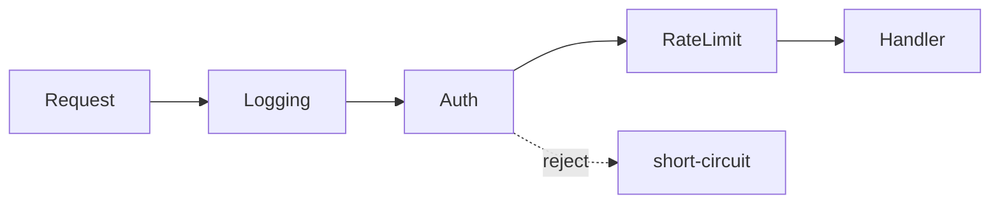
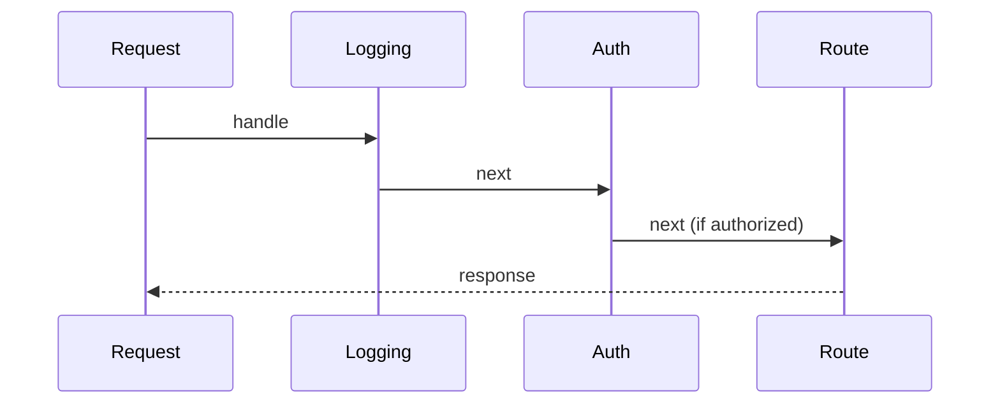

# Chain of Responsibility Pattern

> Chain of Responsibility passes a request along a chain of handlers until one handles it — decoupling sender from receiver and letting you add/reorder handlers freely.

## Introduction

Chain of Responsibility (CoR) links handlers so each either processes a request or passes it to the next. The sender doesn't know which handler will act. It's the pattern behind middleware pipelines, event bubbling, and validation chains.

## Why this concept exists

When multiple objects might handle a request and the handler isn't known in advance (or several should get a chance), hard-coding the selection couples the sender to all of them. CoR lets each handler decide independently, and lets you insert/remove/reorder handlers without touching the sender.

## Real-world analogy

**Escalating support tiers**: your ticket goes to L1; if they can't solve it, it passes to L2, then L3. Each tier either resolves it or forwards it. You (sender) don't pick the tier; the chain routes it.

## Problem Statement

An HTTP server must run a request through middleware: logging → auth → rate-limit → handler. Each stage may handle/short-circuit or pass along. You'll build a handler chain that's easy to reorder and extend.

## Internal Working



- Each **handler** has a reference to the **next** and a `handle(request)` that either processes and/or delegates to `next`.
- A handler can **short-circuit** (stop the chain) or **pass through**.
- Dart-friendly: a list of handler **functions** (middleware) composed into a pipeline is often cleaner than a linked-object chain.

## Memory Representation

A linked list of handlers (or a list of functions); negligible.

## Compiler Behavior / Runtime Behavior

Requests traverse the chain at runtime until handled or exhausted.

## Flutter Engine Behavior

Conceptually related: **gesture/event propagation** and `Notification` bubbling travel up the tree until handled ([Module 08](../08%20Widget%20Lifecycle/README.md)).

## Dart VM Behavior

Not applicable.

## Examples

```dart
class Request {
  final String path;
  final Map<String, String> headers;
  Request(this.path, this.headers);
}

abstract class Handler {
  Handler? _next;
  Handler setNext(Handler next) { _next = next; return next; } // chain builder
  String handle(Request req) => _next?.handle(req) ?? 'no handler';
}

class LoggingHandler extends Handler {
  @override
  String handle(Request req) {
    print('LOG ${req.path}');
    return super.handle(req); // pass along
  }
}
class AuthHandler extends Handler {
  @override
  String handle(Request req) {
    if (!req.headers.containsKey('Authorization')) {
      return '401 Unauthorized'; // short-circuit
    }
    return super.handle(req);
  }
}
class RouteHandler extends Handler {
  @override
  String handle(Request req) =>
      req.path == '/home' ? '200 OK home' : '404 Not Found';
}

void main() {
  final chain = LoggingHandler();
  chain.setNext(AuthHandler()).setNext(RouteHandler()); // build the chain

  print(chain.handle(Request('/home', {'Authorization': 'x'}))); // 200 OK home
  print(chain.handle(Request('/home', {})));                     // 401 Unauthorized
}
```

```dart
// Idiomatic Dart: middleware as a list of functions
typedef Next = String Function();
typedef Middleware = String Function(Request req, Next next);
// compose a List<Middleware> into a pipeline — easy to reorder/insert.
```

## Diagrams



## Common Mistakes

| Mistake | Why | Fix |
|---------|-----|-----|
| No terminal handler | Request falls off the end unhandled | Provide a default/terminal handler |
| Handlers with hidden dependencies on order | Fragile | Make ordering explicit and documented |
| Handler doing too much | SRP violation | One concern per handler |
| Silent drop (neither handle nor pass) | Lost requests | Ensure every handler passes or handles |

## Best Practices

- Ensure a **terminal handler** (default response) so requests are always resolved.
- Keep each handler **single-purpose**; compose the pipeline explicitly.
- Prefer a **list-of-functions middleware** pipeline in Dart for readability/reordering.
- Allow handlers to short-circuit clearly (return a result) vs pass (`next`).

## Performance

O(chain length) per request; keep chains reasonable and handlers light.

## Advantages / Disadvantages

- **+** Decouples sender from handlers, easy to add/reorder/remove, single-purpose stages.
- **−** Request may go unhandled if misconfigured; harder to trace flow; ordering matters.

## Interview Questions

1. **🟢 What does Chain of Responsibility do?** — Passes a request along a chain of handlers until one handles it, decoupling sender from receiver.
2. **🟢 Give a real example.** — HTTP middleware (logging/auth/rate-limit), support escalation, event bubbling.
3. **🟡 How does a handler short-circuit?** — By handling the request and not calling `next` (returning a result immediately).
4. **🟡 What's the risk if there's no terminal handler?** — Requests fall off the end unhandled; always provide a default.
5. **🟡 Dart-idiomatic form?** — A composed list of middleware functions rather than a linked chain of objects.
6. **🔴 CoR vs Decorator?** — Both form chains; Decorator always delegates and augments (all layers run), CoR may stop at the first handler that acts.
7. **🔴 Where is CoR-like behavior in Flutter?** — Gesture/notification propagation bubbling up the widget tree until handled.

## Senior Engineer Tips

- Model cross-cutting request processing (auth, logging, validation, rate-limiting) as ordered middleware — trivially testable per stage.
- Make the pipeline data (a list) so ordering/feature-flagging is configuration, not code edits (OCP).
- Always include a catch-all terminal handler.

## Architect Perspective

CoR structures request/event processing into composable, reorderable stages — the model for interceptors, middleware, and validation pipelines across networking, auth, and event systems ([Modules 16, 17](../16%20Networking/README.md)). It keeps cross-cutting concerns modular and independently testable.

## Summary

- CoR passes a request through handlers until one handles it; sender is decoupled.
- Ensure a terminal handler; keep handlers single-purpose; prefer function-based middleware in Dart.
- Related to Decorator (chain) but may short-circuit; mirrors event bubbling.

## Revision Notes

- CoR = request travels handlers until handled; may short-circuit.
- Terminal/default handler required; one concern per handler.
- Dart: middleware as list of functions; ordering = config (OCP).
- Vs Decorator (all run + augment); Flutter event bubbling is CoR-like.

## Practice Questions

1. How does a handler short-circuit the chain?
2. Why is a terminal handler necessary?
3. How does CoR differ from Decorator?

## Coding Questions

1. Add a `RateLimitHandler` to the middleware chain.
2. Reimplement the chain as a composed list of middleware functions.
3. Build a validation chain (`nonEmpty` → `email` → `maxLength`) returning the first failure.

## Mini Project

**Request middleware pipeline (pure Dart):** Implement a CoR pipeline (logging/auth/rate-limit/route) both as linked handlers and as composed middleware functions, with a terminal 404 handler. Test short-circuit and pass-through paths, and reordering. Acceptance: no unhandled requests; handlers single-purpose; ordering configurable; `dart analyze` clean.
