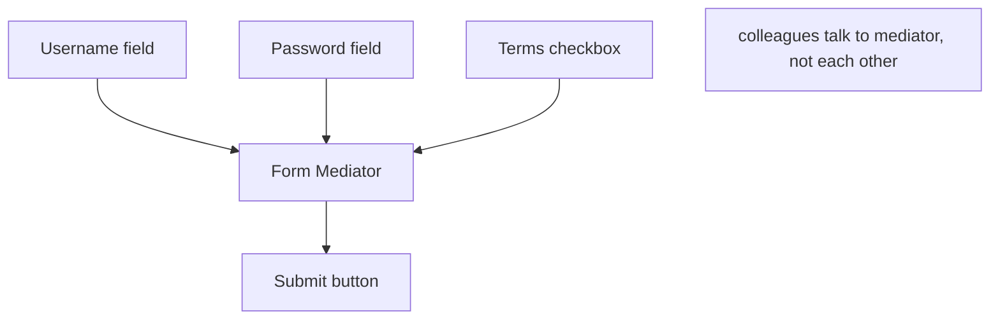
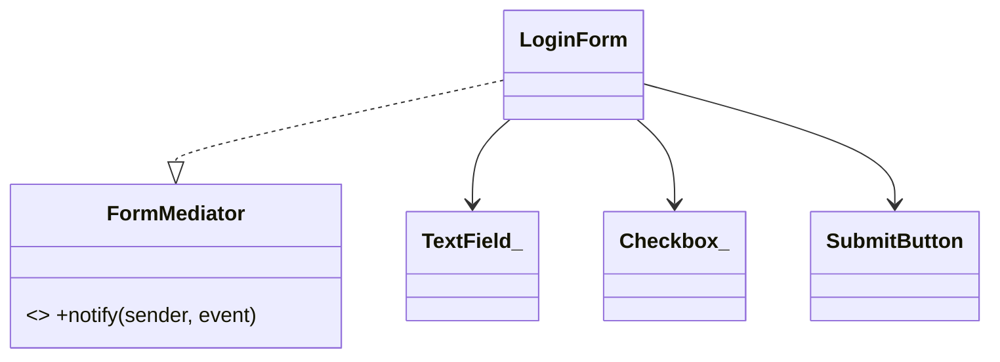

# Mediator Pattern

> Mediator centralizes complex communication between objects so they talk through a hub instead of referencing each other directly — turning a tangled many-to-many web into a clean hub-and-spoke.

## Introduction

Mediator introduces a central object that coordinates interactions among "colleague" objects. Colleagues notify the mediator of events; the mediator decides how others should react. This removes direct references between colleagues.

## Why this concept exists

When many objects interact directly, you get an `N×N` web of references — a change to one ripples everywhere and reuse becomes impossible. Mediator collapses that into `N` relationships (each colleague ↔ mediator), centralizing the interaction logic in one place.

## Real-world analogy

**Air traffic control**: planes (colleagues) don't coordinate landings by talking to each other directly (chaos); they all talk to the control tower (mediator), which sequences everyone. One hub, clear rules.

## Problem Statement

A form has fields whose interactions are tangled: enabling "Submit" depends on username + password + terms; changing one field affects others. Wiring each field to every other field is a mess. You'll route all changes through a mediator (the form controller).

## Internal Working



- **Mediator interface** with a `notify(sender, event)` method.
- **Colleagues** hold a reference to the mediator (not to each other) and call `notify` on changes.
- The **concrete mediator** encapsulates the interaction rules and updates colleagues.
- In Flutter, a state controller/BLoC/ViewModel often *is* the mediator for a screen's widgets.

## Memory Representation

Colleagues reference the mediator; the mediator references colleagues — a hub, not a mesh.

## Compiler Behavior / Runtime Behavior

Events flow to the mediator, which orchestrates responses at runtime.

## Flutter Engine Behavior

Not applicable, but a screen's **controller/ViewModel/BLoC** acts as a mediator between its widgets, centralizing cross-widget interaction ([Modules 11, 43](../11%20State%20Management/README.md)).

## Dart VM Behavior

Not applicable.

## Examples

```dart
abstract interface class FormMediator {
  void notify(String sender, String event);
}

class TextField_ {
  final String name;
  final FormMediator mediator;
  String value = '';
  TextField_(this.name, this.mediator);
  void setValue(String v) {
    value = v;
    mediator.notify(name, 'changed'); // tell the hub, not other fields
  }
}

class Checkbox_ {
  final FormMediator mediator;
  bool checked = false;
  Checkbox_(this.mediator);
  void toggle() {
    checked = !checked;
    mediator.notify('terms', 'changed');
  }
}

class SubmitButton {
  bool enabled = false;
}

class LoginForm implements FormMediator {
  late final TextField_ username = TextField_('username', this);
  late final TextField_ password = TextField_('password', this);
  late final Checkbox_ terms = Checkbox_(this);
  final SubmitButton submit = SubmitButton();

  @override
  void notify(String sender, String event) {
    // centralized interaction rules:
    submit.enabled = username.value.isNotEmpty &&
        password.value.length >= 6 &&
        terms.checked;
    print('submit enabled: ${submit.enabled}');
  }
}

void main() {
  final form = LoginForm();
  form.username.setValue('ada');   // submit enabled: false
  form.password.setValue('secret'); // submit enabled: false
  form.terms.toggle();              // submit enabled: true
}
```

## Diagrams



## Common Mistakes

| Mistake | Why | Fix |
|---------|-----|-----|
| Colleagues still referencing each other | Defeats the pattern | Route all interaction through the mediator |
| Mediator becoming a God object | Absorbs all logic | Split by screen/area; keep colleagues cohesive |
| Overusing for simple interactions | Needless indirection | Use direct calls for trivial cases |
| Mediator with hidden global state | Coupling | Scope mediators; inject dependencies |

## Best Practices

- Route colleague interactions through the mediator; colleagues stay ignorant of each other.
- Keep mediators **scoped** (per screen/feature) to avoid God objects.
- Recognize that a **ViewModel/BLoC/controller** is your Flutter mediator — put cross-widget rules there.
- Keep colleagues cohesive (SRP); mediator owns only the *coordination*.

## Performance

Negligible; centralized dispatch.

## Advantages / Disadvantages

- **+** Reduces coupling (N×N → N), centralizes interaction logic, reusable colleagues.
- **−** Mediator can bloat into a God object; centralization can hide flow.

## Interview Questions

1. **🟢 What does Mediator do?** — Centralizes communication between objects so they interact via a hub rather than direct references.
2. **🟢 What problem does it solve?** — The tangled many-to-many (`N×N`) coupling of objects that reference each other.
3. **🟡 Mediator vs Observer?** — Observer is one-to-many notification (subject→observers); Mediator coordinates many-to-many interactions with centralized *logic*.
4. **🟡 Mediator vs Facade?** — Facade is a one-way simplifier over a subsystem; Mediator manages bidirectional interaction among peers.
5. **🟡 What's the Flutter analogue?** — A screen's ViewModel/BLoC/controller mediating its widgets.
6. **🔴 What's the main risk?** — The mediator becoming a God object; mitigate by scoping per feature and keeping colleagues cohesive.
7. **🔴 When is Mediator overkill?** — For a couple of objects with simple, stable interactions — direct calls are clearer.

## Senior Engineer Tips

- In Flutter, don't wire widgets to each other — let the controller/BLoC mediate; that's the pattern in action and keeps widgets dumb.
- Scope mediators tightly (one per screen/flow) to prevent God-object drift.
- Keep coordination rules in the mediator and domain rules in the domain — don't conflate them.

## Architect Perspective

Mediator localizes interaction complexity, which is exactly the role of presentation-layer controllers (ViewModel/BLoC) coordinating UI components. It keeps components reusable and decoupled, and confines cross-component logic to one testable place — a cornerstone of MVVM/BLoC screen design ([Modules 43, 11](../43%20MVVM/README.md)).

## Summary

- Mediator centralizes many-to-many interaction into a hub; colleagues don't reference each other.
- Reduces coupling but risks God-object bloat — scope it per feature.
- Your Flutter ViewModel/BLoC is a mediator; distinct from Observer (notify) and Facade (simplify).

## Revision Notes

- Mediator = hub for object interaction (N×N → N); colleagues ↔ mediator only.
- Risk: God object → scope per screen/feature.
- Mediator (bidirectional coordination) vs Observer (notify) vs Facade (simplify).
- Flutter: ViewModel/BLoC/controller = mediator.

## Practice Questions

1. How does Mediator differ from Observer and Facade?
2. Why can a mediator become a God object, and how do you prevent it?
3. Why is a BLoC/ViewModel a mediator?

## Coding Questions

1. Build a `WizardMediator` coordinating next/back/step-validity across steps.
2. Model a chat-room mediator routing messages between users.
3. Refactor mutually-referencing UI components to communicate via a mediator.

## Mini Project

**Login form mediator (pure Dart):** Implement a `LoginForm` mediator coordinating username/password/terms/submit with centralized enable rules; colleagues never reference each other. Test that field changes correctly toggle submit. Acceptance: no colleague-to-colleague references; rules centralized; mediator scoped to the form; `dart analyze` clean.
