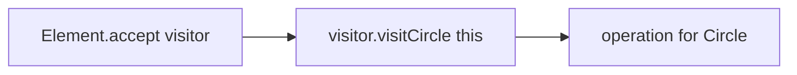
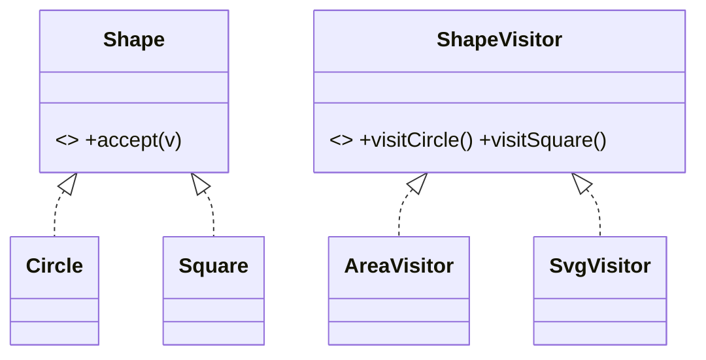

# Visitor Pattern

> Visitor lets you add new operations to a set of object types **without modifying those types** — you move the operation into a separate "visitor" object that each element accepts.

## Introduction

Visitor separates an algorithm from the object structure it operates on. Elements expose an `accept(visitor)` method; the visitor has a `visitXxx` method per element type. Adding a new operation = a new visitor, not edits to every element class.

## Why this concept exists

When you have a stable set of types and *many* operations over them (a compiler AST: type-check, optimize, print, evaluate), putting every operation as a method on every type bloats them and violates SRP/OCP. Visitor externalizes operations so new ones don't touch the types. The tradeoff: adding a new *type* touches every visitor.

## Real-world analogy

A **tax inspector** (visitor) visits different businesses (elements) — a restaurant, a factory, a shop — applying the right assessment for each. To add a new kind of inspection (safety audit), you send a new inspector; the businesses don't change.

## Problem Statement

You have a stable `Shape` hierarchy (`Circle`, `Square`) and keep needing new operations (area, perimeter, export-to-SVG, describe). Adding each as a method on every shape bloats them. You'll add operations as visitors instead.

## Internal Working



- **Element interface:** `accept(Visitor v)` → calls `v.visitConcrete(this)` (double dispatch).
- **Visitor interface:** one `visitX(X)` per concrete element.
- **Concrete visitors** implement an operation across all element types.
- **Double dispatch:** the element picks the visit method by its type; the visitor picks the operation — together selecting the right code.
- Dart alternative: **sealed classes + exhaustive `switch`** achieves the same "operations outside the types" with less ceremony.

## Memory Representation

Not applicable — ordinary objects; visitors are usually stateless (or accumulate a result).

## Compiler Behavior / Runtime Behavior

Double dispatch resolves at runtime via `accept`→`visitX`. With sealed classes, the compiler enforces handling all types in the `switch`.

## Flutter Engine Behavior

Not applicable directly. (The element tree is walked by visitor-like mechanisms; render tree operations traverse nodes.)

## Dart VM Behavior

Not applicable.

## Examples

```dart
// Classic Visitor
abstract interface class ShapeVisitor<R> {
  R visitCircle(Circle c);
  R visitSquare(Square s);
}

abstract interface class Shape {
  R accept<R>(ShapeVisitor<R> v);
}

class Circle implements Shape {
  final double r;
  Circle(this.r);
  @override
  R accept<R>(ShapeVisitor<R> v) => v.visitCircle(this);
}
class Square implements Shape {
  final double side;
  Square(this.side);
  @override
  R accept<R>(ShapeVisitor<R> v) => v.visitSquare(this);
}

// New operation = new visitor (no edits to Circle/Square)
class AreaVisitor implements ShapeVisitor<double> {
  @override
  double visitCircle(Circle c) => 3.14159 * c.r * c.r;
  @override
  double visitSquare(Square s) => s.side * s.side;
}
class SvgVisitor implements ShapeVisitor<String> {
  @override
  String visitCircle(Circle c) => '<circle r="${c.r}"/>';
  @override
  String visitSquare(Square s) => '<rect w="${s.side}"/>';
}

void main() {
  final shapes = <Shape>[Circle(2), Square(3)];
  final area = AreaVisitor();
  final svg = SvgVisitor();
  for (final s in shapes) {
    print('area=${s.accept(area)} svg=${s.accept(svg)}');
  }
}
```

```dart
// Dart 3 alternative: sealed classes + switch (no accept/visit boilerplate)
// sealed class Shape2 {}  ... final area = switch (shape) { Circle2() => ..., Square2() => ... };
```

## Diagrams



## Common Mistakes

| Mistake | Why | Fix |
|---------|-----|-----|
| Visitor over an unstable type set | Every new type edits all visitors | Use only when types are stable |
| Visitor boilerplate where a `switch` suffices | Overhead | Prefer sealed classes + `switch` in Dart |
| Visitors mutating elements unexpectedly | Hidden coupling | Keep visitors focused; document side effects |
| Forgetting double dispatch (type-checking inside visitor) | Defeats the pattern | Use `accept`/`visitX` |

## Best Practices

- Use Visitor when the **type set is stable** but **operations grow**.
- In Dart, strongly consider **sealed classes + exhaustive `switch`** — same benefit, far less boilerplate, compiler-enforced completeness.
- Keep visitors single-operation (SRP); parameterize result type (`Visitor<R>`).

## Performance

Negligible (two virtual calls per element). Sealed `switch` may be faster/clearer.

## Advantages / Disadvantages

- **+** Add operations without editing types (OCP for operations), gathers a related operation in one place.
- **−** Adding a *type* touches every visitor; boilerplate; awkward vs Dart's sealed `switch`.

## Interview Questions

1. **🟢 What does Visitor enable?** — Adding new operations over a set of types without modifying those types.
2. **🟢 What's the tradeoff?** — Easy to add operations, hard to add types (every visitor must handle the new type).
3. **🟡 What is double dispatch?** — Two virtual calls (`accept` picks element type, `visitX` picks operation) select the correct code — Dart lacks multi-methods, so Visitor simulates it.
4. **🟡 Dart 3 alternative to Visitor?** — Sealed classes + exhaustive `switch`: operations live outside the types with compiler-enforced completeness and no `accept` boilerplate.
5. **🟡 When is Visitor appropriate?** — Stable type hierarchies with many/growing operations (ASTs, document models).
6. **🔴 Why does Visitor violate OCP for types but satisfy it for operations?** — New operations are new visitors (closed types, open operations); new types force edits across all visitors.
7. **🔴 Where is Visitor common?** — Compilers/interpreters (AST traversal), serialization over object graphs.

## Senior Engineer Tips

- In modern Dart, reach for **sealed classes + `switch`** first; use classic Visitor mainly when integrating with code that expects the `accept`/`visit` shape.
- If your types change more often than your operations, Visitor is the wrong pattern — flip to methods-on-types or polymorphism.
- Parameterize the visitor's return type (`Visitor<R>`) for reusable traversal.

## Architect Perspective

Visitor (or its sealed-class equivalent) is the tool for operation-rich, type-stable structures like ASTs, rule engines, and document models — keeping the many operations organized and the types clean. In Dart, sealed classes make this ergonomic and compiler-safe, aligning with pattern-matching state modeling ([Module 02](../01%20Dart%20Fundamentals/09_records_and_patterns.md)).

## Summary

- Visitor adds operations to a stable type set without editing the types (via double dispatch).
- Easy to add operations, hard to add types; boilerplate-heavy.
- In Dart, prefer sealed classes + exhaustive `switch` for the same benefit.

## Revision Notes

- Visitor = operations outside types via `accept`/`visitX` (double dispatch).
- Open for operations, closed for types (opposite of usual OCP).
- Dart alt: sealed classes + exhaustive `switch` (less boilerplate, compiler-checked).
- Use for stable types + many operations (ASTs).

## Practice Questions

1. Why is adding a new type expensive with Visitor?
2. What is double dispatch and why is it needed?
3. When would you use sealed `switch` instead?

## Coding Questions

1. Add a `PerimeterVisitor` without editing shape classes.
2. Reimplement the shapes example with sealed classes + `switch`.
3. Build an AST (`Num`/`Add`/`Mul`) with `EvalVisitor` and `PrintVisitor`.

## Mini Project

**Expression evaluator (pure Dart):** Model an AST (`Num`, `Add`, `Mul`) and implement `EvalVisitor` and `PrintVisitor` via Visitor; then reimplement with sealed classes + exhaustive `switch` and compare. Acceptance: new operation added without editing node types; sealed variant compiler-exhaustive; `dart analyze` clean.
