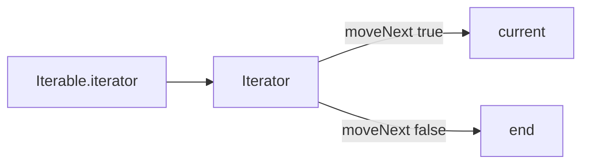
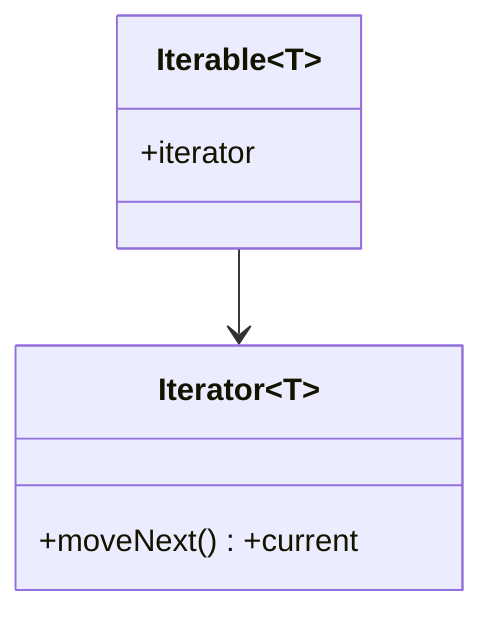

# Iterator Pattern

> Iterator provides a way to traverse a collection's elements sequentially without exposing its internal representation — the abstraction behind every `for-in` loop.

## Introduction

Iterator decouples traversal from the collection. A collection exposes an iterator that yields elements one at a time; clients traverse via a uniform interface regardless of the underlying structure (array, tree, linked list). Dart bakes this in via `Iterable`/`Iterator` and `for-in`.

## Why this concept exists

Different collections store data differently, but clients want a uniform way to walk them without knowing (or coupling to) the internals. Iterator provides that uniform traversal contract and allows multiple simultaneous/independent traversals and custom iteration orders.

## Real-world analogy

A **TV remote's channel-up button**: you move through channels one at a time without knowing how channels are stored internally. The remote (iterator) gives sequential access; the TV's storage stays hidden.

## Problem Statement

You have a custom tree/collection and want clients to loop with `for-in` and use `map`/`where` without exposing its internal nodes. You'll implement `Iterable`/`Iterator` (and the far simpler `sync*` generator).

## Internal Working



- **Iterator interface:** `moveNext()` advances and returns whether an element exists; `current` gives it.
- **Iterable interface:** exposes `iterator` (a fresh iterator each call → supports multiple traversals).
- Implementing `Iterable`/`Iterator` unlocks `for-in`, `map`, `where`, `fold`, etc., for free.
- **`sync*` generators** are the idiomatic Dart way to produce lazy iterables without hand-writing an iterator ([01 · collections](../01%20Dart%20Fundamentals/06_collections.md)).

## Memory Representation

An iterator holds a cursor/position into the collection; lazy iterables compute elements on demand (minimal memory).

## Compiler Behavior

`for-in` desugars to `iterator` + `moveNext`/`current`. `sync*` compiles to a lazy iterator state machine.

## Runtime Behavior

Traversal is lazy for `sync*`/lazy `Iterable`s; modifying a collection during iteration throws `ConcurrentModificationError`.

## Flutter Engine Behavior

Not applicable, but lazy iteration underpins `ListView.builder`-style on-demand construction (compute items as needed).

## Dart VM Behavior

Not applicable.

## Examples

```dart
// Custom collection made iterable via sync* (idiomatic Dart)
class Ring<T> extends Iterable<T> {
  final List<T> _items;
  Ring(this._items);

  @override
  Iterator<T> get iterator => _gen().iterator;

  Iterable<T> _gen() sync* {
    for (final x in _items) {
      yield x; // lazy, one at a time
    }
  }
}

// Hand-written Iterator (what for-in uses under the hood)
class Countdown extends Iterable<int> {
  final int from;
  Countdown(this.from);
  @override
  Iterator<int> get iterator => _CountdownIterator(from);
}
class _CountdownIterator implements Iterator<int> {
  int _n;
  _CountdownIterator(this._n) : _n = _n + 1; // will pre-decrement
  @override
  int current = 0;
  @override
  bool moveNext() {
    if (_n <= 0) return false;
    _n--;
    current = _n;
    return _n >= 0;
  }
}

void main() {
  final ring = Ring([1, 2, 3]);
  for (final x in ring) {
    print(x); // 1,2,3 — for-in works
  }
  print(ring.map((x) => x * 10).toList()); // [10,20,30] — Iterable methods free

  print(Countdown(3).toList()); // [3,2,1,0]

  // lazy generator:
  Iterable<int> naturals() sync* {
    var i = 0;
    while (true) {
      yield i++;
    }
  }
  print(naturals().take(4).toList()); // [0,1,2,3] — infinite, but lazy
}
```

## Diagrams



## Common Mistakes

| Mistake | Why | Fix |
|---------|-----|-----|
| Hand-writing iterators when `sync*` works | Boilerplate/bugs | Use `sync*` generators |
| Mutating a collection while iterating | `ConcurrentModificationError` | Iterate a copy or collect changes |
| Sharing one iterator across loops | Iterators are single-pass | Get a fresh `iterator` per traversal |
| Infinite generator without a bound | Hangs | Use `take`/conditions |

## Best Practices

- Prefer **`sync*` generators** and extending `Iterable` over hand-rolled iterators.
- Return a **fresh iterator** each time (supports multiple independent traversals).
- Keep iteration **lazy** for large/infinite sequences; bound with `take`.
- Don't mutate during iteration.

## Performance

Lazy iteration avoids materializing whole collections; `sync*` has small per-yield overhead — fine for typical use, avoid in ultra-hot inner loops if profiling shows cost.

## Advantages / Disadvantages

- **+** Uniform traversal, hides internals, supports lazy/infinite sequences and multiple traversals, unlocks all `Iterable` methods.
- **−** Hand-written iterators are fiddly (use `sync*`); single-pass; mutation-during-iteration hazard.

## Interview Questions

1. **🟢 What does Iterator provide?** — Sequential access to a collection's elements without exposing its internal structure.
2. **🟢 What's the Dart idiom for it?** — Extend `Iterable` and/or use `sync*` generators; `for-in` uses `iterator`/`moveNext`/`current`.
3. **🟡 Why return a fresh iterator each call?** — Iterators are single-pass/stateful; fresh ones enable multiple independent traversals.
4. **🟡 How do you make a lazy/infinite sequence?** — A `sync*` generator that `yield`s on demand, bounded by `take`/conditions.
5. **🟡 Why does mutating during iteration throw?** — It invalidates the iterator's cursor; Dart raises `ConcurrentModificationError`.
6. **🔴 `sync*` vs `async*`?** — `sync*` produces a lazy `Iterable` (pull); `async*` produces a `Stream` (push, async) ([02 · streams](../02%20Advanced%20Dart/03_streams.md)).
7. **🔴 How does implementing `Iterable` benefit you for free?** — You get `map`/`where`/`fold`/`take`/`for-in` etc. without extra code.

## Senior Engineer Tips

- Almost never hand-write an `Iterator` in Dart — `sync*` or extending `Iterable` is cleaner and correct.
- Expose custom collections as `Iterable` to hide internals yet give clients the full functional toolkit.
- For async sequences, reach for `Stream`/`async*`, not Iterator.

## Architect Perspective

Iterator standardizes traversal so client code is decoupled from data-structure internals — the basis of Dart's rich `Iterable` API and lazy pipelines. Lazy iteration underlies memory-efficient processing of large/streamed datasets, complementing streams for async and `ListView.builder` for on-demand UI ([Modules 01, 21](../01%20Dart%20Fundamentals/06_collections.md)).

## Summary

- Iterator gives uniform, internals-hiding sequential traversal; Dart provides it via `Iterable`/`Iterator` + `for-in`.
- Use `sync*` generators over hand-written iterators; keep iteration lazy; return fresh iterators.
- `sync*` = lazy `Iterable` (pull); `async*` = `Stream` (push).

## Revision Notes

- Iterator = sequential access, hides internals; `moveNext`/`current`.
- Dart: extend `Iterable` / `sync*` generator → `for-in` + all Iterable methods.
- Fresh iterator per traversal; no mutation during iteration.
- `sync*` (Iterable) vs `async*` (Stream).

## Practice Questions

1. Why prefer `sync*` over a hand-written `Iterator`?
2. How do you make a lazy infinite sequence safely?
3. `sync*` vs `async*`?

## Coding Questions

1. Make a custom `Matrix` iterable in row-major order via `sync*`.
2. Implement a lazy `fibonacci()` generator and take the first 10.
3. Extend `Iterable` on a tree to yield nodes in-order.

## Mini Project

**Custom iterable collection (pure Dart):** Implement a `LinkedList<T>` (or tree) that extends `Iterable<T>` using `sync*`, supporting `for-in`, `map`, `where`, and multiple independent traversals, plus a lazy generator utility. Add tests. Acceptance: internals hidden; fresh iterator per traversal; lazy where appropriate; `dart analyze` clean.
