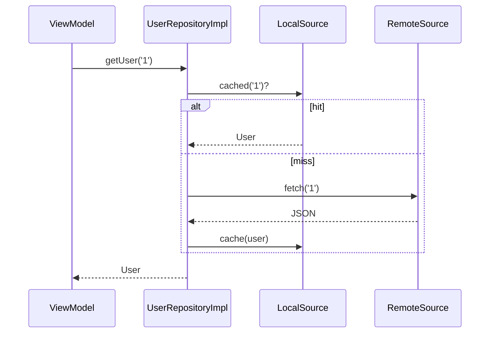

# Repository Pattern

> A repository is an abstraction over data access that gives the rest of the app a clean, domain-oriented API — hiding whether data comes from network, database, or cache.

## Introduction

The Repository pattern mediates between the domain and data sources. Callers use methods like `getUser(id)` / `saveOrder(order)` against an **interface**, unaware of the underlying REST API, local DB, or cache. It's arguably the single most important application pattern in Flutter apps.

## Why this concept exists

Without a repository, UI/logic code calls HTTP clients and databases directly, coupling business logic to infrastructure, making testing require real servers/DBs, and scattering caching/error-mapping everywhere. Repository centralizes data access behind a domain interface, enabling swap, cache, and test in one place (DIP applied — [Module 04](../04%20SOLID%20Principles/05_dip_dependency_inversion.md)).

## Real-world analogy

A **librarian**: you ask for a book by title; the librarian figures out whether it's on the shelf (cache), in storage (DB), or must be ordered (network). You don't care how it's fetched — you get the book through one simple request.

## Problem Statement

Your app needs users from a REST API, cached locally, falling back to the DB offline. UI shouldn't know any of that. You'll define a `UserRepository` interface and an implementation coordinating remote + local sources.

## Internal Working

```mermaid
flowchart TD
    UI[UI / ViewModel / UseCase] --> R[UserRepository interface]
    R <|.. Impl[UserRepositoryImpl]
    Impl --> Remote[RemoteDataSource - REST]
    Impl --> Local[LocalDataSource - DB/cache]
```

- **Repository interface** in the domain, expressed in **domain types** (entities), returning `Future`/`Stream` (often `Result` — [Module 38](../38%20Error%20Handling/README.md)).
- **Implementation** orchestrates data sources, maps DTOs↔entities, applies caching/offline strategy, and translates errors.
- Depends on **data source abstractions** (also injected) — remote (HTTP/GraphQL) and local (DB/cache).

## Memory Representation

The repo may hold an in-memory cache; bound it to avoid leaks ([02 · memory_and_gc](../02%20Advanced%20Dart/13_memory_and_gc.md)).

## Compiler Behavior / Runtime Behavior

Callers depend on the interface (compile-time decoupling); at runtime the impl chooses source, maps data, and handles errors.

## Flutter Engine Behavior

Not applicable. (Repositories sit in the data layer; ViewModels/BLoCs/use cases depend on them — [Modules 11, 40](../11%20State%20Management/README.md).)

## Dart VM Behavior

Not applicable.

## Examples

```dart
// Domain entity (not the wire DTO)
class User {
  final String id, name;
  const User(this.id, this.name);
}

// Repository interface (domain-facing, domain types)
abstract interface class UserRepository {
  Future<User> getUser(String id);
  Future<List<User>> getAll();
}

// Data source abstractions
abstract interface class UserRemoteSource {
  Future<Map<String, dynamic>> fetch(String id);
}
abstract interface class UserLocalSource {
  User? cached(String id);
  void cache(User u);
}

// Implementation: orchestrates sources, maps, caches, handles errors
class UserRepositoryImpl implements UserRepository {
  final UserRemoteSource remote;
  final UserLocalSource local;
  UserRepositoryImpl(this.remote, this.local);

  @override
  Future<User> getUser(String id) async {
    final cachedUser = local.cached(id);
    if (cachedUser != null) return cachedUser;        // cache hit
    final json = await remote.fetch(id);              // network
    final user = User(json['id'] as String, json['name'] as String); // map DTO->entity
    local.cache(user);                                // update cache
    return user;
  }

  @override
  Future<List<User>> getAll() async => [await getUser('1')];
}

// Fake for tests — no network/DB
class FakeUserRepository implements UserRepository {
  @override
  Future<User> getUser(String id) async => User(id, 'Test');
  @override
  Future<List<User>> getAll() async => [const User('1', 'Test')];
}

Future<void> main() async {
  final UserRepository repo = FakeUserRepository(); // swap real impl in prod
  print((await repo.getUser('1')).name); // Test
}
```

## Diagrams



## Common Mistakes

| Mistake | Why | Fix |
|---------|-----|-----|
| Returning DTOs/`Map`/HTTP types from the repo | Leaks infra into domain | Return domain entities |
| Calling HTTP/DB directly from UI | Coupling, untestable | Go through the repository |
| Business logic in the repository | SRP blur | Keep repo about data access; logic in domain/use cases |
| Repo interface depending on Dio/sqflite types | Recouples to infra | Interface in domain types only |
| Unbounded in-repo cache | Memory leak | Bound/evict cache |

## Best Practices

- Define the interface in **domain terms** (entities, not DTOs); return `Future`/`Stream`/`Result`.
- Keep the **interface in the domain**, implementations in the data layer (DIP).
- Map DTO↔entity and translate errors **inside** the repository ([02 · json](../02%20Advanced%20Dart/12_json_and_serialization.md), [Module 38](../38%20Error%20Handling/README.md)).
- Inject data sources; make the whole thing fakeable for tests.
- Put caching/offline strategy here, bounded.

## Performance

Centralized caching improves latency; bound caches; offload heavy parsing to isolates ([02 · isolates](../02%20Advanced%20Dart/04_isolates.md)).

## Advantages / Disadvantages

- **+** Decouples domain from infra, single place for caching/offline/error-mapping, highly testable, swappable sources.
- **−** Extra layer/boilerplate; risk of anemic pass-through repos or logic creep.

## Interview Questions

1. **🟢 What is the Repository pattern?** — An abstraction over data access exposing a domain-oriented API and hiding the data source(s).
2. **🟢 Why not call HTTP/DB directly from the UI?** — It couples business logic to infrastructure, scatters caching/error handling, and makes testing require real backends.
3. **🟡 What should a repository return?** — Domain entities (not DTOs/HTTP types), via `Future`/`Stream`/`Result`.
4. **🟡 Where do the interface and implementation live (Clean Architecture)?** — Interface in the domain layer; implementation in the data layer (DIP).
5. **🟡 What belongs inside a repository?** — Source orchestration, DTO↔entity mapping, caching/offline strategy, error translation — not business rules.
6. **🔴 How does Repository enable testing?** — UI/use cases depend on the interface; you inject a fake repository, testing logic without network/DB.
7. **🔴 Repository vs DAO?** — DAO is a lower-level, table/query-oriented data access object; Repository is higher-level and domain-oriented (may combine multiple DAOs/sources).

## Senior Engineer Tips

- Keep repositories **thin orchestrators**: mapping + caching + source coordination, no domain rules (those go in use cases/entities).
- Separate **DTOs** (data layer) from **entities** (domain); map at the repo boundary so API changes don't ripple inward.
- Return `Result`/typed failures rather than throwing for expected errors — makes callers explicit and testable.

## Architect Perspective

Repository is the boundary between domain and data in layered/clean architecture — the linchpin of testability, offline-first, and multi-source strategies. It localizes all the messy realities of data (network flakiness, caching, formats) so the domain stays pure and the UI stays simple ([Modules 40, 19, 16](../40%20Clean%20Architecture/README.md)).

## Summary

- Repository exposes a domain-oriented data API and hides sources (network/DB/cache).
- Interface in domain (entities), impl in data layer; map DTOs, cache, translate errors inside.
- Enables testing (inject fakes), offline-first, and source swaps; keep it thin.

## Revision Notes

- Repository = domain-facing data-access abstraction; hides sources.
- Return entities (not DTOs); interface in domain, impl in data (DIP).
- Map DTO↔entity + cache + error-translate inside; inject sources; fakeable.
- Repo (domain-level) vs DAO (query-level).

## Practice Questions

1. Why should a repository return entities, not DTOs?
2. Where do the interface and implementation live in Clean Architecture?
3. What belongs in a repository vs a use case?

## Coding Questions

1. Add offline fallback (local DB) to `UserRepositoryImpl` when remote fails.
2. Introduce DTO↔entity mapping and a `Result` return type.
3. Write tests for a use case using a `FakeUserRepository`.

## Mini Project

**Users data layer (pure Dart):** Define `UserRepository` (domain), `UserRepositoryImpl` orchestrating remote + local fakes with caching and `Result` returns + DTO↔entity mapping, and a `GetUser` use case depending only on the interface. Test with fakes (no real IO). Acceptance: no DTO/infra leakage; caching bounded; swappable/testable; `dart analyze` clean.
