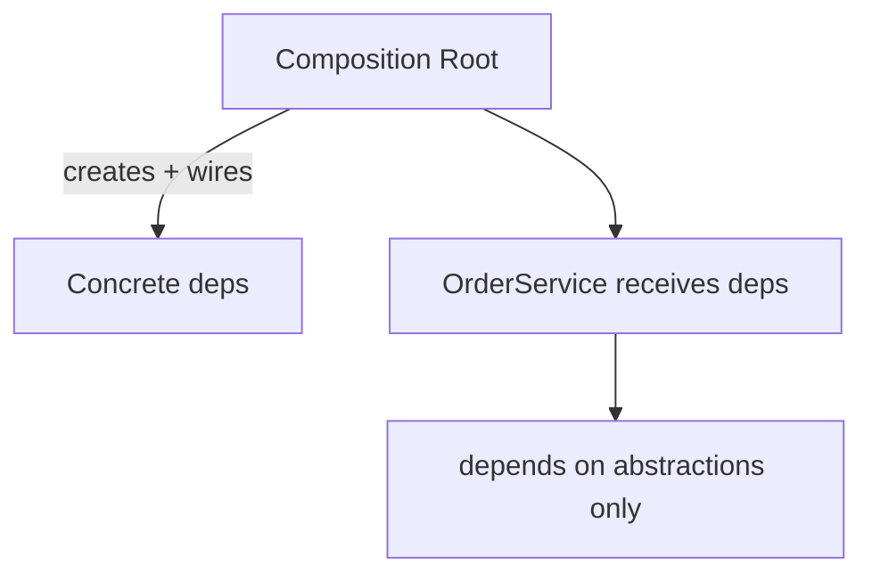
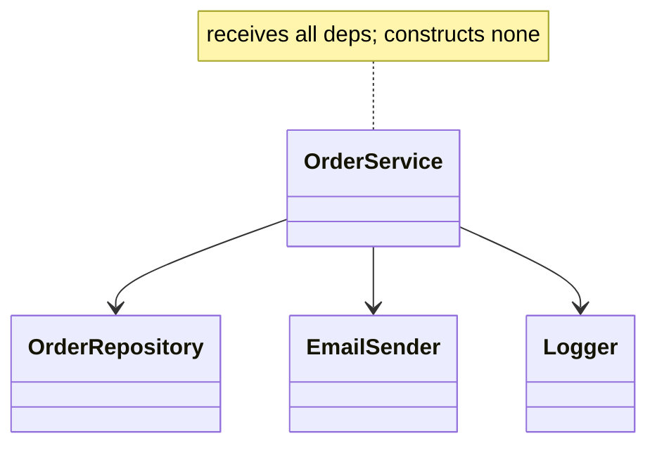

# Dependency Injection Pattern

> Dependency Injection (DI) supplies an object's dependencies from the outside instead of having it create them — the practical technique that realizes the Dependency Inversion Principle.

## Introduction

DI means a class **receives** its collaborators (via constructor, setter, or a container) rather than constructing them internally. This file covers the DI *pattern* and forms; the full Flutter tooling (get_it, Provider, Riverpod, InheritedWidget) is [Module 14](../14%20Dependency%20Injection/README.md).

## Why this concept exists

Hard-wired dependencies (`final repo = FirebaseRepo()`) make code untestable and rigid ([Module 04 · DIP](../04%20SOLID%20Principles/05_dip_dependency_inversion.md)). DI decouples "what a class needs" from "who provides it," enabling substitution (real vs fake), single wiring point, and clear dependency graphs.

## Real-world analogy

A **coffee machine that takes water from a plumbed-in supply** vs one you must manually fill from a specific well. Injected water (dependency) can come from any source (tap, bottle, test supply). The machine doesn't care where water comes from — it just receives it.

## Problem Statement

An `OrderService` needs a repository, an email sender, and a logger. Constructing them inside makes it untestable. You'll inject abstractions via the constructor and wire concretes at a single composition root.

## Internal Working



- **Forms of DI:**
  - **Constructor injection** (preferred): dependencies passed to the constructor — explicit, immutable, testable.
  - **Setter/property injection:** set after construction (for optional deps).
  - **Interface/method injection:** pass per call.
- **Composition root:** the single place (app startup) where the object graph is assembled.
- **DI container / service locator:** automates registration/resolution (get_it), but overuse hides dependencies — prefer constructor injection.

## Memory Representation

Container-managed singletons live for app lifetime; factory registrations create per-request instances. Mind retained singletons ([02 · memory_and_gc](../02%20Advanced%20Dart/13_memory_and_gc.md)).

## Compiler Behavior / Runtime Behavior

Depending on abstractions gives compile-time-safe substitution; the container resolves concretes at runtime.

## Flutter Engine Behavior

Not applicable directly. (Flutter provides DI via `InheritedWidget`/`Provider`/`Riverpod` down the widget tree — [Module 14](../14%20Dependency%20Injection/README.md).)

## Dart VM Behavior

Not applicable.

## Examples

```dart
// Abstractions
abstract interface class OrderRepository { Future<void> save(String o); }
abstract interface class EmailSender { Future<void> send(String to); }
abstract interface class Logger { void log(String m); }

// Consumer receives dependencies (constructor injection)
class OrderService {
  final OrderRepository repo;
  final EmailSender email;
  final Logger logger;
  OrderService({required this.repo, required this.email, required this.logger});

  Future<void> place(String order, String customer) async {
    logger.log('placing $order');
    await repo.save(order);
    await email.send(customer);
  }
}

// Concrete implementations
class SqlRepo implements OrderRepository {
  @override
  Future<void> save(String o) async => print('SQL save $o');
}
class SmtpEmail implements EmailSender {
  @override
  Future<void> send(String to) async => print('email $to');
}
class ConsoleLogger implements Logger {
  @override
  void log(String m) => print('[LOG] $m');
}

// Tiny manual DI container (composition root)
class Injector {
  final _singletons = <Type, Object>{};
  void register<T extends Object>(T instance) => _singletons[T] = instance;
  T get<T>() => _singletons[T] as T;
}

Future<void> main() async {
  // Composition root: wire the graph once
  final injector = Injector()
    ..register<OrderRepository>(SqlRepo())
    ..register<EmailSender>(SmtpEmail())
    ..register<Logger>(ConsoleLogger());

  final service = OrderService(
    repo: injector.get<OrderRepository>(),
    email: injector.get<EmailSender>(),
    logger: injector.get<Logger>(),
  );
  await service.place('o1', 'ada@x.com');

  // In tests: inject fakes directly, no container needed
  // OrderService(repo: FakeRepo(), email: FakeEmail(), logger: FakeLogger());
}
```

## Diagrams



## Common Mistakes

| Mistake | Why | Fix |
|---------|-----|-----|
| `new`ing dependencies inside a class | Untestable, coupled | Inject via constructor |
| Service locator everywhere | Hidden deps, global state | Prefer constructor injection; locate at edges |
| Injecting concrete types | Recouples to impl | Depend on abstractions |
| Over-injecting trivial values | Ceremony | Inject volatile/external deps, not pure helpers |
| Wiring scattered across the app | Hard to reason about | One composition root |

## Best Practices

- Prefer **constructor injection** of **abstractions**; make deps `final`.
- Wire the graph at a **single composition root**.
- Use a DI container to *reduce wiring boilerplate*, not to hide dependencies.
- Inject **volatile/external** dependencies (repos, clients, clock); don't inject trivial pure values.
- Register single instances via the container instead of hard singletons ([03_singleton.md](03_singleton.md)).

## Performance

Negligible; container lookups are cheap. Singleton lifetimes save re-construction.

## Advantages / Disadvantages

- **+** Testable (inject fakes), swappable, explicit dependency graph, single wiring point, enables DIP/OCP.
- **−** Wiring/boilerplate; service-locator overuse hides deps; lifetime management needs care.

## Interview Questions

1. **🟢 What is Dependency Injection?** — Supplying a class's dependencies from outside (constructor/setter/container) instead of creating them internally.
2. **🟢 DI vs DIP?** — DIP is the principle (depend on abstractions); DI is the technique that provides those abstractions.
3. **🟡 Which DI form is preferred and why?** — Constructor injection: explicit, immutable, guarantees deps at construction, easiest to test.
4. **🟡 Constructor injection vs service locator?** — Constructor injection makes dependencies explicit; a service locator is a global lookup that can hide them — prefer the former, use locators at edges.
5. **🟡 What is a composition root?** — The single place (startup) where concrete implementations are wired to abstractions.
6. **🔴 What should you inject vs not?** — Inject volatile/external dependencies (repos, HTTP clients, clock, config); don't inject trivial pure values/helpers.
7. **🔴 How does DI enable testing and swapping?** — You pass fakes/alternate implementations without changing the consumer, since it depends only on abstractions.

## Senior Engineer Tips

- Default to constructor injection; reach for a container (get_it/Riverpod) to cut boilerplate, not to smuggle globals.
- Keep the composition root thin and explicit — it's the one place allowed to know concretes.
- Inject a `Clock`/`Random`/`Uuid` abstraction so time/randomness are testable (a frequent oversight).

## Architect Perspective

DI is the practical backbone of testable, modular architecture: it realizes DIP, enables Clean Architecture's wiring at the edge, supports multi-flavor builds (dev/prod/mock), and keeps the dependency graph explicit. The choice of DI mechanism (manual, get_it, Riverpod) is a key architectural decision covered fully in [Module 14](../14%20Dependency%20Injection/README.md).

## Summary

- DI supplies dependencies from outside (prefer constructor injection of abstractions).
- Wire at a single composition root; use containers to reduce boilerplate, not hide deps.
- Realizes DIP; enables testing, swapping, and modularity; inject volatile deps only.

## Revision Notes

- DI = provide deps externally; DIP = depend on abstractions (DI implements it).
- Prefer constructor injection (`final` abstractions); single composition root.
- Container reduces boilerplate; service locator can hide deps (use sparingly).
- Inject volatile/external deps (repo/client/clock), not trivial values.

## Practice Questions

1. Why is `OrderService` with injected deps testable while a `new`-ing version isn't?
2. Constructor injection vs service locator — tradeoffs?
3. What belongs in the composition root?

## Coding Questions

1. Refactor a class that `new`s a `Clock`/`HttpClient` to inject abstractions.
2. Build a tiny DI container with singleton + factory registrations.
3. Inject a fake `Clock` to make a time-based function deterministic in tests.

## Mini Project

**DI-wired order service (pure Dart):** Build `OrderService` depending on `OrderRepository`/`EmailSender`/`Logger` abstractions, a small `Injector` container, and a composition root wiring real impls; then a test wiring fakes. Acceptance: no `new` inside `OrderService`; all deps abstract + injected; single composition root; tests use fakes; `dart analyze` clean. (Full Flutter DI tooling continues in [Module 14](../14%20Dependency%20Injection/README.md).)
