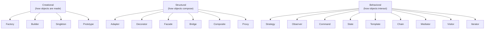

# 05 · Design Patterns

## Introduction

Design patterns are **named, reusable solutions to recurring design problems**. They're a shared vocabulary ("let's use a Strategy here") and, more importantly, the *applied form* of SOLID. This module covers the classic Gang-of-Four (GoF) patterns across three families, plus two patterns essential to Flutter apps: **Repository** and **Dependency Injection**.

## Why this module exists

Patterns turn SOLID principles ([Module 04](../04%20SOLID%20Principles/README.md)) into concrete structures. Knowing them lets you recognize a problem's shape and reach for a proven solution instead of reinventing (often badly). Interviewers use patterns to test design maturity; codebases use them to stay extensible.

## The three families

## Module map

### Creational (object creation)

| Pattern | Intent | File |
|---------|--------|------|
| Factory (Simple/Method/Abstract) | Create objects without naming concrete classes | [01_factory.md](01_factory.md) |
| Builder | Construct complex objects step by step | [02_builder.md](02_builder.md) |
| Singleton | One shared instance | [03_singleton.md](03_singleton.md) |
| Prototype | Clone existing objects | [04_prototype.md](04_prototype.md) |

### Structural (object composition)

| Pattern | Intent | File |
|---------|--------|------|
| Adapter | Make incompatible interfaces work together | [05_adapter.md](05_adapter.md) |
| Decorator | Add behavior by wrapping | [06_decorator.md](06_decorator.md) |
| Facade | Simplify a complex subsystem | [07_facade.md](07_facade.md) |
| Bridge | Decouple abstraction from implementation | [08_bridge.md](08_bridge.md) |
| Composite | Treat trees uniformly | [09_composite.md](09_composite.md) |
| Proxy | Stand-in controlling access | [10_proxy.md](10_proxy.md) |

### Behavioral (object interaction)

| Pattern | Intent | File |
|---------|--------|------|
| Strategy | Swappable algorithms | [11_strategy.md](11_strategy.md) |
| Observer | Notify dependents of change | [12_observer.md](12_observer.md) |
| Command | Encapsulate a request as an object | [13_command.md](13_command.md) |
| State | Behavior varies with internal state | [14_state.md](14_state.md) |
| Template Method | Fixed skeleton, variable steps | [15_template_method.md](15_template_method.md) |
| Chain of Responsibility | Pass a request along handlers | [16_chain_of_responsibility.md](16_chain_of_responsibility.md) |
| Mediator | Centralize complex communication | [17_mediator.md](17_mediator.md) |
| Visitor | Add operations without editing types | [18_visitor.md](18_visitor.md) |
| Iterator | Traverse without exposing internals | [19_iterator.md](19_iterator.md) |

### Application patterns (Flutter-critical)

| Pattern | Intent | File |
|---------|--------|------|
| Repository | Abstract data access behind a clean API | [20_repository.md](20_repository.md) |
| Dependency Injection | Supply dependencies from outside | [21_dependency_injection.md](21_dependency_injection.md) |

## Prerequisites

[03 OOP](../03%20Object%20Oriented%20Programming/README.md) and [04 SOLID](../04%20SOLID%20Principles/README.md). Patterns are OOP + SOLID applied.

## How each file is structured

Beyond the standard template, each pattern file states: the **problem it solves**, a **UML diagram**, a **Dart implementation**, a **Flutter/real-world usage**, and **when NOT to use it** (patterns are tools, not goals).

## What you'll be able to do after this module

- Recognize which pattern fits a problem — and when *no* pattern is the right answer.
- Implement each idiomatically in Dart (using records, sealed classes, closures where they simplify the classic form).
- Explain where Flutter/its ecosystem already uses these (e.g., Builder in widget builders, Observer in `ChangeNotifier`, Strategy in `ScrollPhysics`).

## Summary

Patterns are the applied vocabulary of good design. Learn the intent and the smell each addresses; implement them in Dart; and resist over-engineering — reach for a pattern when the problem actually has its shape.
