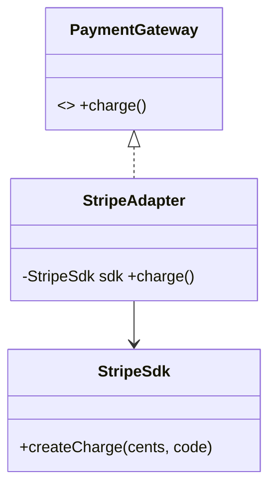

# Adapter Pattern

> An adapter wraps an incompatible interface so it looks like the interface your code expects — the "plug converter" between two systems that can't talk directly.

## Introduction

Adapter (a.k.a. Wrapper) translates one interface into another. You have a class your code needs to use, but its API doesn't match what your code expects; the adapter sits between them, forwarding calls and converting shapes.

## Why this concept exists

You can't always change third-party or legacy code, yet your app depends on a clean, consistent interface (often for DIP — [Module 04](../04%20SOLID%20Principles/dip_dependency_inversion.md)). Adapter lets incompatible components collaborate without modifying either — essential when integrating SDKs, legacy APIs, or swapping vendors.

## Real-world analogy

A **travel power adapter**: your laptop plug (your code's expected interface) doesn't fit the foreign socket (the third-party API). The adapter converts between them so both work unchanged.

## Problem Statement

Your app depends on a clean `PaymentGateway` interface, but the vendor SDK exposes `StripeSdk.createCharge(cents, currencyCode)` with a totally different shape. You'll write a `StripeAdapter implements PaymentGateway` that translates.

## Internal Working

```mermaid
flowchart LR
    Client --> Target[PaymentGateway interface]
    Target <|.. Adapter[StripeAdapter]
    Adapter --> Adaptee[StripeSdk incompatible API]
```

- **Target:** the interface your code wants (`PaymentGateway.charge(amount)`).
- **Adaptee:** the existing incompatible class (`StripeSdk`).
- **Adapter:** implements Target, holds/uses the Adaptee, and translates calls/data.
- **Object adapter** (composition — preferred in Dart) vs **class adapter** (inheritance — limited by single inheritance).

## Memory Representation

The adapter holds a reference to the adaptee (composition); negligible overhead.

## Compiler Behavior

Not applicable. (The adapter satisfies the target interface at compile time so clients depend only on it.)

## Runtime Behavior

Each call is forwarded with data conversion (units, shapes, error mapping).

## Flutter Engine Behavior

Not applicable. (Adapters are common at plugin/platform-channel boundaries and when wrapping REST/SDK responses into domain models.)

## Dart VM Behavior

Not applicable.

## Examples

```dart
// Target: what your app expects
abstract interface class PaymentGateway {
  Future<bool> charge({required double amount, required String currency});
}

// Adaptee: incompatible third-party SDK (can't modify)
class StripeSdk {
  Future<String> createCharge(int amountCents, String currencyCode) async {
    return 'ch_123'; // returns a charge id, uses cents + different names
  }
}

// Adapter: translate app interface -> SDK
class StripeAdapter implements PaymentGateway {
  final StripeSdk _sdk;
  StripeAdapter(this._sdk);

  @override
  Future<bool> charge({required double amount, required String currency}) async {
    final cents = (amount * 100).round();               // convert units
    final id = await _sdk.createCharge(cents, currency.toLowerCase());
    return id.startsWith('ch_');                          // map result -> bool
  }
}

Future<void> main() async {
  final PaymentGateway gateway = StripeAdapter(StripeSdk()); // app depends on Target
  print(await gateway.charge(amount: 19.99, currency: 'USD')); // true
}
```

## Diagrams



## Common Mistakes

| Mistake | Why | Fix |
|---------|-----|-----|
| Leaking the adaptee's types through the target | Recouples clients to the SDK | Convert fully to your domain types |
| Putting business logic in the adapter | SRP violation | Adapter only translates; logic elsewhere |
| Class adapter via inheritance in Dart | Single-inheritance limits | Prefer object adapter (composition) |
| One giant adapter for many SDKs | Low cohesion | One adapter per adaptee |

## Best Practices

- Prefer **object adapters** (composition) in Dart.
- Fully translate to your **domain types** (units, enums, error models) — don't leak SDK types.
- Keep adapters thin: translation only, no business rules.
- Combine with DIP: your app depends on the target interface; the adapter is wired at the composition root.

## Performance

Negligible (a forwarding call + small conversions).

## Advantages / Disadvantages

- **+** Integrate incompatible/legacy/third-party code without changing it; enables vendor swaps; supports DIP.
- **−** Extra layer; risk of leaking adaptee details if done carelessly.

## Interview Questions

1. **🟢 What does Adapter do?** — Converts one interface into another so incompatible classes can work together.
2. **🟢 Object vs class adapter?** — Object adapter uses composition (holds the adaptee); class adapter uses inheritance. Dart favors object adapters (single inheritance).
3. **🟡 How does Adapter support DIP?** — Your app depends on the target interface; the adapter implements it over a concrete SDK, keeping the app decoupled from the vendor.
4. **🟡 Adapter vs Facade?** — Adapter changes an interface to match an expected one; Facade simplifies a complex subsystem behind a new, easier interface.
5. **🟡 What should an adapter NOT do?** — Contain business logic; it should only translate shapes/units/errors.
6. **🔴 How do adapters enable vendor migration?** — Swap the adapter (e.g., Stripe→Razorpay) while the app keeps using the unchanged target interface.
7. **🔴 Why avoid leaking adaptee types?** — It recouples clients to the third party, defeating the adapter's purpose.

## Senior Engineer Tips

- Adapters are the natural home for a data layer's DTO↔domain mapping and error translation.
- Keep one adapter per external system; test it against a fake adaptee to lock the translation.
- Pair with the Repository pattern ([repository.md](repository.md)) — the repository interface is the target, the adapter/impl wraps the SDK/HTTP.

## Architect Perspective

Adapters are the boundary translators of clean architecture: they keep the domain independent of external frameworks/SDKs by converting at the edge. This is what makes vendor swaps, platform differences, and legacy integration manageable without rippling change inward ([Modules 40, 16](../40%20Clean%20Architecture/README.md)).

## Summary

- Adapter wraps an incompatible interface to match what your code expects.
- Prefer object adapters; translate fully to domain types; keep them thin.
- Enables integration, vendor swaps, and DIP; don't leak adaptee details.

## Revision Notes

- Adapter = interface converter (Target ← Adapter → Adaptee).
- Object adapter (composition) preferred in Dart.
- Translate units/shapes/errors to domain types; no business logic.
- Adapter changes interface; Facade simplifies subsystem.

## Practice Questions

1. Why prefer an object adapter in Dart?
2. How does Adapter differ from Facade?
3. What happens if the adapter leaks SDK types to callers?

## Coding Questions

1. Adapt a legacy `XmlLogger.writeLine(String)` to a modern `Logger.log(level, msg)` interface.
2. Wrap two weather SDKs behind one `WeatherService` interface via adapters.
3. Adapt a callback-based API to a `Future`-returning target interface.

## Mini Project

**Payment gateway adapters (pure Dart):** Define a `PaymentGateway` target; implement `StripeAdapter` and `RazorpayAdapter` over two mismatched fake SDKs; write a checkout that depends only on the target and swap gateways via injection. Acceptance: no SDK type leaks; unit conversions/error mapping done in adapters; swapping vendors edits only wiring; `dart analyze` clean.
