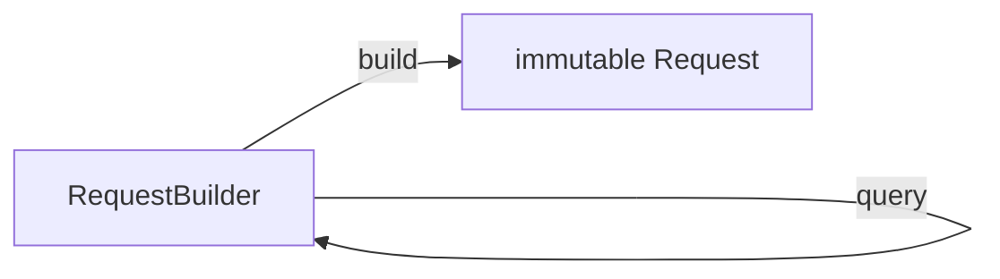
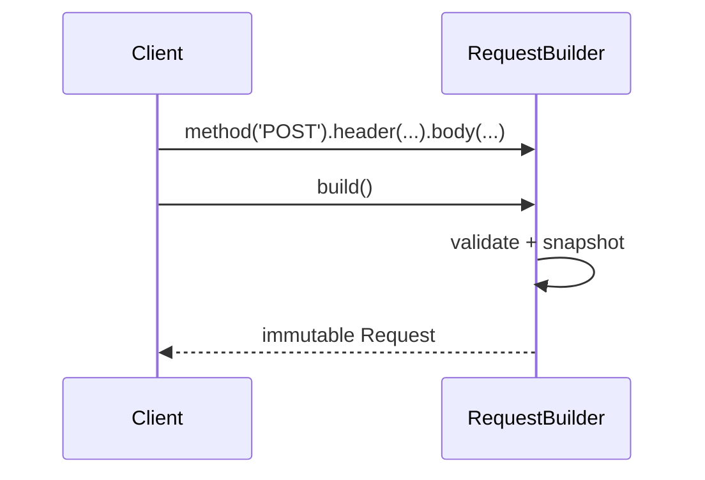

# Builder Pattern

> Builder constructs a complex object step by step, separating *how* it's assembled from *what* it represents — ideal when an object has many optional parts or configuration.

## Introduction

The Builder pattern assembles a complex object through a series of steps (often chained), then produces the finished product with a `build()`. It shines when a constructor would otherwise take a dozen optional parameters or require a valid multi-step assembly.

## Why this concept exists

Telescoping constructors (`Pizza(size, cheese, [pepperoni], [mushroom], ...)`) and giant named-parameter lists become unreadable and error-prone. Builder gives a fluent, validated, incremental construction path and can enforce required-before-optional ordering.

## Real-world analogy

Ordering a **custom burger**: you add patty, then cheese, then sauce, then "done." The counter (builder) accumulates your choices and hands you the finished burger. You don't hand the kitchen one giant order string.

## Problem Statement

Build an HTTP request with optional headers, query params, body, and timeout — without a 10-argument constructor. You'll use a fluent builder producing an immutable `Request`.

## Internal Working



- A mutable **builder** accumulates state via chained methods returning `this` (or via cascades `..`).
- `build()` validates and returns an **immutable** product.
- Dart alternatives: **named parameters + `copyWith`** often replace Builder for simple cases; cascades (`..`) give fluent config natively.

## Memory Representation

The builder is a short-lived mutable object; the product is typically immutable. Discard the builder after `build()`.

## Compiler Behavior

Not applicable. (Fluent chaining is ordinary method calls returning the builder.)

## Runtime Behavior

Each step mutates builder state; `build()` snapshots it into the product (defensive copies of collections).

## Flutter Engine Behavior

Not applicable. (Flutter's `WidgetBuilder`/`builder:` callbacks are a *builder-callback* idiom; `ThemeData` and `TextStyle.copyWith` cover many builder use cases.)

## Dart VM Behavior

Not applicable.

## Examples

```dart
class Request {
  final String method, url;
  final Map<String, String> headers;
  final Map<String, String> query;
  final String? body;
  final Duration timeout;

  Request._({
    required this.method,
    required this.url,
    required this.headers,
    required this.query,
    required this.body,
    required this.timeout,
  });

  @override
  String toString() =>
      '$method $url q=$query h=$headers body=$body t=${timeout.inSeconds}s';
}

class RequestBuilder {
  final String url;
  String _method = 'GET';
  final _headers = <String, String>{};
  final _query = <String, String>{};
  String? _body;
  Duration _timeout = const Duration(seconds: 30);

  RequestBuilder(this.url);

  RequestBuilder method(String m) { _method = m; return this; }
  RequestBuilder header(String k, String v) { _headers[k] = v; return this; }
  RequestBuilder query(String k, String v) { _query[k] = v; return this; }
  RequestBuilder body(String b) { _body = b; return this; }
  RequestBuilder timeout(Duration d) { _timeout = d; return this; }

  Request build() {
    if (_method == 'GET' && _body != null) {
      throw StateError('GET cannot have a body'); // validation at build
    }
    return Request._(
      method: _method,
      url: url,
      headers: Map.unmodifiable(_headers), // defensive copy
      query: Map.unmodifiable(_query),
      body: _body,
      timeout: _timeout,
    );
  }
}

void main() {
  final req = RequestBuilder('https://api.example.com/users')
      .method('POST')
      .header('Authorization', 'Bearer x')
      .query('page', '1')
      .body('{"name":"Ada"}')
      .timeout(const Duration(seconds: 10))
      .build();
  print(req);
}
```

## Diagrams



## Common Mistakes

| Mistake | Why | Fix |
|---------|-----|-----|
| Builder producing a mutable product | Loses immutability benefits | `build()` returns an immutable object |
| Not defensively copying collections | Post-build mutation leaks in | `Map.unmodifiable`/`List.of` |
| Using Builder where named params + copyWith suffice | Over-engineering | Prefer Dart idioms for simple cases |
| Forgetting validation in `build()` | Invalid objects created | Validate before returning |

## Best Practices

- Return an **immutable** product; defensively copy collections.
- Validate invariants in `build()`.
- Prefer Dart **named parameters + `copyWith`** or **cascades** for simple configuration; reserve full Builder for genuinely complex/multi-step assembly.
- Consider a `sealed`/staged builder if ordering must be enforced at compile time.

## Performance

Neutral; one throwaway builder allocation per product.

## Advantages / Disadvantages

- **+** Readable step-by-step construction, validation point, immutable result, avoids telescoping constructors.
- **−** Extra class/boilerplate; often unnecessary in Dart thanks to named params + `copyWith`.

## Interview Questions

1. **🟢 What problem does Builder solve?** — Constructing complex objects with many optional/variant parts without unwieldy constructors, with a clear validation point.
2. **🟢 What does `build()` typically return?** — A finished, usually immutable product (with defensive copies of internal collections).
3. **🟡 When is Builder unnecessary in Dart?** — When named parameters + defaults + `copyWith` (or cascades) already give readable, validated construction.
4. **🟡 How do you enforce validation with Builder?** — Check invariants inside `build()` before returning the product.
5. **🟡 Builder vs Factory?** — Factory decides *which* object to create; Builder decides *how to assemble* one complex object step by step.
6. **🔴 How can you enforce required steps at compile time?** — A staged/typed builder where each step returns a different type exposing only the next valid methods.
7. **🔴 Where does Flutter use builder idioms?** — `builder:`/`itemBuilder` callbacks (lazy widget construction) and `copyWith` on `ThemeData`/`TextStyle`.

## Senior Engineer Tips

- In Dart, reach for `copyWith`/named params first; introduce a Builder only when assembly is truly multi-step or conditional.
- Use cascades (`..`) for fluent config of an existing mutable object without a dedicated builder.
- Make the product immutable so it can be shared/compared safely ([02 · immutability](../02%20Advanced%20Dart/immutability.md)).

## Architect Perspective

Builder centralizes complex, validated construction — useful for query builders, request builders, and configuration DSLs. In Dart apps it's often subsumed by named params + `copyWith`, so the architectural value is mostly in DSL-like or staged-construction scenarios (e.g., building queries for [Module 20 Database](../20%20Database/README.md)).

## Summary

- Builder assembles complex objects step by step, validating and producing an immutable product.
- Prefer Dart named params + `copyWith`/cascades for simple cases; use Builder for genuinely complex assembly.
- Defensively copy collections; validate in `build()`.

## Revision Notes

- Builder = step-by-step construction → `build()` returns immutable product.
- Chain methods return `this`; defensive-copy collections; validate in `build()`.
- Dart alt: named params + `copyWith` + cascades.
- Builder=how to assemble; Factory=which to create.

## Practice Questions

1. Why should `build()` return an immutable object?
2. When do Dart named parameters make Builder redundant?
3. How would you enforce that `method` is set before `body`?

## Coding Questions

1. Build a `SqlQueryBuilder` (`select`/`from`/`where`/`orderBy`/`build`) producing an immutable query string.
2. Implement a staged builder that only allows `.body()` after `.method('POST')` (type-enforced).
3. Rewrite a 9-parameter constructor as named params + `copyWith` and argue whether Builder is needed.

## Mini Project

**HTTP request builder (pure Dart):** Implement a fluent `RequestBuilder` producing an immutable `Request`, with validation (no body on GET), defensive copies, and support for chaining. Add tests for valid/invalid builds. Acceptance: product immutable; validation enforced in `build()`; a note comparing to the named-params+`copyWith` alternative; `dart analyze` clean.
