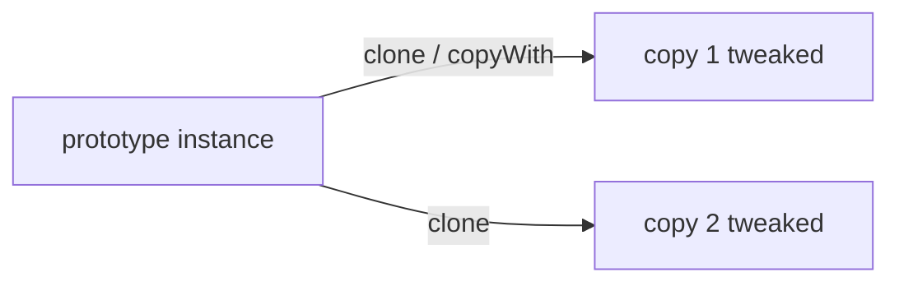
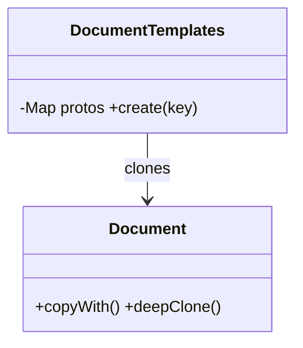

# Prototype Pattern

> Prototype creates new objects by **cloning** an existing instance rather than constructing from scratch — useful when construction is expensive or the concrete type isn't known statically.

## Introduction

Prototype produces new objects by copying a prototypical instance (`clone()`), optionally tweaking the copy. In Dart this most often appears as `copyWith` on immutable classes and as registries of pre-configured prototypes.

## Why this concept exists

Sometimes building an object is costly (heavy computation, config loading) or you only have an *instance* (not its class) to base a new one on. Cloning sidesteps re-running expensive construction and lets you vary configuration from a known-good baseline.

## Real-world analogy

A **cookie cutter with pre-set dough**: instead of mixing new dough each time, you stamp copies of a prepared master and decorate each differently. Or "Save As" on a document — start from an existing one and modify.

## Problem Statement

You have a fully-configured default `Document` template (margins, fonts, header). Creating variants by re-specifying everything is wasteful and error-prone. You'll clone the prototype and adjust only what differs.

## Internal Working



- Define a `clone()` (or `copyWith`) that returns a copy.
- **Shallow vs deep** clone matters when the object has mutable nested state ([03 · equality_and_copying](../03%20Object%20Oriented%20Programming/equality_and_copying.md)).
- A **prototype registry** maps keys → pre-built prototypes to clone on demand.
- Dart idiom: immutable class + `copyWith` *is* Prototype for most cases.

## Memory Representation

Each clone is a new heap object; deep clones duplicate nested mutable objects, shallow clones share them.

## Compiler Behavior

Not applicable.

## Runtime Behavior

Cloning copies fields at runtime; deep clone recurses. Immutable clones can share nested immutables safely (structural sharing).

## Flutter Engine Behavior

Not applicable. (`ThemeData.copyWith`, `TextStyle.copyWith`, and widget config cloning are Prototype-flavored.)

## Dart VM Behavior

Not applicable.

## Examples

```dart
class Document {
  final String title;
  final int marginPt;
  final List<String> sections; // mutable nesting

  const Document({
    required this.title,
    this.marginPt = 20,
    this.sections = const [],
  });

  // copyWith == Prototype clone-with-tweaks (shallow: shares/replaces list)
  Document copyWith({String? title, int? marginPt, List<String>? sections}) =>
      Document(
        title: title ?? this.title,
        marginPt: marginPt ?? this.marginPt,
        sections: sections ?? this.sections,
      );

  // explicit DEEP clone (new sections list)
  Document deepClone() =>
      Document(title: title, marginPt: marginPt, sections: List.of(sections));

  @override
  String toString() => '$title (m=$marginPt, $sections)';
}

// Prototype registry
class DocumentTemplates {
  final _protos = <String, Document>{
    'letter': const Document(title: 'Letter', marginPt: 25, sections: ['Header', 'Body']),
    'memo': const Document(title: 'Memo', marginPt: 15, sections: ['To', 'Message']),
  };
  Document create(String key) => _protos[key]!.copyWith(); // clone from prototype
}

void main() {
  const master = Document(title: 'Master', marginPt: 20, sections: ['Intro']);
  final variant = master.copyWith(title: 'Variant', marginPt: 30);
  print(master);  // Master (m=20, [Intro])
  print(variant); // Variant (m=30, [Intro])

  final tpl = DocumentTemplates();
  print(tpl.create('memo')); // Memo (m=15, [To, Message])
}
```

## Diagrams



## Common Mistakes

| Mistake | Why | Fix |
|---------|-----|-----|
| Shallow clone when deep is needed | Copies share mutable nested state | Deep-clone nested mutables (or use immutables) |
| Reinventing `copyWith` manually everywhere | Boilerplate/bugs | Use `freezed`/`copyWith` codegen |
| Prototype for cheap objects | Unnecessary indirection | Just construct them |
| Mutating a shared prototype in a registry | Corrupts all future clones | Keep prototypes immutable |

## Best Practices

- Prefer **immutable classes + `copyWith`** — that's idiomatic Prototype in Dart.
- Keep registry prototypes **immutable** so clones start from a stable baseline.
- Choose deep vs shallow clone deliberately based on nested mutability.
- Use codegen (`freezed`) to avoid hand-written clone boilerplate.

## Performance

Cloning avoids expensive re-construction; deep clones cost O(size). Immutability + structural sharing keeps it cheap.

## Advantages / Disadvantages

- **+** Avoids costly construction, varies from a known-good baseline, decouples from concrete type.
- **−** Deep-clone complexity; unnecessary for cheap/simple objects; manual clones are error-prone.

## Interview Questions

1. **🟢 What is the Prototype pattern?** — Creating new objects by cloning an existing instance rather than constructing from scratch.
2. **🟢 How does Dart express Prototype idiomatically?** — Immutable classes with `copyWith` (clone-with-tweaks).
3. **🟡 Shallow vs deep clone — why does it matter?** — Shallow clones share nested mutable objects (edits leak); deep clones duplicate them for independence.
4. **🟡 When is Prototype worth it over `new`?** — When construction is expensive, or you must copy from an instance whose concrete type you don't know.
5. **🟡 What's a prototype registry?** — A map of pre-configured prototypes cloned on demand by key.
6. **🔴 Why keep registry prototypes immutable?** — A mutated shared prototype corrupts every subsequent clone.
7. **🔴 Where does Flutter use Prototype-like cloning?** — `copyWith` on `ThemeData`/`TextStyle`/config objects.

## Senior Engineer Tips

- In Dart, you rarely write a classic `clone()`—`copyWith` (hand-written or `freezed`) covers it and preserves immutability.
- Reach for a prototype registry when you have many pre-baked configurations (themes, templates, default entities).
- Be explicit about clone depth in tests to prevent shared-mutation surprises.

## Architect Perspective

Prototype (via `copyWith`) is the everyday mechanism for evolving immutable state — the backbone of reducers, `copyWith`-based state updates, and template systems. Deep-clone decisions intersect with immutability strategy ([02 · immutability](../02%20Advanced%20Dart/immutability.md)); standardize on immutable models so cloning is safe and cheap.

## Summary

- Prototype clones an existing instance instead of constructing anew.
- In Dart it's `copyWith` on immutable classes; use a registry for pre-baked prototypes.
- Mind shallow vs deep clone; keep prototypes immutable; codegen the boilerplate.

## Revision Notes

- Prototype = clone existing object (`clone()`/`copyWith`).
- Dart idiom: immutable + `copyWith`; registry of prototypes.
- Shallow shares nested mutables; deep duplicates them.
- Keep prototypes immutable; Flutter: `ThemeData/TextStyle.copyWith`.

## Practice Questions

1. Why is `copyWith` considered a Prototype implementation?
2. When would a shallow clone cause a bug?
3. When is Prototype unnecessary?

## Coding Questions

1. Add `copyWith` + `deepClone` to a mutable `Board` (grid) and show the difference.
2. Build a `ThemeTemplates` registry cloning base themes with tweaks.
3. Demonstrate a shared-mutation bug from shallow cloning, then fix it.

## Mini Project

**Document template engine (pure Dart):** Implement an immutable `Document` with `copyWith`, a `DocumentTemplates` prototype registry, and both shallow/deep clone paths. Write tests proving clones are independent where required. Acceptance: prototypes immutable; documented shallow vs deep behavior; `dart analyze` clean.
