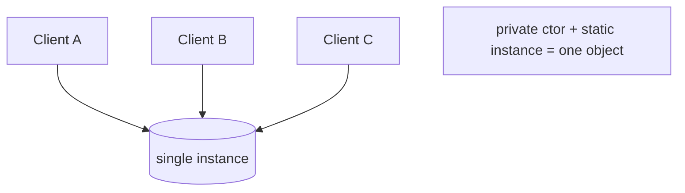
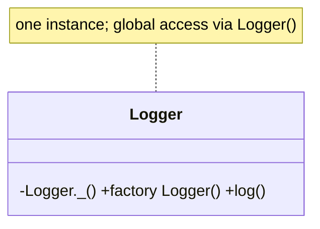

# Singleton Pattern

> Singleton guarantees a class has exactly one instance with a global access point — powerful, frequently overused, and best replaced by dependency injection in most apps.

## Introduction

Singleton ensures one shared instance (a logger, a config, a cache). Dart makes it trivial with a private constructor + static instance or a `factory` constructor. This file covers the idioms, lazy vs eager init, thread/isolate considerations, and — critically — **why to prefer DI**.

## Why this concept exists

Some resources genuinely should be single (a connection pool, an app config). A singleton provides controlled single-instance access. But it's also the most abused pattern: it's global mutable state in disguise, which hurts testability and hides dependencies — so this file teaches it *and its safer alternative*.

## Real-world analogy

A country's **central bank**: there's exactly one, and everyone references the same one. Useful when singularity is real — but if *everything* routed through one office, you'd get bottlenecks and untraceable dependencies (the singleton overuse problem).

## Problem Statement

You need one shared `AppConfig` and one `Logger`. You'll implement them as singletons — then see how a DI-managed single instance gives the same singularity *with* testability.

## Internal Working



- **Idiom 1 (factory):** `factory Logger() => _instance;` with a private `Logger._()` and `static final _instance`.
- **Idiom 2 (static field):** `static final Logger instance = Logger._();` (eager, lazy-loaded on first access due to `final` top-level/static lazy init).
- **Lazy:** `static Logger? _i; static Logger get instance => _i ??= Logger._();`
- **Isolate caveat:** each isolate has its own memory → a "singleton" is single **per isolate**, not globally ([02 · isolates](../02%20Advanced%20Dart/isolates.md)).

## Memory Representation

One heap instance referenced by the static field, alive for the isolate's lifetime (effectively a GC root — never collected while the class is loaded).

## Compiler Behavior

`static final` fields are **lazily initialized** on first access in Dart — so even the "eager" idiom is effectively lazy.

## Runtime Behavior

First access constructs the instance; subsequent accesses return the same object. No locking needed *within* an isolate (single-threaded event loop).

## Flutter Engine Behavior

Not applicable. (Flutter apps often use singletons via DI containers like `get_it`; `WidgetsBinding.instance` is a framework singleton.)

## Dart VM Behavior

Per-isolate static state; the instance lives in the isolate's heap. Background isolates get their *own* copy.

## Examples

```dart
// Idiom 1: factory constructor returns the single instance
class Logger {
  Logger._(); // private
  static final Logger _instance = Logger._();
  factory Logger() => _instance; // Logger() always yields the same object
  void log(String m) => print('[LOG] $m');
}

// Idiom 2: static instance (lazy via `static final`)
class AppConfig {
  AppConfig._();
  static final AppConfig instance = AppConfig._();
  String env = 'prod';
}

// Idiom 3: explicit lazy
class Cache {
  Cache._();
  static Cache? _i;
  static Cache get instance => _i ??= Cache._();
  final _store = <String, Object>{};
}

void main() {
  print(identical(Logger(), Logger()));                 // true
  print(identical(AppConfig.instance, AppConfig.instance)); // true
  Logger().log('hello');
  AppConfig.instance.env = 'staging';
  print(AppConfig.instance.env); // staging — shared state
}
```

### The DI alternative (preferred)

```dart
// Instead of a hard singleton, register ONE instance in a DI container:
//   getIt.registerSingleton<Logger>(ConsoleLogger());
// Consumers receive it via constructor injection -> single instance AND testable
// (swap a FakeLogger in tests). See dependency_injection.md.
```

## Diagrams



## Common Mistakes

| Mistake | Why | Fix |
|---------|-----|-----|
| Using singletons as a default | Global mutable state; hidden deps; hard tests | Prefer DI-managed single instances |
| Mutable global state in a singleton | Spooky action at a distance | Keep it stateless or inject state |
| Assuming global uniqueness across isolates | Singletons are per-isolate | Don't rely on cross-isolate singleton state |
| Singleton holding `BuildContext`/large graphs | Memory leaks (never collected) | Don't store transient/UI objects in singletons |

## Best Practices

- Prefer **DI** (register one instance in the container) over hard singletons — same singularity, better testability.
- If you must use a raw singleton, keep it **stateless** or with carefully controlled state.
- Remember singletons are **per-isolate**; design background work accordingly.
- Never store `BuildContext`/short-lived objects in a singleton.

## Performance

One allocation; lazy init defers cost to first use. Negligible overhead; the risks are architectural, not performance.

## Advantages / Disadvantages

- **+** Guaranteed single instance, easy global access, lazy init.
- **−** Global mutable state, hidden dependencies, hard to mock/test, per-isolate (not truly global), lifecycle you don't control.

## Interview Questions

1. **🟢 What is a Singleton?** — A class with exactly one instance and a global access point.
2. **🟢 How do you implement one in Dart?** — Private constructor + a static instance, optionally exposed via a `factory` constructor; `static final` gives lazy init.
3. **🟡 Why is Singleton often considered an anti-pattern?** — It's global mutable state: it hides dependencies, couples code, and makes testing/mocking hard.
4. **🟡 What's the DI alternative and why is it better?** — Register one instance in a DI container and inject it; you get singularity *and* the ability to swap fakes in tests.
5. **🟡 Are Dart singletons globally unique?** — No — per isolate. Background isolates get their own copy.
6. **🔴 Is locking needed for a Dart singleton?** — Not within an isolate (single-threaded event loop); cross-isolate sharing isn't possible via memory anyway.
7. **🔴 What lifecycle risk do singletons carry?** — They live for the isolate's lifetime (GC root); storing large/transient objects causes leaks.

## Senior Engineer Tips

- Treat "I need a singleton" as "I need one instance" — satisfy it via DI registration, not a hard-coded static, so tests can substitute it.
- Keep any legitimate singleton **immutable/stateless**; put mutable state behind injected, testable services.
- Audit singletons for retained references — they never get collected.

## Architect Perspective

Singletons centralize but also globalize. In scalable architectures, single-instance services are managed by a **DI container at the composition root**, preserving singularity while keeping the dependency graph explicit and testable. Raw ad-hoc singletons are a common source of coupling and untestable code at scale ([Module 14](../14%20Dependency%20Injection/README.md)).

## Summary

- Singleton = one instance + global access; trivial in Dart via private ctor + static/factory.
- It's global state — prefer DI-managed single instances for testability.
- Per-isolate, lazily initialized; keep stateless; avoid storing transient objects.

## Revision Notes

- Dart singleton: `Foo._()` + `static final instance` (lazy) or `factory Foo() => _i`.
- Per-isolate (not global); no locking needed within an isolate.
- Anti-pattern risk: global mutable state, hidden deps, hard tests.
- Prefer DI single instance; keep stateless; watch retained refs (leaks).

## Practice Questions

1. Why does `identical(Logger(), Logger())` return true?
2. Give two reasons to prefer DI over a hard singleton.
3. Why isn't a Dart singleton shared across isolates?

## Coding Questions

1. Implement `Logger` three ways (factory, static-final, explicit-lazy); prove single-instance.
2. Convert a hard `Analytics` singleton into a DI-registered instance and inject it into a service.
3. Show a leak: a singleton holding a growing list; then bound/clear it.

## Mini Project

**Config & logging via DI-singleton (pure Dart):** Implement `AppConfig` and `Logger`, first as raw singletons, then refactor to register single instances in a tiny DI container and inject them. Write a test that swaps a `FakeLogger`. Acceptance: single-instance guaranteed; production uses real, tests use fake; no `BuildContext`/transient stored; `dart analyze` clean.
