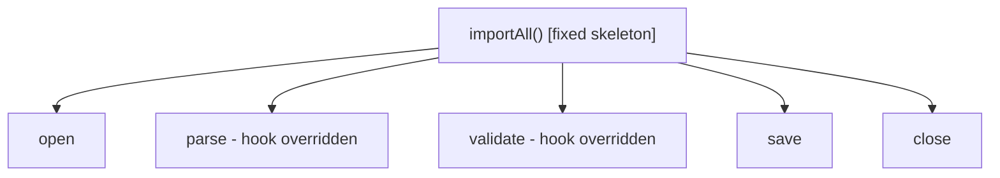
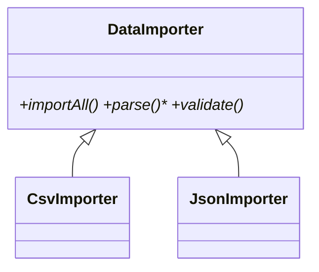

# Template Method Pattern

> Template Method defines the skeleton of an algorithm in a base class and lets subclasses fill in specific steps — the overall structure is fixed; the details vary.

## Introduction

Template Method puts the invariant algorithm structure in one place (a `final`/non-overridable method) that calls overridable "hook" steps. Subclasses customize the steps without changing the sequence.

## Why this concept exists

Many algorithms share a fixed sequence but differ in a few steps (parse → validate → transform → save, with format-specific parse/transform). Duplicating the whole sequence per variant is wasteful and drift-prone. Template Method centralizes the sequence and isolates the variation.

## Real-world analogy

A **recipe template** for beverages: boil water → add main ingredient → pour → add condiments. Tea and coffee follow the same steps but "add main ingredient" and "condiments" differ. The overall procedure is fixed; two steps vary.

## Problem Statement

A data-import pipeline always does open → read → parse → validate → save → close, but parse/validate differ per format (CSV vs JSON). You'll fix the sequence in a base class and override only the varying steps.

## Internal Working



- A base class defines the **template method** (the fixed sequence) — ideally non-overridable.
- **Primitive/hook operations** (abstract or overridable) are the variable steps subclasses implement.
- Optional **hooks** with default no-op bodies let subclasses opt in.
- Contrast: Template Method uses **inheritance**; Strategy achieves similar variation via **composition** (often preferred).

## Memory Representation

Not applicable — ordinary inheritance.

## Compiler Behavior / Runtime Behavior

Subclass hook implementations are dispatched during the template method's fixed flow (dynamic dispatch).

## Flutter Engine Behavior

Not applicable, but the `State` lifecycle is Template-Method-like: the framework calls `initState`→`build`→`dispose` in a fixed order; you override the steps ([Module 08](../08%20Widget%20Lifecycle/README.md)).

## Dart VM Behavior

Not applicable.

## Examples

```dart
abstract class DataImporter {
  // Template method: fixed skeleton (don't override)
  Future<int> importAll(String source) async {
    final raw = await _open(source);
    final rows = parse(raw);        // hook (varies)
    final valid = rows.where(validate).toList(); // hook (varies)
    await _save(valid);
    _close();
    return valid.length;
  }

  Future<String> _open(String s) async => s;      // shared
  Future<void> _save(List<Map<String, String>> rows) async =>
      print('saved ${rows.length}');              // shared
  void _close() => print('closed');               // shared

  // steps subclasses customize:
  List<Map<String, String>> parse(String raw);
  bool validate(Map<String, String> row);
}

class CsvImporter extends DataImporter {
  @override
  List<Map<String, String>> parse(String raw) =>
      raw.split('\n').where((l) => l.isNotEmpty).map((l) {
        final c = l.split(',');
        return {'name': c[0], 'age': c[1]};
      }).toList();
  @override
  bool validate(Map<String, String> row) => (int.tryParse(row['age']!) ?? -1) >= 0;
}

Future<void> main() async {
  final n = await CsvImporter().importAll('Ada,36\nBob,-1\nEve,29');
  print('imported $n'); // saves 2 valid rows -> imported 2
}
```

## Diagrams



## Common Mistakes

| Mistake | Why | Fix |
|---------|-----|-----|
| Allowing the template method to be overridden | Breaks the fixed structure | Make it non-overridable (`base`/documented) |
| Too many abstract hooks | Subclass burden | Provide sensible default hooks |
| Using inheritance where composition fits | Rigid coupling | Prefer Strategy for swappable steps |
| Hidden step ordering assumptions | Fragile subclasses | Document the contract of each hook |

## Best Practices

- Keep the **template method fixed**; expose only the intended hook steps.
- Provide **default hook implementations** where reasonable to reduce subclass burden.
- Prefer **Strategy/composition** when steps should be swappable at runtime or reused across hierarchies.
- Document each hook's contract (inputs, when called, expected side effects).

## Performance

Negligible; ordinary virtual calls.

## Advantages / Disadvantages

- **+** Eliminates duplicated algorithm structure, centralizes control flow, isolates variation.
- **−** Inheritance coupling (fragile base class), less flexible than composition, single-inheritance limit.

## Interview Questions

1. **🟢 What is Template Method?** — A base class defines an algorithm's fixed skeleton and delegates variable steps to overridable methods.
2. **🟢 Template Method vs Strategy?** — Template Method varies steps via **inheritance** (fixed skeleton, overridden hooks); Strategy varies the whole algorithm via **composition** (swappable at runtime).
3. **🟡 Why should the template method not be overridable?** — To guarantee the invariant sequence; subclasses customize only the designated steps.
4. **🟡 What are hooks?** — Overridable steps, sometimes with default (often no-op) implementations subclasses can opt into.
5. **🟡 Where does Flutter exhibit Template Method?** — The `State` lifecycle: the framework calls fixed lifecycle methods in order; you override the steps.
6. **🔴 When prefer Strategy over Template Method?** — When steps should be swapped at runtime, reused across unrelated types, or to avoid inheritance coupling.
7. **🔴 What's the main risk of Template Method?** — Fragile base class: changes to the skeleton ripple to all subclasses.

## Senior Engineer Tips

- If you need to vary steps at runtime or across hierarchies, refactor Template Method → Strategy (inject step functions).
- Provide default hooks so common subclasses stay tiny; reserve abstract hooks for truly required variation.
- Use Dart's `base`/`final` modifiers to lock the skeleton and communicate intent.

## Architect Perspective

Template Method encodes a canonical process (import pipelines, request lifecycles, build flows) once, ensuring consistency while allowing controlled variation. For flexibility-sensitive code, its composition-based sibling (Strategy) usually scales better — a recurring inheritance-vs-composition decision ([Module 03](../03%20Object%20Oriented%20Programming/composition_and_relationships.md)).

## Summary

- Template Method fixes an algorithm's skeleton and lets subclasses fill in steps.
- Keep the skeleton non-overridable; provide default hooks; document hook contracts.
- Prefer Strategy/composition when runtime swapping or cross-hierarchy reuse is needed.

## Revision Notes

- Template Method = fixed skeleton + overridable steps (inheritance).
- Skeleton non-overridable; hooks = variable steps (with defaults).
- Template Method (inheritance) vs Strategy (composition, runtime swap).
- Flutter `State` lifecycle is Template-Method-like.

## Practice Questions

1. How does Template Method differ from Strategy?
2. Why lock the template method?
3. When would you refactor to Strategy?

## Coding Questions

1. Add a `JsonImporter` subclass overriding parse/validate.
2. Build a `ReportGenerator` template (`header`/`body`/`footer` hooks).
3. Refactor a Template Method pipeline into an injectable Strategy-based one.

## Mini Project

**Import pipeline (pure Dart):** Implement `DataImporter` with a fixed `importAll` skeleton and `CsvImporter`/`JsonImporter` overriding parse/validate; add a default hook (`onSkippedRow`). Then provide a Strategy-based variant and compare. Acceptance: skeleton fixed; hooks documented; both approaches tested; `dart analyze` clean.
