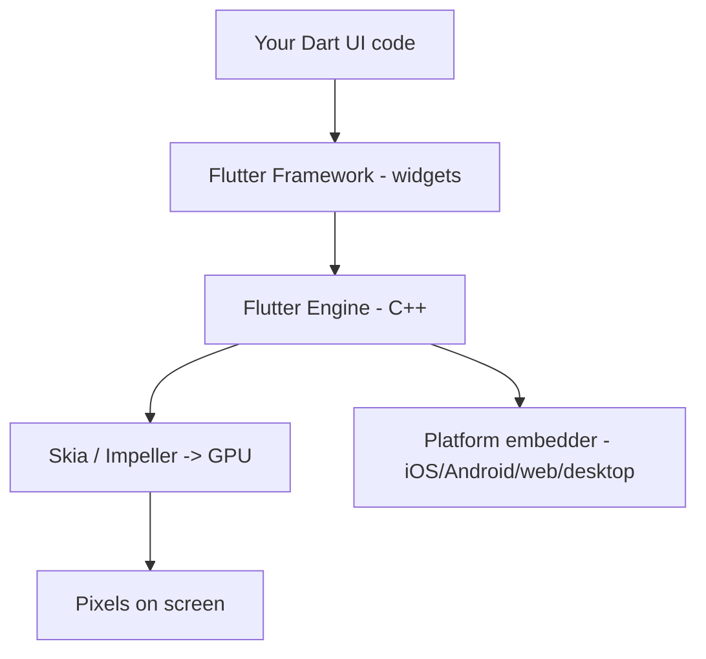
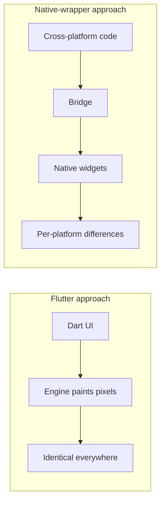

# What Is Flutter (and How It Renders)

> Flutter is a UI toolkit that draws every pixel itself using its own rendering engine, rather than wrapping platform widgets — which is why a Flutter app looks and behaves identically across iOS, Android, web, and desktop.

## Introduction

Flutter is Google's open-source UI framework for building natively-compiled apps for mobile, web, desktop, and embedded — from a single Dart codebase. Its defining trait: it **owns the rendering**. Instead of asking the OS to draw a button, Flutter paints the button itself onto a canvas via its engine (Skia/Impeller).

## Why this concept exists

Cross-platform frameworks historically either wrapped native widgets (inconsistent look/behavior, "bridge" overhead — early React Native) or used web views (slow, non-native feel). Flutter took a third path: **render everything itself** with a fast engine, giving pixel-perfect consistency, high performance (compiled to native/AOT), and full control over every pixel.

## Real-world analogy

Most toolkits are like **ordering furniture from each country's local store** (native widgets) — you get local styles but inconsistency and integration hassle. Flutter is like **bringing your own workshop** (the engine) and building identical furniture anywhere — total consistency and control, at the cost of carrying the workshop (engine bundled in the app).

## Problem Statement

You must ship one app to iOS + Android + web that looks and behaves *identically*, animates smoothly, and compiles to fast native code. Why does Flutter fit, and how does it actually put pixels on screen? By the end you'll explain the render path and the tradeoffs vs native/RN.

## Internal Working



- **Framework (Dart):** widgets, rendering, gestures, animation, Material/Cupertino.
- **Engine (C++):** the rasterizer (Skia/Impeller), Dart runtime, text layout, platform channels.
- **Embedder:** platform-specific glue (surface, input, lifecycle) per OS.
- Your widget tree is turned into a scene the engine **rasterizes to the GPU** every frame — Flutter draws its own UI (see [Module 09](../09%20Rendering%20Pipeline/README.md), [Module 10](../10%20Flutter%20Architecture/README.md)).

## Memory Representation

The compiled app bundles the engine + your AOT-compiled Dart. UI state lives as Dart objects (the trees) in the Dart heap ([02 · memory_and_gc](../02%20Advanced%20Dart/13_memory_and_gc.md)).

## Compiler Behavior

Debug builds use **JIT** (hot reload); release builds use **AOT** to native machine code ([02 · dart_compilation](../02%20Advanced%20Dart/14_dart_compilation.md)). Web compiles via dart2js/dart2wasm.

## Runtime Behavior

Each frame: the framework builds/updates the trees, computes layout and paint, and the engine composites + rasterizes to the GPU — targeting 60/120fps ([Module 09](../09%20Rendering%20Pipeline/README.md)).

## Flutter Engine Behavior

The engine runs the raster and platform threads separately from the UI (Dart) thread; heavy UI-thread work causes dropped frames — hence isolates for CPU work ([02 · isolates](../02%20Advanced%20Dart/04_isolates.md), [Module 21](../21%20Performance/README.md)).

## Dart VM Behavior

The engine embeds the Dart runtime; your UI runs on the **root isolate**'s event loop ([02 · event_loop](../02%20Advanced%20Dart/01_event_loop.md)).

## Examples

```dart
import 'package:flutter/material.dart';

void main() => runApp(const MyApp());

class MyApp extends StatelessWidget {
  const MyApp({super.key});
  @override
  Widget build(BuildContext context) {
    return MaterialApp(
      title: 'Hello Flutter',
      home: Scaffold(
        appBar: AppBar(title: const Text('What is Flutter')),
        body: const Center(child: Text('Flutter draws this text itself.')),
      ),
    );
  }
}
// The Text, AppBar, and background are all painted by Flutter's engine,
// not by native iOS/Android widgets.
```

## Diagrams



## Comparison

| Approach | Rendering | Consistency | Performance | Example |
|----------|-----------|-------------|-------------|---------|
| **Flutter** | Own engine paints pixels | Identical across platforms | AOT-compiled, 60/120fps | Flutter |
| Native | OS widgets | Fully native per-OS | Native | Swift/Kotlin |
| Native-bridge | Wraps native widgets | Per-platform variance | Bridge overhead (older) | early React Native |
| WebView | HTML/CSS in a web view | Web-like | Slower | Cordova/Ionic |

## Common Mistakes

| Mistake | Why it's wrong | Correction |
|---------|----------------|-----------|
| "Flutter uses native widgets" | It paints its own | Flutter renders via Skia/Impeller |
| "Flutter is just a web view" | It's compiled + engine-rendered | AOT-native on mobile/desktop |
| Doing heavy work on the UI isolate | Blocks frame production | Offload to isolates ([02](../02%20Advanced%20Dart/04_isolates.md)) |
| Expecting per-platform look automatically | Flutter is consistent by default | Use adaptive widgets for platform feel ([Module 25](../25%20Adaptive%20UI/README.md)) |

## Best Practices

- Embrace consistency by default; add **adaptive** UI where platform conventions matter.
- Keep the UI isolate free; offload CPU work.
- Profile in **release/profile** builds, not debug.
- Learn the trees/pipeline early — it explains performance and rebuilds.

## Performance

Flutter targets 60/120fps by rasterizing efficiently; jank comes from blocking the UI isolate or over-rebuilding, not from the rendering approach itself ([Module 21](../21%20Performance/README.md)).

## Advantages / Disadvantages

- **+** One codebase, pixel-perfect consistency, high performance, full UI control, fast iteration (hot reload), rich animation.
- **−** Larger app size (bundled engine), less "automatically native" feel, platform-channel work for deep native features ([Module 26](../26%20Platform%20Channels/README.md)).

## Interview Questions

1. **🟢 What is Flutter?** — A UI toolkit that compiles Dart to native and renders its own UI via an engine (Skia/Impeller), giving one consistent codebase across platforms.
2. **🟢 How does Flutter differ from React Native's original approach?** — RN wrapped native widgets over a JS bridge; Flutter paints every pixel itself with a compiled engine, avoiding the bridge and per-platform widget variance.
3. **🟡 What are Flutter's architectural layers?** — Framework (Dart), Engine (C++, rasterizer + Dart runtime), Embedder (per-platform glue). ([02_architecture_overview.md](02_architecture_overview.md))
4. **🟡 Why is Flutter's look consistent across platforms?** — It draws widgets itself rather than delegating to native OS widgets.
5. **🟡 What renders the pixels?** — The engine's rasterizer (Skia, or Impeller) drawing to the GPU each frame.
6. **🔴 Why can heavy Dart work cause jank even though rendering is on the GPU?** — UI building/layout runs on the single UI isolate; blocking it delays frame production. Offload CPU work to isolates.
7. **🔴 Debug vs release compilation and why it matters?** — Debug = JIT (hot reload); release = AOT native (fast startup, store-compliant). Benchmark only in release.

## Senior Engineer Tips

- Internalize "Flutter owns the pixels" — it explains consistency, custom painting power ([Module 23](../23%20Custom%20Painting/README.md)), and why native look needs adaptive widgets.
- Keep the UI isolate lean; treat frame budget (~16ms@60fps) as sacred.
- Know Impeller (the modern renderer replacing Skia on some platforms) for shader-jank improvements ([Module 21](../21%20Performance/README.md)).

## Architect Perspective

Choosing Flutter is choosing consistency + control + one codebase over automatic platform-nativeness. Architecturally, the "own the rendering" model means performance work centers on the UI isolate and rebuild discipline, and platform integration happens through channels — all decisions that shape team structure and non-functional requirements.

## Summary

- Flutter compiles Dart to native and paints its own UI via an engine — consistent everywhere.
- Layers: Framework (Dart) → Engine (C++/rasterizer) → Embedder (platform).
- Debug=JIT/hot reload, release=AOT; jank comes from blocking the UI isolate, not the render model.

## Revision Notes

- Flutter = own-rendering UI toolkit (Skia/Impeller), one Dart codebase, native-compiled.
- Layers: Framework/Engine/Embedder.
- Consistent by default; adaptive for platform feel.
- Debug JIT (hot reload), release AOT; UI on root isolate — don't block it.

## Practice Questions

1. Why does Flutter look identical on iOS and Android by default?
2. Why is app size larger than a native app?
3. Why must benchmarks run in release mode?

## Coding Questions

1. Write a minimal `runApp` that shows centered text and change the theme color.
2. Add an `AppBar` and a body; identify which parts the engine paints.
3. Explain (in comments) what would happen if you ran a 500ms loop in `build`.

## Mini Project

**Hello Flutter + render map (Flutter):** Build a themed `Scaffold` with an `AppBar` and centered content. In a `NOTES.md`, diagram the framework→engine→embedder path for this screen and label what each layer does. Acceptance: app runs; notes correctly map the render path; no blocking work in `build`.
