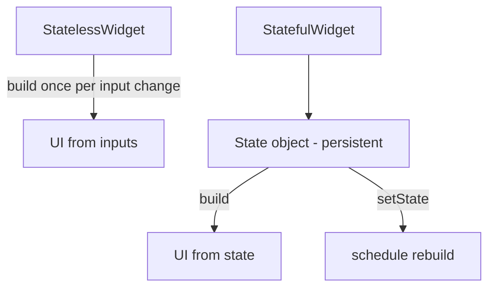
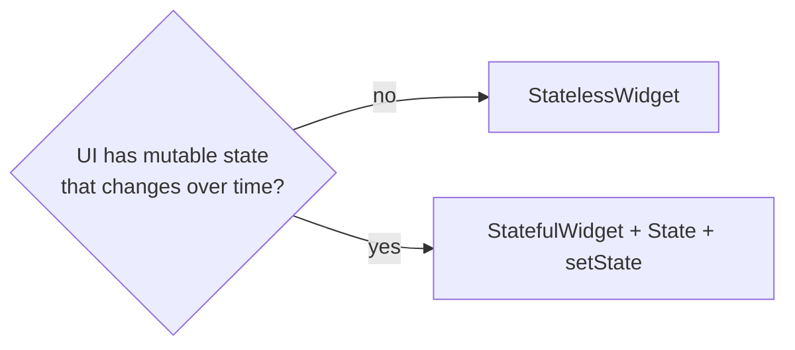

# `StatelessWidget` vs `StatefulWidget` (and `setState`)

> Use a `StatelessWidget` when the UI depends only on its inputs; use a `StatefulWidget` when it has mutable state that changes over its lifetime and must trigger rebuilds via `setState`.

## Introduction

Every custom widget is one of two kinds. A **`StatelessWidget`** is fully described by its constructor inputs (immutable). A **`StatefulWidget`** pairs an immutable widget with a mutable **`State`** object that persists across rebuilds and calls `setState` to request a rebuild. This file covers the split, `setState`, and when to choose each.

## Why this concept exists

Most UI is a pure function of inputs (stateless) — cheap and simple. But some UI holds evolving local state (a toggle, a form field, an animation, a fetched result). The `StatefulWidget`/`State` pair gives a persistent place for that state that survives rebuilds (unlike throwaway widgets — see [04_widgets_elements_render_objects.md](04_widgets_elements_render_objects.md)).

## Real-world analogy

- **StatelessWidget** = a **printed sign**: whatever you set at creation is what it shows; to change it you print a new one.
- **StatefulWidget** = a **digital display with memory**: it keeps a value (state) and updates its screen when that value changes.

## Problem Statement

A price label derived from props should be stateless; a like-button that toggles on tap needs local mutable state. You'll build both and use `setState` correctly.

## Internal Working



- **`StatelessWidget`**: implement `build(context)`; no mutable fields (should be `final`). Rebuilds only when its parent gives it new inputs.
- **`StatefulWidget`**: immutable widget + `createState()` returning a **`State`** object.
- **`State`**: holds mutable fields; `build(context)` renders from them; `setState(fn)` mutates state **and** tells the framework to rebuild.
- The `State` object **persists** in the Element tree across rebuilds; the `StatefulWidget` instance itself is recreated (config), and `State.widget` gives the current config.

## Memory Representation

The `State` object lives with the Element (persistent). The widget objects (both kinds) are throwaway config recreated each build ([04_widgets_elements_render_objects.md](04_widgets_elements_render_objects.md)).

## Compiler Behavior

`const` constructors on stateless widgets enable skip-rebuild optimizations ([03_declarative_ui.md](03_declarative_ui.md)). `State` fields being mutable is expected (not `final`).

## Runtime Behavior

`setState(fn)` runs `fn` synchronously (mutate state), then marks the element dirty; the framework rebuilds it next frame. Calling `setState` after `dispose` throws — a common lifecycle bug ([Module 08](../08%20Widget%20Lifecycle/README.md)).

## Flutter Engine Behavior

Not applicable directly; `setState` feeds the rebuild → layout → paint pipeline ([Module 09](../09%20Rendering%20Pipeline/README.md)).

## Dart VM Behavior

Not applicable.

## Examples

```dart
import 'package:flutter/material.dart';

// Stateless: fully described by inputs (all final)
class PriceTag extends StatelessWidget {
  final double price;
  const PriceTag({super.key, required this.price});
  @override
  Widget build(BuildContext context) =>
      Text('\$${price.toStringAsFixed(2)}'); // pure function of `price`
}

// Stateful: holds mutable local state
class LikeButton extends StatefulWidget {
  const LikeButton({super.key});
  @override
  State<LikeButton> createState() => _LikeButtonState();
}
class _LikeButtonState extends State<LikeButton> {
  bool _liked = false; // mutable state (persists across rebuilds)

  @override
  Widget build(BuildContext context) {
    return IconButton(
      icon: Icon(_liked ? Icons.favorite : Icons.favorite_border),
      color: _liked ? Colors.red : null,
      onPressed: () => setState(() => _liked = !_liked), // mutate + rebuild
    );
  }
}

void main() => runApp(const MaterialApp(
      home: Scaffold(
        body: Center(
          child: Column(mainAxisSize: MainAxisSize.min, children: [
            PriceTag(price: 19.99),
            LikeButton(),
          ]),
        ),
      ),
    ));
```

## Diagrams



## Common Mistakes

| Mistake | Why | Fix |
|---------|-----|-----|
| Mutable fields in a `StatelessWidget` | Widgets are immutable; won't rebuild | Use `StatefulWidget` or lift state up |
| Mutating state without `setState` | UI won't update | Wrap the mutation in `setState` |
| Heavy work inside `setState` | Blocks/janks | Do work outside; only set state in the callback |
| `setState` after `dispose` | Throws | Guard / cancel async before dispose ([Module 08](../08%20Widget%20Lifecycle/README.md)) |
| Everything stateful "just in case" | Unneeded complexity/rebuilds | Prefer stateless; add state only when needed |
| Business logic living in `State` | Untestable, coupled | Move to view models/BLoC ([Module 11](../11%20State%20Management/README.md)) |

## Best Practices

- **Default to `StatelessWidget`**; upgrade to stateful only for genuine local mutable state.
- Keep `State` about **UI state**, not business logic (that goes to state management — [Module 11](../11%20State%20Management/README.md)).
- Call `setState` with a minimal callback that only mutates state; do heavy work before it.
- **Lift state up** or use a state solution when multiple widgets share it.
- Use `const` on stateless widgets where possible.

## Performance

`setState` rebuilds that element's subtree — keep it small (split widgets, push state down) so rebuilds are cheap ([Module 21](../21%20Performance/README.md)).

## Advantages / Disadvantages

- **+ Stateless:** simple, cheap, `const`-able, easy to test. **+ Stateful:** local persistent state with controlled rebuilds.
- **− Stateful:** lifecycle to manage (dispose), easy to misuse for logic; over-stateful trees over-rebuild.

## Interview Questions

1. **🟢 StatelessWidget vs StatefulWidget?** — Stateless is fully defined by its inputs (immutable); Stateful pairs an immutable widget with a persistent `State` holding mutable data and uses `setState` to rebuild.
2. **🟢 What does `setState` do?** — Runs your mutation synchronously and marks the element dirty so the framework rebuilds it next frame.
3. **🟡 Why can't a `StatelessWidget` hold changing state?** — Widgets are immutable and recreated each build; there's no persistent place for mutable data (that's what `State` is for).
4. **🟡 Where does the `State` object live and why does it persist?** — In the Element tree; the element persists across rebuilds, so the `State` (and its data) survives while the widget config is recreated.
5. **🟡 What's a common `setState` bug?** — Calling it after `dispose` (e.g., from a late async callback); guard or cancel the async first.
6. **🔴 When choose stateful over lifting state / a state manager?** — For purely local, ephemeral UI state (a toggle, a text field, an animation controller). Shared/business state should be lifted or managed externally.
7. **🔴 Why default to stateless?** — Simpler, cheaper, `const`-able, and it forces you to locate real state deliberately, reducing accidental rebuilds.

## Senior Engineer Tips

- Ask "does this UI have memory of its own?" — if no, it's stateless.
- Keep `State` thin: UI-only state + wiring to a view model; don't grow business logic there.
- Split large stateful widgets so `setState` rebuilds a small subtree, not a whole page.

## Architect Perspective

The stateless/stateful choice is the first state-ownership decision. Keeping business/shared state out of widget `State` (in view models/BLoC) and reserving `State` for local UI concerns is what keeps the UI layer thin, testable, and performant — the on-ramp to [Module 11 State Management](../11%20State%20Management/README.md) and MVVM ([Module 43](../43%20MVVM/README.md)).

## Summary

- Stateless = UI from inputs (immutable); Stateful = immutable widget + persistent `State` + `setState`.
- `State` persists in the Element tree; `setState` mutates + schedules a rebuild.
- Default stateless; keep `State` UI-only; scope rebuilds; guard against post-dispose `setState`.

## Revision Notes

- Stateless: inputs-only, `final`, `const`-able. Stateful: `State` holds mutable data, `setState` rebuilds.
- `State` persists (Element); widget is throwaway config (`State.widget`).
- `setState`: mutate + mark dirty; don't call after `dispose`.
- Default stateless; business logic → state management, not `State`.

## Practice Questions

1. Why does adding a mutable field to a StatelessWidget not update the UI?
2. Where does the `State` object live, and why does that let it persist?
3. Why is `setState` after `dispose` an error?

## Coding Questions

1. Build a stateless `Badge(count)` and a stateful `Stepper` (increment/decrement).
2. Convert a stateful widget to stateless by lifting state up to the parent.
3. Reproduce and fix a post-dispose `setState` using an async timer.

## Mini Project

**Stateless/stateful split (Flutter):** Build a `ProductCard` (stateless, from props) containing a `FavoriteToggle` (stateful, local `setState`). Ensure toggling only rebuilds the toggle subtree. In comments, justify each widget's kind. Acceptance: correct kind choices; `setState` scoped; no post-dispose calls; `const` used where possible.
