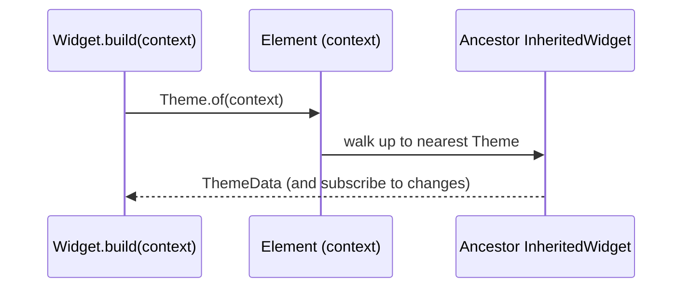

# `BuildContext`

> `BuildContext` is a handle to a widget's location in the Element tree — it's how a widget finds ancestors (`Theme.of(context)`), its size/position, and navigation, and why "context matters" for lookups.

## Introduction

Every `build` method receives a `BuildContext`. It's not the widget and not the data — it's a reference to the **Element** for this widget, i.e., its *position in the tree*. That position is what enables ancestor lookups (`Theme.of`, `MediaQuery.of`, `Navigator.of`, `Provider.of`).

## Why this concept exists

Widgets need access to inherited data and services from *above* them (theme, media query, navigator, injected state) without passing everything through constructors. `BuildContext` gives each widget a tree-aware handle to walk up and find the nearest ancestor of a given type efficiently.

## Real-world analogy

`BuildContext` is your **location pin on a map of the building**. From your pin you can ask "where's the nearest exit (ancestor `Navigator`)?" or "what's this floor's lighting setting (ancestor `Theme`)?" The answer depends on *where you are* — a different pin gives different nearest-ancestors.

## Problem Statement

`Theme.of(context)` returns the theme, but sometimes `Navigator.of(context)` throws "no Navigator found" or a `Scaffold.of(context)` fails — because the context is at the wrong position. You'll learn what context is and why position determines lookups.

## Internal Working

```mermaid
flowchart TD
    Ctx["BuildContext (this Element)"] -->|of(context) walks UP| Anc[nearest ancestor of type T]
    Anc --> Data[InheritedWidget data / service]
```

- `BuildContext` **is** the widget's `Element` (the interface it exposes).
- `SomeInheritedWidget.of(context)` calls `context.dependOnInheritedWidgetOfExactType<T>()`, which walks **up** to the nearest ancestor of that type and **subscribes** the element to it (rebuild on change).
- Context also exposes `size`, `findRenderObject()`, and is used by `Navigator`, `MediaQuery`, `Theme`, `Provider`, etc.
- A context from *above* a provider can't see it → the classic "not found"/"used a context that doesn't include" errors.

## Memory Representation

The context is the Element itself (persistent in the Element tree); no extra allocation ([04_widgets_elements_render_objects.md](04_widgets_elements_render_objects.md)).

## Compiler Behavior

Not applicable.

## Runtime Behavior

`.of(context)` performs an up-the-tree lookup at build time; `dependOn...` registers a dependency so the widget rebuilds when the inherited data changes. `.of(context, listen: false)`/`read` avoids subscribing.

## Flutter Engine Behavior

Not applicable directly.

## Dart VM Behavior

Not applicable.

## Examples

```dart
import 'package:flutter/material.dart';

class ThemedText extends StatelessWidget {
  const ThemedText({super.key});
  @override
  Widget build(BuildContext context) {
    // Look UP the tree for the nearest Theme/MediaQuery ancestors:
    final color = Theme.of(context).colorScheme.primary;
    final width = MediaQuery.of(context).size.width;
    return Text('W=$width', style: TextStyle(color: color));
  }
}

// Classic pitfall: using a context that is ABOVE the Scaffold.
class Pitfall extends StatelessWidget {
  const Pitfall({super.key});
  @override
  Widget build(BuildContext context) {
    return Scaffold(
      // ❌ `context` here is the parent of this Scaffold, so Scaffold.of(context)
      //    would NOT find THIS Scaffold. Use a Builder to get a context BELOW it.
      body: Builder(
        builder: (innerContext) => ElevatedButton(
          onPressed: () => ScaffoldMessenger.of(innerContext)
              .showSnackBar(const SnackBar(content: Text('hi'))),
          child: const Text('Show snackbar'),
        ),
      ),
    );
  }
}
```

## Diagrams



## Common Mistakes

| Mistake | Why | Fix |
|---------|-----|-----|
| `Scaffold.of(context)`/`Navigator.of` with a too-high context | That ancestor isn't above this context | Use a `Builder` to get a context below it |
| Using `context` across async gaps after dispose | Element may be unmounted | Check `mounted`; capture needed values before `await` |
| Storing `context` for later use | It may become invalid | Don't persist context; look up when needed |
| `Provider.of(context, listen:true)` in callbacks | Unnecessary rebuilds | Use `read`/`listen:false` outside build |

## Best Practices

- Treat `context` as "my position in the tree"; lookups find the **nearest ancestor**.
- Use a `Builder`/child widget to obtain a context **below** a provider/`Scaffold` you need.
- Guard `context` use after `await` with `if (!mounted) return;` ([Module 08](../08%20Widget%20Lifecycle/README.md)).
- Don't store contexts; fetch dependencies during `build` (or via `read` in handlers).

## Performance

`dependOn...` subscriptions cause rebuilds when inherited data changes — scope them (use `select`/`read`) to avoid over-rebuilding ([Module 11](../11%20State%20Management/README.md)).

## Advantages / Disadvantages

- **+** Ancestor data/services without prop-drilling; tree-aware lookups; enables `InheritedWidget`/Provider.
- **−** Position-dependent (confusing "not found" errors); async/lifecycle pitfalls; subscriptions can over-rebuild.

## Interview Questions

1. **🟢 What is `BuildContext`?** — A handle to the widget's `Element` — its location in the Element tree — used to look up ancestors and tree-related info.
2. **🟢 What does `Theme.of(context)` do?** — Walks up from `context` to the nearest `Theme` ancestor, returns its data, and subscribes the widget to changes.
3. **🟡 Why does `Scaffold.of(context)` sometimes fail?** — The `context` is above the `Scaffold`; the lookup walks up and doesn't find it. Use a `Builder` to get a context below.
4. **🟡 Why is using `context` after an `await` risky?** — The element may have been unmounted; guard with `if (!mounted) return;`.
5. **🟡 `listen:true` vs `read`/`listen:false`?** — Listening subscribes the widget to rebuild on change (use in build); `read` fetches once without subscribing (use in callbacks).
6. **🔴 How does `.of(context)` actually find ancestors?** — Via `dependOnInheritedWidgetOfExactType`, an O(1)-ish lookup using the element's inherited-widget map, registering a dependency.
7. **🔴 Why shouldn't you store a `BuildContext`?** — It's tied to an element that can be deactivated/unmounted; a stored context may become invalid, causing errors.

## Senior Engineer Tips

- The "no X found for this context" family of errors is almost always a **position** problem — introduce a `Builder` or split a widget to get a descendant context.
- After async work, re-check `mounted` before using `context` (Navigator/ScaffoldMessenger) — a very common crash.
- Prefer `context.read<T>()` in event handlers and `watch`/`select` in build for controlled rebuilds.

## Architect Perspective

`BuildContext` is the mechanism behind Flutter's dependency lookup (`InheritedWidget` → Provider/Riverpod). Understanding it is prerequisite to state management and DI in Flutter ([Modules 11, 14](../11%20State%20Management/README.md)): who can see what depends on tree position, which shapes how you place providers and scope rebuilds.

## Summary

- `BuildContext` is the widget's Element — its position in the tree.
- `.of(context)` walks up to the nearest ancestor and (often) subscribes to it.
- Position determines lookups; guard async/lifecycle use; don't store contexts.

## Revision Notes

- `BuildContext` = this widget's Element (tree position).
- `X.of(context)` = nearest ancestor `X` (+ subscribe via `dependOn...`).
- "Not found" = context too high → use `Builder`.
- After `await`: check `mounted`; don't store context; `read` in callbacks.

## Practice Questions

1. Why does `context` position affect what `Theme.of` returns?
2. How do you fix `Scaffold.of(context)` not finding the scaffold?
3. Why guard `context` use after `await`?

## Coding Questions

1. Show a snackbar correctly using a `Builder`-provided context.
2. Read `MediaQuery` width and adapt layout above/below a breakpoint.
3. Reproduce and fix a post-`await` context-use crash with `mounted`.

## Mini Project

**Context lookups demo (Flutter):** Build a screen using `Theme.of`, `MediaQuery.of`, and a `Builder` to correctly show a `SnackBar`, plus an async action guarded by `mounted`. In comments, explain why each lookup depends on position. Acceptance: no "not found" errors; async guarded; correct `Builder` usage.
