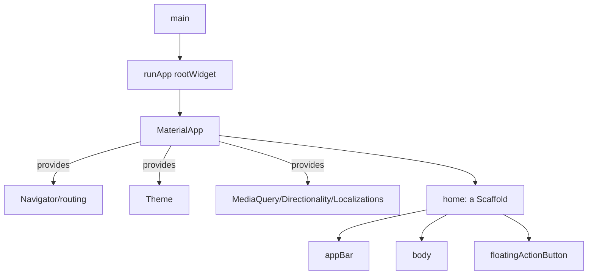
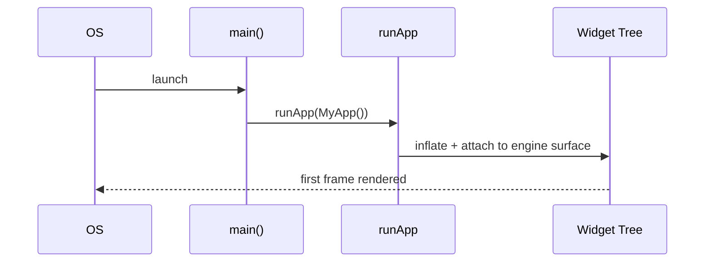

# App Entry Point (`main`, `runApp`, `MaterialApp`, `Scaffold`)

> Every Flutter app starts at `main()`, which calls `runApp(rootWidget)`; `MaterialApp` sets up app-wide plumbing (theme, routing, localization), and `Scaffold` gives a screen its standard structure.

## Introduction

This file explains the boot skeleton you see in every app: `main` → `runApp` → `MaterialApp` → `Scaffold`. Knowing what each does — and what belongs where — lets you read and structure any Flutter app.

## Why this concept exists

An app needs a single entry point, a way to mount the widget tree, and app-level infrastructure (navigation, theming, localization, media query). `runApp` mounts the tree; `MaterialApp`/`CupertinoApp` provide that infrastructure once at the top; `Scaffold` provides per-screen layout slots so you don't rebuild app bars/drawers by hand.

## Real-world analogy

- `main` = the **front door** you enter through.
- `runApp` = **turning the lights on** and mounting the building's interior.
- `MaterialApp` = the **building's shared services** (elevators=navigation, HVAC=theme, signage=localization).
- `Scaffold` = a **room's standard fittings** (ceiling=`AppBar`, floor=`body`, call button=`FloatingActionButton`).

## Problem Statement

You need to bootstrap an app with a theme, a home screen with an app bar and a floating action button, and app-wide navigation. You'll wire `main`→`runApp`→`MaterialApp`→`Scaffold` and know what each provides.

## Internal Working



- **`main()`** — Dart entry; optionally `WidgetsFlutterBinding.ensureInitialized()` before async setup (plugins, DI).
- **`runApp(widget)`** — inflates the widget as the root of the tree and attaches it to the screen.
- **`MaterialApp`** — wraps the app with `Navigator`, `Theme`, `MediaQuery`, `Localizations`, `Directionality`, etc. (Use `CupertinoApp` for iOS-style, or `WidgetsApp` for bare.)
- **`Scaffold`** — Material screen scaffold with slots: `appBar`, `body`, `floatingActionButton`, `drawer`, `bottomNavigationBar`, `snackBar` via `ScaffoldMessenger`.

## Memory Representation

The root widget/element persists for the app's life; `MaterialApp`'s inherited widgets are looked up via context ([build_context.md](build_context.md)).

## Compiler Behavior / Runtime Behavior

`runApp` schedules the first frame; async init before `runApp` should await after `ensureInitialized()`.

## Flutter Engine Behavior

`runApp` connects the framework to the engine's render surface via the binding; the first frame is scheduled and rasterized ([Module 09](../09%20Rendering%20Pipeline/README.md)).

## Dart VM Behavior

`main` runs on the root isolate's event loop ([02 · event_loop](../02%20Advanced%20Dart/event_loop.md)).

## Examples

```dart
import 'package:flutter/material.dart';

Future<void> main() async {
  WidgetsFlutterBinding.ensureInitialized(); // needed before async plugin/DI setup
  // await setupDependencies(); // e.g., DI, preferences (Modules 14, 15)
  runApp(const MyApp());
}

class MyApp extends StatelessWidget {
  const MyApp({super.key});
  @override
  Widget build(BuildContext context) {
    return MaterialApp(
      title: 'Demo',
      theme: ThemeData(colorSchemeSeed: Colors.indigo, useMaterial3: true),
      home: const HomePage(),
      // routes / onGenerateRoute / initialRoute go here (Modules 12, 13)
    );
  }
}

class HomePage extends StatelessWidget {
  const HomePage({super.key});
  @override
  Widget build(BuildContext context) {
    return Scaffold(
      appBar: AppBar(title: const Text('Home')),
      body: const Center(child: Text('Body content')),
      floatingActionButton: FloatingActionButton(
        onPressed: () {},
        child: const Icon(Icons.add),
      ),
    );
  }
}
```

## Diagrams



## Common Mistakes

| Mistake | Why | Fix |
|---------|-----|-----|
| Async work before `ensureInitialized()` | Binding not ready for plugins | Call `WidgetsFlutterBinding.ensureInitialized()` first |
| Heavy synchronous work in `main` before `runApp` | Delays first frame | Defer/parallelize; show a splash |
| Multiple `Scaffold`s nested unnecessarily | Layout/`ScaffoldMessenger` confusion | One `Scaffold` per screen |
| Putting app-wide config in a screen | Duplicated/inconsistent | Configure once in `MaterialApp` |
| Using `Scaffold.of(context)` from the same build | Context above the Scaffold | Use `Builder`/`ScaffoldMessenger` ([build_context.md](build_context.md)) |

## Best Practices

- Call `WidgetsFlutterBinding.ensureInitialized()` before any async setup in `main`.
- Configure **theme, routes, localization once** in `MaterialApp`.
- One `Scaffold` per screen; use its slots instead of hand-building bars.
- Keep `main` thin: init + `runApp`; put setup in dedicated functions ([Module 14](../14%20Dependency%20Injection/README.md)).
- Use `ScaffoldMessenger` for snackbars (survives route changes).

## Performance

Minimize pre-`runApp` work to render the first frame fast; do heavy init lazily/after first frame or on a splash ([Module 21](../21%20Performance/README.md)).

## Advantages / Disadvantages

- **+** Standardized boot + app infrastructure + per-screen structure with minimal code.
- **−** `MaterialApp` imposes Material defaults (use Cupertino/WidgetsApp otherwise); Scaffold conventions to learn.

## Interview Questions

1. **🟢 What does `runApp` do?** — Inflates the given widget as the root of the tree and attaches it to the engine's render surface, scheduling the first frame.
2. **🟢 What does `MaterialApp` provide?** — App-wide `Navigator`/routing, `Theme`, `MediaQuery`, `Localizations`, `Directionality`, etc.
3. **🟡 What is `Scaffold` for?** — A Material screen structure with slots: `appBar`, `body`, `floatingActionButton`, `drawer`, `bottomNavigationBar`, snackbars via `ScaffoldMessenger`.
4. **🟡 Why call `WidgetsFlutterBinding.ensureInitialized()`?** — To initialize the framework binding before doing async work (plugins, DI, preferences) prior to `runApp`.
5. **🟡 `MaterialApp` vs `CupertinoApp` vs `WidgetsApp`?** — Material design app, iOS-style app, and a bare app shell without a design language, respectively.
6. **🔴 Why keep pre-`runApp` work minimal?** — It delays the first frame; heavy init should be deferred, parallelized, or shown behind a splash.
7. **🔴 Why use `ScaffoldMessenger` for snackbars?** — It's scoped above routes, so snackbars persist across navigation and avoid context-position pitfalls.

## Senior Engineer Tips

- Keep `main` to init + `runApp`; extract setup (DI, logging, error handlers) into functions and wire error/zone guards here ([Modules 38, 39](../38%20Error%20Handling/README.md)).
- Configure theming/routing centrally so screens stay consistent and thin.
- For fast startup, defer non-critical init until after the first frame (`WidgetsBinding.instance.addPostFrameCallback`).

## Architect Perspective

The entry point is your app's composition root ([05 · dependency_injection](../05%20Design%20Patterns/dependency_injection.md)): where DI, error handling, logging, theming, and routing are wired once. Structuring it cleanly (thin `main`, centralized app config) sets the tone for a maintainable, testable app and integrates with routing ([Modules 12, 13](../12%20Navigation/README.md)) and DI ([Module 14](../14%20Dependency%20Injection/README.md)).

## Summary

- `main` → `runApp(root)` mounts the tree; `MaterialApp` provides app-wide infrastructure; `Scaffold` structures a screen.
- `ensureInitialized()` before async setup; keep `main` thin; configure theme/routes once.
- Use one `Scaffold` per screen and `ScaffoldMessenger` for snackbars.

## Revision Notes

- `main` → `runApp(widget)` (mount + first frame).
- `MaterialApp` = Navigator + Theme + MediaQuery + Localizations.
- `Scaffold` = appBar/body/FAB/drawer/bottomNav slots.
- `ensureInitialized()` before async init; thin `main` = composition root.

## Practice Questions

1. What does `runApp` connect the widget tree to?
2. Why is `ensureInitialized()` needed before async plugin setup?
3. Why prefer `ScaffoldMessenger` for snackbars?

## Coding Questions

1. Bootstrap an app with a seeded Material 3 theme and a home `Scaffold`.
2. Add a `FloatingActionButton` + `SnackBar` via `ScaffoldMessenger`.
3. Do an async init (fake) after `ensureInitialized()` before `runApp`.

## Mini Project

**App skeleton (Flutter):** Build `main`→`runApp`→`MaterialApp` (themed) → home `Scaffold` with `AppBar`, `body`, and a `FloatingActionButton` that shows a snackbar via `ScaffoldMessenger`. Add a fake async init after `ensureInitialized()`. Acceptance: thin `main`; centralized theme; snackbar works; app runs.
