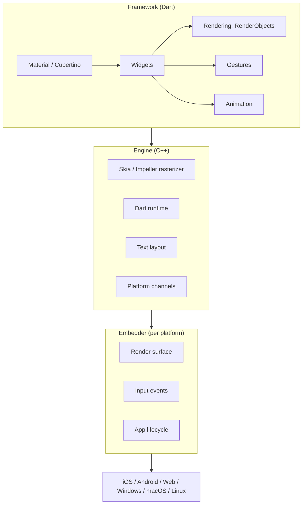
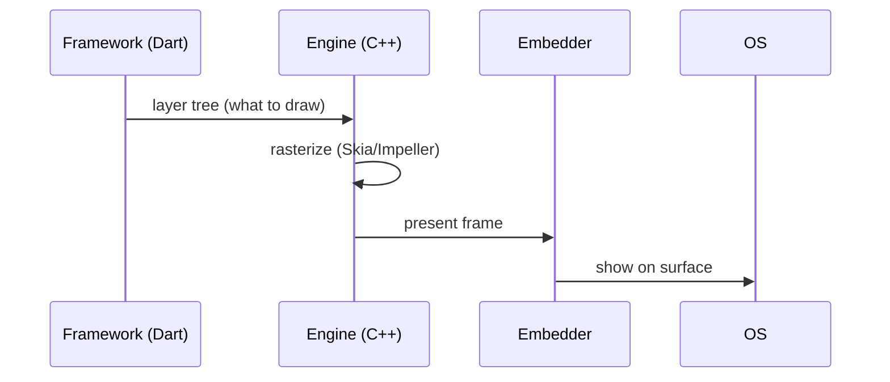

# Architecture Overview (Framework / Engine / Embedder)

> Flutter is built in three layers — a Dart **Framework** you code against, a C++ **Engine** that rasterizes and runs Dart, and a platform **Embedder** that hosts it on each OS.

## Introduction

This file gives the high-level layered picture so later modules (rendering, performance, platform channels) slot in. Deep engine internals (threads, Skia/Impeller, compositor) live in [Module 10](../10%20Flutter%20Architecture/README.md); here we build the mental map.

## Why this concept exists

Understanding the layers explains *where* things happen: why widgets are cheap (Dart framework), why rendering is fast (C++ engine + GPU), why native features need channels (embedder boundary), and why some work must leave the UI isolate. It's the map that makes performance and integration decisions rational.

## Real-world analogy

A **theater production**: the **script and actors** (Framework — what you write), the **stage crew, lighting, and sound engine** (Engine — makes it appear), and the **specific venue** with its doors and power (Embedder — the platform hosting the show). Same script runs in any venue via its crew.

## Problem Statement

You need to reason about: where your widget code runs, what turns it into pixels, and where platform (camera, files) integration happens. You'll place each concern in the right layer.

## Internal Working



| Layer | Language | Responsibilities |
|-------|----------|------------------|
| **Framework** | Dart | Widgets, elements, render objects, gestures, animation, Material/Cupertino, foundation |
| **Engine** | C++ | Rasterization (Skia/Impeller), Dart runtime hosting, text/layout, image decoding, platform-channel plumbing |
| **Embedder** | Platform-native | Creates the render surface, feeds input, manages the app lifecycle/thread setup per OS |

- You almost always work in the **Framework**. The **Engine** turns your render tree into GPU commands. The **Embedder** integrates with the host OS.

## Memory Representation

Framework objects (the trees) live in the Dart heap; the engine manages GPU resources/textures; each runs with its own memory concerns ([02 · memory_and_gc](../02%20Advanced%20Dart/memory_and_gc.md)).

## Compiler Behavior

Framework Dart compiles JIT (debug)/AOT (release); the engine is precompiled C++ shipped with the app ([02 · dart_compilation](../02%20Advanced%20Dart/dart_compilation.md)).

## Runtime Behavior

The framework produces a layer tree each frame; the engine composites + rasterizes on its raster thread; the embedder presents it to the platform surface ([Module 09](../09%20Rendering%20Pipeline/README.md)).

## Flutter Engine Behavior

The engine uses multiple threads (UI/Dart, raster, IO, platform). The **UI (Dart) thread** runs your code; the **raster thread** draws. Blocking the UI thread delays frames (deep dive in [Module 10](../10%20Flutter%20Architecture/README.md), [Module 21](../21%20Performance/README.md)).

## Dart VM Behavior

The engine hosts the Dart runtime; your app runs on the root isolate. `compute`/isolates spawn additional isolates for parallel work ([02 · isolates](../02%20Advanced%20Dart/isolates.md)).

## Examples

```dart
// You write Framework-layer code:
import 'package:flutter/material.dart';

class Card_ extends StatelessWidget {
  const Card_({super.key});
  @override
  Widget build(BuildContext context) => Container( // framework widget
        padding: const EdgeInsets.all(16),
        child: const Text('Rendered by the engine'), // engine paints glyphs
      );
}

// Platform features cross the embedder boundary via channels:
// const channel = MethodChannel('app/battery');
// final level = await channel.invokeMethod('getBatteryLevel'); // Module 26
```

## Diagrams



## Common Mistakes

| Mistake | Why | Fix |
|---------|-----|-----|
| Confusing framework widgets with native widgets | They're Dart, engine-painted | Remember Flutter owns rendering |
| Expecting to touch the engine directly | You work in the framework | Use framework APIs / plugins |
| Doing platform work without channels | Embedder boundary | Use platform channels/plugins ([Module 26](../26%20Platform%20Channels/README.md)) |
| Blaming the engine for jank | Usually UI-thread blocking | Profile; offload work ([Module 21](../21%20Performance/README.md)) |

## Best Practices

- Work at the **framework** layer; reach for the engine only via provided APIs/plugins.
- Cross to native through **platform channels**; keep that boundary thin.
- Keep the UI thread free; understand the raster thread does the drawing.
- Learn the three trees + pipeline to reason about the framework→engine handoff.

## Performance

The engine is highly optimized; app performance is dominated by framework-side rebuild/layout cost and UI-thread blocking ([Module 21](../21%20Performance/README.md)).

## Advantages / Disadvantages

- **+** Clear separation: portable framework, fast engine, thin per-platform embedder.
- **−** Native integration requires crossing the embedder boundary (channels); engine adds app size.

## Interview Questions

1. **🟢 Name Flutter's three layers.** — Framework (Dart), Engine (C++), Embedder (per-platform).
2. **🟢 Which layer do you write code in?** — Almost always the Framework (widgets/render/gestures/animation).
3. **🟡 What does the Engine do?** — Rasterizes the render tree (Skia/Impeller), hosts the Dart runtime, does text layout/image decode, and plumbs platform channels.
4. **🟡 What is the Embedder's job?** — Provides the render surface, input, and lifecycle integration for a specific OS.
5. **🟡 Where do platform features (camera, battery) integrate?** — Across the embedder boundary via platform channels/plugins.
6. **🔴 Why does UI-thread work cause jank if the engine draws on the raster thread?** — The framework must produce the layer tree on the UI thread first; if it's blocked, the raster thread has nothing new to draw on time.
7. **🔴 How does the framework hand off to the engine each frame?** — It produces a layer tree; the engine composites and rasterizes it, and the embedder presents it.

## Senior Engineer Tips

- Map every performance question to a layer: rebuild/layout cost → framework; shader/raster jank → engine (Impeller helps); startup/surface → embedder.
- Keep platform-channel payloads small and calls off hot paths.
- For deep threading/compositor detail, see [Module 10](../10%20Flutter%20Architecture/README.md); for the frame pipeline, [Module 09](../09%20Rendering%20Pipeline/README.md).

## Architect Perspective

The layered architecture is why Flutter is portable yet fast: a shared Dart framework, a reusable native engine, and thin platform embedders. Architecturally, it localizes platform-specific risk to the embedder/channel boundary and keeps your app logic portable — shaping how you structure native integrations and multi-platform builds.

## Summary

- Three layers: Framework (Dart, what you write) → Engine (C++, rasterizes + runs Dart) → Embedder (per-OS host).
- You code the framework; the engine paints; the embedder integrates with the platform.
- Native features cross the embedder via channels; jank is usually framework/UI-thread, not engine.

## Revision Notes

- Framework (Dart) / Engine (C++, Skia/Impeller + Dart runtime) / Embedder (per platform).
- You write framework code; engine rasterizes; embedder hosts + input/lifecycle.
- Platform features → channels (embedder boundary).
- Deep dive: Module 10 (arch), Module 09 (pipeline).

## Practice Questions

1. Which layer rasterizes pixels, and in what language?
2. Where does camera/battery integration happen and how?
3. Why can a blocked UI thread stall rendering the engine could otherwise do?

## Coding Questions

1. Label a small widget file's parts by layer (framework vs engine-painted).
2. Sketch (comment) the frame handoff from framework to engine.
3. Identify where a `MethodChannel` call crosses layers.

## Mini Project

**Layer map (docs + small app):** Build a simple screen and write `ARCHITECTURE.md` mapping each concern (widgets, painting, input, a hypothetical native call) to Framework/Engine/Embedder, with a Mermaid diagram. Acceptance: correct layer attribution; diagram present; app runs.
