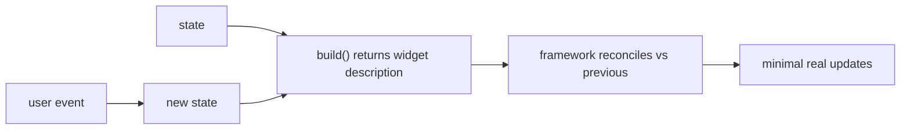
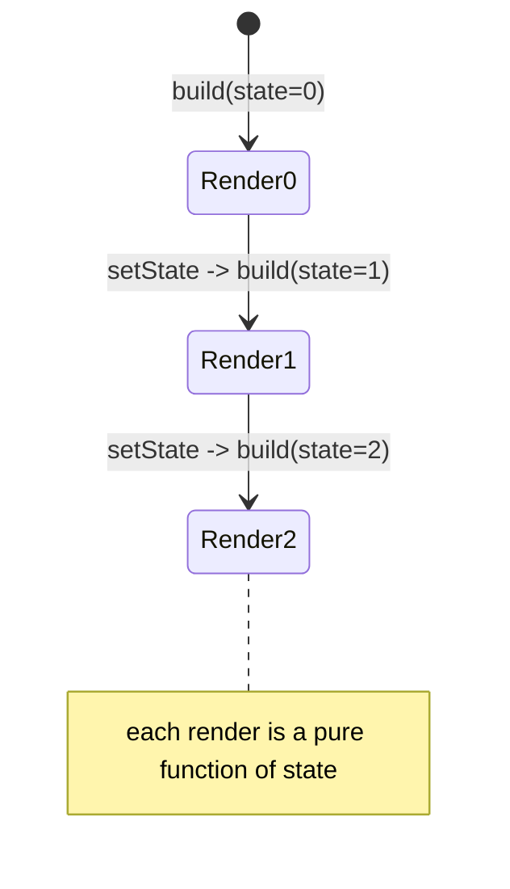

# Declarative UI (UI = f(state))

> In Flutter you describe *what* the UI should look like for the current state, and the framework figures out *how* to update the screen — you never manually mutate widgets.

## Introduction

Flutter is **declarative**: your `build` method returns a description of the UI for the current state. When state changes, you rebuild the description and Flutter efficiently reconciles the difference. This is the opposite of the **imperative** model (Android Views/iOS UIKit) where you mutate widget properties directly.

## Why this concept exists

Imperative UI code drifts out of sync with state ("I updated the model but forgot to update label 3"). Declarative UI makes the screen a pure function of state — `UI = f(state)` — so there's one source of truth and no manual widget mutation to forget. The framework handles the minimal updates.

## Real-world analogy

Imperative is **giving turn-by-turn edits to a painting** ("erase that, move this, recolor that"). Declarative is **describing the final picture** and handing it to an artist who figures out what to change from the last version. You state the destination, not the steps.

## Problem Statement

A counter shows a number and a button increments it. In imperative UIs you'd find the label and call `label.setText(...)`. In Flutter you change state and rebuild the description. You'll see why declarative avoids sync bugs.

## Internal Working



- `build(context)` returns an **immutable description** (widgets) for the current state.
- On state change (`setState`/notifier/stream), `build` runs again → a new description.
- Flutter **reconciles** the new widget tree against the persistent Element tree and updates only what changed (see [widgets_elements_render_objects.md](widgets_elements_render_objects.md), [Module 09](../09%20Rendering%20Pipeline/README.md)).
- You never hold references to mutate widgets; widgets are cheap, throwaway blueprints.

## Memory Representation

Widgets are lightweight, short-lived config objects recreated each build; the Element tree persists and holds state ([widgets_elements_render_objects.md](widgets_elements_render_objects.md)).

## Compiler Behavior

`const` widget constructors let Flutter skip rebuilding unchanged subtrees ([01 · variables](../01%20Dart%20Fundamentals/variables_and_mutability.md)) — a key declarative-perf lever.

## Runtime Behavior

Rebuilds are frequent and cheap by design; the expensive work (layout/paint) is minimized via reconciliation and `const`/keys ([Module 21](../21%20Performance/README.md)).

## Flutter Engine Behavior

Not applicable directly; declarative rebuilds feed the pipeline that the engine rasterizes.

## Dart VM Behavior

Frequent widget allocation is GC-managed; `const` widgets avoid allocation ([02 · memory_and_gc](../02%20Advanced%20Dart/memory_and_gc.md)).

## Examples

```dart
import 'package:flutter/material.dart';

class CounterPage extends StatefulWidget {
  const CounterPage({super.key});
  @override
  State<CounterPage> createState() => _CounterPageState();
}

class _CounterPageState extends State<CounterPage> {
  int _count = 0; // the state

  @override
  Widget build(BuildContext context) {
    // UI = f(state): describe the UI for the CURRENT _count
    return Scaffold(
      body: Center(child: Text('Count: $_count')),
      floatingActionButton: FloatingActionButton(
        onPressed: () => setState(() => _count++), // change state -> rebuild
        child: const Icon(Icons.add),
      ),
    );
  }
}
// You never call someLabel.setText(...). You change _count and rebuild the
// DESCRIPTION; Flutter updates the actual text efficiently.
```

```text
Imperative (Android View), for contrast:
  countLabel.setText("Count: " + count);   // you manually mutate the widget
  // easy to forget when count changes elsewhere -> UI/state drift
```

## Diagrams



## Common Mistakes

| Mistake | Why | Fix |
|---------|-----|-----|
| Trying to mutate a widget after building | Widgets are immutable blueprints | Change state + rebuild |
| Storing widgets to update later | Not how declarative works | Store state, not widgets |
| Heavy logic/side effects in `build` | `build` runs often | Keep `build` pure; do effects elsewhere |
| Not using `const` widgets | Extra rebuild/allocation | `const` static subtrees |
| Mutating state without `setState`/notifier | UI won't update | Trigger a rebuild via the state mechanism |

## Best Practices

- Keep `build` **pure**: derive UI from state, no side effects, no network calls.
- Store **state**, not widgets; never mutate widgets directly.
- Use `const` for unchanging subtrees to skip rebuilds.
- Isolate the *what* (widgets) from the *how* (framework reconciliation) — trust the framework to diff.

## Performance

Cheap frequent rebuilds are fine; the cost is in layout/paint, minimized by `const`, keys, and scoping rebuilds ([Module 21](../21%20Performance/README.md)). Never do expensive work in `build`.

## Advantages / Disadvantages

- **+** Single source of truth, no UI/state drift, simpler reasoning, testable pure builds, easy animations of state.
- **−** Frequent rebuilds require discipline (`const`, scoping) to stay cheap; mental shift from imperative.

## Interview Questions

1. **🟢 What does declarative UI mean in Flutter?** — You describe the UI as a function of the current state (`UI = f(state)`); the framework updates the screen — you don't mutate widgets.
2. **🟢 Declarative vs imperative UI?** — Declarative: rebuild a description on state change (Flutter/React). Imperative: manually mutate widget properties (UIKit/Android Views).
3. **🟡 Why does declarative avoid UI/state drift?** — There's one source of truth (state); the UI is regenerated from it, so nothing can be "forgotten."
4. **🟡 Why must `build` be pure?** — It runs frequently; side effects/heavy work there cause bugs and jank. Effects belong in lifecycle methods/handlers.
5. **🟡 Why are frequent rebuilds acceptable?** — Widgets are cheap blueprints; reconciliation + `const`/keys minimize the expensive layout/paint work.
6. **🔴 How does `const` support the declarative model's performance?** — `const` widgets are canonicalized and identical across builds, so the framework skips rebuilding/diffing those subtrees.
7. **🔴 What persists across rebuilds if widgets don't?** — The Element tree (and `State` objects) persist; widgets are recreated each build ([widgets_elements_render_objects.md](widgets_elements_render_objects.md)).

## Senior Engineer Tips

- Treat `build` like a pure render function; put side effects in `initState`/handlers/effects, not `build`.
- Scope rebuilds (split widgets, `const`, selective listeners) so state changes rebuild the *smallest* subtree ([Module 11](../11%20State%20Management/README.md), [Module 21](../21%20Performance/README.md)).
- Think in state transitions, not widget mutations — it maps directly to testable logic.

## Architect Perspective

The declarative model makes UI a deterministic projection of state, which is the foundation for all Flutter state management and for testability (given state, assert UI). Architecting around a clear state source (and minimal, well-scoped rebuilds) is the core UI-layer decision that everything in [Module 11](../11%20State%20Management/README.md) builds on.

## Summary

- Flutter UI is declarative: `build` returns a description of the UI for the current state.
- Change state → rebuild description → framework reconciles minimal updates; never mutate widgets.
- Keep `build` pure; use `const`/scoping so frequent rebuilds stay cheap.

## Revision Notes

- Declarative: `UI = f(state)`; rebuild description on state change.
- Never mutate widgets; store state, not widgets.
- Keep `build` pure; `const` + scoping keep rebuilds cheap.
- Elements/State persist; widgets are throwaway blueprints.

## Practice Questions

1. Why can't you call `setText` on a Flutter `Text`?
2. Why is doing a network call in `build` a bug?
3. How does declarative UI prevent state/UI drift?

## Coding Questions

1. Build a toggle that swaps an icon based on a bool state (declaratively).
2. Add `const` to static subtrees of a screen and explain the benefit.
3. Convert a described "imperative" update into a state-change + rebuild.

## Mini Project

**Declarative counter + theme toggle (Flutter):** Build a screen whose entire UI derives from two state values (count, isDark), updated via `setState`. Add `const` to static parts. In comments, note what would need manual mutation in an imperative framework. Acceptance: no widget mutation; `build` pure; `const` used; UI fully a function of state.
