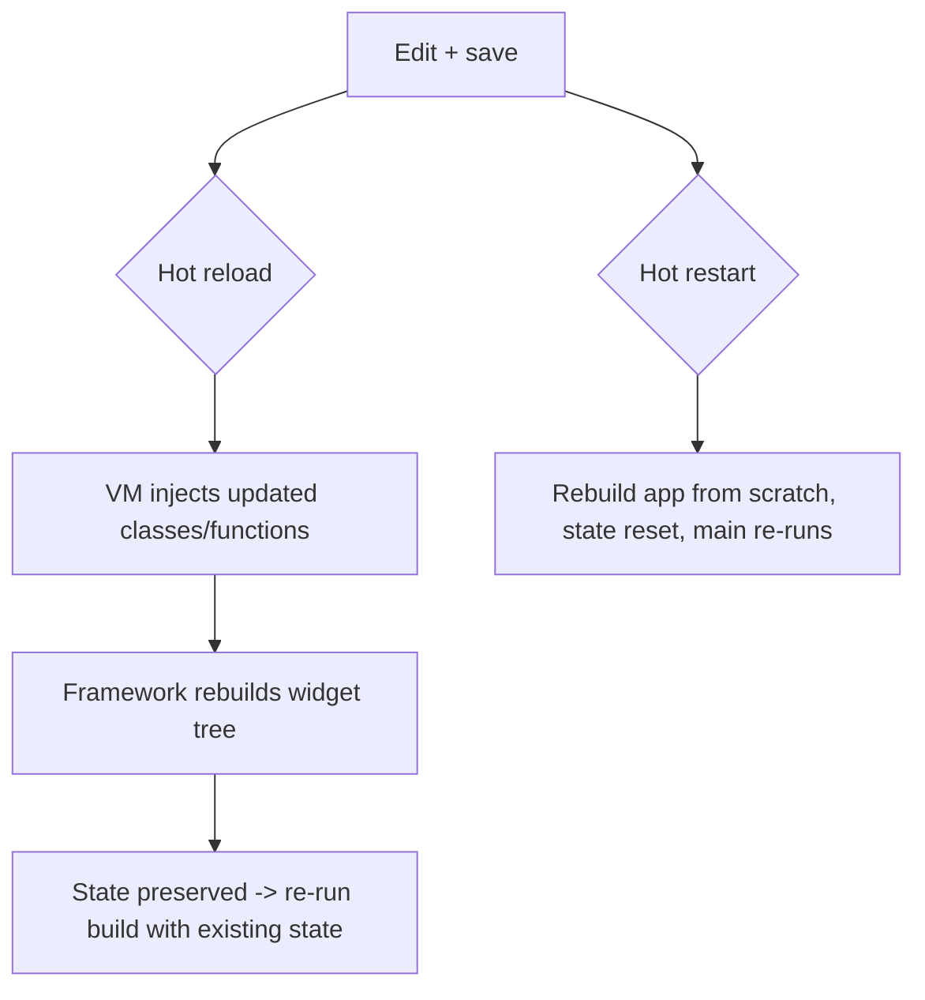
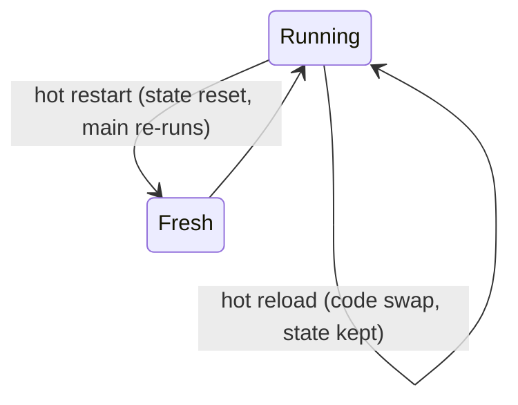

# Hot Reload vs Hot Restart

> Hot reload injects changed code into the running app and **preserves state**; hot restart rebuilds and **resets state**. Both exist only in debug (JIT) builds — release (AOT) has neither.

## Introduction

Hot reload is Flutter's signature productivity feature: edit code, save, and see the change in under a second **without losing your current screen/state**. This file explains how it works, when it *doesn't* apply, and the difference from hot restart and a full rebuild.

## Why this concept exists

Fast iteration is the difference between a tight and a painful UI-building loop. Because Flutter is declarative (UI = f(state)) and runs on the JIT-capable Dart VM in debug, it can swap updated code and simply **re-run `build`**, re-projecting the UI from the *preserved* state — giving near-instant feedback.

## Real-world analogy

Hot reload is **editing a live stage play's script mid-scene** — actors keep their positions (state) and just say the new lines. Hot restart is **restarting the play from Act 1** (fresh state). A full rebuild is **re-rehearsing and re-staging the whole production**.

## Problem Statement

You tweak a widget's padding and color — hot reload shows it instantly with your form still filled in. But changing `main()` or an `initState` doesn't take effect until hot restart. You'll learn why, and what each command does.

## Internal Working



- **Hot reload:** the JIT VM recompiles changed libraries to Kernel and **injects** them; Flutter then **rebuilds the widget tree**, re-running `build` against **preserved `State`**. UI updates; state survives.
- **Hot restart:** discards state and **re-runs the app** (`main`) with new code — like a fast fresh start (still no full native recompile).
- **Full restart/rebuild:** recompiles everything (needed for native code, `pubspec` deps, or release builds).
- Requires **JIT** → debug only. Release (AOT) can't hot reload ([02 · dart_compilation](../02%20Advanced%20Dart/dart_compilation.md)).

## What hot reload does NOT pick up

- Changes to `main()` / app initialization
- `initState` / field initializers already run (state already built)
- Global/static variable initializers
- `const`/enum changes in some cases, and native code / plugin / `pubspec.yaml` changes
→ Use **hot restart** (or full rebuild for native/deps).

## Memory Representation

Hot reload preserves the existing Element/`State` objects (state lives there — [widgets_elements_render_objects.md](widgets_elements_render_objects.md)); only code is swapped. Hot restart discards them.

## Compiler Behavior

JIT recompiles changed libraries to Kernel and injects; the CFE/VM handle incremental compilation ([02 · dart_compilation](../02%20Advanced%20Dart/dart_compilation.md)).

## Runtime Behavior

After injection, Flutter marks the tree dirty and rebuilds; since `State` persists, `build` reflects new code with old data.

## Flutter Engine Behavior

The engine keeps running; only the Dart code is updated and a new frame is produced. Debug builds ship the JIT-capable VM to enable this.

## Dart VM Behavior

The VM's incremental JIT compiler + code injection is what makes reload possible; AOT (release) omits the JIT, so reload is unavailable.

## Examples

```dart
import 'package:flutter/material.dart';

void main() => runApp(const MyApp());

class MyApp extends StatefulWidget {
  const MyApp({super.key});
  @override
  State<MyApp> createState() => _MyAppState();
}
class _MyAppState extends State<MyApp> {
  int count = 0; // <- preserved across HOT RELOAD, reset by HOT RESTART

  @override
  Widget build(BuildContext context) {
    return MaterialApp(
      home: Scaffold(
        // Edit this color/text and hot reload: `count` stays the same.
        appBar: AppBar(backgroundColor: Colors.teal, title: const Text('Reload')),
        body: Center(child: Text('count = $count')),
        floatingActionButton: FloatingActionButton(
          onPressed: () => setState(() => count++),
          child: const Icon(Icons.add),
        ),
      ),
    );
  }
}
// Try: increment to 5, change AppBar color, HOT RELOAD -> color changes, count still 5.
// Change the initial `int count = 0` to `= 10`, HOT RELOAD -> still 5 (initializer
// already ran). HOT RESTART -> resets to 10.
```

```text
CLI: flutter run   →  press 'r' = hot reload, 'R' = hot restart, 'q' = quit
```

## Diagrams



## Common Mistakes

| Mistake | Why | Fix |
|---------|-----|-----|
| Expecting `main`/`initState` edits via hot reload | State already built | Hot restart |
| Expecting reload in release | Release is AOT (no JIT) | Use debug for iteration |
| Confusing reload vs restart | Different state behavior | Reload keeps state; restart resets |
| Editing native/`pubspec` and reloading | Not Dart-code-only | Full rebuild |
| Relying on reload to test cold-start logic | State persists | Hot restart / relaunch |

## Best Practices

- Use **hot reload** for UI tweaks; **hot restart** when changing `main`, `initState`, statics, enums, or app init.
- Do a **full rebuild** for native code, plugins, or `pubspec.yaml` changes.
- Keep `build` pure so reload re-projects UI cleanly from state ([declarative_ui.md](declarative_ui.md)).
- Verify cold-start/init logic with hot restart or a fresh launch, not reload.

## Performance

Hot reload is sub-second; hot restart is a few seconds; full rebuild is longest. None reflect *release* performance — benchmark in release ([02 · dart_compilation](../02%20Advanced%20Dart/dart_compilation.md)).

## Advantages / Disadvantages

- **+** Near-instant feedback with preserved state → fast UI iteration.
- **−** Debug-only; doesn't apply to `main`/init/native/deps; not representative of release performance.

## Interview Questions

1. **🟢 Hot reload vs hot restart?** — Reload injects changed code and **keeps state** (re-runs `build`); restart re-runs the app and **resets state**.
2. **🟢 Why does hot reload work in debug but not release?** — Debug uses the JIT-capable VM (can inject code); release is AOT native with no JIT ([02](../02%20Advanced%20Dart/dart_compilation.md)).
3. **🟡 Why doesn't hot reload reflect `initState`/`main` changes?** — Those already ran and state is built; only `build` re-runs. Use hot restart.
4. **🟡 What preserves state across hot reload?** — The persistent Element/`State` objects; only code is swapped ([widgets_elements_render_objects.md](widgets_elements_render_objects.md)).
5. **🟡 When is a full rebuild required?** — Native code, plugin changes, or `pubspec.yaml` dependency changes.
6. **🔴 How does hot reload work under the hood?** — The VM incrementally recompiles changed libraries to Kernel and injects them; the framework rebuilds the widget tree against preserved state.
7. **🔴 Why must `build` be pure for reliable hot reload?** — Reload re-runs `build`; side effects there would re-execute or leave state inconsistent on each reload.

## Senior Engineer Tips

- If a change "doesn't show," ask: is it in `build` (reload) or in init/`main`/statics (restart)? That instantly tells you which command to use.
- Keep initialization idempotent/side-effect-light so reload/restart behave predictably.
- Never conclude anything about performance from debug + reload; profile in release.

## Architect Perspective

Hot reload is a direct consequence of two architectural choices: declarative UI (state-projected rendering) and Dart's dual JIT/AOT pipeline. It shapes team velocity and testing habits, but the debug/release divergence (and no-reflection/AOT constraints) must inform how you structure init, DI, and performance validation ([02 · dart_compilation](../02%20Advanced%20Dart/dart_compilation.md), [Module 51](../51%20Deployment/README.md)).

## Summary

- Hot reload swaps code and **preserves state** (re-runs `build`); hot restart **resets state** (re-runs `main`).
- Both are debug/JIT-only; release (AOT) has neither.
- Use restart for `main`/init/statics; full rebuild for native/deps; keep `build` pure.

## Revision Notes

- Reload = inject code + keep state (rebuild tree); restart = reset state + re-run `main`.
- Debug/JIT only; release/AOT = no reload.
- Not reflected by reload: `main`, `initState`, statics/enums, native, `pubspec`.
- State persists in Elements/`State`; keep `build` pure.

## Practice Questions

1. Why does incrementing to 5 survive a hot reload but not a hot restart?
2. Why won't editing `main()` show up on hot reload?
3. Why is hot reload unavailable in release builds?

## Coding Questions

1. Demonstrate state preservation: change a color via reload while a counter stays.
2. Change a field initializer and show it takes effect only after restart.
3. List which of several edits need reload vs restart vs full rebuild.

## Mini Project

**Reload behavior lab (Flutter + notes):** Build a stateful counter with editable styling. In `RELOAD.md`, document experiments: (a) style edit + reload (state kept), (b) initializer change + reload vs restart, (c) `main` change behavior. Explain each via JIT + preserved-state. Acceptance: correct observations tied to the mechanism; app runs.
