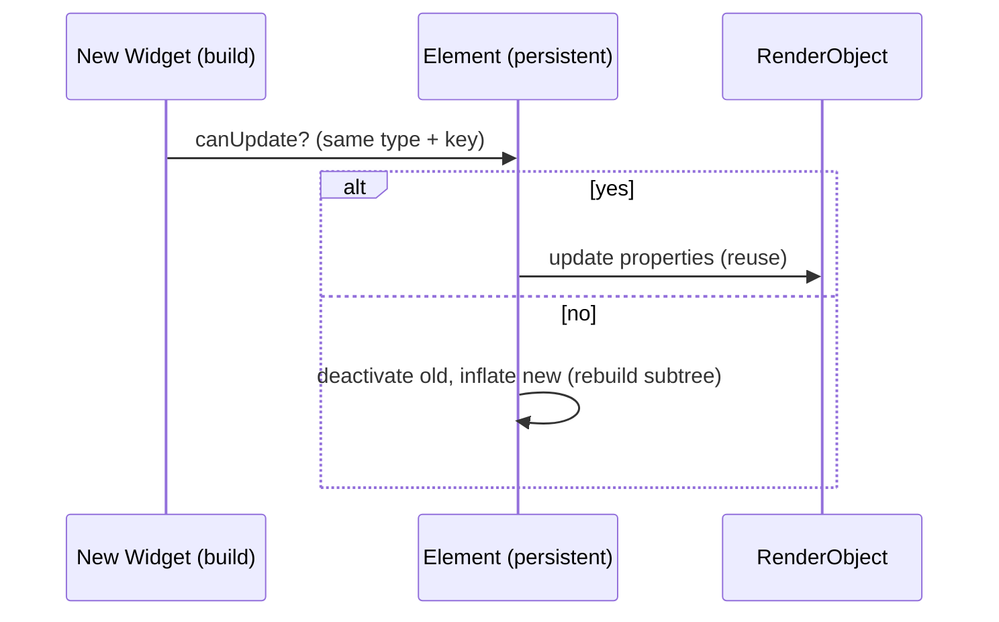

# The Three Trees (Widget, Element, RenderObject)

> Flutter maintains three parallel trees: **Widgets** (immutable blueprints you write), **Elements** (the persistent instances that hold state and manage the lifecycle), and **RenderObjects** (the objects that actually lay out and paint). Understanding them explains rebuilds, keys, and performance.

## Introduction

You write **Widgets**. Behind them, Flutter builds an **Element tree** (the living instantiation that persists across rebuilds and holds `State`) and a **RenderObject tree** (which computes layout and paints). This trio is the single most important mental model in Flutter.

## Why this concept exists

Recreating the entire UI from scratch every frame would be slow. By separating cheap, throwaway **Widgets** from persistent **Elements** and expensive **RenderObjects**, Flutter can rebuild widget descriptions freely while reusing elements/render objects and updating only what changed. This split is *why* declarative UI is fast.

## Real-world analogy

- **Widget** = a **blueprint/spec sheet** (cheap, disposable, describes what you want).
- **Element** = the **project manager** on site who keeps the building's identity, tracks changes, and decides what to reuse vs rebuild.
- **RenderObject** = the **actual physical structure** that occupies space and is visible.

New blueprints arrive each rebuild; the project manager (element) compares them to what's built and updates the structure (render object) minimally.

## Problem Statement

Why does `setState` not recreate the whole screen? Why do two visually-identical widgets sometimes lose state when reordered (needing a `Key`)? You'll answer both via the three trees.

## Internal Working

```mermaid
flowchart LR
    subgraph Widget Tree (immutable, rebuilt)
      W1[MaterialApp] --> W2[Scaffold] --> W3[Text]
    end
    subgraph Element Tree (persistent, holds State)
      E1[Element] --> E2[Element] --> E3[Element]
    end
    subgraph RenderObject Tree (layout + paint)
      R1[RenderView] --> R2[RenderFlex] --> R3[RenderParagraph]
    end
    W1 -. creates/updates .-> E1
    E1 -. manages .-> R1
```

- **Widget:** immutable configuration; recreated on every build. Has a `createElement()`.
- **Element:** created once per widget *position*; **persists** across rebuilds; holds the `State` for stateful widgets; decides whether to **update** (same widget type + key → reuse) or **replace** the subtree.
- **RenderObject:** does layout (sizing/positioning) and painting; expensive, so reused whenever possible.
- **Reconciliation:** on rebuild, each element compares the new widget to the old at its position — same `runtimeType` (and `key`) → update in place; else → rebuild that subtree ([Module 09](../09%20Rendering%20Pipeline/README.md)).

## Memory Representation

Widgets are short-lived (GC'd each rebuild); Elements and RenderObjects persist across frames and hold the real state/layout data ([02 · memory_and_gc](../02%20Advanced%20Dart/memory_and_gc.md)).

## Compiler Behavior

`const` widgets are canonicalized → identical instances across builds → elements can skip updating that subtree entirely.

## Runtime Behavior

On rebuild: widget tree is regenerated; the element tree walks it, reusing elements where the widget type+key match, updating render objects' properties instead of recreating them. Mismatches deactivate the old element subtree (and its `State`).

## Flutter Engine Behavior

The RenderObject tree produces the layer tree the engine rasterizes; layout (constraints down, sizes up) and paint happen here ([Module 09](../09%20Rendering%20Pipeline/README.md)).

## Dart VM Behavior

Not applicable beyond GC of throwaway widgets.

## Examples

```dart
import 'package:flutter/material.dart';

// Widget = blueprint. This whole method returns a fresh widget tree each build.
class Demo extends StatelessWidget {
  const Demo({super.key});
  @override
  Widget build(BuildContext context) {
    return Column(
      children: const [
        Text('A'), // Widget -> Element -> RenderParagraph
        Text('B'),
      ],
    );
  }
}

// Keys preserve element/State identity when children reorder:
class KeyedList extends StatefulWidget {
  const KeyedList({super.key});
  @override
  State<KeyedList> createState() => _KeyedListState();
}
class _KeyedListState extends State<KeyedList> {
  var items = ['a', 'b', 'c'];
  @override
  Widget build(BuildContext context) {
    return Column(
      children: [
        for (final it in items)
          // ValueKey ties the Element (and any State) to the data 'it',
          // so reordering moves state with the item instead of losing it.
          ListTile(key: ValueKey(it), title: Text(it)),
        ElevatedButton(
          onPressed: () => setState(() => items = items.reversed.toList()),
          child: const Text('reverse'),
        ),
      ],
    );
  }
}
```

## Diagrams



## Common Mistakes

| Mistake | Why | Fix |
|---------|-----|-----|
| Thinking widgets hold state | Widgets are throwaway | State lives in `State`/Elements |
| Omitting keys on reorderable lists | Elements match by position → state jumps to wrong item | Add stable `Key`s |
| Overusing `GlobalKey` | Expensive, easy to misuse | Use `ValueKey`/`ObjectKey` for identity; `GlobalKey` sparingly |
| Expecting `setState` to rebuild everything | It rebuilds the subtree, reconciled | Trust reconciliation; scope rebuilds |
| Heavy work in `build` | Runs each rebuild | Keep `build` cheap/pure |

## Best Practices

- Remember: you write **widgets**; the framework manages **elements** and **render objects**.
- Use **keys** when identity matters across reorders/insertions (lists, animated switches).
- Prefer `const` widgets to let elements skip subtree updates.
- Keep `build` cheap; the trees make frequent rebuilds affordable only if `build` is light.

## Performance

Reconciliation + `const` + keys minimize expensive render-object work. The perf wins come from *reuse* of elements/render objects, not from avoiding widget rebuilds ([Module 21](../21%20Performance/README.md)).

## Advantages / Disadvantages

- **+** Cheap declarative rebuilds, persistent state/layout, minimal real updates, key-based identity control.
- **−** Mental overhead; key/identity bugs are subtle; requires understanding to debug rebuilds.

## Interview Questions

1. **🟢 What are Flutter's three trees?** — Widgets (immutable blueprints), Elements (persistent instances holding state/lifecycle), RenderObjects (layout + paint).
2. **🟢 Which tree holds state?** — The Element tree (via `State` objects for stateful widgets); widgets don't.
3. **🟡 What happens to widgets on rebuild?** — They're recreated (throwaway); elements are reused where the widget type+key match, updating render objects in place.
4. **🟡 What is reconciliation?** — The element comparing a new widget to the old at its position: same `runtimeType`+`key` → update; else → rebuild that subtree.
5. **🟡 Why do keys matter?** — They give elements a stable identity so state moves with the right item when children reorder/insert.
6. **🔴 Why is separating widgets from elements/render objects a performance design?** — It lets Flutter rebuild cheap descriptions freely while reusing expensive layout/paint objects, updating only diffs.
7. **🔴 When do you need a `GlobalKey` vs a `ValueKey`?** — `ValueKey`/`ObjectKey` for identity within a list; `GlobalKey` to access state/RenderObject across the tree or preserve a subtree when moving it — use sparingly (costly).

## Senior Engineer Tips

- When a widget "loses its state" on reorder or conditional swap, think **keys/element identity** first.
- Use the DevTools **Widget Inspector** to see the element tree and diagnose rebuilds.
- Don't reach for `GlobalKey` casually; it's for cross-tree access/preservation, not routine identity.

## Architect Perspective

The three-tree model is the substrate of Flutter performance and correctness. Understanding it lets you scope rebuilds, use keys deliberately, and reason about state ownership — foundational for state management ([Module 11](../11%20State%20Management/README.md)), lifecycle ([Module 08](../08%20Widget%20Lifecycle/README.md)), and the rendering pipeline ([Module 09](../09%20Rendering%20Pipeline/README.md)).

## Summary

- Widgets (immutable blueprints) → Elements (persistent, hold state, reconcile) → RenderObjects (layout + paint).
- Widgets are recreated each build; elements/render objects are reused via reconciliation.
- Keys control element identity across reorders; `const` lets elements skip subtree updates.

## Revision Notes

- 3 trees: Widget (throwaway), Element (persistent + State + reconciliation), RenderObject (layout/paint).
- State lives in Elements/`State`, not widgets.
- Reconcile: same type+key → update; else rebuild subtree.
- Keys = element identity (lists/reorder); `const` = skip updates; `GlobalKey` sparingly.

## Practice Questions

1. Why doesn't `setState` recreate the whole app?
2. Why can reordering list items without keys move state to the wrong row?
3. What persists across rebuilds and what doesn't?

## Coding Questions

1. Build a reorderable list that loses state without keys, then fix it with `ValueKey`.
2. Use the Widget Inspector to observe element reuse on rebuild (write findings).
3. Demonstrate `const` skipping a subtree rebuild.

## Mini Project

**Three-trees explorer (Flutter + docs):** Build a small screen with a keyed, reorderable stateful list. In `TREES.md`, diagram the widget/element/render trees for one row and explain what happens to each on reorder with vs without keys. Acceptance: keyed reorder preserves state; docs correctly explain reconciliation; app runs.
