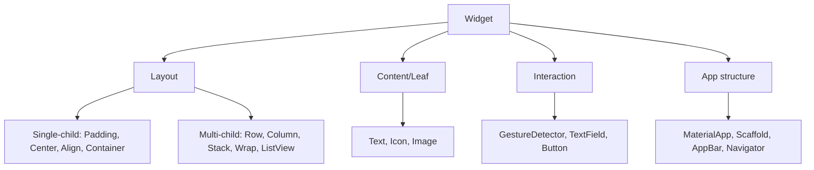
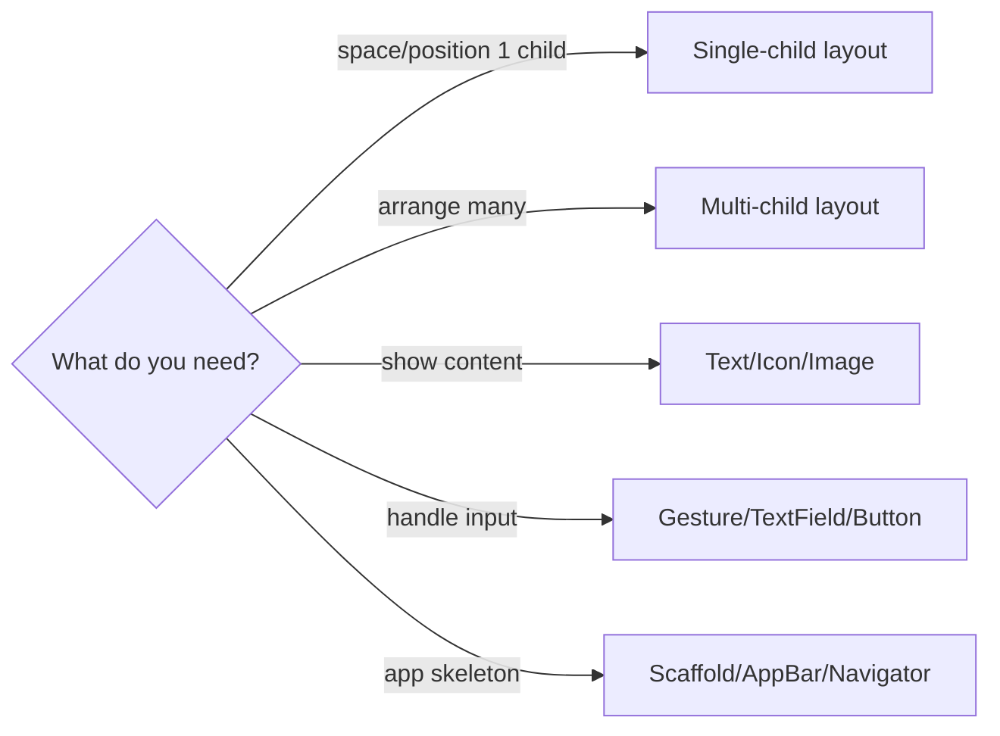

# Widget Categories (Navigating the Catalog)

> Widgets fall into a few functional categories — layout, single-child, multi-child, styling/painting, input, and app-structure — and knowing the categories turns "which widget?" from guesswork into a lookup.

## Introduction

Flutter ships hundreds of widgets, but they group into a handful of **roles**. This file maps those roles so you can navigate the catalog: layout vs content, single-child vs multi-child, Material vs Cupertino vs foundational, and stateless vs stateful.

## Why this concept exists

Beginners drown in the widget list. Categories give a mental index: to overlay things you want a *multi-child positioning* widget (`Stack`); to add padding you want a *single-child layout* widget (`Padding`); to scroll you want a *scrollable*. Knowing the role narrows hundreds of options to a few.

## Real-world analogy

Like a **hardware store organized by aisle**: fasteners, tools, plumbing, electrical. You don't memorize every SKU — you learn the aisles, then find the specific item. Widget categories are the aisles.

## Problem Statement

You need to: pad content, arrange items in a row, overlay a badge, scroll a list, and style text. Which category each? By the end you'll route each need to the right kind of widget instantly.

## Internal Working



| Category | Examples | Purpose |
|----------|----------|---------|
| **Single-child layout** | `Padding`, `Center`, `Align`, `SizedBox`, `Container`, `ConstrainedBox` | Position/size one child |
| **Multi-child layout** | `Row`, `Column`, `Flex`, `Stack`, `Wrap`, `ListView`, `GridView` | Arrange multiple children |
| **Content/leaf** | `Text`, `Icon`, `Image`, `RichText` | Render actual content |
| **Painting/styling** | `DecoratedBox`, `Opacity`, `ClipRRect`, `Transform` | Visual effects |
| **Input/interaction** | `GestureDetector`, `TextField`, `ElevatedButton`, `InkWell` | Handle user input |
| **App structure** | `MaterialApp`, `Scaffold`, `AppBar`, `Navigator`, `Drawer` | App/screen scaffolding |
| **Sliver** | `SliverList`, `SliverAppBar`, `SliverGrid` | Scroll-effect building blocks |

Also orthogonal: **Material** (`ElevatedButton`) vs **Cupertino** (`CupertinoButton`) vs **foundational** (`Text`, `Container`); and **Stateless** vs **Stateful** ([06](../06%20Flutter%20Fundamentals/05_stateless_vs_stateful.md)).

## Memory Representation

Not applicable — categories are conceptual. (All are widgets → elements → render objects, [06](../06%20Flutter%20Fundamentals/04_widgets_elements_render_objects.md).)

## Compiler Behavior / Runtime Behavior

Not special; category is a design lens, not a language feature.

## Flutter Engine Behavior / Dart VM Behavior

Not applicable.

## Examples

```dart
import 'package:flutter/material.dart';

class CategoryDemo extends StatelessWidget {
  const CategoryDemo({super.key});
  @override
  Widget build(BuildContext context) {
    return Scaffold(                         // app structure
      appBar: AppBar(title: const Text('Categories')), // app + content
      body: Padding(                          // single-child layout
        padding: const EdgeInsets.all(16),
        child: Column(                        // multi-child layout
          crossAxisAlignment: CrossAxisAlignment.start,
          children: [
            const Text('Title', style: TextStyle(fontSize: 24)), // content
            const SizedBox(height: 8),         // single-child (spacing)
            Row(children: const [              // multi-child
              Icon(Icons.star),                // content/leaf
              SizedBox(width: 4),
              Text('4.5'),
            ]),
            GestureDetector(                   // interaction
              onTap: () {},
              child: const Text('Tap me'),
            ),
          ],
        ),
      ),
    );
  }
}
```

## Diagrams



## Common Mistakes

| Mistake | Why | Fix |
|---------|-----|-----|
| Using `Container` for everything | Bloated, unclear intent | Use the specific widget (`Padding`, `SizedBox`, `Align`) |
| Reaching for a widget by memory | Slow, error-prone | Route by category first |
| Mixing Material/Cupertino inconsistently | Inconsistent UX | Pick a design language; adapt deliberately ([Module 25](../25%20Adaptive%20UI/README.md)) |
| Stateful where stateless works | Extra complexity | Default stateless ([06](../06%20Flutter%20Fundamentals/05_stateless_vs_stateful.md)) |

## Best Practices

- Route needs by **category** → then pick the specific widget.
- Prefer the **narrowest** widget that expresses intent (`Padding` over `Container(padding:)`).
- Keep a consistent design language (Material or Cupertino) per platform strategy.
- Compose small widgets rather than one giant `build`.

## Performance

Prefer `const` widgets; choose builder-based scrollables for long lists ([05_scrolling_and_slivers.md](05_scrolling_and_slivers.md)); avoid unnecessarily heavy widgets ([Module 21](../21%20Performance/README.md)).

## Advantages / Disadvantages

- **+** A mental index that makes the huge catalog navigable; intent-revealing widget choices.
- **−** Categories overlap (e.g., `Container` spans several); requires familiarity to internalize.

## Interview Questions

1. **🟢 "Everything is a widget" — what does that mean?** — Layout, styling, gestures, and app structure are all widgets composed into a tree; there's no separate "layout system" vs "view system."
2. **🟢 Single-child vs multi-child layout widgets?** — Single-child (`Padding`, `Center`) wrap one child to position/size it; multi-child (`Row`, `Column`, `Stack`) arrange several.
3. **🟡 When would you avoid `Container`?** — When a specific widget states intent better/cheaper (`Padding`, `SizedBox`, `Align`, `DecoratedBox`).
4. **🟡 Material vs Cupertino vs foundational widgets?** — Material (Android/Material Design), Cupertino (iOS-style), foundational (design-agnostic like `Text`, `Container`, `Row`).
5. **🟡 How do you decide which widget to use?** — Identify the *role* (layout/content/input/structure), then pick the specific widget in that category.
6. **🔴 Why does Flutter favor many small widgets over big configurable ones?** — Composition ([03](../03%20Object%20Oriented%20Programming/06_composition_and_relationships.md)): small single-purpose widgets compose flexibly and enable `const`/rebuild scoping.
7. **🔴 How do categories map to the three trees?** — All categories are widgets → elements → render objects; layout widgets typically back onto layout render objects, leaves onto paint render objects.

## Senior Engineer Tips

- Learn the *aisles*, not the SKUs — you'll look up specifics but should know the category instantly.
- Prefer intent-revealing widgets; a screen full of nested `Container`s hides structure.
- Bookmark the official **Widget Catalog** and **Widget of the Week**; the catalog is your reference, not memorization.

## Architect Perspective

Consistent widget vocabulary and a chosen design language are the seeds of a design system ([Module 07 capstone], [Module 25](../25%20Adaptive%20UI/README.md)). Composing small, intent-revealing widgets keeps UIs maintainable and rebuild-efficient at scale.

## Summary

- Widgets group into layout (single/multi-child), content, styling, input, app-structure, and slivers.
- Route needs by category, then pick the narrowest intent-revealing widget.
- Everything is a widget; compose small pieces; prefer `const`.

## Revision Notes

- Categories: single-child layout / multi-child layout / content / styling / input / app-structure / sliver.
- Material vs Cupertino vs foundational; stateless vs stateful.
- Route by role → specific widget; prefer narrowest intent-revealing widget over `Container`.

## Practice Questions

1. Which category do you reach for to overlay a badge on an avatar?
2. Why prefer `Padding` over `Container(padding:)`?
3. How do widget categories relate to the three trees?

## Coding Questions

1. Build a screen using one widget from each major category, labeled in comments.
2. Refactor a `Container`-heavy widget into specific intent-revealing widgets.
3. Recreate a simple UI once with Material and once with Cupertino widgets.

## Mini Project

**Category tour (Flutter):** Build a single screen that intentionally uses each category (single/multi-child layout, content, styling, input, app-structure) with comments naming the category and why. Acceptance: correct category use; intent-revealing widgets; `const` where possible; app runs.
