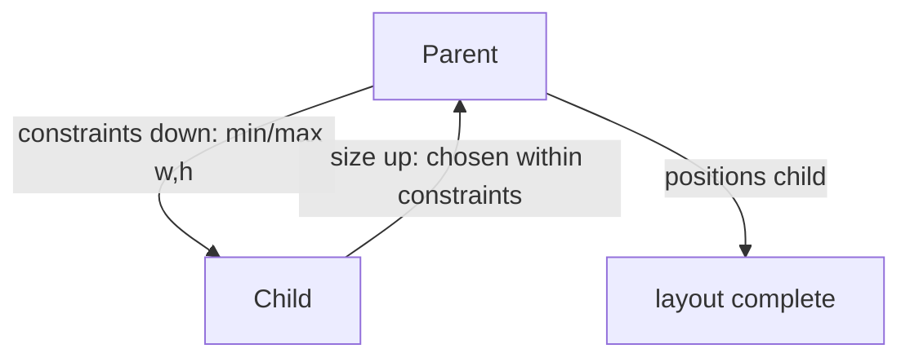
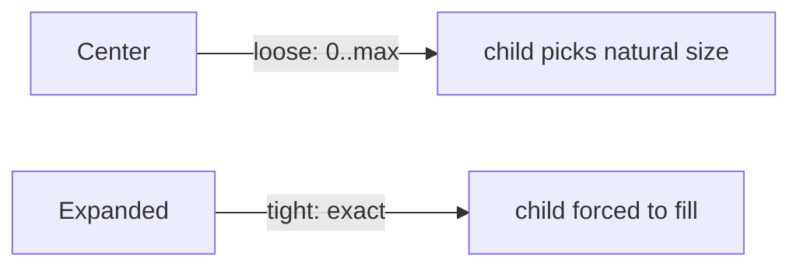

# Constraints & Sizing (`Container`, `SizedBox`, `ConstrainedBox`)

> Flutter layout has one rule: **constraints go down, sizes go up, parent sets position.** Understand it and every "unbounded height", "infinite width", and overflow error becomes obvious.

## Introduction

A parent passes **constraints** (min/max width & height) to each child; the child chooses its **size** within them and reports back; the parent then **positions** it. This single-pass model governs all layout. This file makes it concrete and covers the sizing widgets (`SizedBox`, `Container`, `ConstrainedBox`, `FractionallySizedBox`, `AspectRatio`).

## Why this concept exists

Flutter uses a fast, single-pass layout (no multi-pass constraint solving). To keep it O(n), children must size themselves *given* a parent's constraints — they can't "measure everything." Knowing this explains why widgets behave as they do and why certain combinations error.

## Real-world analogy

A landlord (parent) tells a tenant (child): "your room can be **between 10 and 20 m²**" (constraints). The tenant picks a size in that range (say 15 m²) and reports it; the landlord then decides **where** to place the room. The tenant can't demand a size outside the allowed range.

## Problem Statement

You get "BoxConstraints forces an infinite height", or a `Container` doesn't size as expected, or a child won't fill its parent. You'll diagnose each via the constraints rule and pick the right sizing widget.

## Internal Working



**The rule (memorize):**
1. Parent gives child **constraints** (a `BoxConstraints`: minW/maxW/minH/maxH).
2. Child picks its **size** within those constraints.
3. Parent **positions** the child (child can't know/choose its own position).

Sizing widgets:

| Widget | Effect |
|--------|--------|
| `SizedBox(width, height)` | Fixed size (or spacing) |
| `ConstrainedBox(constraints)` | Impose min/max constraints |
| `UnconstrainedBox` | Let child pick its natural size (removes constraints) |
| `Container` | Convenience combo (padding/margin/color/constraints/child) |
| `FractionallySizedBox(widthFactor)` | Size relative to parent |
| `AspectRatio(aspectRatio)` | Size to a ratio |
| `Expanded`/`Flexible` | Fill within a Flex ([02_layout_flex.md](02_layout_flex.md)) |
| `LayoutBuilder` | Read incoming constraints to build adaptively |

**Tight vs loose constraints:** *tight* fixes an exact size (min==max); *loose* allows anything up to max (min 0). E.g., a `Center` gives loose constraints; `Expanded` gives tight.

## Memory Representation

Constraints/sizes are computed per frame in the render tree; no persistent extra allocation beyond render objects ([06](../06%20Flutter%20Fundamentals/04_widgets_elements_render_objects.md)).

## Compiler Behavior

Not applicable.

## Runtime Behavior

Layout runs once per frame top-down (constraints) then bottom-up (sizes). Violations (e.g., an unbounded constraint given to a widget that needs a bound) throw descriptive layout errors.

## Flutter Engine Behavior

This is the layout phase of the pipeline; deep detail in [Module 09](../09%20Rendering%20Pipeline/README.md).

## Dart VM Behavior

Not applicable.

## Examples

```dart
import 'package:flutter/material.dart';

class SizingDemo extends StatelessWidget {
  const SizingDemo({super.key});
  @override
  Widget build(BuildContext context) {
    return Scaffold(
      body: Column(
        children: [
          // Fixed size box
          const SizedBox(width: 100, height: 40, child: ColoredBox(color: Colors.teal)),

          // Container tries to be as big as parent allows unless constrained:
          Container(height: 50, color: Colors.orange), // full width, 50 tall

          // Impose max width regardless of parent:
          ConstrainedBox(
            constraints: const BoxConstraints(maxWidth: 150),
            child: Container(height: 30, color: Colors.purple),
          ),

          // Read incoming constraints to adapt:
          LayoutBuilder(
            builder: (context, constraints) => Text(
              'maxW=${constraints.maxWidth.toStringAsFixed(0)}',
            ),
          ),

          // Fill remaining vertical space (tight constraint from Expanded):
          Expanded(child: Container(color: Colors.indigo.shade100)),
        ],
      ),
    );
  }
}
```

```text
Classic error: putting a ListView (wants unbounded height) inside a Column
without bounding it -> "vertical viewport was given unbounded height".
Fix: wrap the ListView in Expanded (gives it a bounded height).
```

## Diagrams



## Common Mistakes

| Mistake | Why | Fix |
|---------|-----|-----|
| `ListView`/`Column` unbounded in a `Column` | Scrollables want unbounded main-axis; parent can't provide | Wrap in `Expanded`/`SizedBox(height:)`/`shrinkWrap` |
| Expecting `Container` to shrink-wrap when parent is tight | Tight constraints force size | Use `Align`/`UnconstrainedBox` or change parent |
| `width`/`height` ignored | Parent constraints override child's wishes | Understand constraints beat requested size |
| Infinite width in `Row` child | Unbounded main axis | `Expanded`/`Flexible` or fixed width |
| Overusing `Container` for one property | Bloat | Use `SizedBox`/`Padding`/`ColoredBox`/`Align` |

## Best Practices

- Recite the rule when debugging: **constraints down, sizes up, parent positions.**
- Use `LayoutBuilder` to build based on **incoming constraints**; `MediaQuery` for screen size ([Module 24](../24%20Responsive%20UI/README.md)).
- Bound scrollables (`Expanded`, fixed height, or `shrinkWrap`) inside flexes.
- Prefer specific sizing widgets (`SizedBox`, `ConstrainedBox`, `AspectRatio`) over `Container` when you need one thing.

## Performance

Single-pass layout is O(n); avoid excessive `IntrinsicWidth`/`IntrinsicHeight` (they force extra passes) — expensive in big trees ([Module 21](../21%20Performance/README.md)).

## Advantages / Disadvantages

- **+** Fast single-pass layout, predictable once understood, powerful adaptive tools.
- **−** Steep beginner learning curve; unbounded/tight errors are cryptic until the rule clicks.

## Interview Questions

1. **🟢 State Flutter's layout rule.** — Constraints go down (parent→child), sizes go up (child→parent), and the parent sets the child's position.
2. **🟢 Tight vs loose constraints?** — Tight: min==max (exact size forced, e.g., `Expanded`). Loose: min 0..max (child picks, e.g., `Center`).
3. **🟡 Why does a `ListView` in a `Column` throw "unbounded height"?** — `Column` gives its children unbounded vertical space, but a scrollable needs a bounded viewport. Wrap it in `Expanded` (or set a height / `shrinkWrap`).
4. **🟡 Why might a `Container`'s `width` be ignored?** — If the parent passes tight constraints, they override the child's requested size.
5. **🟡 `LayoutBuilder` vs `MediaQuery`?** — `LayoutBuilder` gives the *parent's* constraints (local); `MediaQuery` gives *screen/window* metrics (global).
6. **🔴 Why is Flutter layout single-pass and why does that matter?** — For O(n) performance; it means children size themselves given constraints rather than being measured multiple times — hence the rule and its errors.
7. **🔴 What do `IntrinsicHeight`/`IntrinsicWidth` cost?** — Extra layout passes to compute intrinsic sizes; avoid in large/scrolling trees.

## Senior Engineer Tips

- When layout misbehaves, add a `LayoutBuilder` to print the incoming constraints — it reveals what the parent is actually offering.
- "It won't fill" → the parent isn't giving tight/bounded constraints; "unbounded" → wrap in something that bounds it.
- Reserve intrinsic sizing for small, non-scrolling cases.

## Architect Perspective

The constraints model is the foundation of responsive, adaptive, and performant layouts across form factors ([Modules 24, 25](../24%20Responsive%20UI/README.md)). Teaching it early prevents the most common UI bugs and is prerequisite to custom layout/render work ([Module 09](../09%20Rendering%20Pipeline/README.md), [Module 23](../23%20Custom%20Painting/README.md)).

## Summary

- Layout = constraints down, sizes up, parent positions (single pass, O(n)).
- Tight forces size; loose lets the child choose. Use `SizedBox`/`ConstrainedBox`/`LayoutBuilder` deliberately.
- Bound scrollables in flexes; avoid excessive intrinsic sizing.

## Revision Notes

- Rule: constraints ↓, sizes ↑, parent positions.
- Tight (min==max) vs loose (0..max); `Expanded`=tight, `Center`=loose.
- `ListView` in `Column` → unbounded → `Expanded`/height/`shrinkWrap`.
- `LayoutBuilder` = parent constraints; `MediaQuery` = screen; avoid heavy intrinsics.

## Practice Questions

1. Why is a child's requested width sometimes ignored?
2. How do you fix "vertical viewport was given unbounded height"?
3. `LayoutBuilder` vs `MediaQuery` — when each?

## Coding Questions

1. Reproduce and fix the `ListView`-in-`Column` unbounded error three ways.
2. Use `LayoutBuilder` to switch layout above/below 600px width.
3. Constrain a child to `maxWidth: 400` centered on wide screens.

## Mini Project

**Constraints playground (Flutter):** Build a screen demonstrating tight vs loose (Expanded vs Center), a bounded ListView-in-Column, a `ConstrainedBox` max-width card, and a `LayoutBuilder` that adapts at a breakpoint. Comment each with the constraints rule. Acceptance: no layout errors; each case demonstrates the rule; app runs.
