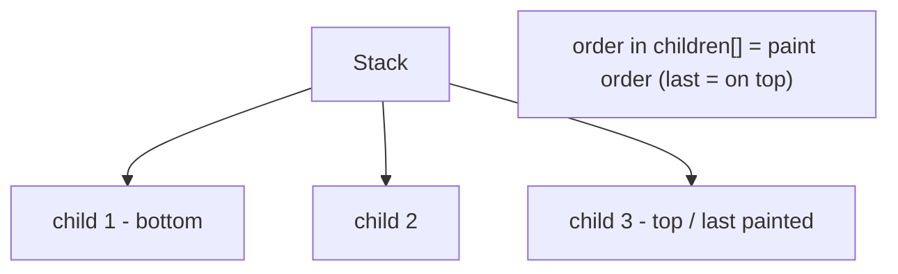

# Stack & Positioning (`Stack`, `Positioned`, `Align`, `Alignment`)

> `Stack` overlaps children on top of each other; `Positioned`/`Align` place them within it — the tool for badges, overlays, layered backgrounds, and free-form placement.

## Introduction

Where `Row`/`Column` arrange children *beside* each other, `Stack` layers them *on top* of each other. Children are positioned with `Positioned` (edges/size) or `Align`/`Alignment` (relative anchor). This file covers overlap layout and its sizing quirks.

## Why this concept exists

Some UIs need layering: a badge on an avatar, text over an image, a floating button over content, gradient overlays. Flex can't overlap; `Stack` provides z-ordering and precise/relative placement in a shared coordinate space.

## Real-world analogy

A **stack of transparent sheets on an overhead projector**: each sheet (child) sits above the previous; you slide each to a spot (position). The last sheet added is on top (paint order).

## Problem Statement

Put a notification badge on the top-right of an avatar, and caption text at the bottom-left of an image. You'll use `Stack` + `Positioned`/`Align`.

## Internal Working



- **`Stack`** sizes itself to its **non-positioned** children (largest), constrained by parent; `Positioned` children don't affect stack size.
- **`Positioned`** places a child by `top`/`right`/`bottom`/`left`/`width`/`height` (only valid inside a `Stack`). `Positioned.fill` stretches to all edges.
- **`Align`** places a non-positioned child by an `Alignment` (e.g., `Alignment.bottomLeft`); `Alignment(x, y)` uses -1..1 coordinates.
- **`fit`:** `StackFit.loose` (children size themselves) vs `StackFit.expand` (fill the stack).
- **Paint/z-order:** later children in the list paint on top.

## Memory Representation

Backed by `RenderStack`; positioned children are laid out relative to the stack ([06](../06%20Flutter%20Fundamentals/04_widgets_elements_render_objects.md)).

## Compiler Behavior / Runtime Behavior

`Positioned` outside a `Stack` is a layout error. Non-positioned children are aligned via the stack's `alignment`.

## Flutter Engine Behavior

Layered painting in paint order; overlays composite in the pipeline ([Module 09](../09%20Rendering%20Pipeline/README.md)).

## Dart VM Behavior

Not applicable.

## Examples

```dart
import 'package:flutter/material.dart';

class StackDemo extends StatelessWidget {
  const StackDemo({super.key});
  @override
  Widget build(BuildContext context) {
    return Scaffold(
      body: Center(
        child: Column(
          mainAxisAlignment: MainAxisAlignment.center,
          children: [
            // Avatar with a badge (top-right)
            SizedBox(
              width: 64,
              height: 64,
              child: Stack(
                clipBehavior: Clip.none,
                children: [
                  const CircleAvatar(radius: 32, child: Icon(Icons.person)),
                  Positioned(
                    top: -2,
                    right: -2,
                    child: Container(
                      padding: const EdgeInsets.all(4),
                      decoration: const BoxDecoration(
                          color: Colors.red, shape: BoxShape.circle),
                      child: const Text('3',
                          style: TextStyle(color: Colors.white, fontSize: 10)),
                    ),
                  ),
                ],
              ),
            ),
            const SizedBox(height: 24),
            // Image with caption overlay (bottom-left)
            SizedBox(
              width: 200,
              height: 120,
              child: Stack(
                fit: StackFit.expand,
                children: [
                  Container(color: Colors.teal), // stand-in for an image
                  const Align(
                    alignment: Alignment.bottomLeft,
                    child: Padding(
                      padding: EdgeInsets.all(8),
                      child: Text('Caption',
                          style: TextStyle(color: Colors.white)),
                    ),
                  ),
                ],
              ),
            ),
          ],
        ),
      ),
    );
  }
}
```

## Diagrams

```mermaid
flowchart LR
    A[Alignment.topLeft (-1,-1)] --- C[center (0,0)] --- B[bottomRight (1,1)]
```

## Common Mistakes

| Mistake | Why | Fix |
|---------|-----|-----|
| `Positioned` outside a `Stack` | Only valid in `Stack` | Put it inside a `Stack` |
| Stack collapses to zero size | Only positioned children → no size driver | Add a non-positioned child or wrap in `SizedBox` |
| Content clipped at edges | Default clips overflow | `clipBehavior: Clip.none` (for badges) |
| Expecting flex behavior in Stack | Stack overlaps, not distributes | Use `Row`/`Column` for beside-each-other |
| Wrong z-order | Paint order = list order | Reorder `children` |

## Best Practices

- Give the `Stack` a size (via a sized parent or a non-positioned child) so positioned children have a frame.
- Use `Positioned.fill` for backgrounds/overlays; `Align` for simple anchored placement.
- `clipBehavior: Clip.none` when badges must exceed bounds.
- Keep stacks shallow; deep overlays hurt readability and can complicate hit-testing.

## Performance

Cheap for small stacks; many overlapping semi-transparent layers add compositing cost ([Module 21](../21%20Performance/README.md)).

## Advantages / Disadvantages

- **+** Layering/overlays, precise + relative placement, z-order control.
- **−** Sizing quirks (needs a size driver), easy to misuse for layouts flex should do, hit-testing subtleties.

## Interview Questions

1. **🟢 What does `Stack` do?** — Overlaps children on top of each other in a shared coordinate space (z-ordered by list order).
2. **🟢 How do you position a child in a `Stack`?** — `Positioned` (edges/size) for absolute-ish placement, or `Align`/`Alignment` for relative anchoring.
3. **🟡 How does a `Stack` decide its size?** — It sizes to its largest **non-positioned** child (within parent constraints); positioned children don't drive size.
4. **🟡 What determines z-order?** — Paint order = order in `children` (last is on top).
5. **🟡 `Positioned.fill` vs `StackFit.expand`?** — `Positioned.fill` stretches one child to all edges; `StackFit.expand` makes the stack expand and forces non-positioned children to fill.
6. **🔴 Why does my `Stack` have zero size?** — All children are `Positioned`, so there's no size driver; add a non-positioned child or constrain the stack.
7. **🔴 How do you let a badge overflow the stack bounds?** — Set `clipBehavior: Clip.none` (default clips).

## Senior Engineer Tips

- Always give a Stack a definite size via a sized ancestor/child; "zero-size Stack" is a frequent gotcha.
- Prefer `Align` for simple anchored overlays; reserve `Positioned` for precise offsets.
- For tappable overlapping areas, mind hit-test order (top child wins) and use `IgnorePointer`/`AbsorbPointer` deliberately.

## Architect Perspective

Stack underpins overlay systems (badges, tooltips, custom dialogs, media controls). Combined with `Overlay`/`OverlayEntry` it powers app-wide floating UI. Used judiciously it's essential; overused it hides structure that flex would express more clearly.

## Summary

- `Stack` layers children (z-order = list order); `Positioned`/`Align` place them.
- Stack sizes to non-positioned children; give it a size driver.
- Use `Positioned.fill` for overlays, `Clip.none` for overflowing badges.

## Revision Notes

- `Stack` overlaps; last child on top; sizes to non-positioned children.
- `Positioned` (edges/size, Stack-only) vs `Align`/`Alignment` (relative -1..1).
- Zero-size stack → add non-positioned child / constrain.
- `Positioned.fill` overlays; `Clip.none` to overflow.

## Practice Questions

1. Why might a Stack render with zero size?
2. How is z-order determined?
3. When use `Align` vs `Positioned`?

## Coding Questions

1. Put a count badge on the top-right of an icon, overflowing bounds.
2. Overlay a gradient + caption on an image via `Positioned.fill` + `Align`.
3. Build a card with a "NEW" ribbon in a corner.

## Mini Project

**Media card with overlays (Flutter):** Build a fixed-size card with a background, a bottom gradient + title (`Positioned.fill`/`Align`), and a top-right badge that overflows (`Clip.none`). Acceptance: correct sizing/z-order; badge overflows; no `Positioned`-outside-Stack errors; app runs.
