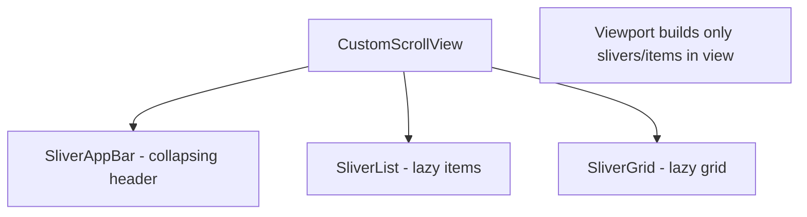
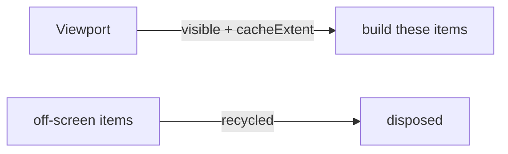

# Scrolling & Slivers (`ListView`, `GridView`, `CustomScrollView`)

> Use **builder** constructors (`ListView.builder`) for long/lazy lists, and **slivers** (`CustomScrollView` + `SliverAppBar`/`SliverList`) when you need custom scroll effects like collapsing headers — never build thousands of widgets eagerly.

## Introduction

Scrollables show more content than fits on screen. This file covers `ListView`/`GridView` (and their lazy `.builder` forms), `SingleChildScrollView`, and the **sliver** system (`CustomScrollView`) for advanced scroll behaviors. The key theme: **laziness** — build only what's visible.

## Why this concept exists

Rendering a 10,000-item list eagerly would allocate 10,000 widgets/elements and jank hard. Lazy builders construct items on demand as they scroll into view. Slivers generalize this: composable scrollable "slices" that can implement app bars, grids, lists, and effects in one scroll view.

## Real-world analogy

A **conveyor belt sushi bar**: plates (items) are prepared as they approach you (lazy building), not all at once. Slivers are like **different stations on one belt** — an app-bar station, a list station, a grid station — all moving together.

## Problem Statement

Show a 5,000-item feed smoothly, then a screen with a large image header that collapses into an app bar as you scroll. You'll use `ListView.builder` and a `CustomScrollView` with slivers.

## Internal Working



- **`ListView.builder(itemBuilder, itemCount)`**: builds items **lazily** as they scroll into view (the default for real lists).
- **`ListView(children: [...])`**: builds **all** children eagerly — fine for a few, bad for many.
- **`SingleChildScrollView`**: scrolls a single (often `Column`) child — no laziness; only for small content.
- **`GridView.builder`**: lazy grid with a `SliverGridDelegate` (fixed count or max extent).
- **Slivers**: `CustomScrollView` hosts `SliverAppBar` (collapsing), `SliverList`/`SliverChildBuilderDelegate`, `SliverGrid`, `SliverToBoxAdapter` (wrap a normal widget), `SliverPadding`.
- **Physics**: `ScrollPhysics` (bouncing iOS, clamping Android) — a Strategy ([05 · strategy](../05%20Design%20Patterns/11_strategy.md)).

## Memory Representation

Lazy scrollables keep only visible (+cache extent) items in the element/render trees; off-screen items are recycled → bounded memory ([02 · memory_and_gc](../02%20Advanced%20Dart/13_memory_and_gc.md)).

## Compiler Behavior

Not applicable. Use `const` item content where possible.

## Runtime Behavior

The viewport requests items for the visible range + a cache area; scrolling builds/disposes items at the edges. Eager `ListView(children:)` builds everything up front regardless of visibility.

## Flutter Engine Behavior

Scrolling drives repeated layout/paint of the viewport; smoothness depends on cheap item builds ([Module 21](../21%20Performance/README.md)).

## Dart VM Behavior

Not applicable.

## Examples

```dart
import 'package:flutter/material.dart';

class FeedList extends StatelessWidget {
  const FeedList({super.key});
  @override
  Widget build(BuildContext context) {
    // LAZY: builds only visible items among 5000
    return ListView.builder(
      itemCount: 5000,
      itemBuilder: (context, index) => ListTile(
        leading: CircleAvatar(child: Text('$index')),
        title: Text('Item $index'),
      ),
    );
  }
}

class CollapsingHeader extends StatelessWidget {
  const CollapsingHeader({super.key});
  @override
  Widget build(BuildContext context) {
    return CustomScrollView(
      slivers: [
        const SliverAppBar(
          expandedHeight: 200,
          pinned: true,
          flexibleSpace: FlexibleSpaceBar(title: Text('Gallery')),
        ),
        SliverList(
          delegate: SliverChildBuilderDelegate(
            (context, index) => ListTile(title: Text('Row $index')),
            childCount: 50,
          ),
        ),
        SliverGrid(
          gridDelegate: const SliverGridDelegateWithFixedCrossAxisCount(
            crossAxisCount: 3,
          ),
          delegate: SliverChildBuilderDelegate(
            (context, index) => Card(child: Center(child: Text('$index'))),
            childCount: 30,
          ),
        ),
      ],
    );
  }
}
```

## Diagrams



## Common Mistakes

| Mistake | Why | Fix |
|---------|-----|-----|
| `ListView(children: [huge list])` | Eager build → jank/memory | Use `ListView.builder` |
| `Column` of many items in `SingleChildScrollView` | No laziness | Use a lazy list |
| `ListView` inside `Column` unbounded | Constraints error | `Expanded`/height/`shrinkWrap` ([03_constraints_and_sizing.md](03_constraints_and_sizing.md)) |
| Heavy work in `itemBuilder` | Per-item jank | Keep builds cheap; precompute |
| Nested scrollables same axis | Conflicting scroll | Use slivers in one `CustomScrollView` |
| Missing keys on dynamic lists | State jumps on reorder | Add `ValueKey` ([06](../06%20Flutter%20Fundamentals/04_widgets_elements_render_objects.md)) |

## Best Practices

- **Always use `.builder`** for lists that can grow; reserve `children:[]` for a few fixed items.
- Combine multiple scroll effects with **one `CustomScrollView`** + slivers, not nested scrollables.
- Keep `itemBuilder` cheap; use `const` item subtrees; add stable keys for dynamic data.
- For infinite scroll/pagination, load more near the end ([Module 21](../21%20Performance/README.md)).
- Wrap a plain widget in a scroll view via `SliverToBoxAdapter`.

## Performance

Laziness bounds memory/CPU to the visible window; jank comes from expensive item builds or eager lists. Tune `cacheExtent`; profile scrolling with DevTools ([Module 21](../21%20Performance/README.md)).

## Advantages / Disadvantages

- **+** Lazy = smooth + bounded memory for huge data; slivers compose rich scroll effects.
- **−** Sliver API is verbose/steeper; nested/misused scrollables cause bugs.

## Interview Questions

1. **🟢 `ListView` vs `ListView.builder`?** — `ListView(children:)` builds all children eagerly; `.builder` builds items lazily on demand — required for long/large lists.
2. **🟢 When use `SingleChildScrollView`?** — For a small amount of content that might overflow; it's not lazy, so not for long lists.
3. **🟡 What are slivers?** — Composable scrollable slices (`SliverAppBar`, `SliverList`, `SliverGrid`) hosted by a `CustomScrollView` to build custom scroll effects in one viewport.
4. **🟡 How do you build a collapsing header?** — `CustomScrollView` with a `SliverAppBar` (`expandedHeight`, `pinned`, `flexibleSpace`) followed by content slivers.
5. **🟡 Why does a `ListView` in a `Column` error?** — Unbounded height; bound it via `Expanded`/height/`shrinkWrap`.
6. **🔴 How does lazy building bound memory?** — The viewport builds only visible items + a cache extent and recycles off-screen ones, so element/render counts stay proportional to what's visible.
7. **🔴 How do you combine a list and a grid that scroll together?** — Put a `SliverList` and a `SliverGrid` in the same `CustomScrollView` (don't nest separate scrollables).

## Senior Engineer Tips

- Default to `.builder`; treat eager `children:[]` lists as a smell for anything data-driven.
- Use one `CustomScrollView` for multi-section screens (header + list + grid) instead of nesting scroll views.
- Profile scroll jank: it's almost always expensive `itemBuilder` work — cache/const/simplify items.

## Architect Perspective

Lazy scrolling + slivers are essential for feed-heavy, data-rich apps (social, commerce, media). The pattern — build only what's visible, compose sections as slivers, paginate at the edge — is a core performance and UX decision that scales to large datasets ([Modules 21, 16](../21%20Performance/README.md)).

## Summary

- Use `.builder` for lazy long lists/grids; `SingleChildScrollView` only for small content.
- Slivers (`CustomScrollView`) compose custom scroll effects (collapsing headers, mixed sections).
- Bound scrollables inside flexes; keep item builds cheap; key dynamic lists.

## Revision Notes

- `ListView.builder`/`GridView.builder` = lazy; `children:[]` = eager (few items only).
- Slivers: `CustomScrollView` + `SliverAppBar`/`SliverList`/`SliverGrid`/`SliverToBoxAdapter`.
- `ListView` in `Column` → bound it (`Expanded`/height/`shrinkWrap`).
- Cheap `itemBuilder`; keys for dynamic lists; paginate near end.

## Practice Questions

1. Why is `ListView.builder` required for a 5,000-item list?
2. How do you build a collapsing app-bar header?
3. Why nest slivers instead of scroll views for multi-section screens?

## Coding Questions

1. Build a lazy 10k-item `ListView.builder` with cheap items.
2. Build a `CustomScrollView` with a pinned `SliverAppBar` + `SliverList` + `SliverGrid`.
3. Add infinite-scroll pagination (load more near the bottom).

## Mini Project

**Gallery feed (Flutter):** Build a `CustomScrollView` with a collapsing `SliverAppBar`, a lazy `SliverList` section, and a `SliverGrid` section, plus pagination on the list. Keep items `const`/cheap and keyed. Acceptance: smooth scroll; lazy building (bounded memory); no unbounded/nested-scroll errors; app runs.
