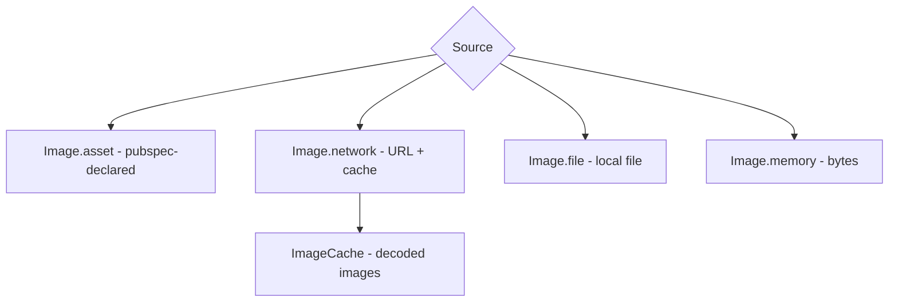
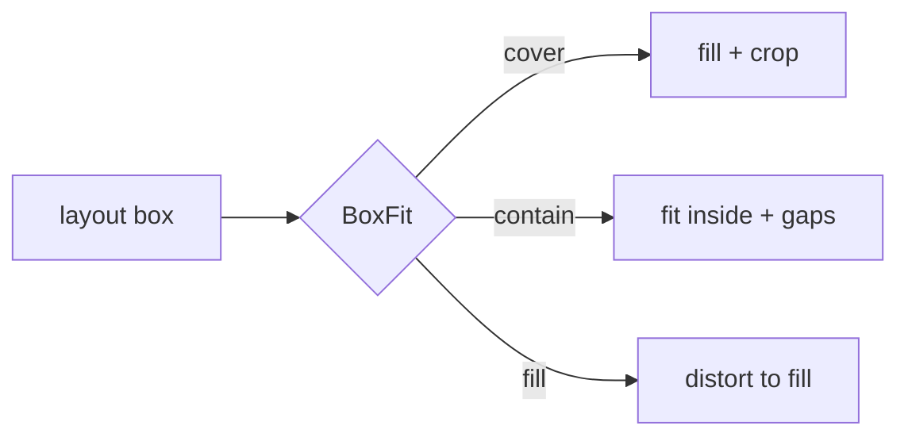

# Images & Assets (`Image`, assets, network, caching)

> Load bundled images with `Image.asset` (declared in `pubspec.yaml`), remote ones with `Image.network` (cached, with loading/error builders), and always control sizing with `fit` to avoid layout surprises.

## Introduction

Images come from assets (bundled), the network, files, or memory. This file covers declaring assets, the `Image` constructors, `BoxFit`, caching, placeholders/error handling, and resolution-aware assets.

## Why this concept exists

Images are heavy (bytes + decode + GPU memory) and come from varied sources with different failure modes (missing asset, network error, slow load). Flutter provides source-specific constructors, an image cache, and hooks for placeholders/errors so you handle these correctly and performantly.

## Real-world analogy

Images are like **framed pictures**: `fit` decides how a picture fills its frame (stretch, crop, letterbox); the frame size is the layout box. Network images are pictures **ordered by mail** — you show a placeholder while waiting and a fallback if delivery fails.

## Problem Statement

Show a bundled logo, a remote avatar with a spinner while loading and a fallback on error, and control cropping. You'll declare assets, use `Image.network` builders, and set `BoxFit`.

## Internal Working



- **`Image.asset('assets/logo.png')`** — must be declared under `flutter: assets:` in `pubspec.yaml`.
- **`Image.network(url, loadingBuilder:, errorBuilder:)`** — remote; provide placeholder + fallback; uses the image cache.
- **`Image.file` / `Image.memory`** — local file / raw bytes.
- **`BoxFit`**: `cover` (fill, crop), `contain` (letterbox), `fill` (stretch), `fitWidth`/`fitHeight`, `none`, `scaleDown`.
- **Resolution-aware assets**: `1.5x`/`2.0x`/`3.0x` variants folders; Flutter picks by device pixel ratio.
- **Caching**: decoded images cached in `ImageCache` (bounded); `cacheWidth`/`cacheHeight` decode at target size to save memory.
- For robust network caching/placeholders, `cached_network_image` is the common package.

## Memory Representation

Decoded images consume memory ∝ pixels (not file size). Large images decoded at full resolution blow memory — use `cacheWidth`/`cacheHeight` or `ResizeImage` ([Module 21](../21%20Performance/README.md)).

## Compiler Behavior

Asset paths are validated at build; missing declared assets fail the build/asset bundle.

## Runtime Behavior

Network images load asynchronously (show placeholder), may error (show fallback). The cache reuses decoded frames across widgets.

## Flutter Engine Behavior

The engine decodes images (often off the UI isolate) and uploads to GPU textures; oversized images cost decode time + GPU memory ([Module 21](../21%20Performance/README.md)).

## Dart VM Behavior

Not applicable directly; decode is engine-side.

## Examples

```dart
import 'package:flutter/material.dart';

class ImageDemo extends StatelessWidget {
  const ImageDemo({super.key});
  @override
  Widget build(BuildContext context) {
    return Scaffold(
      body: Column(
        children: [
          // Bundled asset (declared in pubspec.yaml)
          Image.asset('assets/logo.png', height: 80),

          // Network image with placeholder + error fallback, cropped to fill
          SizedBox(
            width: 120,
            height: 120,
            child: Image.network(
              'https://example.com/avatar.jpg',
              fit: BoxFit.cover, // fill the box, cropping as needed
              cacheWidth: 240,   // decode at ~2x display size, not full-res
              loadingBuilder: (context, child, progress) =>
                  progress == null ? child : const Center(child: CircularProgressIndicator()),
              errorBuilder: (context, error, stack) =>
                  const Icon(Icons.broken_image, size: 48),
            ),
          ),
        ],
      ),
    );
  }
}
```

```yaml
# pubspec.yaml — declare assets so Image.asset can find them
flutter:
  assets:
    - assets/logo.png
    - assets/images/   # a whole folder
```

## Diagrams



## Common Mistakes

| Mistake | Why | Fix |
|---------|-----|-----|
| Asset not declared in `pubspec.yaml` | Not bundled → error | Declare under `flutter: assets:` |
| No `errorBuilder`/`loadingBuilder` on network images | Broken/blank UI on failure/slow net | Provide placeholder + fallback |
| Decoding huge images at full res | Memory spikes/jank | `cacheWidth`/`cacheHeight`/`ResizeImage` |
| Wrong `BoxFit` | Distortion or unexpected crop | Choose `cover`/`contain` intentionally |
| Unbounded image in a `Row`/`Column` | Layout error | Constrain with `SizedBox`/`Expanded` |

## Best Practices

- Declare assets in `pubspec.yaml`; provide resolution variants for crispness.
- Always give network images **loading + error** builders (or use `cached_network_image`).
- Constrain image size and pick `BoxFit` deliberately (`cover` for avatars/thumbnails).
- Decode at display size (`cacheWidth`/`cacheHeight`) to bound memory.
- Prefer vector (`flutter_svg`) for icons/illustrations where appropriate.

## Performance

Memory ∝ decoded pixels; downscale on decode. The image cache reuses decodes; oversized images are a top memory/jank cause ([Module 21](../21%20Performance/README.md)).

## Advantages / Disadvantages

- **+** Source-specific constructors, caching, placeholders/errors, resolution awareness.
- **−** Easy to blow memory with full-res decodes; network needs explicit loading/error handling.

## Interview Questions

1. **🟢 How do you show a bundled image?** — `Image.asset('path')` with the path declared under `flutter: assets:` in `pubspec.yaml`.
2. **🟢 How do you handle network image loading/errors?** — `Image.network` with `loadingBuilder` (placeholder/progress) and `errorBuilder` (fallback), or use `cached_network_image`.
3. **🟡 What does `BoxFit.cover` do vs `contain`?** — `cover` fills the box and crops overflow; `contain` fits entirely inside, possibly leaving gaps.
4. **🟡 Why can images cause memory spikes?** — Decoded memory is proportional to pixel dimensions; full-res decodes of large images are huge. Use `cacheWidth`/`cacheHeight`.
5. **🟡 How does Flutter pick resolution variants?** — By device pixel ratio, choosing `2.0x`/`3.0x` asset folders when declared.
6. **🔴 Where does image decoding happen and why does it matter?** — In the engine (often off the UI isolate); oversized decodes cost time + GPU memory, causing jank if not downscaled.
7. **🔴 When would you use `flutter_svg` instead of raster images?** — For scalable icons/illustrations that must stay crisp at any size and keep asset size small.

## Senior Engineer Tips

- Always downscale-on-decode for thumbnails/avatars; full-res decode of list images is a classic memory bug.
- Use `cached_network_image` in real apps for disk caching + placeholders/errors out of the box.
- Reserve space (fixed box) for images to avoid layout jumps while they load.

## Architect Perspective

Image handling is a performance-critical, failure-prone concern in media/commerce/social apps: caching strategy (memory + disk), decode sizing, and graceful placeholders/errors materially affect memory, smoothness, and perceived quality — decisions that scale with feed size ([Modules 21, 16, 34](../21%20Performance/README.md)).

## Summary

- Load images by source (`asset`/`network`/`file`/`memory`); declare assets in `pubspec`.
- Handle network loading/errors; control cropping with `BoxFit`; decode at display size to bound memory.
- Use resolution variants and caching; consider `cached_network_image`/`flutter_svg`.

## Revision Notes

- `Image.asset` (declare in `pubspec`), `Image.network` (loading/error builders), `.file`/`.memory`.
- `BoxFit`: cover(crop)/contain(letterbox)/fill(stretch).
- Memory ∝ decoded pixels → `cacheWidth`/`cacheHeight`.
- Resolution variants by DPR; `cached_network_image`/`flutter_svg` in real apps.

## Practice Questions

1. Why must assets be declared in `pubspec.yaml`?
2. How do you prevent a large image from blowing memory?
3. `cover` vs `contain` — when each?

## Coding Questions

1. Show an asset logo + a network avatar with spinner + error fallback.
2. Build an image grid that decodes thumbnails at reduced size.
3. Compare `cover`/`contain`/`fill` visually in one screen.

## Mini Project

**Media gallery item (Flutter):** Build a reusable image tile: fixed box, `BoxFit.cover`, downscaled decode, loading spinner, and error fallback, plus a bundled asset header. Acceptance: assets declared; network loading/error handled; memory-conscious decode; no layout jumps; app runs.
