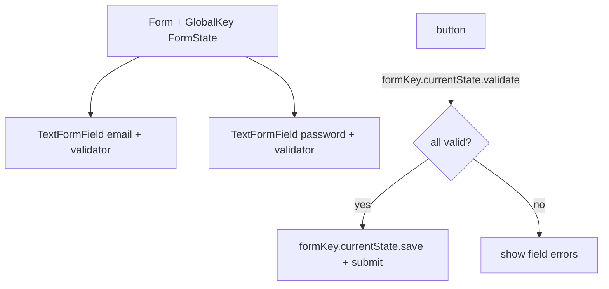
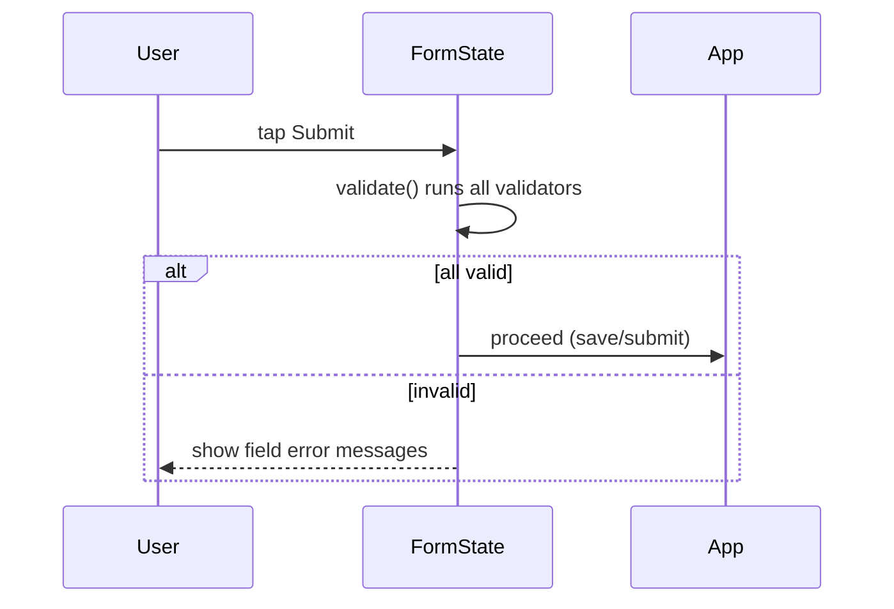

# Input & Forms (`TextField`, `Form`, validation, buttons, gestures)

> Collect input with `TextField`/`TextFormField`, group and validate with `Form` + `GlobalKey<FormState>`, and handle taps with buttons or `GestureDetector`/`InkWell` — always disposing controllers.

## Introduction

This file covers user input: text fields (+controllers/focus), the `Form` system (validation, save), buttons (`ElevatedButton`/`TextButton`/`OutlinedButton`), and gesture handling (`GestureDetector`, `InkWell`). It's the interactive half of UI.

## Why this concept exists

Apps need to capture and validate user input reliably: manage text state, focus, keyboard, validation errors, and submit. Flutter's `Form`/`FormField` system coordinates validation/saving across fields, and controllers manage field state and cursor.

## Real-world analogy

A **paper form with a clerk**: each blank is a field, the clerk (FormState) checks all blanks are valid before accepting (validate), then files the answers (save). Buttons are the "submit" and "cancel" stamps.

## Problem Statement

Build a login form: email + password fields with validation, a submit button enabled logic, focus movement, and proper controller disposal. You'll use `Form`, `TextFormField`, controllers, and `GlobalKey<FormState>`.

## Internal Working



- **`TextField`**: raw input; use a `TextEditingController` to read/set text and a `FocusNode` for focus.
- **`TextFormField`**: `TextField` integrated with `Form` — has `validator` and `onSaved`.
- **`Form` + `GlobalKey<FormState>`**: `formKey.currentState!.validate()` runs all validators; `.save()` triggers `onSaved`; `AutovalidateMode` controls when validation runs.
- **Buttons**: `ElevatedButton`/`FilledButton`/`TextButton`/`OutlinedButton`/`IconButton`; disabled when `onPressed: null`.
- **Gestures**: `GestureDetector` (raw taps/drags), `InkWell` (Material ripple), `onTap`/`onLongPress`.
- **Controllers/FocusNodes must be disposed** in `State.dispose` ([Module 08](../08%20Widget%20Lifecycle/README.md), [02 · memory_and_gc](../02%20Advanced%20Dart/13_memory_and_gc.md)).

## Memory Representation

Controllers/FocusNodes are objects held by `State`; not disposing them leaks ([02 · memory_and_gc](../02%20Advanced%20Dart/13_memory_and_gc.md)).

## Compiler Behavior / Runtime Behavior

Validators run on `validate()`/autovalidate; returning a non-null string shows an error under the field. `onPressed: null` renders a disabled button.

## Flutter Engine Behavior

Text input coordinates with the platform keyboard/IME via the engine/embedder ([06 · architecture_overview](../06%20Flutter%20Fundamentals/02_architecture_overview.md)).

## Dart VM Behavior

Not applicable.

## Examples

```dart
import 'package:flutter/material.dart';

class LoginForm extends StatefulWidget {
  const LoginForm({super.key});
  @override
  State<LoginForm> createState() => _LoginFormState();
}

class _LoginFormState extends State<LoginForm> {
  final _formKey = GlobalKey<FormState>();
  final _email = TextEditingController();
  final _password = TextEditingController();
  final _passwordFocus = FocusNode();

  @override
  void dispose() {
    _email.dispose();          // MUST dispose controllers/focus nodes
    _password.dispose();
    _passwordFocus.dispose();
    super.dispose();
  }

  void _submit() {
    if (_formKey.currentState!.validate()) {
      // valid -> proceed (call a view model / repository)
      debugPrint('login ${_email.text}');
    }
  }

  @override
  Widget build(BuildContext context) {
    return Scaffold(
      appBar: AppBar(title: const Text('Login')),
      body: Padding(
        padding: const EdgeInsets.all(16),
        child: Form(
          key: _formKey,
          child: Column(
            children: [
              TextFormField(
                controller: _email,
                decoration: const InputDecoration(labelText: 'Email'),
                keyboardType: TextInputType.emailAddress,
                textInputAction: TextInputAction.next,
                onFieldSubmitted: (_) => _passwordFocus.requestFocus(),
                validator: (v) =>
                    (v == null || !v.contains('@')) ? 'Enter a valid email' : null,
              ),
              TextFormField(
                controller: _password,
                focusNode: _passwordFocus,
                obscureText: true,
                decoration: const InputDecoration(labelText: 'Password'),
                validator: (v) =>
                    (v == null || v.length < 6) ? 'Min 6 characters' : null,
                onFieldSubmitted: (_) => _submit(),
              ),
              const SizedBox(height: 16),
              FilledButton(onPressed: _submit, child: const Text('Sign in')),
              TextButton(onPressed: () {}, child: const Text('Forgot password?')),
            ],
          ),
        ),
      ),
    );
  }
}
```

## Diagrams



## Common Mistakes

| Mistake | Why | Fix |
|---------|-----|-----|
| Not disposing controllers/focus nodes | Memory leak | `dispose()` them in `State.dispose` |
| Managing text via `setState` on every keystroke | Rebuild churn | Use the controller; read on submit |
| No `Form`/validators for multi-field input | Manual, error-prone | Use `Form` + `TextFormField` validators |
| Business logic in the widget | Untestable | Delegate to a view model/BLoC ([Module 11](../11%20State%20Management/README.md)) |
| Using `context` after async submit without `mounted` | Crash | Guard with `if (!mounted) return;` ([06 · build_context](../06%20Flutter%20Fundamentals/06_build_context.md)) |

## Best Practices

- Use `Form` + `TextFormField` + `GlobalKey<FormState>` for multi-field validation.
- **Dispose** controllers/focus nodes; create them in `initState`/as fields.
- Manage focus with `FocusNode` + `textInputAction`; move to next on submit.
- Keep submit logic in a view model; the widget only collects/validates + calls it.
- Choose the right button semantics (`Filled`/`Elevated`/`Text`/`Outlined`); disable via `onPressed: null`.

## Performance

Reading text from controllers on submit avoids per-keystroke rebuilds. Gesture/ink handling is cheap ([Module 21](../21%20Performance/README.md)).

## Advantages / Disadvantages

- **+** Coordinated validation/save, focus/keyboard management, rich input widgets, Material feedback (ink).
- **−** Controller/focus lifecycle to manage (leak-prone); easy to over-`setState` on input.

## Interview Questions

1. **🟢 `TextField` vs `TextFormField`?** — `TextFormField` integrates with `Form` (has `validator`/`onSaved`); `TextField` is standalone.
2. **🟢 How do you validate a form?** — Wrap fields in a `Form` with a `GlobalKey<FormState>`, give each a `validator`, and call `formKey.currentState!.validate()`.
3. **🟡 Why dispose `TextEditingController`/`FocusNode`?** — They're long-lived objects held by `State`; not disposing leaks memory ([02](../02%20Advanced%20Dart/13_memory_and_gc.md)).
4. **🟡 How do you move focus between fields?** — Use `FocusNode`s + `textInputAction: next` and `onFieldSubmitted` to `requestFocus` the next node.
5. **🟡 How do you disable a button?** — Set `onPressed: null`.
6. **🔴 `GestureDetector` vs `InkWell`?** — Both detect taps; `InkWell` adds Material ripple feedback and must be inside a `Material`. Use `InkWell` for Material tap surfaces.
7. **🔴 Where should submit/business logic live?** — In a view model/BLoC, not the widget; the form collects+validates and delegates, keeping UI testable.

## Senior Engineer Tips

- Create controllers as `final` fields (or in `initState`) and dispose them — a top source of Flutter leaks.
- Keep the widget dumb: validate locally, delegate the actual sign-in/save to injected logic.
- Use `autovalidateMode: onUserInteraction` for friendlier validation timing.

## Architect Perspective

Forms are where UI meets domain validation. Keeping presentation-level validation (format) in the form and business rules in the domain/use case ([Modules 40, 46](../40%20Clean%20Architecture/README.md)) — with the widget delegating submit to a view model — yields testable, maintainable input flows. Controller lifecycle discipline prevents a common leak class at scale.

## Summary

- Collect input with `TextField`/`TextFormField`; validate via `Form` + `GlobalKey<FormState>`.
- Dispose controllers/focus nodes; manage focus + keyboard actions; disable buttons with `null`.
- Delegate submit/business logic to a view model; guard async `context` use.

## Revision Notes

- `Form` + `GlobalKey<FormState>` + `TextFormField.validator`; `validate()`/`save()`.
- Dispose `TextEditingController`/`FocusNode` (leaks!).
- Focus: `FocusNode` + `textInputAction` + `onFieldSubmitted`.
- Disable button: `onPressed: null`; `InkWell` = Material ripple.
- Logic → view model, not widget; guard async with `mounted`.

## Practice Questions

1. Why must controllers be disposed, and where?
2. How does `Form` coordinate multi-field validation?
3. `GestureDetector` vs `InkWell` — when each?

## Coding Questions

1. Build a signup form (email/password/confirm) with cross-field validation.
2. Implement focus traversal that moves to the next field on "next".
3. Make a submit button enable only when the form is valid.

## Mini Project

**Login form (Flutter):** Build a validated `Form` (email + password), focus traversal, a submit that validates and calls an injected `AuthService` fake, proper disposal, and `mounted`-guarded async. Acceptance: validation works; controllers disposed; logic delegated (not in widget); no post-dispose context use; app runs.
