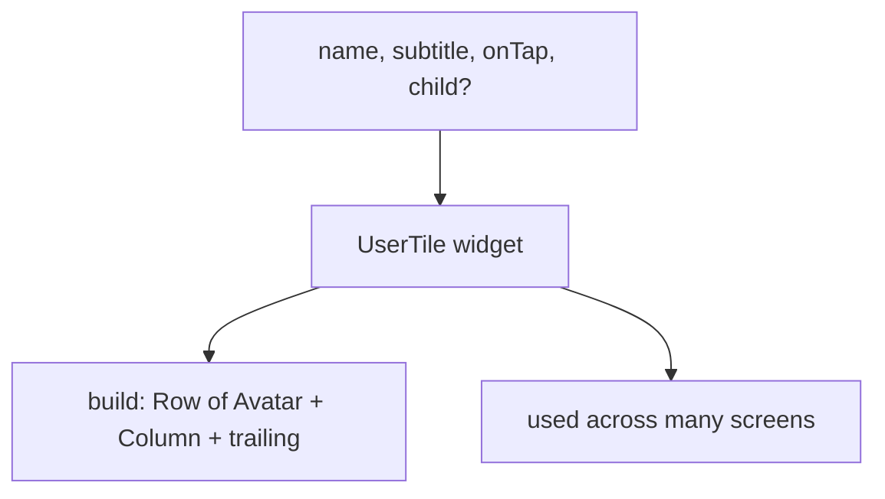
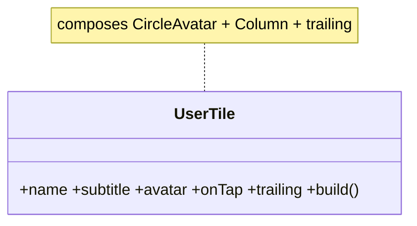

# Building Custom Composite Widgets

> Build your own widgets by **composing** existing ones into small, reusable, `const`-friendly units — Flutter's "composition over inheritance" philosophy in daily practice.

## Introduction

Most custom widgets in Flutter are **composite**: a `StatelessWidget`/`StatefulWidget` whose `build` combines existing widgets. This file covers designing reusable widgets — parameters, `const` constructors, callbacks, `child`/builder slots — and when to reach for a custom `RenderObject` instead (rarely; see [Module 23](../23%20Custom%20Painting/README.md)).

## Why this concept exists

Copy-pasting the same `Container`+`Row`+`Text` block across screens causes drift and bloats `build` methods. Extracting a named composite widget (`UserCard`, `PrimaryButton`) gives reuse, a clear API, `const` rebuild-skipping, and testability — the practical payoff of composition ([03 · composition](../03%20Object%20Oriented%20Programming/composition_and_relationships.md)).

## Real-world analogy

**Prefab components** in construction: instead of building each wall from raw bricks every time, you make a reusable wall panel (custom widget) with defined connectors (parameters/callbacks) and snap it in wherever needed.

## Problem Statement

You keep repeating an avatar+name+subtitle+trailing-action row. You'll extract a configurable, `const`-friendly `UserTile` widget with parameters and an `onTap` callback, and learn to expose a `child` slot for flexibility.

## Internal Working



- Extract a widget when a UI block is **repeated**, **complex**, or **named-concept** worthy.
- Expose a **clear API**: required/optional named params, callbacks (`VoidCallback`, `ValueChanged<T>`), and optionally a `child`/`Widget Function(...)` builder slot for flexibility.
- Make it **`const`-constructible** (all fields `final`) so parents can `const` it and skip rebuilds.
- Prefer **`StatelessWidget`** unless it owns local state; keep business logic out ([06 · stateless_vs_stateful](../06%20Flutter%20Fundamentals/stateless_vs_stateful.md)).
- Custom **`RenderObject`** widgets are for bespoke layout/painting only — rare; see [Module 23](../23%20Custom%20Painting/README.md).

## Memory Representation

Composite widgets are ordinary widgets → elements → render objects; `const` instances are shared/skip rebuilds ([06](../06%20Flutter%20Fundamentals/widgets_elements_render_objects.md)).

## Compiler Behavior

`const` constructors require all-`final` fields and enable canonicalization/rebuild-skipping.

## Runtime Behavior

A composite rebuilds when its inputs change or its parent rebuilds it; `const` instances are skipped when unchanged.

## Flutter Engine Behavior / Dart VM Behavior

Not applicable beyond normal widget behavior.

## Examples

```dart
import 'package:flutter/material.dart';

// A reusable, const-friendly composite widget with a clear API.
class UserTile extends StatelessWidget {
  final String name;
  final String subtitle;
  final ImageProvider? avatar;
  final VoidCallback? onTap;   // callback slot
  final Widget? trailing;      // widget slot for flexibility

  const UserTile({
    super.key,
    required this.name,
    required this.subtitle,
    this.avatar,
    this.onTap,
    this.trailing,
  });

  @override
  Widget build(BuildContext context) {
    final theme = Theme.of(context);
    return InkWell(
      onTap: onTap,
      child: Padding(
        padding: const EdgeInsets.symmetric(horizontal: 16, vertical: 8),
        child: Row(
          children: [
            CircleAvatar(backgroundImage: avatar, child: avatar == null ? Text(name[0]) : null),
            const SizedBox(width: 12),
            Expanded(
              child: Column(
                crossAxisAlignment: CrossAxisAlignment.start,
                children: [
                  Text(name, style: theme.textTheme.titleMedium),
                  Text(subtitle, style: theme.textTheme.bodySmall),
                ],
              ),
            ),
            if (trailing != null) trailing!,
          ],
        ),
      ),
    );
  }
}

// Usage — reusable across screens, const where inputs are constant:
class Demo extends StatelessWidget {
  const Demo({super.key});
  @override
  Widget build(BuildContext context) {
    return Scaffold(
      body: ListView(
        children: [
          UserTile(
            name: 'Ada',
            subtitle: 'Engineer',
            trailing: const Icon(Icons.chevron_right),
            onTap: () {},
          ),
          const UserTile(name: 'Bob', subtitle: 'Designer'), // const!
        ],
      ),
    );
  }
}
```

## Diagrams



## Common Mistakes

| Mistake | Why | Fix |
|---------|-----|-----|
| Giant `build` methods, copy-pasted blocks | Drift, unreadable | Extract named composite widgets |
| Non-`const` constructors (mutable fields) | Lose rebuild-skipping | Make fields `final`, add `const` ctor |
| Business logic inside the widget | Untestable, coupled | Delegate via callbacks / view models |
| Extracting into a *method* returning a widget | Doesn't get its own element/`const`/rebuild scope | Extract a **widget class**, not a helper method |
| Over-parameterizing | Confusing API | Provide sensible defaults; use `child`/builder slots |

## Best Practices

- Extract a **widget class** (not a `Widget _buildX()` method) so it gets its own element, `const`-ability, and rebuild scoping.
- Design a **small, clear API**: required/optional named params, callbacks, and `child`/builder slots.
- Make it **`const`-constructible**; keep it **stateless** unless it owns local state.
- Keep logic out (delegate via callbacks); theme via `Theme.of(context)` not hardcoded.
- Compose small widgets; each has a single responsibility ([04 · SRP](../04%20SOLID%20Principles/srp_single_responsibility.md)).

## Performance

Widget classes (vs helper methods) enable `const` + independent rebuild scoping, reducing unnecessary rebuilds — a real, common perf win ([Module 21](../21%20Performance/README.md)).

## Advantages / Disadvantages

- **+** Reuse, clear APIs, `const`/rebuild scoping, testability, readable `build`s.
- **−** More files/types; risk of over-abstracting tiny one-offs.

## Interview Questions

1. **🟢 How do you build a custom widget in Flutter?** — Usually by composing existing widgets in a `Stateless`/`StatefulWidget`'s `build` (composition over inheritance).
2. **🟢 Why extract a widget class instead of a `_buildX()` method?** — A class gets its own element, can be `const`, and rebuilds independently; a method inlines into the parent's build (no scoping/`const` benefit).
3. **🟡 How do you make a custom widget flexible?** — Expose parameters, callbacks (`VoidCallback`/`ValueChanged`), and `child`/builder slots.
4. **🟡 Why make custom widgets `const`-constructible?** — `const` instances are canonicalized and skipped during rebuilds, improving performance.
5. **🟡 Stateless or stateful for a custom widget?** — Stateless unless it owns local mutable state; keep business logic out regardless.
6. **🔴 When do you need a custom `RenderObject` widget?** — Only for bespoke layout/painting not expressible by composition — rare; see [Module 23](../23%20Custom%20Painting/README.md).
7. **🔴 How does extracting widgets help rebuild performance?** — It scopes rebuilds to the smallest subtree and enables `const`, so unrelated parts don't rebuild.

## Senior Engineer Tips

- Prefer widget classes over build-helper methods — it's a genuine performance and clarity win, not just style.
- Design custom widgets like a public API: minimal required params, sensible defaults, escape-hatch `child`/builder slots.
- Build a small design-system package of composites (buttons, cards, tiles) for consistency across teams.

## Architect Perspective

Custom composite widgets are the atoms of a **design system**: reusable, themed, tested components with clear APIs. Investing in them early yields UI consistency, faster feature work, and rebuild efficiency across a large app — the UI-layer parallel to a well-factored domain ([Modules 25, 47](../25%20Adaptive%20UI/README.md)).

## Summary

- Build custom widgets by composing existing ones into small, `const`-friendly, single-purpose classes.
- Expose clear parameters/callbacks/slots; keep logic out; extract widget *classes*, not helper methods.
- This is composition-over-inheritance in practice and the basis of a design system.

## Revision Notes

- Compose existing widgets into a `Stateless`/`Stateful` class (not a `_buildX()` method).
- Clear API: named params + callbacks + `child`/builder slots; `const` ctor (final fields).
- Stateless unless owns state; logic → callbacks/view models; theme via `Theme.of`.
- Widget class ⇒ `const` + rebuild scoping (perf). RenderObject only for bespoke layout/paint.

## Practice Questions

1. Why is a widget class better than a build-helper method?
2. How do slots (`child`/builder) improve a widget's flexibility?
3. When would you actually need a custom `RenderObject`?

## Coding Questions

1. Extract a repeated card block into a `const`-constructible `InfoCard` with params + `onTap`.
2. Add a `trailing` widget slot and a builder slot to a custom list tile.
3. Convert three `_buildX()` helper methods into widget classes and note the benefits.

## Mini Project

**Design-system starter kit (Flutter):** Build `PrimaryButton`, `UserTile`, and `SectionCard` as reusable, themed, `const`-friendly composite widgets with clear APIs (params, callbacks, slots), and a demo screen using them. Acceptance: widget classes (not helper methods); `const` where possible; logic delegated via callbacks; consistent theming; app runs.
