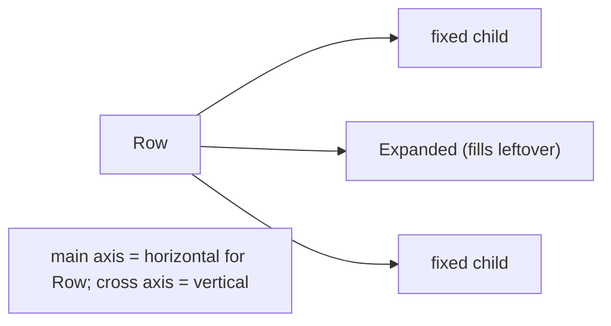
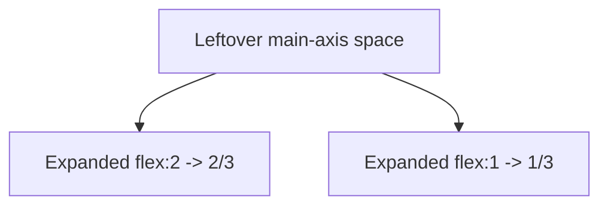

# Flex Layout (`Row`, `Column`, `Flex`, `Expanded`, `Flexible`, `Spacer`)

> `Row` and `Column` lay children along a main axis; `Expanded`/`Flexible` divide the leftover space; `mainAxisAlignment`/`crossAxisAlignment` position them — this is 80% of everyday Flutter layout.

## Introduction

`Row` (horizontal) and `Column` (vertical) are `Flex` widgets that arrange children along a **main axis** and size them along a **cross axis**. `Expanded`/`Flexible`/`Spacer` control how free space is shared. Mastering these + alignment covers most layouts.

## Why this concept exists

Linear arrangement (toolbars, lists of fields, button rows, stacked sections) is the most common UI need. Flex provides a declarative, constraint-driven way to distribute children and space without manual coordinates.

## Real-world analogy

A **row of books on an adjustable shelf**: some books have fixed width (unflexed), some stretch to fill gaps (`Expanded`), and you can push them left, center, right, or space them evenly (`mainAxisAlignment`).

## Problem Statement

Build a toolbar: an icon on the left, a title that takes remaining space, and an action on the right; plus a form column of full-width fields. You'll use `Row`/`Column`, `Expanded`, `Spacer`, and alignment.

## Internal Working



- **Main axis:** horizontal for `Row`, vertical for `Column`. **Cross axis** is perpendicular.
- **`mainAxisAlignment`:** `start`/`end`/`center`/`spaceBetween`/`spaceAround`/`spaceEvenly` — distributes free space along main axis.
- **`crossAxisAlignment`:** `start`/`end`/`center`/`stretch`/`baseline`.
- **`mainAxisSize`:** `max` (fill available) vs `min` (shrink to children).
- **`Expanded`** (flex, fills remaining, forces fill) vs **`Flexible`** (may be smaller than its share) vs **`Spacer`** (flexible empty gap).
- Flex first lays out **non-flex** children, then divides remaining space among flex children by their `flex` factor.

## Memory Representation

Backed by `RenderFlex` render objects ([06](../06%20Flutter%20Fundamentals/widgets_elements_render_objects.md)); layout computed via constraints ([constraints_and_sizing.md](constraints_and_sizing.md)).

## Compiler Behavior

Not applicable. Use `const` for static children.

## Runtime Behavior

`RenderFlex` sizes inflexible children first, then allocates leftover main-axis space to flex children proportionally; overflow (children exceed space, no flex) produces the yellow-black overflow stripes.

## Flutter Engine Behavior

Layout (constraints down, sizes up) happens in the render layer; details in [Module 09](../09%20Rendering%20Pipeline/README.md).

## Dart VM Behavior

Not applicable.

## Examples

```dart
import 'package:flutter/material.dart';

class FlexDemo extends StatelessWidget {
  const FlexDemo({super.key});
  @override
  Widget build(BuildContext context) {
    return Scaffold(
      body: Column(
        crossAxisAlignment: CrossAxisAlignment.stretch, // fill width
        children: [
          // Toolbar: icon | title (fills) | action
          Row(
            children: [
              const Icon(Icons.menu),
              const SizedBox(width: 8),
              const Expanded(                         // takes ALL leftover space
                child: Text('Title', overflow: TextOverflow.ellipsis),
              ),
              IconButton(icon: const Icon(Icons.search), onPressed: () {}),
            ],
          ),
          const SizedBox(height: 16),
          // Proportional split: 2:1
          Row(
            children: [
              Expanded(flex: 2, child: Container(height: 40, color: Colors.teal)),
              const SizedBox(width: 8),
              Expanded(flex: 1, child: Container(height: 40, color: Colors.orange)),
            ],
          ),
          const SizedBox(height: 16),
          // Push apart with Spacer
          Row(
            children: const [Text('Left'), Spacer(), Text('Right')],
          ),
          const SizedBox(height: 16),
          // Even distribution
          const Row(
            mainAxisAlignment: MainAxisAlignment.spaceEvenly,
            children: [Text('A'), Text('B'), Text('C')],
          ),
        ],
      ),
    );
  }
}
```

## Diagrams



## Common Mistakes

| Mistake | Why | Fix |
|---------|-----|-----|
| Overflow (yellow/black stripes) | Children exceed available space with no flex | Wrap flexible child in `Expanded`/`Flexible`, or scroll |
| `Row` with an unbounded-width child (e.g., another `Row`/`Text` too long) | Infinite width constraint | Constrain or `Expanded`/`Flexible` |
| Using `Expanded` outside a Flex | Only valid in `Row`/`Column`/`Flex` | Put it inside a flex parent |
| `mainAxisSize.max` inside a scroll view | Fights unbounded axis | Use `min` or intrinsic sizing |
| Confusing main vs cross alignment | Wrong axis controlled | Row: main=horizontal; Column: main=vertical |

## Best Practices

- Use `Expanded` to fill remaining space; `Flexible` when the child may be smaller; `Spacer` for gaps.
- Set `mainAxisSize: min` when a `Row`/`Column` should hug its children (e.g., inside a `Center`).
- Guard long text with `Expanded` + `overflow: TextOverflow.ellipsis`.
- Prefer `SizedBox` for fixed spacing over padding hacks.

## Performance

Flex layout is cheap; deeply nested flex + intrinsic sizing can cost more — keep trees reasonable ([Module 21](../21%20Performance/README.md)).

## Advantages / Disadvantages

- **+** Declarative linear layout, flexible space distribution, alignment control.
- **−** Overflow/unbounded-constraint errors confuse beginners; requires the constraints mental model.

## Interview Questions

1. **🟢 `Row` vs `Column`?** — `Row` arranges children horizontally (main axis = horizontal); `Column` vertically. Both are `Flex`.
2. **🟢 `Expanded` vs `Flexible`?** — `Expanded` forces the child to fill its share of remaining space; `Flexible` lets it be smaller (up to its share). `Expanded` = `Flexible(fit: FlightFit.tight)`.
3. **🟡 What causes the overflow stripes?** — Children's total main-axis size exceeds available space with no flex to absorb it; fix with `Expanded`/`Flexible` or a scroll view.
4. **🟡 `mainAxisAlignment` vs `crossAxisAlignment`?** — Main aligns along the layout direction (distributing free space); cross aligns perpendicular (including `stretch`).
5. **🟡 What does `mainAxisSize` control?** — Whether the flex fills the available main-axis extent (`max`) or shrinks to its children (`min`).
6. **🔴 How does `RenderFlex` allocate space?** — Lays out inflexible children first, then divides leftover main-axis space among flex children by their `flex` factors.
7. **🔴 Why does a `Row` inside a `Row` sometimes throw an unbounded-width error?** — The inner needs a bounded width; wrap it in `Expanded`/`Flexible` or constrain it ([constraints_and_sizing.md](constraints_and_sizing.md)).

## Senior Engineer Tips

- "Unbounded" errors mean a child wants infinite space on an axis; the fix is almost always `Expanded`/`Flexible` or an explicit size.
- Use `Spacer` and `spaceBetween` instead of manual padding math for distribution.
- Extract repeated `Row`/`Column` structures into small widgets ([custom_composite_widgets.md](custom_composite_widgets.md)).

## Architect Perspective

Flex is the workhorse of responsive layouts; combined with `LayoutBuilder`/`MediaQuery` it adapts to size ([Module 24](../24%20Responsive%20UI/README.md)). A solid grasp of flex + constraints prevents the majority of layout bugs and is prerequisite to building a consistent design system.

## Summary

- `Row`/`Column`/`Flex` arrange along a main axis; `Expanded`/`Flexible`/`Spacer` split leftover space.
- `mainAxisAlignment`/`crossAxisAlignment`/`mainAxisSize` control positioning.
- Overflow/unbounded errors come from the constraints model — wrap flexible children.

## Revision Notes

- Row=horizontal main axis; Column=vertical. Cross axis = perpendicular.
- `Expanded` fills share (tight); `Flexible` may be smaller; `Spacer` = flexible gap.
- `mainAxisAlignment` distributes free space; `crossAxisAlignment` incl. `stretch`.
- Overflow/unbounded → wrap in `Expanded`/`Flexible` or constrain/scroll.

## Practice Questions

1. Why does long text in a `Row` overflow, and how do you fix it?
2. `Expanded` vs `Flexible` — give a case for each.
3. How does a 2:1 space split work with `flex`?

## Coding Questions

1. Build a toolbar: leading icon, expanding ellipsized title, trailing action.
2. Split a row into 3:2 colored panels with a gap.
3. Use `Spacer`/`spaceBetween` to place items at the two ends.

## Mini Project

**Responsive toolbar + form (Flutter):** Build a `Column` form of full-width fields under a `Row` toolbar (icon | expanding title | action), plus a proportional colored panel row. Handle long titles with ellipsis. Acceptance: no overflow errors; correct flex distribution; alignment intentional; app runs.
