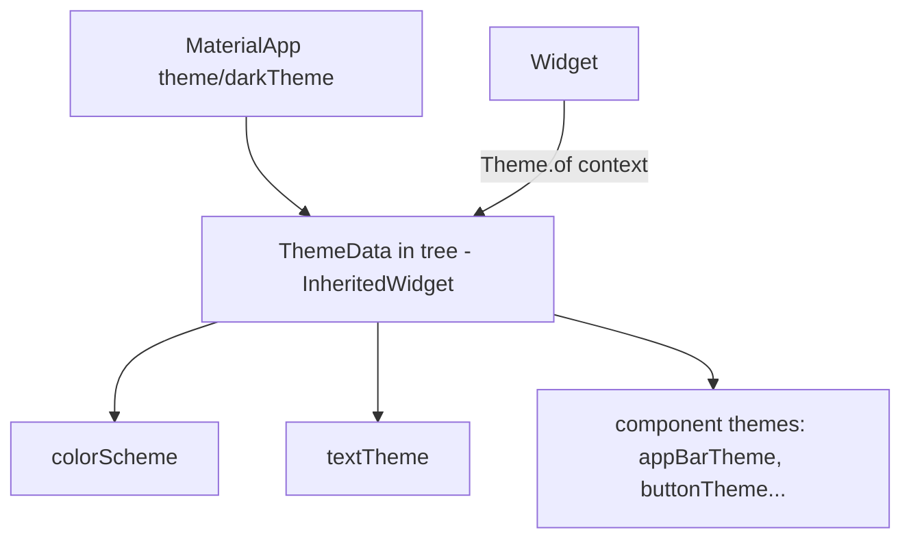
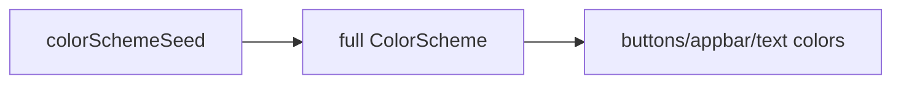

# Text & Theming (`Text`, `TextStyle`, `Theme`, `TextTheme`)

> Style text via `TextStyle`, but centralize look-and-feel in a `ThemeData` so the whole app stays consistent — read styles from `Theme.of(context)` instead of hardcoding.

## Introduction

`Text` renders strings; `TextStyle` styles them; `RichText`/`Text.rich` mix styles. But hardcoding styles everywhere causes drift. **Theming** centralizes colors, typography (`TextTheme`), and component styles in `ThemeData`, which widgets read via `Theme.of(context)`. This file covers both.

## Why this concept exists

Consistent typography and color are the essence of a polished app. Hardcoding `TextStyle(fontSize: 16, color: ...)` in 200 places makes rebranding or dark mode a nightmare. A central theme is the single source of truth; widgets consume it contextually.

## Real-world analogy

A **company brand guide**: instead of each designer picking fonts/colors ad hoc, everyone follows one guide (theme). Change the guide once and all materials update. `Theme.of(context)` is "look it up in the brand guide."

## Problem Statement

Style headings/body consistently, support light/dark themes, and change the brand color in one place. You'll define a `ThemeData`, use `TextTheme`, and read styles from context.

## Internal Working



- **`TextStyle`**: `fontSize`, `fontWeight`, `color`, `letterSpacing`, `height` (line height), `fontFamily`, etc. Combine/override with `style.copyWith(...)`.
- **`ThemeData`**: app-wide `colorScheme` (Material 3: `colorSchemeSeed`), `textTheme`, and component sub-themes (`appBarTheme`, `elevatedButtonTheme`…).
- **`TextTheme`**: named roles (`displayLarge`, `headlineMedium`, `titleLarge`, `bodyMedium`, `labelSmall`…). Use `Theme.of(context).textTheme.titleLarge`.
- **Provided via `InheritedWidget`**: `Theme.of(context)` looks up the nearest `Theme` ([06 · build_context](../06%20Flutter%20Fundamentals/build_context.md)).
- **Dark mode:** provide `theme` + `darkTheme` + `themeMode`; the framework picks based on system/user.

## Memory Representation

`ThemeData` is an immutable object in the tree; lookups are cheap ([06](../06%20Flutter%20Fundamentals/build_context.md)).

## Compiler Behavior

Not applicable. Prefer `const TextStyle` where values are constant.

## Runtime Behavior

`Theme.of(context)` resolves the nearest theme; changing `themeMode` or theme triggers dependent rebuilds.

## Flutter Engine Behavior

Text layout/shaping happens in the engine (glyphs, line breaking); the framework provides the style.

## Dart VM Behavior

Not applicable.

## Examples

```dart
import 'package:flutter/material.dart';

void main() => runApp(const MyApp());

class MyApp extends StatelessWidget {
  const MyApp({super.key});
  @override
  Widget build(BuildContext context) {
    return MaterialApp(
      themeMode: ThemeMode.system, // follow device
      theme: ThemeData(
        useMaterial3: true,
        colorSchemeSeed: Colors.indigo, // one seed derives the palette
        textTheme: const TextTheme(
          titleLarge: TextStyle(fontWeight: FontWeight.bold),
        ),
      ),
      darkTheme: ThemeData(
        useMaterial3: true,
        brightness: Brightness.dark,
        colorSchemeSeed: Colors.indigo,
      ),
      home: const TextDemo(),
    );
  }
}

class TextDemo extends StatelessWidget {
  const TextDemo({super.key});
  @override
  Widget build(BuildContext context) {
    final theme = Theme.of(context);
    return Scaffold(
      appBar: AppBar(title: const Text('Text & Theme')),
      body: Padding(
        padding: const EdgeInsets.all(16),
        child: Column(
          crossAxisAlignment: CrossAxisAlignment.start,
          children: [
            // Read styles from the theme, not hardcoded:
            Text('Heading', style: theme.textTheme.headlineMedium),
            const SizedBox(height: 8),
            Text('Body text goes here.', style: theme.textTheme.bodyMedium),
            const SizedBox(height: 8),
            // Override just one property via copyWith:
            Text('Accent',
                style: theme.textTheme.titleLarge
                    ?.copyWith(color: theme.colorScheme.primary)),
            const SizedBox(height: 8),
            // Mixed styles in one paragraph:
            Text.rich(TextSpan(children: [
              const TextSpan(text: 'Normal '),
              TextSpan(
                  text: 'bold',
                  style: theme.textTheme.bodyMedium
                      ?.copyWith(fontWeight: FontWeight.bold)),
            ])),
          ],
        ),
      ),
    );
  }
}
```

## Diagrams



## Common Mistakes

| Mistake | Why | Fix |
|---------|-----|-----|
| Hardcoding `TextStyle`/colors everywhere | Drift, hard to rebrand/dark-mode | Read from `Theme.of(context)` |
| Duplicating a style with tweaks | Divergence | `theme.textTheme.x.copyWith(...)` |
| Ignoring dark mode | Poor UX | Provide `darkTheme` + `themeMode` |
| Fixed colors that break in dark | Contrast issues | Use `colorScheme` roles (`primary`, `onSurface`) |
| Custom fonts not declared | Font not applied | Declare in `pubspec.yaml` fonts section |

## Best Practices

- Centralize typography/colors in `ThemeData`; read via `Theme.of(context)`.
- Use `colorScheme` **roles** (`primary`, `surface`, `onSurface`) so dark mode & contrast work.
- Derive one-off styles with `copyWith` from theme text styles.
- Support light + dark from day one; test both.
- Declare custom fonts in `pubspec.yaml`; prefer Material 3 (`useMaterial3: true`).

## Performance

Theme lookups are cheap; `const TextStyle`/widgets avoid rebuild cost. Excessive theme-dependent rebuilds can be scoped ([Module 21](../21%20Performance/README.md)).

## Advantages / Disadvantages

- **+** Consistency, easy rebrand/dark mode, single source of truth, accessible contrast via roles.
- **−** Learning the `TextTheme`/`colorScheme` roles; over-theming can obscure local intent.

## Interview Questions

1. **🟢 How do you style text?** — With `TextStyle` on a `Text` widget; combine styles with `copyWith`; mix styles via `Text.rich`/`RichText`.
2. **🟢 How do you keep styling consistent app-wide?** — Define a `ThemeData` (colors + `textTheme` + component themes) and read via `Theme.of(context)` instead of hardcoding.
3. **🟡 What is `TextTheme`?** — Named typography roles (`headlineMedium`, `bodyMedium`, etc.) provided by the theme.
4. **🟡 How do you support dark mode?** — Provide `theme`, `darkTheme`, and `themeMode`; use `colorScheme` roles so colors adapt.
5. **🟡 How is the theme delivered to widgets?** — Via an `InheritedWidget`; `Theme.of(context)` looks up the nearest one.
6. **🔴 Why use `colorScheme` roles over raw colors?** — Roles (`primary`/`onSurface`) adapt across light/dark and maintain contrast/accessibility; raw colors break in one mode.
7. **🔴 How do you add a custom font?** — Add the font files and declare them under `flutter: fonts:` in `pubspec.yaml`, then set `fontFamily`.

## Senior Engineer Tips

- Build a small **design-system layer** (extension getters like `context.textTheme`, semantic styles) so screens read intent, not raw values.
- Prefer seed-based `ColorScheme` (M3) for a coherent palette and easy theming.
- Always verify contrast in dark mode; use `on*` roles for foreground colors.

## Architect Perspective

Theming is your design-system foundation: centralizing tokens (color/typography/spacing) enables rebranding, white-labeling, dark mode, and accessibility at scale. Wrapping the theme in semantic app-level extensions decouples screens from raw values — the base of a maintainable UI layer ([Module 25](../25%20Adaptive%20UI/README.md)).

## Summary

- Style with `TextStyle`/`copyWith`/`Text.rich`; centralize in `ThemeData` and read via `Theme.of(context)`.
- Use `TextTheme` roles and `colorScheme` roles for consistency + dark mode + contrast.
- Support light/dark from the start; declare custom fonts in `pubspec`.

## Revision Notes

- `Text` + `TextStyle` (+`copyWith`, `Text.rich`); prefer `const`.
- Centralize in `ThemeData` (colorScheme + textTheme + component themes); read via `Theme.of(context)`.
- Dark mode: `theme`/`darkTheme`/`themeMode`; use `colorScheme` roles.
- Custom fonts declared in `pubspec.yaml`; M3 `colorSchemeSeed`.

## Practice Questions

1. Why prefer `colorScheme.primary` over a hardcoded color?
2. How do you override one property of a theme text style?
3. How is `ThemeData` delivered to a deep widget?

## Coding Questions

1. Define a themed app (seed color + custom `titleLarge`) and render headings/body from the theme.
2. Add light/dark themes with `themeMode: system` and verify both.
3. Create semantic extension getters (`context.textTheme`, `context.colors`).

## Mini Project

**Themed typography kit (Flutter):** Build a screen showing all major `TextTheme` roles, an accent style via `copyWith`, and light/dark support driven by `colorSchemeSeed`. Add `context.textTheme`/`context.colors` extensions. Acceptance: no hardcoded colors/sizes; dark mode works with good contrast; app runs.
