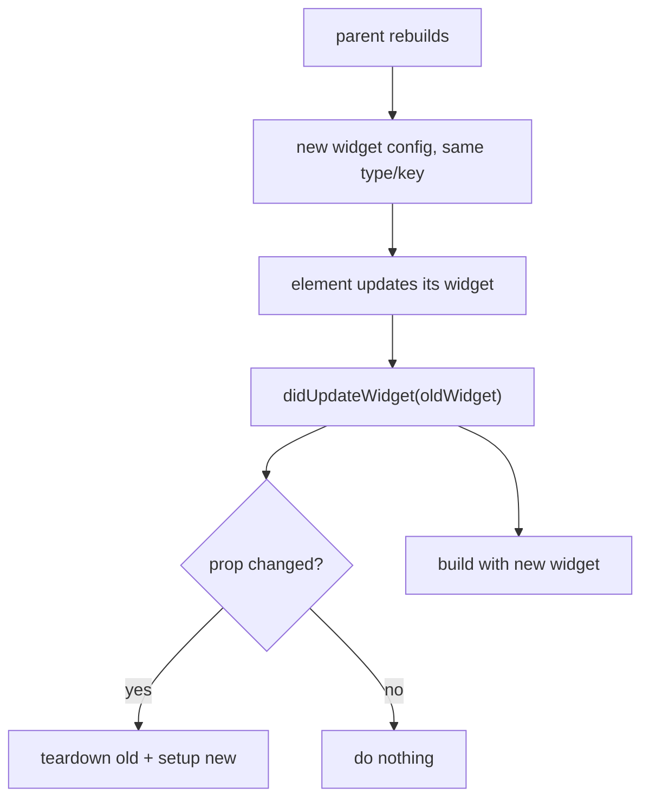
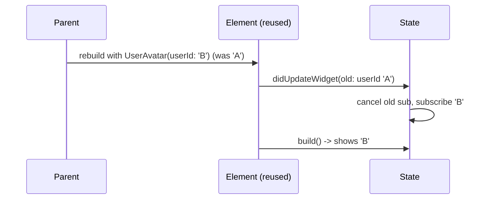

# `didUpdateWidget` (Reacting to New Config)

> When a parent rebuilds and gives this `State` a **new widget instance** of the same type, `didUpdateWidget(oldWidget)` runs — the place to react to *changed properties* (re-subscribe, restart animations, refetch).

## Introduction

Because `State` persists while its `StatefulWidget` config is recreated each build ([Module 06](../06%20Flutter%20Fundamentals/04_widgets_elements_render_objects.md)), the `State` must be told when its configuration changed. `didUpdateWidget(oldWidget)` is that hook: compare `oldWidget` to the current `widget` and react to differences.

## Why this concept exists

A parent may pass a new `userId`, `url`, `duration`, or `controller` to the same widget. The `State`'s existing resources (subscriptions, animations) were set up for the *old* values; `didUpdateWidget` lets you tear down and re-setup for the new ones — otherwise you'd show stale data.

## Real-world analogy

A **rented apartment with the same tenant but a new lease**: the tenant (State) stays, but the lease terms (widget config) changed. `didUpdateWidget` is reading the new lease and adjusting (new parking spot? re-register the car).

## Problem Statement

A `UserAvatar(userId)` subscribes to a user's profile stream. When the parent passes a different `userId`, you must unsubscribe from the old and subscribe to the new. You'll do it in `didUpdateWidget`.

## Internal Working



- Called when the framework updates the element with a **new widget of the same runtimeType (and key)** — i.e., reconciliation reused this element ([Module 06](../06%20Flutter%20Fundamentals/04_widgets_elements_render_objects.md)).
- `widget` already refers to the **new** config inside `didUpdateWidget`; the parameter is the **old** one.
- Always call `super.didUpdateWidget(oldWidget)`.
- Compare specific fields; react only to real changes. Follows immediately by a `build`.

## Memory Representation

You typically swap resources (cancel old subscription, create new) — ensure the old one is released to avoid leaks ([05_dispose_and_leaks.md](05_dispose_and_leaks.md)).

## Compiler Behavior

Not applicable. Use `covariant` for the typed old-widget parameter.

## Runtime Behavior

If the widget type/key changes, the element is **replaced** (new `State`, `initState` runs) rather than updated — so `didUpdateWidget` only fires for same-type-same-key updates.

## Flutter Engine Behavior / Dart VM Behavior

Not applicable.

## Examples

```dart
import 'dart:async';
import 'package:flutter/material.dart';

class UserAvatar extends StatefulWidget {
  final String userId;
  const UserAvatar({super.key, required this.userId});
  @override
  State<UserAvatar> createState() => _UserAvatarState();
}

class _UserAvatarState extends State<UserAvatar> {
  StreamSubscription<String>? _sub;
  String _name = '...';

  @override
  void initState() {
    super.initState();
    _subscribe(widget.userId);
  }

  @override
  void didUpdateWidget(covariant UserAvatar oldWidget) {
    super.didUpdateWidget(oldWidget);
    if (oldWidget.userId != widget.userId) {
      // config changed -> re-subscribe for the new user
      _sub?.cancel();               // tear down old
      _subscribe(widget.userId);    // set up new
    }
  }

  void _subscribe(String id) {
    _sub = _profileStream(id).listen((name) {
      if (mounted) setState(() => _name = name);
    });
  }

  Stream<String> _profileStream(String id) async* {
    yield 'User $id';
  }

  @override
  void dispose() {
    _sub?.cancel(); // final cleanup
    super.dispose();
  }

  @override
  Widget build(BuildContext context) => Text(_name);
}
```

## Diagrams



## Common Mistakes

| Mistake | Why | Fix |
|---------|-----|-----|
| Ignoring config changes | Stale data/subscriptions | React in `didUpdateWidget` |
| Not cancelling old resource before re-setup | Leak/duplicate | Cancel old, then create new |
| Reacting unconditionally (no field compare) | Wasteful/incorrect restarts | Compare old vs new fields |
| Expecting `didUpdateWidget` on key/type change | It's replaced instead (`initState` runs) | Handle init in `initState` too |
| Forgetting `super.didUpdateWidget` | Framework invariants | Always call super |

## Best Practices

- Compare **specific fields** (`oldWidget.x != widget.x`) and react only to real changes.
- **Tear down before re-setup** (cancel old subscription/controller, then create new).
- Keep the same acquisition logic reusable across `initState` and `didUpdateWidget` (a private `_setup(id)`).
- Remember `widget` = new config inside the method; the parameter = old.

## Performance

Reacting only on actual change avoids needless re-subscribes/animation restarts; unconditional work causes flicker/waste ([Module 21](../21%20Performance/README.md)).

## Advantages / Disadvantages

- **+** Keeps a reused `State` in sync with changing config; avoids stale data.
- **−** Easy to forget; must manage teardown/re-setup carefully to avoid leaks/duplicates.

## Interview Questions

1. **🟢 When is `didUpdateWidget` called?** — When the parent rebuilds this widget with a new instance of the **same type and key**, so the element reuses this `State`.
2. **🟢 What does the `oldWidget` parameter represent?** — The previous configuration; `widget` already holds the new one.
3. **🟡 Why not just handle everything in `build`?** — `build` runs constantly and shouldn't perform side effects like re-subscribing; `didUpdateWidget` fires only on config change.
4. **🟡 What happens if the widget's type or key changes instead?** — The element is replaced: old `State` is disposed and a new one runs `initState` (no `didUpdateWidget`).
5. **🟡 What must you do when a watched prop changes?** — Tear down the old resource (cancel subscription/controller) and set up for the new value.
6. **🔴 How do you avoid leaks/duplicates across updates?** — Cancel the previous subscription/controller before creating the new one; final cleanup in `dispose`.
7. **🔴 Why compare fields instead of reacting unconditionally?** — To avoid unnecessary restarts/refetches (flicker, wasted work) when unrelated props changed.

## Senior Engineer Tips

- Factor resource setup into a `_setup(config)` used by both `initState` and `didUpdateWidget`, with a matching `_teardown()`.
- If a passed-in controller (e.g., `TextEditingController`) changes, swap listeners in `didUpdateWidget`.
- Remember key/type change ⇒ fresh `State`; design so both paths (init and update) are handled.

## Architect Perspective

`didUpdateWidget` keeps reusable, parameterized widgets correct as inputs change — essential for list items, detail screens keyed by id, and controller-driven widgets. Combined with keys and reconciliation, it's how Flutter efficiently reuses elements while staying data-correct ([Module 06](../06%20Flutter%20Fundamentals/04_widgets_elements_render_objects.md)).

## Summary

- `didUpdateWidget(oldWidget)` fires when a reused `State` gets a new same-type-same-key config.
- Compare old vs new fields; tear down old resources before setting up new; call `super`.
- Type/key change replaces the `State` (runs `initState`) instead.

## Revision Notes

- Fires on new config, same type+key (element reused); `widget`=new, param=old.
- React to changed fields: cancel old → setup new; compare before acting.
- Type/key change ⇒ replace (initState), not update.
- Factor `_setup`/`_teardown`; final cleanup in `dispose`; call super.

## Practice Questions

1. Why does changing `userId` need `didUpdateWidget`, not `build`?
2. What happens if the widget's `key` changes instead of a field?
3. How do you avoid a leaked subscription across updates?

## Coding Questions

1. Re-subscribe a stream when a `topic` prop changes.
2. Restart an animation when its `duration` prop changes.
3. Swap listeners when an injected `controller` instance changes.

## Mini Project

**Keyed detail loader (Flutter):** Build a `DetailView(id)` that loads/streams data for `id`, re-loading when `id` changes via `didUpdateWidget` (teardown+setup), with a shared `_setup`/`_teardown` and full disposal. Acceptance: no stale data on id change; no leaked subscriptions; reacts only on real change; app runs.
