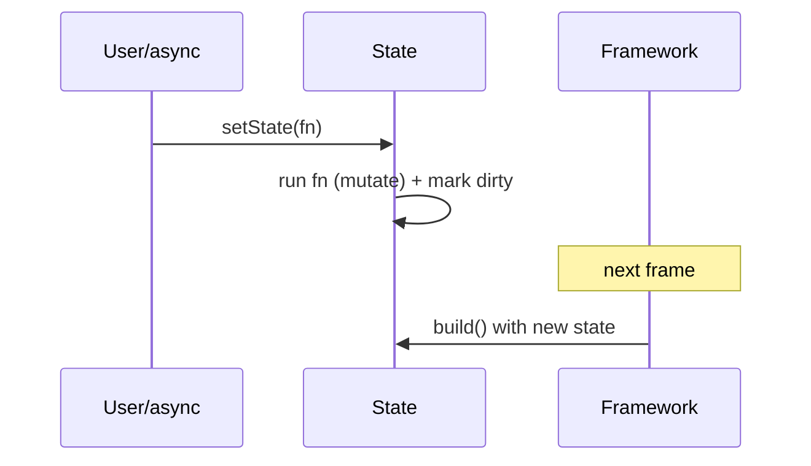

# `setState` Mechanics & Pitfalls

> `setState(fn)` runs `fn` synchronously to mutate state, then marks the element dirty so the framework rebuilds it on the next frame — it does **not** rebuild immediately, and calling it after `dispose` throws.

## Introduction

`setState` is the primitive that turns state changes into rebuilds. Understanding *exactly* what it does (and doesn't) prevents the classic bugs: async misuse, post-dispose calls, heavy work inside it, and over-broad rebuilds.

## Why this concept exists

In the declarative model (`UI = f(state)` — [06 · declarative_ui](../06%20Flutter%20Fundamentals/03_declarative_ui.md)), the framework needs to know *which* elements changed so it can rebuild them efficiently. `setState` is how you signal "my state changed, schedule a rebuild of this element's subtree."

## Real-world analogy

`setState` is **flipping a "needs cleaning" flag on a hotel room**: you update the room's status (mutate state) and raise the flag (mark dirty). Housekeeping (the framework) doesn't come *instantly* — it processes flagged rooms on its next round (next frame).

## Problem Statement

You increment a counter, fetch data async then update UI, and wonder why a late callback crashes with "setState() called after dispose()". You'll learn `setState`'s exact behavior and safe async usage.

## Internal Working

```mermaid
flowchart TD
    Call["setState(fn)"] --> Run[run fn synchronously - mutate state]
    Run --> Dirty[markNeedsBuild - element marked dirty]
    Dirty --> Frame[next frame: framework rebuilds dirty elements]
    Frame --> Build[build() runs with new state]
```

- `setState(fn)`:
  1. Runs `fn` **synchronously** (do your state mutation here).
  2. Marks this element **dirty** (`markNeedsBuild`).
  3. The framework rebuilds it during the **next frame** — not immediately.
- Rebuild scope = **this element's subtree** (the whole `State`'s `build`), reconciled against the old tree.
- `setState` **asserts `mounted`**: calling after `dispose` throws.
- The `fn` should be **synchronous and cheap** — just the mutation. Do async/heavy work *before* calling `setState`.

## Memory Representation

No allocation of note; it flips a dirty flag. Rebuilds recreate throwaway widgets (GC'd) while elements persist ([Module 06](../06%20Flutter%20Fundamentals/04_widgets_elements_render_objects.md)).

## Compiler Behavior

Not applicable.

## Runtime Behavior

Multiple `setState` calls in one synchronous stretch coalesce into a single rebuild next frame. `setState` outside `build`? fine (handlers/callbacks). Inside `build`? causes an error/rebuild loop.

## Flutter Engine Behavior

Marking dirty schedules a frame; the engine drives the build→layout→paint pipeline ([Module 09](../09%20Rendering%20Pipeline/README.md)).

## Dart VM Behavior

Not applicable directly; async callbacks run on the event loop ([02 · event_loop](../02%20Advanced%20Dart/01_event_loop.md)).

## Examples

```dart
import 'package:flutter/material.dart';

class Counter extends StatefulWidget {
  const Counter({super.key});
  @override
  State<Counter> createState() => _CounterState();
}

class _CounterState extends State<Counter> {
  int _count = 0;
  bool _loading = false;
  String _data = '';

  void _increment() {
    setState(() => _count++); // sync mutation -> rebuild next frame
  }

  Future<void> _load() async {
    setState(() => _loading = true);       // show spinner
    final result = await _fetch();         // async work OUTSIDE setState
    if (!mounted) return;                  // guard: widget may be disposed
    setState(() {                          // apply result
      _data = result;
      _loading = false;
    });
  }

  Future<String> _fetch() async {
    await Future.delayed(const Duration(milliseconds: 300));
    return 'loaded';
  }

  @override
  Widget build(BuildContext context) {
    return Column(
      mainAxisSize: MainAxisSize.min,
      children: [
        Text('Count: $_count'),
        if (_loading) const CircularProgressIndicator() else Text(_data),
        ElevatedButton(onPressed: _increment, child: const Text('+')),
        ElevatedButton(onPressed: _load, child: const Text('Load')),
      ],
    );
  }
}
```

## Diagrams



## Common Mistakes

| Mistake | Why | Fix |
|---------|-----|-----|
| `await` **inside** the `setState` callback | Callback must be sync | Await first, then `setState` with the result |
| `setState` after `dispose` (late async) | Asserts `mounted` → throws | Guard `if (!mounted) return;` |
| Heavy work inside `setState` | Runs synchronously, blocks | Do work before; only mutate in the callback |
| `setState` in `build` | Rebuild loop | Trigger from handlers/effects |
| Empty `setState(() {})` after mutating a field elsewhere | Works but obscures intent | Mutate inside the callback |
| Over-broad `setState` on a huge widget | Rebuilds too much | Split widgets / push state down ([Module 11](../11%20State%20Management/README.md)) |

## Best Practices

- Keep the `setState` callback **synchronous and minimal** — just the mutation.
- Do **async/heavy work outside**, then guard with `mounted` before `setState`.
- Never call `setState` in `build`; call it from event handlers/callbacks.
- **Scope rebuilds**: split large widgets so `setState` rebuilds the smallest subtree.
- For shared/complex state, prefer a state-management solution over raw `setState` ([Module 11](../11%20State%20Management/README.md)).

## Performance

Rebuild scope = the calling `State`'s subtree; keep it small. Coalesced `setState`s = one rebuild. Cheap `build` + `const` keep frequent rebuilds affordable ([Module 21](../21%20Performance/README.md)).

## Advantages / Disadvantages

- **+** Simple, built-in, precise per-widget rebuild trigger.
- **−** Manual; easy to misuse (async/dispose); rebuilds the whole `State` subtree; doesn't scale to shared state.

## Interview Questions

1. **🟢 What does `setState` do?** — Runs the callback synchronously to mutate state, marks the element dirty, and the framework rebuilds it next frame (not immediately).
2. **🟢 Does `setState` rebuild immediately?** — No; it schedules a rebuild for the next frame.
3. **🟡 Why is `setState` after `dispose` an error?** — It asserts `mounted`; the element is gone, so there's nothing to rebuild — guard with `mounted`.
4. **🟡 Why shouldn't the `setState` callback be async?** — It must complete synchronously; do `await` before and call `setState` with the result.
5. **🟡 What is the rebuild scope of `setState`?** — The calling `State`'s subtree (its `build`), reconciled against the previous tree.
6. **🔴 What happens with multiple `setState` calls in one synchronous block?** — They coalesce into a single rebuild on the next frame.
7. **🔴 When should you stop using `setState`?** — When state is shared across widgets or logic is complex — move to a state manager ([Module 11](../11%20State%20Management/README.md)).

## Senior Engineer Tips

- The async pattern is fixed: `setState(loading=true)` → `await` → `if(!mounted) return;` → `setState(apply result)`.
- If `setState` rebuilds too much, that's a signal to split the widget or lift state, not to optimize `build`.
- Prefer `ValueListenableBuilder`/state management to rebuild only the tiny reactive part.

## Architect Perspective

`setState` is fine for **local, ephemeral UI state**; beyond that, its whole-subtree rebuild and manual nature don't scale. Recognizing that boundary — local `setState` vs managed shared state — is the key architectural decision leading into [Module 11 State Management](../11%20State%20Management/README.md).

## Summary

- `setState` mutates synchronously, marks dirty, rebuilds next frame (this subtree).
- Keep the callback sync/minimal; do async outside + guard `mounted`; never in `build`.
- Scope rebuilds; graduate to state management for shared/complex state.

## Revision Notes

- `setState(fn)`: run fn sync (mutate) → mark dirty → rebuild next frame (this subtree).
- Async: await first → `if(!mounted) return;` → setState. Never async callback, never in `build`.
- Multiple calls coalesce; scope rebuilds by splitting widgets.
- Local UI state only → else Module 11.

## Practice Questions

1. Why does the UI update "next frame" not instantly?
2. Fix a "setState after dispose" from a delayed callback.
3. Why can't the `setState` callback be `async`?

## Coding Questions

1. Implement an async load with spinner using the safe `setState` pattern.
2. Show two coalesced `setState` calls producing one rebuild (log builds).
3. Refactor an over-broad `setState` by splitting into a smaller stateful subwidget.

## Mini Project

**Safe async loader (Flutter):** Build a widget that loads data with a spinner using the `setState(loading)`→`await`→`mounted`-guard→`setState(result)` pattern, plus an error path. Split the reactive part into a small subwidget to scope rebuilds. Acceptance: no post-dispose crash; sync callbacks; scoped rebuild; app runs.
