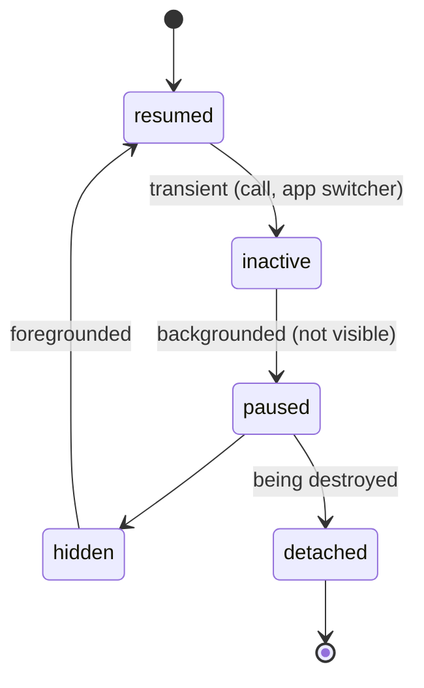
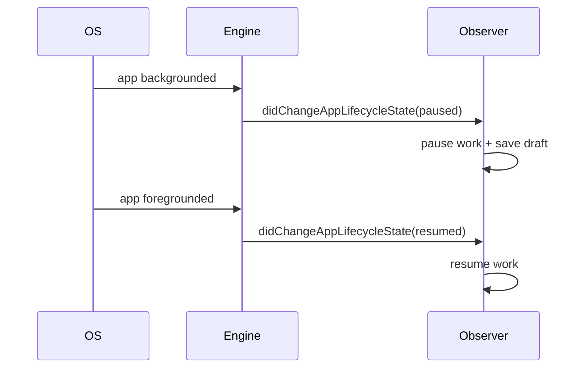

# App Lifecycle (`AppLifecycleState`, `WidgetsBindingObserver`)

> Beyond individual widgets, the whole app moves between **resumed, inactive, paused, hidden, and detached** states; observe them with `WidgetsBindingObserver` to pause/resume work when the app goes to the background or foreground.

## Introduction

Widget lifecycle handles a widget's tenure; **app lifecycle** handles the process moving in/out of the foreground. You observe it via `WidgetsBindingObserver.didChangeAppLifecycleState(AppLifecycleState)` (or `AppLifecycleListener`). This is where you pause animations/timers, stop the camera, save drafts, or resume streams.

## Why this concept exists

When the user backgrounds the app (call, home button, app switcher), continuing to run animations, GPS, camera, or network polling wastes battery and may be killed by the OS. The app lifecycle lets you react — pausing on background, resuming on foreground, and persisting state before possible termination.

## Real-world analogy

A **shop's open/closed status**: when open (`resumed`) staff serve customers; when the shutters come down (`paused`), you stop the coffee machine, lock the till (save state), and turn off lights (release resources) — then reverse it when reopening.

## Problem Statement

Your app runs a location stream and an animation. When backgrounded, both should pause (battery); on return, resume; and if the OS may kill the app, persist a draft. You'll observe `AppLifecycleState`.

## Internal Working



| State | Meaning | Typical action |
|-------|---------|----------------|
| `resumed` | Visible + interactive (foreground) | Resume streams/animations |
| `inactive` | Transient, not receiving input (e.g., incoming call, app switcher) | Light pause |
| `paused` | Backgrounded, not visible | Pause timers/GPS/camera; save state |
| `hidden` | Hidden (newer unified state across platforms) | Similar to paused |
| `detached` | Engine running, no view; app being destroyed | Final cleanup |

- Implement `WidgetsBindingObserver`, register with `WidgetsBinding.instance.addObserver(this)` in `initState`, remove in `dispose`, and override `didChangeAppLifecycleState`.
- Modern alternative: `AppLifecycleListener` (Flutter 3.13+) with granular callbacks (`onResume`, `onPause`, `onDetach`, etc.).

## Memory Representation

The observer is held by the binding until removed — **remove it in `dispose`** or it leaks (same principle as [dispose_and_leaks.md](dispose_and_leaks.md)).

## Compiler Behavior

Not applicable.

## Runtime Behavior

The framework invokes `didChangeAppLifecycleState` on transitions. `detached`/kill may not always give you time — persist important state on `paused`.

## Flutter Engine Behavior

The embedder reports platform lifecycle events to the engine, surfaced as `AppLifecycleState` ([06 · architecture_overview](../06%20Flutter%20Fundamentals/architecture_overview.md)).

## Dart VM Behavior

Not applicable.

## Examples

```dart
import 'package:flutter/material.dart';

class LifecycleAware extends StatefulWidget {
  const LifecycleAware({super.key});
  @override
  State<LifecycleAware> createState() => _LifecycleAwareState();
}

class _LifecycleAwareState extends State<LifecycleAware>
    with WidgetsBindingObserver {
  String _status = 'resumed';

  @override
  void initState() {
    super.initState();
    WidgetsBinding.instance.addObserver(this); // register
  }

  @override
  void didChangeAppLifecycleState(AppLifecycleState state) {
    setState(() => _status = state.name);
    switch (state) {
      case AppLifecycleState.resumed:
        _resumeWork();   // resume streams/animations
      case AppLifecycleState.inactive:
        break;           // transient
      case AppLifecycleState.paused:
      case AppLifecycleState.hidden:
        _pauseWork();    // pause timers/GPS/camera
        _saveDraft();    // persist in case of termination
      case AppLifecycleState.detached:
        _finalCleanup();
    }
  }

  void _resumeWork() {}
  void _pauseWork() {}
  void _saveDraft() {}
  void _finalCleanup() {}

  @override
  void dispose() {
    WidgetsBinding.instance.removeObserver(this); // MUST remove
    super.dispose();
  }

  @override
  Widget build(BuildContext context) => Text('App: $_status');
}
```

```dart
// Modern alternative (Flutter 3.13+):
// final listener = AppLifecycleListener(
//   onResume: _resumeWork, onPause: _pauseWork, onDetach: _finalCleanup,
// );
// ... listener.dispose() when done.
```

## Diagrams



## Common Mistakes

| Mistake | Why | Fix |
|---------|-----|-----|
| Not removing the observer in `dispose` | Leak | `removeObserver(this)` |
| Relying on `detached` for critical saves | May not run/finish | Persist on `paused` |
| Keeping GPS/camera/animations running when paused | Battery drain, OS kill | Pause on `paused`/`hidden` |
| Doing heavy work synchronously in the callback | Jank on transition | Keep it light; offload |
| Ignoring `inactive` vs `paused` distinction | Wrong reaction timing | Treat `inactive` as transient |

## Best Practices

- Register in `initState`, **remove in `dispose`**.
- **Pause** battery-heavy work (GPS/camera/animations/polling) on `paused`/`hidden`; **resume** on `resumed`.
- **Persist important state on `paused`** (don't rely on `detached`).
- Keep the callback light; offload heavy save/cleanup.
- Consider `AppLifecycleListener` for granular, modern handling.

## Performance / Battery

Pausing background work saves battery and avoids OS termination for misbehavior; resuming promptly keeps UX smooth ([Module 21](../21%20Performance/README.md), [Module 33](../33%20Background%20Services/README.md)).

## Advantages / Disadvantages

- **+** React to foreground/background; save battery; persist before termination; resume cleanly.
- **−** Observer lifecycle to manage (leak risk); `detached` timing not guaranteed; platform nuances.

## Interview Questions

1. **🟢 What are the `AppLifecycleState` values?** — `resumed`, `inactive`, `paused`, `hidden`, `detached`.
2. **🟢 How do you observe app lifecycle?** — Implement `WidgetsBindingObserver`, `addObserver` in `initState`, `removeObserver` in `dispose`, override `didChangeAppLifecycleState` (or use `AppLifecycleListener`).
3. **🟡 What should you do on `paused`?** — Pause battery-heavy work (GPS/camera/animations) and persist important state.
4. **🟡 `inactive` vs `paused`?** — `inactive` is a transient state (e.g., app switcher/incoming call) still partly visible; `paused` is fully backgrounded/not visible.
5. **🟡 Why not rely on `detached` for saving?** — It runs during teardown and may not complete; save on `paused` instead.
6. **🔴 Why must you remove the observer in `dispose`?** — The binding retains it; not removing leaks the `State` (same reachability issue as subscriptions).
7. **🔴 How would you pause a location stream app-wide on background?** — In `didChangeAppLifecycleState`, on `paused`/`hidden` pause the location service; resume on `resumed`.

## Senior Engineer Tips

- Treat `paused` as "save now" — persistence you rely on must happen here, not `detached`.
- Centralize app-lifecycle handling (one observer / an `AppLifecycleListener` in a service) rather than scattering it across widgets.
- Combine with background execution ([Module 33](../33%20Background%20Services/README.md)) when work must continue while backgrounded.

## Architect Perspective

App-lifecycle handling is a cross-cutting concern (battery, data integrity, resource release). Centralizing it in a lifecycle service that coordinates streams, sensors, and persistence — rather than ad-hoc per widget — yields consistent, battery-friendly, crash-resilient behavior, and integrates with background services and offline-first strategies ([Modules 33, 19](../33%20Background%20Services/README.md)).

## Summary

- App lifecycle: `resumed`/`inactive`/`paused`/`hidden`/`detached`; observe via `WidgetsBindingObserver`/`AppLifecycleListener`.
- Pause heavy work and persist state on `paused`; resume on `resumed`; final cleanup on `detached` (don't rely on it for saves).
- Register in `initState`, remove observer in `dispose` (leak risk).

## Revision Notes

- States: resumed/inactive/paused/hidden/detached.
- Observe: `WidgetsBindingObserver` + `add/removeObserver` (init/dispose) + `didChangeAppLifecycleState`; or `AppLifecycleListener`.
- `paused` → pause GPS/camera/anim + SAVE state (not `detached`).
- Remove observer in `dispose` (leak); centralize handling.

## Practice Questions

1. Where do you persist a draft to survive app kill, and why?
2. Why remove the observer in `dispose`?
3. `inactive` vs `paused` — how do you react differently?

## Coding Questions

1. Pause/resume an animation on app background/foreground.
2. Save a text draft on `paused` and restore on `resumed`.
3. Reimplement using `AppLifecycleListener` with granular callbacks.

## Mini Project

**Battery-aware tracker (Flutter):** Build a widget that runs a (fake) location stream + animation, pauses both on `paused`/`hidden`, saves state, and resumes on `resumed`, using `WidgetsBindingObserver` with proper observer removal. Acceptance: work pauses/resumes correctly; state persisted on `paused`; observer removed; app runs.
