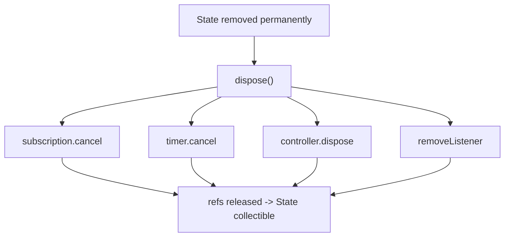
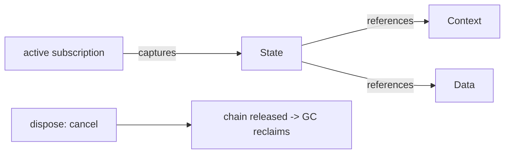

# `dispose` & Leak Prevention

> `dispose()` is your one guaranteed chance to release resources — cancel subscriptions/timers and dispose controllers there, or they (and everything they capture) leak.

## Introduction

`dispose()` runs once when a `State` is permanently removed from the tree. It's where you undo everything acquired in `initState`/`didChangeDependencies`/`didUpdateWidget`: stream subscriptions, timers, `AnimationController`s, `TextEditingController`s, `FocusNode`s, `ScrollController`s, and listeners. Missing cleanup is the #1 Flutter memory-leak source.

## Why this concept exists

Flutter is GC-managed, but GC only reclaims **unreachable** objects ([02 · memory_and_gc](../02%20Advanced%20Dart/memory_and_gc.md)). An active subscription/timer/listener keeps a reference to your callback — which captures `this` (the `State`) — so the whole widget subtree stays reachable and can't be collected. `dispose` breaks those references.

## Real-world analogy

Moving out of an apartment: `dispose` is **returning the keys, cancelling utilities, and forwarding mail**. If you skip it, the utility company keeps billing (timer fires), the old address keeps receiving mail (callbacks), and you're still "reachable" — you never truly leave (leak).

## Problem Statement

Your screen's memory climbs each time it's opened/closed. It has a stream subscription, a periodic timer, and an `AnimationController`. You'll release all three in `dispose` and verify the leak is gone.

## Internal Working



- `dispose()` runs once, after `deactivate`, when the `State` won't be reused.
- Release everything with an owner in this `State`:
  - `StreamSubscription.cancel()`
  - `Timer.cancel()`
  - `AnimationController.dispose()`, `TextEditingController.dispose()`, `ScrollController.dispose()`, `FocusNode.dispose()`
  - `listenable.removeListener(...)`
- Call `super.dispose()` **last**.
- After `dispose`, `mounted` is false → never `setState`.

## Memory Representation

Active subscriptions/timers/listeners are GC roots-by-reachability: they retain the `State` and its captured objects (including `BuildContext`, big data) until released ([02 · memory_and_gc](../02%20Advanced%20Dart/memory_and_gc.md)).

## Compiler Behavior

Analyzer lints (e.g., `close_sinks`, package `leak_tracker` in tests) help catch some cases; not comprehensive.

## Runtime Behavior

A fired timer/stream callback after removal that touches state throws (or leaks); cancel them in `dispose` to prevent both.

## Flutter Engine Behavior / Dart VM Behavior

Not applicable directly; leaked objects increase heap pressure and GC work over time.

## Examples

```dart
import 'dart:async';
import 'package:flutter/material.dart';

class LiveScreen extends StatefulWidget {
  final Stream<int> ticks;
  const LiveScreen({super.key, required this.ticks});
  @override
  State<LiveScreen> createState() => _LiveScreenState();
}

class _LiveScreenState extends State<LiveScreen>
    with SingleTickerProviderStateMixin {
  StreamSubscription<int>? _sub;
  Timer? _timer;
  late final AnimationController _anim;
  final _scroll = ScrollController();
  int _value = 0;

  @override
  void initState() {
    super.initState();
    _anim = AnimationController(vsync: this, duration: const Duration(seconds: 1));
    _sub = widget.ticks.listen((v) {
      if (mounted) setState(() => _value = v);
    });
    _timer = Timer.periodic(const Duration(seconds: 1), (_) {/* ... */});
  }

  @override
  void dispose() {
    _sub?.cancel();      // 1. cancel stream subscription
    _timer?.cancel();    // 2. cancel timer
    _anim.dispose();     // 3. dispose animation controller
    _scroll.dispose();   // 4. dispose scroll controller
    super.dispose();     // last
  }

  @override
  Widget build(BuildContext context) =>
      ListView(controller: _scroll, children: [Text('$_value')]);
}
```

## Diagrams



## Common Mistakes

| Mistake | Why leaks | Fix |
|---------|-----------|-----|
| Not cancelling `StreamSubscription` | Stream retains callback → `State` | `cancel()` in `dispose` |
| Not disposing controllers | Framework/ticker retains them | `dispose()` each |
| Not cancelling `Timer.periodic` | Scheduler holds callback | `cancel()` |
| `addListener` without `removeListener` | Listenable retains listener | `removeListener` in `dispose` |
| `super.dispose()` first | Frees framework state too early | Call it **last** |
| Storing `BuildContext`/large data in long-lived objects | Retained via the object | Don't; release owners |

## Best Practices

- **Every acquire has a release**: create in `initState`, free in `dispose`, in reverse-ish order; `super.dispose()` last.
- Cancel subscriptions/timers; dispose all controllers/focus nodes; remove listeners.
- Guard async callbacks with `mounted` so a not-yet-cancelled callback can't `setState` post-dispose.
- Consider a **mixin/base** that tracks and disposes resources uniformly.
- Verify with **DevTools memory** (open/close cycles) and `leak_tracker` in tests.

## Performance

Leaks cause gradual memory growth → more GC → eventual jank/OOM on low-end devices ([Module 21](../21%20Performance/README.md)). Proper disposal keeps memory flat across navigation.

## Advantages / Disadvantages

- **+** Deterministic cleanup point; prevents leaks and post-dispose callbacks.
- **−** Manual and easy to forget; must mirror every acquisition.

## Interview Questions

1. **🟢 What is `dispose` for?** — Releasing resources when a `State` is permanently removed: cancel subscriptions/timers, dispose controllers, remove listeners.
2. **🟢 Name three things you must dispose/cancel.** — `StreamSubscription` (cancel), `Timer` (cancel), controllers like `AnimationController`/`TextEditingController` (dispose).
3. **🟡 Why does an uncancelled subscription leak the whole screen?** — The stream holds the callback, which captures `this` (the `State`), keeping the widget/state graph reachable.
4. **🟡 Where should `super.dispose()` go?** — Last, after your own cleanup.
5. **🟡 How do you prevent post-dispose `setState`?** — Guard with `if (!mounted) return;` in async callbacks and cancel their sources in `dispose`.
6. **🔴 How do you detect a leak?** — DevTools memory: heap snapshots across open/close cycles, look for growing instances, inspect the retaining path; `leak_tracker` in tests.
7. **🔴 How would you standardize cleanup across many widgets?** — A mixin/base class that registers subscriptions/controllers and disposes them all in one `dispose`.

## Senior Engineer Tips

- Adopt a rule enforced in review: "if you `listen`/create a controller/start a timer, cancel/dispose it in `dispose`."
- Build a `DisposeBag`/`AutoDisposeMixin` to register-and-release resources uniformly.
- Prefer state management (`Bloc`/Riverpod auto-dispose) which handles much of this for you ([Module 11](../11%20State%20Management/README.md)).

## Architect Perspective

Disposal discipline is a system-wide reliability concern; leaks are a leading cause of gradual slowdowns and crashes at scale. Standardizing lifecycle-resource management (mixins, lints, leak tests in CI) and leaning on auto-disposing state solutions is an architectural decision that keeps long-running apps healthy ([02 · memory_and_gc](../02%20Advanced%20Dart/memory_and_gc.md), [Module 49](../49%20Testing/README.md)).

## Summary

- `dispose` is the one guaranteed cleanup hook: cancel subscriptions/timers, dispose controllers, remove listeners; `super.dispose()` last.
- Uncancelled resources retain the `State` (and its captures) → leaks.
- Guard async with `mounted`; standardize with mixins; verify with DevTools/leak_tracker.

## Revision Notes

- Release in `dispose`: subscription.cancel, timer.cancel, controller.dispose, removeListener; `super.dispose()` last.
- Leak cause: active ref captures `this` → State not collectible.
- Guard async with `mounted`; DisposeBag/mixin to standardize.
- Detect: DevTools retaining path / `leak_tracker`.

## Practice Questions

1. Why does a forgotten `Timer.periodic` keep a screen alive?
2. Why call `super.dispose()` last?
3. How do you confirm a leak is fixed?

## Coding Questions

1. Write an `AutoDisposeMixin` that tracks subscriptions/controllers and disposes all.
2. Reproduce a leak (uncancelled subscription) then fix it; verify in DevTools.
3. Add `mounted` guards to prevent post-dispose `setState`.

## Mini Project

**Leak-safe live screen (Flutter):** Build a screen with a stream subscription, a periodic timer, an `AnimationController`, and a `ScrollController`; dispose all correctly and guard async. Add a `DisposeBag` mixin and refactor to use it. Verify (notes) via DevTools that memory is flat across open/close. Acceptance: all resources released; `super.dispose()` last; no post-dispose calls; app runs.
