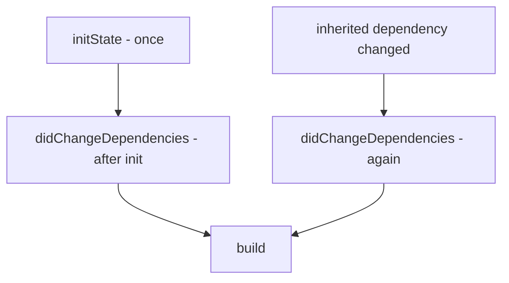
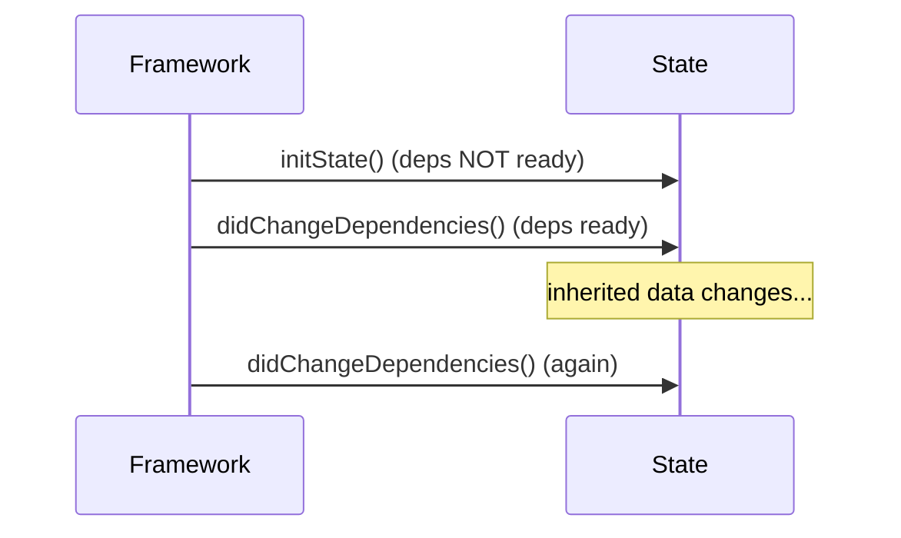

# `initState` vs `didChangeDependencies`

> Use `initState` for one-time setup that doesn't need inherited data; use `didChangeDependencies` for setup that reads `InheritedWidget`s (theme, provider, media query) — because those dependencies aren't ready in `initState`.

## Introduction

Both run early, but they differ in *when* and *why*. `initState` is a single one-time hook; `didChangeDependencies` runs right after `initState` **and again** whenever an inherited dependency changes. Picking correctly avoids "dependencies not ready" bugs and stale data.

## Why this concept exists

`InheritedWidget` dependencies (registered via `context.dependOn...`) aren't wired up when `initState` runs, so lookups there are unsafe/incomplete. `didChangeDependencies` exists as the safe place to read them — and to *re-read* when they change.

## Real-world analogy

`initState` is **unpacking your own boxes** when you move in (things you brought). `didChangeDependencies` is **checking the building's shared utilities** (water pressure, electricity) — which you can only do once you're connected, and must recheck if the utility company changes something.

## Problem Statement

You need to (a) create an `AnimationController` once, and (b) load data that depends on a `Locale`/`Provider` value, re-loading if that value changes. You'll put (a) in `initState` and (b) in `didChangeDependencies`.

## Internal Working



- **`initState`**: called **once**, before dependencies are available. Safe: create controllers/timers, subscribe to non-context streams, init fields. Unsafe: `dependOnInheritedWidgetOfExactType` (theme/provider) that registers a dependency.
- **`didChangeDependencies`**: called **immediately after `initState`**, and **again** whenever an inherited widget this `State` depends on changes. Safe place for `Theme.of`, `MediaQuery.of`, `Provider.of(listen:true)`, `Localizations.of`, and reacting to their changes.
- `context` is usable in both, but *inherited-dependency* lookups belong in `didChangeDependencies`.

## Memory Representation

Resources created here live in the `State` until `dispose` ([dispose_and_leaks.md](dispose_and_leaks.md)).

## Compiler Behavior

Not applicable.

## Runtime Behavior

`didChangeDependencies` can run multiple times; make it **idempotent** (don't leak by re-subscribing without cleaning up the previous subscription).

## Flutter Engine Behavior / Dart VM Behavior

Not applicable.

## Examples

```dart
import 'package:flutter/material.dart';

class LocalizedGreeting extends StatefulWidget {
  const LocalizedGreeting({super.key});
  @override
  State<LocalizedGreeting> createState() => _LocalizedGreetingState();
}

class _LocalizedGreetingState extends State<LocalizedGreeting>
    with SingleTickerProviderStateMixin {
  late final AnimationController _controller; // needs `this` (a TickerProvider)
  Locale? _locale;
  String _greeting = '';

  @override
  void initState() {
    super.initState();
    // one-time setup that does NOT need inherited data:
    _controller = AnimationController(vsync: this, duration: const Duration(seconds: 1))
      ..forward();
  }

  @override
  void didChangeDependencies() {
    super.didChangeDependencies();
    // reads inherited data; re-runs if the Locale changes:
    final newLocale = Localizations.localeOf(context);
    if (newLocale != _locale) {
      _locale = newLocale;
      _greeting = _greetingFor(newLocale); // reload based on dependency
    }
  }

  String _greetingFor(Locale l) => l.languageCode == 'fr' ? 'Bonjour' : 'Hello';

  @override
  void dispose() {
    _controller.dispose(); // release
    super.dispose();
  }

  @override
  Widget build(BuildContext context) => Text(_greeting);
}
```

## Diagrams



## Common Mistakes

| Mistake | Why | Fix |
|---------|-----|-----|
| `Theme.of(context)`/`Provider.of` (listen) in `initState` | Dependencies not registered yet | Move to `didChangeDependencies` |
| Assuming `didChangeDependencies` runs once | It re-runs on dependency change | Make it idempotent (diff before acting) |
| Re-subscribing without cleanup in `didChangeDependencies` | Leaks/duplicate subscriptions | Cancel old before creating new |
| Heavy unconditional work each call | Re-runs waste work | Guard with a change check |

## Best Practices

- One-time, context-free setup → `initState`.
- Inherited-data reads and reactions → `didChangeDependencies`, made **idempotent** (compare old vs new before re-doing work).
- If you re-subscribe on dependency change, cancel the previous subscription first.
- Use `initState` for `AnimationController` (needs `vsync: this`), fields, and non-context subscriptions.

## Performance

`didChangeDependencies` may run several times; guard expensive work behind a change check to avoid redundant reloads ([Module 21](../21%20Performance/README.md)).

## Advantages / Disadvantages

- **+** Clear separation: own setup vs inherited-data setup; supports reacting to dependency changes.
- **−** Subtle timing rules; idempotency required; easy to misuse `initState` for context lookups.

## Interview Questions

1. **🟢 Difference between `initState` and `didChangeDependencies`?** — `initState` runs once before dependencies are ready (own setup); `didChangeDependencies` runs after it and again on inherited-dependency changes (context-dependent setup).
2. **🟢 Why can't you call `Theme.of(context)` (as a dependency) in `initState`?** — The inherited-widget dependencies aren't registered yet; use `didChangeDependencies`.
3. **🟡 Why must `didChangeDependencies` be idempotent?** — It can run multiple times; unconditional work leaks/duplicates. Diff before acting.
4. **🟡 Where do you create an `AnimationController` and why?** — In `initState` (with `vsync: this`); it's one-time, context-free setup.
5. **🟡 How do you react to a changed inherited value (e.g., Locale)?** — In `didChangeDependencies`, compare new vs stored and reload if different.
6. **🔴 What triggers a re-run of `didChangeDependencies`?** — A change in an `InheritedWidget` this `State` depends on (e.g., theme/locale/provider it read with `listen:true`).
7. **🔴 If you subscribe to a provider stream, where and how to avoid duplicates?** — Subscribe in `didChangeDependencies`, cancelling any previous subscription first; cancel finally in `dispose`.

## Senior Engineer Tips

- Rule of thumb: "needs `context` inherited data? → `didChangeDependencies`. Otherwise → `initState`."
- Guard `didChangeDependencies` work with a stored-previous-value comparison to avoid redundant reloads.
- Prefer state management ([Module 11](../11%20State%20Management/README.md)) for data loading; these hooks are for wiring, not business logic.

## Architect Perspective

Correctly separating own-setup from dependency-driven setup keeps widgets robust to theme/locale/provider changes and avoids leaks — important for reactive, localized, themable apps. Standardizing idempotent dependency handling (or pushing it to state management) reduces subtle lifecycle bugs across a large codebase.

## Summary

- `initState`: one-time, context-free setup (controllers, fields, non-context subscriptions).
- `didChangeDependencies`: read/react to inherited data; runs again on changes — keep it idempotent.
- Cancel-before-resubscribe; dispose everything in `dispose`.

## Revision Notes

- `initState` once, deps NOT ready → own setup (`AnimationController`, fields).
- `didChangeDependencies` after init + on inherited change → `Theme/Provider/Locale`; idempotent.
- Re-subscribe? cancel previous first. Dispose in `dispose`.

## Practice Questions

1. Why does `didChangeDependencies` exist separately from `initState`?
2. What makes `didChangeDependencies` need to be idempotent?
3. Where to create an `AnimationController` and why?

## Coding Questions

1. Load data based on a `Provider` value and reload when it changes (idempotent).
2. Create an `AnimationController` in `initState` and dispose it.
3. Log both methods to observe when each fires as a dependency changes.

## Mini Project

**Locale-aware panel (Flutter):** Build a widget that creates a controller in `initState` and loads a locale-dependent message in `didChangeDependencies`, reloading only when the locale actually changes, with proper disposal. Acceptance: correct method placement; idempotent reload; no leaks; app runs.
