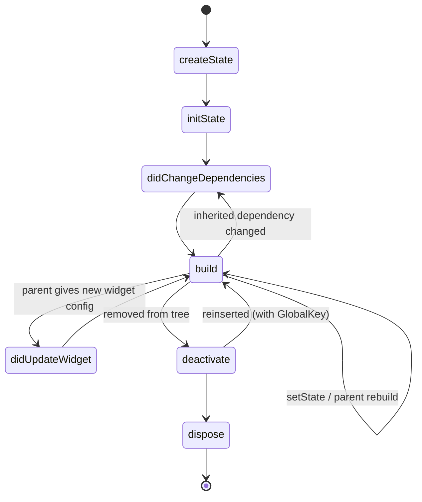
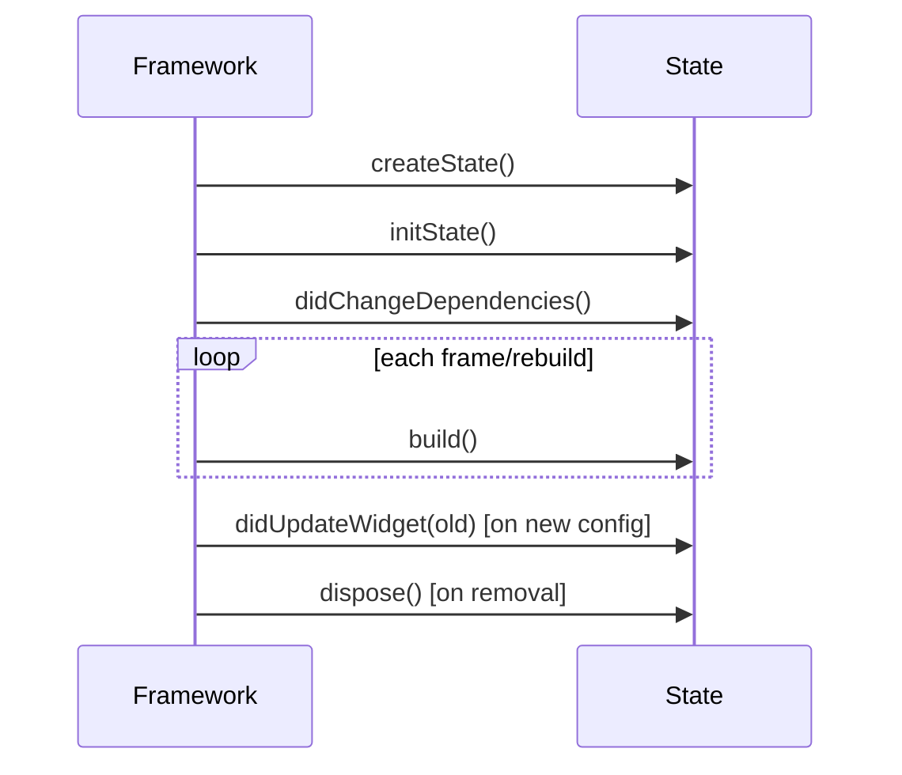

# The `State` Lifecycle (Overview)

> A `State` object is created once, initialized (`initState`), built many times (`build`), updated on config/dependency changes (`didUpdateWidget`/`didChangeDependencies`), and finally torn down (`deactivate`→`dispose`). Each method has a specific job.

## Introduction

This file lays out the full lifecycle sequence and what each callback is for, so the detailed files (init, update, dispose) have a map. The `State` object persists in the Element tree across rebuilds while the `StatefulWidget` config is recreated ([Module 06](../06%20Flutter%20Fundamentals/widgets_elements_render_objects.md)).

## Why this concept exists

Flutter needs defined hook points so you can initialize resources, react to changes, and release resources at the right moments. This is a **Template Method** pattern ([05 · template_method](../05%20Design%20Patterns/template_method.md)): the framework calls fixed lifecycle steps in order; you override the ones you need.

## Real-world analogy

An **employee's tenure**: hired (`createState`), onboarded once (`initState`), does daily work repeatedly (`build`), adapts when their manager/role changes (`didUpdateWidget`/`didChangeDependencies`), and off-boarded with equipment returned (`dispose`). Skipping off-boarding (not disposing) = keycards still active = a leak.

## Problem Statement

Where do you start a timer, read an inherited theme, react to a changed `userId` prop, and cancel a subscription? By the end you'll place each in the correct lifecycle method.

## Internal Working



| Method | Called | Use for |
|--------|--------|---------|
| `createState()` | Once, when the element is created | Return the `State` instance |
| `initState()` | Once, after `createState` | One-time init: controllers, subscriptions (no `context` inherited lookups needing dependencies) |
| `didChangeDependencies()` | After `initState`, and when an inherited dependency changes | React to `InheritedWidget` data (theme, provider) |
| `build()` | Every rebuild | Return the UI (pure) |
| `didUpdateWidget(old)` | When the parent rebuilds this widget with a new config | React to changed widget properties |
| `setState()` | You call it | Mark dirty → schedule rebuild |
| `deactivate()` | When removed from the tree (may be reinserted) | Rare; temporary removal |
| `dispose()` | Once, when permanently removed | Release: cancel subscriptions/timers, dispose controllers |
| `mounted` | property | True between `initState` and `dispose`; guard async |

## Memory Representation

The `State` lives with its Element (persistent across rebuilds); it holds your controllers/subscriptions until `dispose` ([02 · memory_and_gc](../02%20Advanced%20Dart/memory_and_gc.md)).

## Compiler Behavior

Not applicable.

## Runtime Behavior

The framework invokes these in order; `build` runs frequently, init/dispose exactly once. Calling `setState` after `dispose` throws.

## Flutter Engine Behavior

Lifecycle drives the build phase feeding the render pipeline ([Module 09](../09%20Rendering%20Pipeline/README.md)).

## Dart VM Behavior

Not applicable.

## Examples

```dart
import 'dart:async';
import 'package:flutter/material.dart';

class Ticker extends StatefulWidget {
  final int intervalSeconds;
  const Ticker({super.key, required this.intervalSeconds});
  @override
  State<Ticker> createState() => _TickerState();
}

class _TickerState extends State<Ticker> {
  int _ticks = 0;
  Timer? _timer;

  @override
  void initState() {
    super.initState();
    _start(); // one-time init
  }

  @override
  void didChangeDependencies() {
    super.didChangeDependencies();
    // react to inherited data if needed (e.g., Theme/Localizations/Provider)
  }

  @override
  void didUpdateWidget(covariant Ticker oldWidget) {
    super.didUpdateWidget(oldWidget);
    if (oldWidget.intervalSeconds != widget.intervalSeconds) {
      _timer?.cancel();
      _start(); // react to changed config
    }
  }

  void _start() {
    _timer = Timer.periodic(Duration(seconds: widget.intervalSeconds), (_) {
      if (mounted) setState(() => _ticks++); // guard + rebuild
    });
  }

  @override
  void dispose() {
    _timer?.cancel(); // ALWAYS clean up
    super.dispose();
  }

  @override
  Widget build(BuildContext context) => Text('Ticks: $_ticks');
}
```

## Diagrams



## Common Mistakes

| Mistake | Why | Fix |
|---------|-----|-----|
| Inherited lookups needing dependencies in `initState` | Dependencies not ready | Use `didChangeDependencies` |
| Forgetting `super.initState()`/`super.dispose()` | Framework invariants break | Always call super |
| Not disposing resources | Leaks | Cancel/dispose in `dispose` |
| `setState` after `dispose` | Throws | Guard with `mounted` |
| Heavy work in `build` | Runs often | Do it in `initState`/handlers |

## Best Practices

- Initialize once in `initState`; read inherited data in `didChangeDependencies`.
- React to prop changes in `didUpdateWidget` (compare old vs new).
- Keep `build` pure; trigger rebuilds via `setState`/state management.
- **Always** release in `dispose`; guard async with `mounted`.
- Call `super.*` in overridden lifecycle methods.

## Performance

`build` frequency is fine if cheap; do expensive setup once in `initState` and cache. Leaks from missing `dispose` degrade the app over time ([Module 21](../21%20Performance/README.md)).

## Advantages / Disadvantages

- **+** Precise hooks for init/react/cleanup; predictable order; enables correct resource management.
- **−** Easy to misuse (wrong method, missing dispose); more to manage than stateless.

## Interview Questions

1. **🟢 Outline the `State` lifecycle.** — `createState`→`initState`→`didChangeDependencies`→`build` (repeated), `didUpdateWidget` on new config, `deactivate`→`dispose` on removal.
2. **🟢 What runs once vs many times?** — `initState`/`dispose` once; `build` many times; `didChangeDependencies`/`didUpdateWidget` on relevant changes.
3. **🟡 Why not do inherited-widget lookups in `initState`?** — Dependencies aren't registered yet; do them in `didChangeDependencies`.
4. **🟡 What is `mounted` and why guard with it?** — True while the `State` is in the tree; guarding prevents `setState`/context use after `dispose` (async callbacks).
5. **🟡 Which pattern does the lifecycle resemble?** — Template Method: fixed framework-called steps you override.
6. **🔴 When is `didUpdateWidget` called and why compare old vs new?** — When the parent rebuilds this widget with a new config; compare to react only to actual changes (e.g., re-subscribe when an id changed).
7. **🔴 What's the difference between `deactivate` and `dispose`?** — `deactivate` = temporarily removed (may be reinserted, e.g., with a `GlobalKey`); `dispose` = permanent teardown.

## Senior Engineer Tips

- Memorize "init once, react in the two `did*` methods, clean up in `dispose`."
- Pair every resource acquisition with its release in the same file (create in `initState`, free in `dispose`).
- Guard every async callback that touches state/context with `if (!mounted) return;`.

## Architect Perspective

The lifecycle is the local resource-management contract; standardizing it (base classes/mixins for subscription cleanup, lint rules) prevents leaks at scale ([02 · memory_and_gc](../02%20Advanced%20Dart/memory_and_gc.md)). It's also why business logic belongs in state management ([Module 11](../11%20State%20Management/README.md)) — so widget lifecycle handles only UI resources.

## Summary

- `State`: created once, `initState` once, `build` many, `did*` on changes, `dispose` once.
- Put each responsibility in the right method; always clean up; guard async with `mounted`.
- It's Template Method — override the hooks you need, call `super`.

## Revision Notes

- Order: createState → initState → didChangeDependencies → build (×N); didUpdateWidget (new config); dispose (removal).
- Init once (`initState`), inherited data (`didChangeDependencies`), config changes (`didUpdateWidget`), cleanup (`dispose`).
- `mounted` guards async; call `super.*`; keep `build` pure.

## Practice Questions

1. Where do you start a timer and where cancel it?
2. Why read `Theme.of(context)` in `didChangeDependencies` not `initState`?
3. Difference between `deactivate` and `dispose`?

## Coding Questions

1. Build a widget logging each lifecycle method to observe the order.
2. Start/cancel an animation controller across `initState`/`dispose`.
3. Guard an async fetch's `setState` with `mounted`.

## Mini Project

**Lifecycle logger (Flutter):** Build a `StatefulWidget` that prints each lifecycle callback, toggles its own config from a parent (to trigger `didUpdateWidget`), and manages a timer (start in `initState`, cancel in `dispose`). Acceptance: correct order observed; timer cancelled; `mounted`-guarded; `super.*` called.
