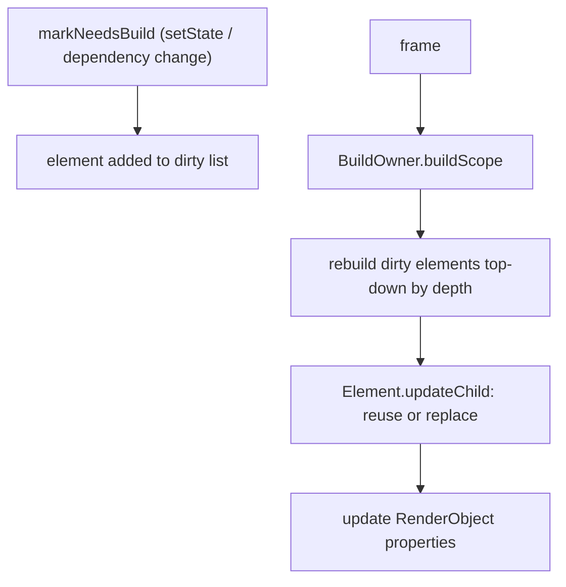
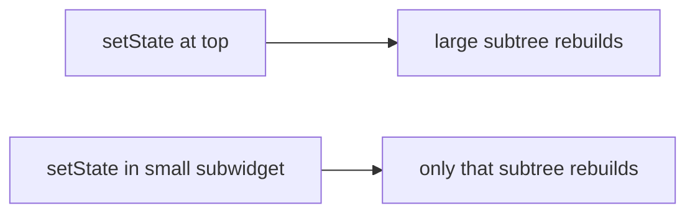

# The Build Phase (Dirty Tracking & Rebuild Scope)

> In the build phase, the framework rebuilds only the elements marked **dirty** (via `setState`/dependency changes), reconciles their new widgets against the element tree, and updates the render tree — the smaller the dirty scope, the cheaper the frame.

## Introduction

Build is the first framework phase. This file covers how elements become **dirty**, how the `BuildOwner` rebuilds them in order, how reconciliation reuses elements, and why **rebuild scope** is the primary build-phase performance lever.

## Why this concept exists

Rebuilding the whole tree every frame would be wasteful. Flutter tracks which elements changed (dirty list) and rebuilds only those, reusing the rest. Understanding this lets you keep rebuilds small and cheap — the core of declarative-UI performance.

## Real-world analogy

A **newspaper reprint**: instead of resetting the whole paper, the press only re-typesets the articles that changed (dirty elements) and reuses the rest of the layout. The fewer articles changed, the faster the reprint.

## Problem Statement

A `setState` at the top of a screen rebuilds everything and janks. Why, and how do you shrink the rebuild to just the changing part? You'll learn dirty tracking and scoping.

## Internal Working



- An element becomes **dirty** via `markNeedsBuild()` — triggered by `setState`, an inherited-dependency change, or `didUpdateWidget`-driven rebuilds.
- The **`BuildOwner`** holds the dirty list; each frame it rebuilds dirty elements **in depth order (ancestors first)**.
- Rebuilding an element re-runs its widget's `build`, producing new child widgets; `Element.updateChild` **reconciles** each: same `runtimeType`+`key` → update in place; else → replace subtree ([06](../06%20Flutter%20Fundamentals/04_widgets_elements_render_objects.md)).
- Reconciliation updates the persistent render objects' properties (cheap) rather than recreating them.
- **Rebuild scope** = the subtree under the dirty element. `const` children short-circuit (identical widget → element skips update).

## Memory Representation

New widget objects are allocated each rebuild (throwaway, GC'd); elements/render objects persist ([02 · memory_and_gc](../02%20Advanced%20Dart/13_memory_and_gc.md)).

## Compiler Behavior

`const` constructors canonicalize widgets so equal `const` children are identical instances → the element can skip rebuilding that subtree.

## Runtime Behavior

Dirty elements rebuild once per frame (coalesced); a rebuild whose new child widget `== ` the old (or is `const`-identical) skips deeper work. Marking dirty during build is disallowed (assertion).

## Flutter Engine Behavior

Not applicable directly; build feeds layout/paint.

## Dart VM Behavior

Frequent small allocations (widgets) are cheap; huge rebuilds create GC pressure ([02 · memory_and_gc](../02%20Advanced%20Dart/13_memory_and_gc.md)).

## Examples

```dart
import 'package:flutter/material.dart';

// ❌ Whole screen rebuilds when only the counter changes
class Bad extends StatefulWidget {
  const Bad({super.key});
  @override
  State<Bad> createState() => _BadState();
}
class _BadState extends State<Bad> {
  int _count = 0;
  @override
  Widget build(BuildContext context) {
    return Column(children: [
      const _ExpensiveHeader(), // rebuilt too (unless const short-circuits)
      Text('$_count'),
      ElevatedButton(onPressed: () => setState(() => _count++), child: const Text('+')),
    ]);
  }
}

// ✅ Scope the rebuild to the counter only
class Good extends StatelessWidget {
  const Good({super.key});
  @override
  Widget build(BuildContext context) {
    return Column(children: const [
      _ExpensiveHeader(), // const -> element skips rebuilding it
      _Counter(),         // only THIS subtree rebuilds on its own setState
    ]);
  }
}
class _Counter extends StatefulWidget {
  const _Counter();
  @override
  State<_Counter> createState() => _CounterState();
}
class _CounterState extends State<_Counter> {
  int _count = 0;
  @override
  Widget build(BuildContext context) => Row(children: [
        Text('$_count'),
        ElevatedButton(onPressed: () => setState(() => _count++), child: const Text('+')),
      ]);
}
class _ExpensiveHeader extends StatelessWidget {
  const _ExpensiveHeader();
  @override
  Widget build(BuildContext context) => const Text('Header');
}
```

## Diagrams



## Common Mistakes

| Mistake | Why | Fix |
|---------|-----|-----|
| `setState` high in the tree | Rebuilds a big subtree | Push state into a small subwidget |
| No `const` on static children | They rebuild needlessly | Mark static subtrees `const` |
| Rebuilding via a whole-page provider | Broad rebuilds | Use selectors/scoped listeners ([Module 11](../11%20State%20Management/README.md)) |
| Expensive work in `build` | Runs each rebuild | Precompute in `initState`/memoize |
| Build-helper methods instead of widget classes | No `const`/scoping | Extract widget classes ([07 · custom_composite_widgets](../07%20Widgets/09_custom_composite_widgets.md)) |

## Best Practices

- **Push state down**: put `setState` in the smallest widget that owns the changing UI.
- Use **`const`** aggressively for static subtrees to short-circuit rebuilds.
- Extract **widget classes** (not helper methods) for independent rebuild scoping.
- For shared state, use **selectors** so only dependent widgets rebuild ([Module 11](../11%20State%20Management/README.md)).
- Keep `build` pure and cheap; memoize expensive derived values.

## Performance

Build cost ∝ dirty subtree size × per-widget build cost. Scoping + `const` are the biggest build-phase wins; verify with DevTools **"Track Widget Rebuilds"** ([Module 21](../21%20Performance/README.md)).

## Advantages / Disadvantages

- **+** Incremental rebuilds; cheap when scoped; `const` short-circuiting.
- **−** Easy to accidentally rebuild large subtrees; requires deliberate scoping.

## Interview Questions

1. **🟢 How does an element become dirty?** — Via `markNeedsBuild()`, triggered by `setState`, an inherited-dependency change, or a config update.
2. **🟢 Does the whole tree rebuild on `setState`?** — No; only the calling element's subtree (dirty elements), reconciled against the old tree.
3. **🟡 What is reconciliation in the build phase?** — For each child, the element compares the new widget to the old: same type+key → update in place; else → replace the subtree.
4. **🟡 How does `const` help the build phase?** — `const` children are identical instances across builds, so the element skips rebuilding those subtrees.
5. **🟡 Why extract widget classes instead of `_buildX()` methods?** — Classes get their own element and rebuild scope (and `const`-ability); methods inline into the parent's build.
6. **🔴 In what order does the `BuildOwner` rebuild dirty elements?** — Top-down by depth (ancestors before descendants) so parent changes propagate correctly.
7. **🔴 How do you minimize rebuild cost for shared state?** — Use fine-grained selectors/scoped listeners so only widgets depending on the changed slice rebuild ([Module 11](../11%20State%20Management/README.md)).

## Senior Engineer Tips

- The fix for "everything rebuilds" is almost always **move state lower** and **`const` the rest**, not micro-optimizing `build`.
- Use DevTools rebuild counts to find over-rebuilding widgets objectively.
- Prefer `ValueListenableBuilder`/`Selector`/Riverpod `select` to rebuild only the reactive leaf.

## Architect Perspective

Rebuild discipline (scoping + `const` + selectors) is a core UI-performance strategy. Architecting state so changes touch the smallest possible subtree — via widget decomposition and fine-grained reactivity — keeps large apps smooth and is a central concern of state-management design ([Module 11](../11%20State%20Management/README.md), [Module 21](../21%20Performance/README.md)).

## Summary

- Build rebuilds only dirty elements (top-down), reconciling widgets and updating render objects.
- Rebuild scope drives cost; shrink it with state-pushdown, `const`, widget classes, and selectors.
- Widgets are throwaway; elements/render objects persist.

## Revision Notes

- Dirty via `markNeedsBuild` (setState/dependency/config); `BuildOwner` rebuilds top-down.
- Reconcile: same type+key → update; else replace. `const` short-circuits.
- Cost ∝ dirty subtree size; scope via state-pushdown + `const` + widget classes + selectors.
- Verify with DevTools rebuild tracking.

## Practice Questions

1. Why does `setState` high in the tree cause a big rebuild?
2. How does `const` reduce build work?
3. Why do widget classes scope rebuilds better than helper methods?

## Coding Questions

1. Refactor a whole-screen `setState` into a small stateful subwidget.
2. Add `const` to static subtrees and measure rebuild reduction (DevTools).
3. Use `ValueListenableBuilder` to rebuild only a counter text.

## Mini Project

**Rebuild-scope lab (Flutter):** Build a screen with an expensive header and a frequently-changing counter; first implement it so everything rebuilds, then refactor (state-pushdown + `const` + a subwidget) so only the counter rebuilds. Document rebuild counts before/after. Acceptance: measurable rebuild reduction; header not rebuilding on counter change; app runs.
