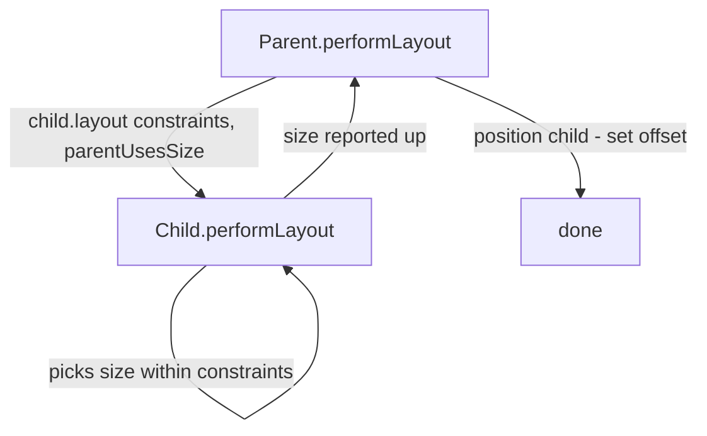
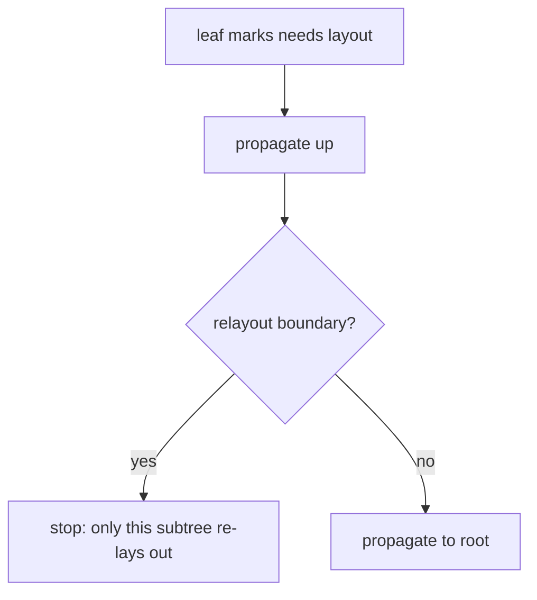

# The Layout Phase (`RenderObject.layout`, Relayout Boundaries)

> In layout, each `RenderObject` receives `BoxConstraints` from its parent, computes and reports its size, and positions its children — a single top-down/bottom-up pass, made incremental by **relayout boundaries**.

## Introduction

Layout is the second phase: the render tree computes geometry. This file covers the render-object layout algorithm (the internals behind the widget-level rule in [07 · constraints_and_sizing](../07%20Widgets/03_constraints_and_sizing.md)), `performLayout`, `parentUsesSize`, intrinsic dimensions, and **relayout boundaries** that keep layout incremental.

## Why this concept exists

Layout must be fast (O(n)) even for deep trees. Flutter achieves this with a single pass — constraints down, sizes up — plus **relayout boundaries** so a change in one subtree doesn't force the whole tree to re-layout. Understanding this explains layout cost and how to contain it.

## Real-world analogy

A **nested set of adjustable boxes**: the outer box tells each inner box "you may be this big at most" (constraints); each inner box picks its size and reports back; the outer box then slots them into place. If only one inner box changes and its outer box's size doesn't depend on it, you needn't rearrange the whole cabinet (relayout boundary).

## Problem Statement

A deep layout re-lays-out entirely when one leaf changes size, causing jank. How does layout normally stay local, and what breaks that? You'll learn `layout`, `parentUsesSize`, and relayout boundaries.

## Internal Working



- **`layout(constraints, {parentUsesSize})`**: the entry point; a `RenderObject` gets constraints, runs `performLayout`, sets its `size`, and lays out/positions children.
- **Constraints down, sizes up:** parent → constraints; child → size (within them); parent → position (child can't set its own position).
- **`parentUsesSize`:** if `false`, the parent doesn't depend on the child's size → the child can be a **relayout boundary** (its re-layout won't dirty the parent).
- **Relayout boundary:** a node beyond which `markNeedsLayout` doesn't propagate upward, because the parent's layout is independent of it (tight constraints + `!parentUsesSize`, or `RenderObject` explicitly a boundary). This keeps layout incremental.
- **Intrinsics** (`getMinIntrinsicWidth`, etc.): extra passes to query natural sizes — `IntrinsicHeight`/`IntrinsicWidth` cost more.
- **Sliver layout** uses `SliverConstraints`/`SliverGeometry` (scroll offset, remaining space) instead of `BoxConstraints` ([07 · scrolling_and_slivers](../07%20Widgets/05_scrolling_and_slivers.md)).

## Memory Representation

Sizes/offsets are stored on render objects; no per-frame allocation of note. Relayout boundaries limit which nodes recompute.

## Compiler Behavior

Not applicable.

## Runtime Behavior

`markNeedsLayout()` dirties a render object; layout propagates **up to the nearest relayout boundary**, then that subtree re-lays-out. Tight constraints from a parent (exact size) create natural boundaries.

## Flutter Engine Behavior

Layout runs on the UI thread as part of the frame; excessive layout (deep trees, intrinsics, unbounded scroll misuse) shows as high `buildDuration` ([01_pipeline_overview.md](01_pipeline_overview.md)).

## Dart VM Behavior

Not applicable.

## Examples

```dart
import 'package:flutter/material.dart';
import 'package:flutter/rendering.dart';

// A minimal custom RenderObject showing the layout contract.
class SquareBox extends SingleChildRenderObjectWidget {
  const SquareBox({super.key, super.child});
  @override
  RenderObject createRenderObject(BuildContext context) => _RenderSquare();
}

class _RenderSquare extends RenderProxyBox {
  @override
  void performLayout() {
    // 1. constraints come in via `constraints`
    // 2. lay out child, using its size (parentUsesSize: true)
    if (child != null) {
      child!.layout(constraints.loosen(), parentUsesSize: true);
    }
    // 3. choose OUR size (a square within constraints)
    final side = constraints.constrainWidth(
      child?.size.longestSide ?? 50,
    );
    size = constraints.constrain(Size(side, side)); // size UP
    // 4. position child (parent sets child offset)
    if (child != null) {
      (child!.parentData as BoxParentData).offset = Offset.zero;
    }
  }
}

void main() => runApp(MaterialApp(
      home: Scaffold(
        body: Center(
          child: SquareBox(child: Container(color: Colors.teal, width: 30, height: 80)),
        ),
      ),
    ));
```

## Diagrams



## Common Mistakes

| Mistake | Why | Fix |
|---------|-----|-----|
| Overusing `IntrinsicWidth/Height` | Extra layout passes → slow | Avoid in large/scrolling trees; use fixed/flex sizing |
| Unbounded constraints to scrollables | Layout error | Bound them ([07 · constraints_and_sizing](../07%20Widgets/03_constraints_and_sizing.md)) |
| Deep nesting forcing wide relayout | No boundaries → full re-layout | Introduce tight-constraint boundaries / `RepaintBoundary` (paint) |
| Assuming child sets its position | Parent does | Read the layout rule |
| Custom `RenderObject` not calling `child.layout` | Broken layout | Follow the layout contract |

## Best Practices

- Rely on the constraints model; give scrollables bounded constraints.
- **Avoid intrinsics** in hot/large trees; prefer explicit sizes or flex.
- Structure UI so size-changing subtrees are **relayout-bounded** (tight constraints from parents that don't depend on their size).
- For custom render objects, implement `performLayout` per the contract (lay out children, set `size`, position children).

## Performance

Layout is O(nodes laid out); relayout boundaries and avoiding intrinsics keep it local and cheap. High layout time appears as UI-thread jank ([Module 21](../21%20Performance/README.md)).

## Advantages / Disadvantages

- **+** Fast single-pass layout; incremental via relayout boundaries; predictable.
- **−** Intrinsics/deep trees can be costly; custom layout requires care; errors are cryptic until the model clicks.

## Interview Questions

1. **🟢 State the layout rule at the render level.** — Parent passes `BoxConstraints` down; child computes its `size` within them and reports up; parent positions the child.
2. **🟢 Can a child choose its own position?** — No; the parent sets the child's offset.
3. **🟡 What is a relayout boundary?** — A node beyond which `markNeedsLayout` doesn't propagate upward (parent layout is independent of it), keeping re-layout local.
4. **🟡 What does `parentUsesSize` do?** — Tells layout whether the parent depends on the child's size; `false` enables the child to be a relayout boundary.
5. **🟡 Why are `IntrinsicWidth/Height` expensive?** — They trigger extra measurement passes to compute natural sizes.
6. **🔴 How does layout stay O(n) with incremental changes?** — Single constraints-down/sizes-up pass + relayout boundaries limit which subtrees recompute.
7. **🔴 How do slivers differ in layout?** — They use `SliverConstraints`/`SliverGeometry` (scroll offset, remaining extent) rather than box constraints.

## Senior Engineer Tips

- If a small change triggers wide re-layout, look for missing relayout boundaries (loose constraints + `parentUsesSize`) and intrinsic usage.
- Prefer fixed/flex sizing over intrinsics; reserve intrinsics for small, non-scrolling cases.
- When writing custom `RenderObject`s, respect the contract exactly — mis-set `size`/offsets cause subtle bugs.

## Architect Perspective

Layout cost and locality shape scroll and animation smoothness. Designing layouts with bounded, boundary-friendly structure (and minimal intrinsics) is a performance decision that scales, and is prerequisite to custom layout/rendering work ([Module 23](../23%20Custom%20Painting/README.md)) and performance tuning ([Module 21](../21%20Performance/README.md)).

## Summary

- Layout: constraints down, sizes up, parent positions — single pass, O(n).
- Relayout boundaries + `parentUsesSize` keep re-layout local; intrinsics add passes.
- Slivers use sliver constraints/geometry; custom render objects must follow the layout contract.

## Revision Notes

- `layout(constraints, parentUsesSize)`; child sizes within constraints, parent positions.
- Relayout boundary = `markNeedsLayout` stops propagating up (parent size-independent).
- Avoid intrinsics in big/scrolling trees; bound scrollables.
- Slivers: `SliverConstraints`/`SliverGeometry`.

## Practice Questions

1. Why can't a child position itself?
2. What makes a subtree a relayout boundary?
3. Why avoid `IntrinsicHeight` in a long list?

## Coding Questions

1. Write a custom `RenderProxyBox` that forces a square size.
2. Demonstrate a relayout boundary limiting re-layout scope.
3. Show the extra-pass cost of `IntrinsicHeight` vs fixed sizing.

## Mini Project

**Custom layout box (Flutter):** Implement a small custom `RenderObject` widget (e.g., a "max-square" box) following the layout contract, plus a demo showing relayout locality when a sibling changes. Document the constraints/size flow. Acceptance: correct `performLayout`; documented constraints-down/sizes-up; no layout errors; app runs.
