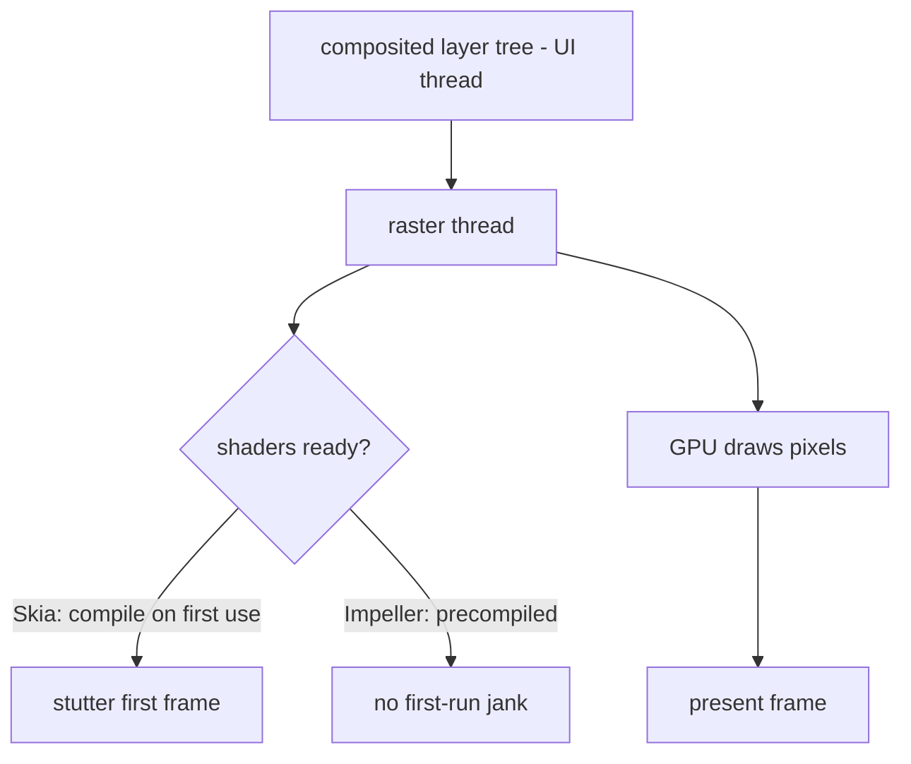
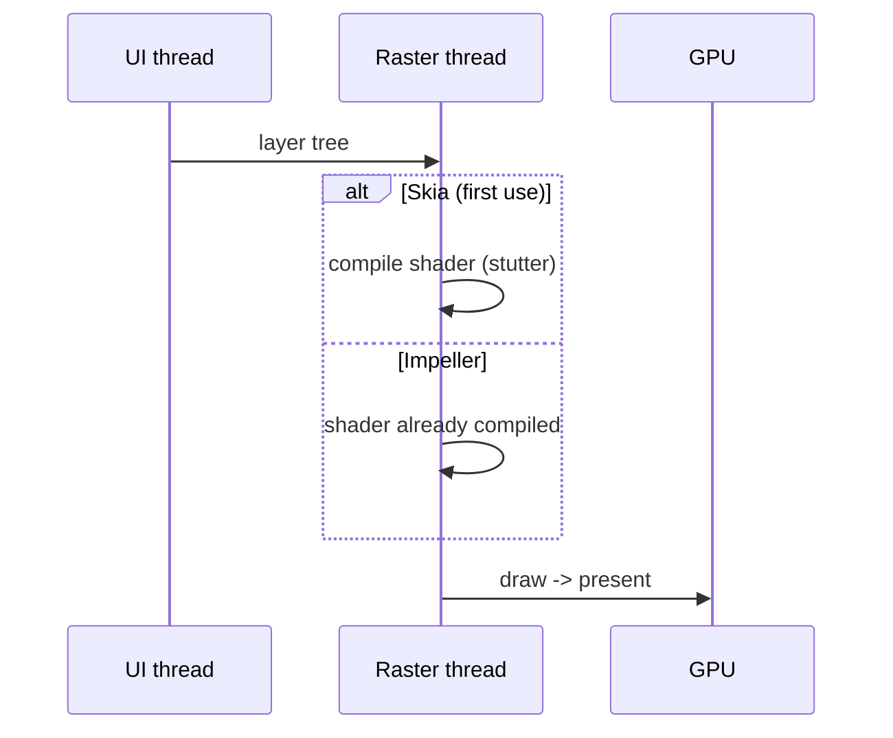

# Rasterization (Skia vs Impeller, Shader Jank)

> Rasterization is the final step where the engine's raster thread turns the composited layer tree into actual GPU pixels — historically via **Skia**, now increasingly **Impeller**, which precompiles shaders to eliminate first-run shader-compilation jank.

## Introduction

Rasterization runs on the **raster thread** (engine/C++), converting recorded drawing commands and layers into pixels on the GPU. This file covers the raster step, the Skia→Impeller shift, and the classic **shader compilation jank** problem Impeller solves.

## Why this concept exists

Drawing to the GPU is the heavy part of a frame. Understanding it explains raster-thread jank (which `const`/rebuild fixes won't touch), why the first run of an animation used to stutter (shader compilation), and why the renderer choice (Skia vs Impeller) matters.

## Real-world analogy

Paint recorded "stage directions" (draw ops); rasterization is the **film crew actually shooting and developing the frame**. Shader compilation jank is like the crew having to **build a custom lens on the spot** the first time a special effect appears — Impeller builds all lenses ahead of time (ahead-of-time shader compilation).

## Problem Statement

The first time a gradient/blur/animation runs, the app stutters, then is smooth afterward. Why, and how does Impeller fix it? You'll learn rasterization and shaders.

## Internal Working



- **Raster thread**: receives the layer tree from the UI thread and issues GPU draw calls to produce pixels; runs in parallel with the next UI frame (pipelining).
- **Skia**: the long-standing 2D engine; compiles GPU **shaders lazily on first use**, causing a one-time hitch (**shader compilation jank**) the first time a novel drawing operation appears (gradients, blurs, some animations).
- **Impeller**: the newer renderer (default on iOS, expanding to Android) that **precompiles shaders at build/engine-init time**, eliminating runtime shader-compilation jank and offering more predictable performance.
- **`rasterDuration`** (frame timings) measures this step; high values = raster-bound jank ([01_pipeline_overview.md](01_pipeline_overview.md)).

## Memory Representation

GPU textures/buffers for layers and cached `RepaintBoundary`s live in GPU memory; large/many textures pressure it ([05_compositing_and_repaint_boundaries.md](05_compositing_and_repaint_boundaries.md)).

## Compiler Behavior

Impeller's shaders are prepared ahead of time (build/engine), unlike Skia's runtime compilation. (Historically Skia offered SkSL shader warm-up to mitigate jank.)

## Runtime Behavior

Skia: first-use shader compilation → transient stutter, then cached. Impeller: shaders ready → consistent frames. Heavy raster ops (large blurs, `saveLayer`, complex clips/paths) cost regardless of renderer.

## Flutter Engine Behavior

This *is* the engine's job. The raster thread is separate from the UI thread; a slow raster step drops frames even if `build`/layout were fast.

## Dart VM Behavior

Not applicable (rasterization is engine-side C++/GPU).

## Examples

```dart
import 'package:flutter/scheduler.dart';

// Detect raster-bound jank via frame timings (profile/release):
void watchRaster() {
  SchedulerBinding.instance.addTimingsCallback((timings) {
    for (final t in timings) {
      final uiMs = t.buildDuration.inMicroseconds / 1000;
      final rasterMs = t.rasterDuration.inMicroseconds / 1000;
      if (rasterMs > 16) {
        // raster-bound: look at effects/shaders, not rebuilds
        // print('RASTER-BOUND frame: ui=${uiMs}ms raster=${rasterMs}ms');
      }
    }
  });
}
```

```text
Historical Skia mitigation (pre-Impeller): SkSL shader warm-up
  flutter run --profile --cache-sksl --purge-persistent-cache
  then flutter build ... --bundle-sksl-path <file>
Impeller removes the need for this on supported platforms.
```

## Diagrams



## Common Mistakes

| Mistake | Why | Fix |
|---------|-----|-----|
| Blaming rebuilds for first-run animation stutter | It's shader compilation (Skia) | Use Impeller / warm up shaders |
| Ignoring `rasterDuration` | Miss raster-bound jank | Profile both UI and raster times |
| Heavy blurs/`saveLayer`/large clips | Expensive raster each frame | Reduce/limit area; cache with boundary |
| Assuming Impeller fixes all jank | It fixes *shader* jank, not heavy raster ops | Still minimize expensive effects |
| Testing perf in debug | Debug raster is not representative | Profile/release only |

## Best Practices

- Prefer **Impeller** on supported platforms to eliminate shader-compilation jank; otherwise warm up shaders (Skia) for critical animations.
- Minimize raster-heavy effects (large blurs, `saveLayer`, complex clips); cache stable expensive content behind `RepaintBoundary`.
- Diagnose jank by **thread**: high `rasterDuration` → raster-bound (effects/shaders), high `buildDuration` → UI-bound (rebuild/layout).
- Always measure in **profile/release**.

## Performance

Raster budget shares the frame with UI work; raster-bound jank needs raster-side fixes (fewer/simpler effects, caching, Impeller) — `const`/rebuild tuning won't help it ([Module 21](../21%20Performance/README.md)).

## Advantages / Disadvantages

- **+ Impeller:** predictable frames, no first-run shader jank, modern GPU pipeline.
- **−** Some platform/feature maturity differences historically; heavy raster ops still cost regardless of renderer.

## Interview Questions

1. **🟢 What is rasterization?** — The engine's raster thread turning the composited layer tree into GPU pixels (the final frame step).
2. **🟢 Skia vs Impeller?** — Both rasterize; Skia compiles shaders lazily on first use (causing first-run jank); Impeller precompiles shaders ahead of time to avoid it.
3. **🟡 What is shader compilation jank?** — A one-time stutter when Skia compiles a GPU shader the first time a novel drawing op appears (gradients/blurs/animations).
4. **🟡 Which thread does rasterization run on?** — The raster thread (engine), separate from the UI/Dart thread.
5. **🟡 How do you know jank is raster-bound?** — High `rasterDuration` in frame timings (vs `buildDuration`).
6. **🔴 Does Impeller fix all jank?** — No — it fixes *shader-compilation* jank; heavy raster operations (big blurs, `saveLayer`) still cost and need reduction/caching.
7. **🔴 How did teams mitigate shader jank on Skia?** — SkSL shader warm-up: capture shaders in profile runs and bundle them so they're precompiled.

## Senior Engineer Tips

- First-run-only stutter on an animation = classic shader-compilation jank → Impeller or shader warm-up, not rebuild tuning.
- Keep an eye on GPU memory when caching many layers/large textures.
- Split your jank diagnosis into UI-thread vs raster-thread first; it dictates the entire fix strategy.

## Architect Perspective

The renderer (Skia/Impeller) and raster-thread cost are performance realities that shape animation/effects design and platform choices. Knowing that raster jank needs raster fixes — and that Impeller changes the shader-jank calculus — is essential for delivering consistently smooth, effect-rich apps at scale ([Module 21](../21%20Performance/README.md), [Module 10](../10%20Flutter%20Architecture/README.md)).

## Summary

- Rasterization = raster thread → GPU pixels (final step).
- Skia compiles shaders lazily (first-run jank); Impeller precompiles them (no shader jank).
- Diagnose by thread (`rasterDuration`); minimize heavy effects and cache; measure in release.

## Revision Notes

- Rasterize on raster thread → GPU pixels; parallel to next UI frame.
- Skia = lazy shader compile (first-run jank); Impeller = AOT shaders (no shader jank).
- `rasterDuration` high = raster-bound → reduce effects/cache, not rebuild tuning.
- Impeller doesn't fix heavy raster ops; profile in release.

## Practice Questions

1. Why does an animation stutter only the first time on Skia?
2. How do you tell raster-bound from UI-bound jank?
3. What does Impeller change, and what does it not fix?

## Coding Questions

1. Add a raster-duration watcher and flag raster-bound frames.
2. Demonstrate first-run vs subsequent-run timing of a gradient animation (Skia).
3. Reduce raster cost of a blurred header (limit area / cache with boundary).

## Mini Project

**Raster jank diagnosis (Flutter + docs):** Build a screen with a gradient/blur animation; capture `rasterDuration` first-run vs steady-state, note shader-compilation behavior, and (where available) compare Skia vs Impeller. Write `RASTER.md` with findings and fixes. Acceptance: correct UI-vs-raster attribution; renderer behavior explained; mitigation proposed.
