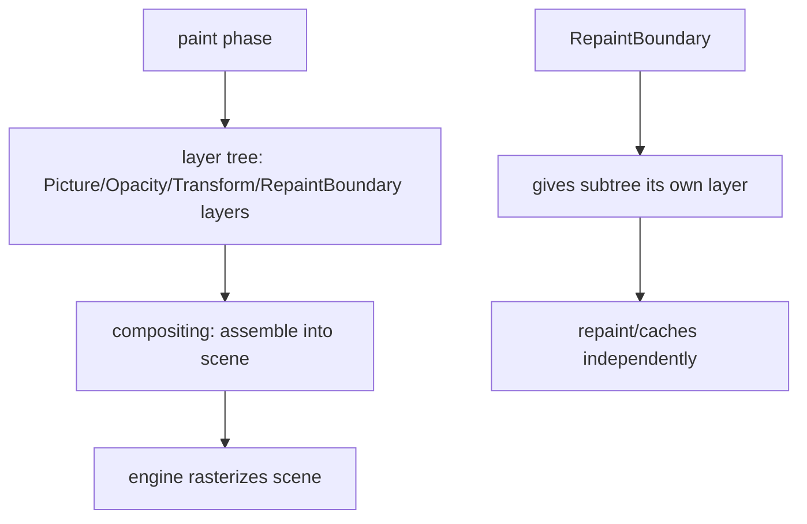
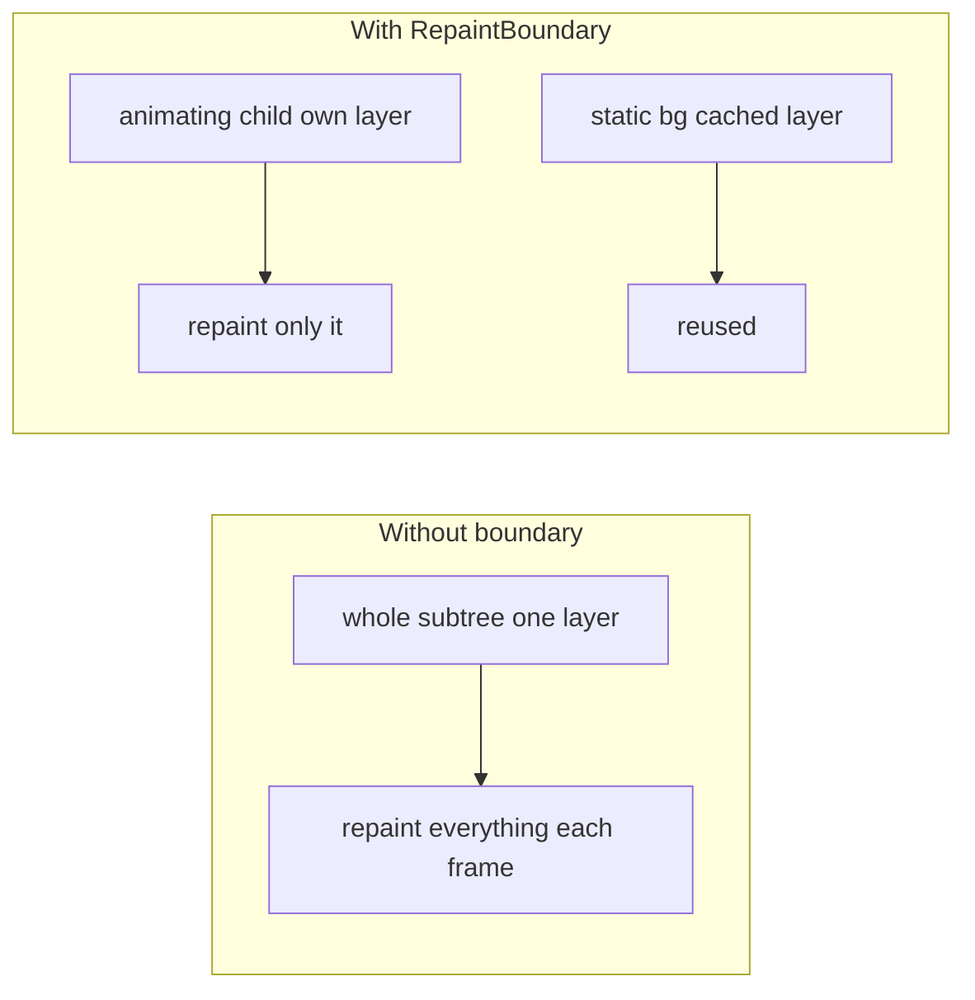

# Compositing & Repaint Boundaries

> Compositing assembles the painted **layers** into a final scene; a `RepaintBoundary` gives a subtree its own layer so it can repaint (and be cached) independently — the key tool for isolating expensive or frequently-animating paints.

## Introduction

After paint produces a layer tree, **compositing** combines those layers into the scene the engine rasterizes. This file covers layers, how compositing works, and `RepaintBoundary` — what it does, when it helps, and when it hurts.

## Why this concept exists

Without layer isolation, repainting one animating widget could force repainting its neighbors (same layer). Layers let Flutter cache stable content and repaint only what changed. `RepaintBoundary` is how you deliberately create that isolation, trading a little memory for cheaper repaints.

## Real-world analogy

Compositing is **stacking transparent animation cels** into one frame. A `RepaintBoundary` is putting a moving character on **its own cel** so you only redraw that cel each frame, reusing the static background cel instead of redrawing everything.

## Problem Statement

An animation inside a complex screen janks because the whole screen repaints each frame. You'll wrap the animating subtree in a `RepaintBoundary` so only it repaints — and learn when a boundary is wasteful.

## Internal Working



- **Layers**: nodes in the layer tree (`PictureLayer` holds recorded drawing; `OpacityLayer`/`TransformLayer`/`ClipLayer` apply effects; `RepaintBoundary` creates an isolating layer).
- **Compositing**: the engine walks the layer tree, applies transforms/opacity/clips, and produces the final scene. Cached layers (unchanged) are reused.
- **`RepaintBoundary`**: forces its child into a separate layer. When the child repaints, siblings/ancestors on other layers **don't** need to; and a stable boundary layer can be **cached** as a texture.
- **Cost/benefit**: a boundary adds a layer (memory + a compositing step). Worth it when the subtree repaints often *independently* (animations, video, custom painters) or is expensive and static (cache it). Wasteful when everything repaints together anyway.

## Memory Representation

Each layer (especially cached `RepaintBoundary` textures) uses GPU memory. Too many boundaries waste memory; too few cause broad repaints ([02 · memory_and_gc](../02%20Advanced%20Dart/memory_and_gc.md)).

## Compiler Behavior

Not applicable.

## Runtime Behavior

`markNeedsPaint` on a boundaried subtree repaints only that layer; the engine composites the changed layer with cached ones. `RepaintBoundary` also stops paint invalidation from crossing it.

## Flutter Engine Behavior

The raster thread rasterizes each layer; a stable `RepaintBoundary` can be rasterized once and reused across frames (saving raster time). Excessive layers increase compositing overhead ([rasterization_skia_impeller.md](rasterization_skia_impeller.md)).

## Dart VM Behavior

Not applicable.

## Examples

```dart
import 'package:flutter/material.dart';

class BoundaryDemo extends StatefulWidget {
  const BoundaryDemo({super.key});
  @override
  State<BoundaryDemo> createState() => _BoundaryDemoState();
}
class _BoundaryDemoState extends State<BoundaryDemo>
    with SingleTickerProviderStateMixin {
  late final AnimationController _c =
      AnimationController(vsync: this, duration: const Duration(seconds: 1))..repeat();

  @override
  void dispose() { _c.dispose(); super.dispose(); }

  @override
  Widget build(BuildContext context) {
    return Column(
      children: [
        const _ExpensiveStaticHeader(), // should NOT repaint each frame
        // Isolate the animating widget so only IT repaints:
        RepaintBoundary(
          child: RotationTransition(
            turns: _c,
            child: const Icon(Icons.refresh, size: 64),
          ),
        ),
      ],
    );
  }
}
class _ExpensiveStaticHeader extends StatelessWidget {
  const _ExpensiveStaticHeader();
  @override
  Widget build(BuildContext context) =>
      const SizedBox(height: 100, child: Center(child: Text('Static header')));
}
```

```text
DevTools: enable "Highlight Repaints" to SEE which layers repaint.
Without the RepaintBoundary, the header may repaint with the spinner each frame.
```

## Diagrams



## Common Mistakes

| Mistake | Why | Fix |
|---------|-----|-----|
| No boundary around a per-frame animation | Neighbors repaint too | Wrap animating subtree in `RepaintBoundary` |
| `RepaintBoundary` everywhere | Wasted layers/memory + compositing overhead | Add only where it isolates real repaint churn |
| Boundary around content that repaints with parent anyway | No benefit, extra cost | Remove it |
| Ignoring GPU memory of cached layers | Memory bloat | Use boundaries judiciously; measure |
| Confusing repaint with rebuild | Different phases | `const`/scoping fixes rebuild; boundary fixes repaint |

## Best Practices

- Wrap **independently, frequently-repainting** subtrees (animations, custom painters, video, list items) in `RepaintBoundary`.
- Use DevTools **"Highlight Repaints"** to find broad repaints and verify boundaries help.
- Don't sprinkle boundaries blindly — each costs a layer + compositing; add where measured churn exists.
- Distinguish **rebuild** (build phase — fix with `const`/scoping — [build_phase.md](build_phase.md)) from **repaint** (paint/composite — fix with `RepaintBoundary`).

## Performance

A well-placed boundary can cut raster/paint work dramatically by caching stable layers and localizing repaints; too many hurt via layer/compositing/memory overhead. Always measure ([Module 21](../21%20Performance/README.md)).

## Advantages / Disadvantages

- **+** Isolates repaints, enables layer caching, big win for animations over complex backgrounds.
- **−** Each boundary adds a layer (GPU memory + compositing step); overuse degrades performance.

## Interview Questions

1. **🟢 What does compositing do?** — Assembles the painted layer tree (applying transforms/opacity/clips) into the final scene the engine rasterizes.
2. **🟢 What does `RepaintBoundary` do?** — Puts its child in its own layer so it repaints (and can be cached) independently of siblings/ancestors.
3. **🟡 When should you add a `RepaintBoundary`?** — Around subtrees that repaint frequently and independently (animations, custom painters, video) or expensive static content to cache.
4. **🟡 What's the cost of a `RepaintBoundary`?** — An extra layer: GPU memory plus a compositing step; overusing them hurts.
5. **🟡 Rebuild vs repaint — different fixes?** — Rebuild (build phase) is reduced by `const`/scoping/selectors; repaint (paint/composite) is isolated by `RepaintBoundary`.
6. **🔴 How does a `RepaintBoundary` save raster time?** — A stable boundary layer can be rasterized once and reused across frames instead of redrawn.
7. **🔴 How do you verify a boundary helps?** — DevTools "Highlight Repaints" (see which layers repaint) and raster timing before/after.

## Senior Engineer Tips

- The classic win: animation/spinner over a complex/static background → wrap the animating part in `RepaintBoundary`.
- Long lists: items are often implicitly boundaried, but custom painters inside them may need explicit boundaries.
- Measure — boundaries are a targeted tool, not a default; both under- and over-use cause problems.

## Architect Perspective

Layer/compositing awareness and deliberate `RepaintBoundary` placement are core to smooth, complex UIs (media, animation-heavy, data-viz). It's a measured, surgical optimization — part of the performance discipline in [Module 21](../21%20Performance/README.md) and essential when combining custom painting with rich screens ([Module 23](../23%20Custom%20Painting/README.md)).

## Summary

- Compositing assembles painted layers into the scene; `RepaintBoundary` gives a subtree its own cacheable, independently-repainting layer.
- Add boundaries around frequently/independently repainting or expensive-static subtrees; each costs a layer — measure.
- Repaint (boundary) is distinct from rebuild (`const`/scoping).

## Revision Notes

- Compositing = assemble layer tree → scene → raster.
- `RepaintBoundary` = own layer → isolate repaint + cache; costs GPU memory + compositing.
- Use for frequent/independent repaints (animations/painters); don't overuse.
- Repaint ≠ rebuild (paint/composite vs build). DevTools "Highlight Repaints".

## Practice Questions

1. Why does an animation without a boundary repaint its neighbors?
2. What does a `RepaintBoundary` cost?
3. How is fixing a repaint different from fixing a rebuild?

## Coding Questions

1. Isolate a spinner over a complex background with `RepaintBoundary`; verify with Highlight Repaints.
2. Show a case where a boundary is wasteful and remove it.
3. Cache an expensive static painter behind a boundary and measure raster savings.

## Mini Project

**Repaint isolation lab (Flutter):** Build a screen with an expensive static background and a per-frame animation; first observe broad repaints (Highlight Repaints), then add a `RepaintBoundary` around the animation and confirm only it repaints. Document GPU-memory/compositing tradeoff. Acceptance: measurable repaint reduction; justified boundary placement; app runs.
