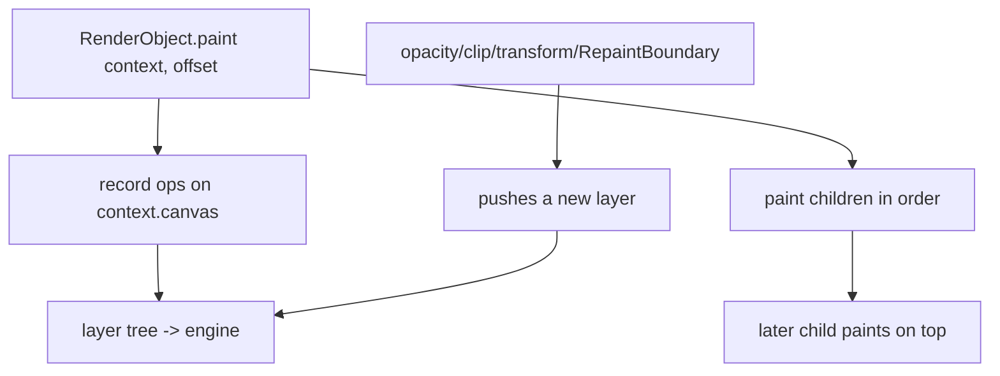
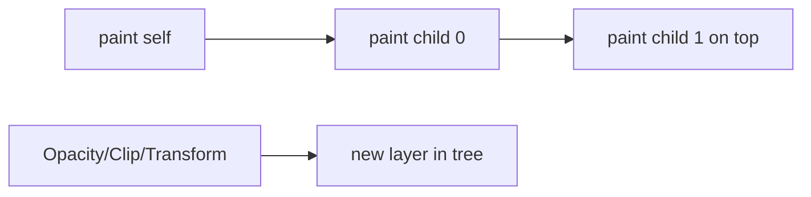

# The Paint Phase (`PaintingContext`, Paint Order, Layers)

> In paint, each `RenderObject` records drawing commands (via `paint(context, offset)`) into a canvas/layer — it doesn't draw pixels itself; it produces a list of operations the engine will rasterize later.

## Introduction

Paint is the third framework phase. Render objects walk top-down and **record** paint operations (rects, text, images) onto a `Canvas` inside a `PaintingContext`, in a defined **paint order**, producing a **layer tree** handed to the engine. This file covers `paint`, order, and when new layers are created.

## Why this concept exists

Separating "record what to draw" (paint, UI thread) from "actually draw" (rasterize, raster thread) lets Flutter cache and composite efficiently. Recording is cheap; the heavy pixel work is deferred to the GPU. Knowing paint order and layer creation explains z-ordering and repaint cost.

## Real-world analogy

Paint is **writing stage directions** ("draw a red rect here, then text there"), not performing them. The directions (display list) are handed to the crew (engine) who actually light and shoot the scene (rasterize).

## Problem Statement

Why does one child appear above another, why does adding opacity/clip create a new layer, and why is painting sometimes the jank source? You'll learn recording, order, and layers.

## Internal Working



- **`paint(PaintingContext context, Offset offset)`**: records ops onto `context.canvas`; calls `context.paintChild(child, offset)` for children.
- **Paint order = tree order**: a render object paints itself then its children; later children paint **on top** (z-order), matching `Stack` behavior ([07 · stack_and_positioning](../07%20Widgets/stack_and_positioning.md)).
- **Layers**: most painting goes onto the current layer, but certain effects **push a new layer**: `Opacity`, `ClipRect/RRect`, `Transform`, `ShaderMask`, `BackdropFilter`, and `RepaintBoundary`. Layers are the unit of compositing/caching ([compositing_and_repaint_boundaries.md](compositing_and_repaint_boundaries.md)).
- **`markNeedsPaint()`** dirties painting only (no re-layout) — cheaper than a layout change.

## Memory Representation

The output is a **layer tree** (`ContainerLayer`, `PictureLayer`, `OpacityLayer`, etc.) referencing recorded `Picture`s; passed to the engine for rasterization.

## Compiler Behavior

Not applicable.

## Runtime Behavior

Only render objects marked needs-paint repaint; a `RepaintBoundary` isolates repainting to its subtree. Expensive `Canvas` ops (large blurs, many paths, `saveLayer`) cost more.

## Flutter Engine Behavior

The engine rasterizes the recorded layers/pictures on the raster thread; `saveLayer` (used by opacity/clips with children) is expensive because it allocates an offscreen buffer ([rasterization_skia_impeller.md](rasterization_skia_impeller.md)).

## Dart VM Behavior

Not applicable.

## Examples

```dart
import 'package:flutter/material.dart';
import 'package:flutter/rendering.dart';

// Custom paint via CustomPainter (records ops; see Module 23)
class RingPainter extends CustomPainter {
  @override
  void paint(Canvas canvas, Size size) {
    final paint = Paint()
      ..color = Colors.teal
      ..style = PaintingStyle.stroke
      ..strokeWidth = 8;
    canvas.drawCircle(size.center(Offset.zero), size.width / 2 - 4, paint);
  }
  @override
  bool shouldRepaint(covariant RingPainter old) => false; // no repaint needed
}

class PaintDemo extends StatelessWidget {
  const PaintDemo({super.key});
  @override
  Widget build(BuildContext context) {
    return Stack( // paint order: children[0] first, children[1] on top
      children: [
        Container(color: Colors.grey.shade200),          // painted first (bottom)
        Opacity(                                          // pushes a NEW layer
          opacity: 0.8,
          child: CustomPaint(painter: RingPainter(), size: const Size(120, 120)),
        ),
      ],
    );
  }
}
```

## Diagrams



## Common Mistakes

| Mistake | Why | Fix |
|---------|-----|-----|
| Overusing `Opacity`/`saveLayer` | Offscreen buffer → costly raster | Use `AnimatedOpacity` sparingly, `Color.withOpacity` on paints, or fade via `Opacity` only when needed |
| Large `BackdropFilter`/blurs | Expensive per frame | Limit area/size; cache |
| `CustomPainter.shouldRepaint` always true | Repaints every frame | Return false / compare inputs |
| Expecting paint to change size | Paint can't affect layout | Change size in layout, not paint |
| Not isolating frequently-repainting subtrees | Repaints neighbors | Wrap in `RepaintBoundary` ([compositing_and_repaint_boundaries.md](compositing_and_repaint_boundaries.md)) |

## Best Practices

- Keep paint ops cheap; minimize `saveLayer`-inducing effects (opacity/clips with children).
- Implement `CustomPainter.shouldRepaint` correctly (repaint only when inputs change).
- Isolate frequently-animating painters with `RepaintBoundary`.
- Prefer painting-only changes (`markNeedsPaint`) over layout changes when possible.
- Use simple clips (anti-alias off / `Clip.hardEdge`) when quality allows.

## Performance

Paint recording is UI-thread; heavy effects raise raster-thread cost. `saveLayer`/blurs/large clips are top offenders; measure with DevTools raster stats ([Module 21](../21%20Performance/README.md)).

## Advantages / Disadvantages

- **+** Cheap recording + deferred GPU raster; layers enable caching/compositing; painting-only changes are cheap.
- **−** Effect widgets (opacity/clip/blur) create layers/offscreen buffers that can jank raster.

## Interview Questions

1. **🟢 What happens in the paint phase?** — Render objects record drawing commands onto a canvas/layer (via `paint`), producing a layer tree; they don't draw pixels themselves.
2. **🟢 What determines paint (z) order?** — Tree order: a render object paints itself then children; later children paint on top.
3. **🟡 What creates a new layer?** — Effects like `Opacity`, clips, `Transform`, `ShaderMask`, `BackdropFilter`, and `RepaintBoundary`.
4. **🟡 Why is `Opacity` (with a child) potentially expensive?** — It may use `saveLayer`, allocating an offscreen buffer that the raster thread must composite.
5. **🟡 `markNeedsPaint` vs `markNeedsLayout`?** — Paint-only dirtying (cheaper) vs layout re-computation (size/position). Prefer paint-only changes when size doesn't change.
6. **🔴 Why implement `shouldRepaint` in `CustomPainter`?** — To avoid repainting every frame; return `false`/compare inputs so it repaints only when needed.
7. **🔴 Where does the paint output go, and who rasterizes it?** — Into a layer tree handed to the engine; the raster thread rasterizes it via Skia/Impeller.

## Senior Engineer Tips

- Treat opacity/clip/blur as "raster-expensive" — measure their cost; isolate or reduce them.
- Always define `shouldRepaint` for custom painters; a `true`/default can silently repaint each frame.
- For animated custom painting, repaint via a `Listenable`/`RepaintBoundary` so only the painter repaints, not the tree.

## Architect Perspective

The paint→layer model underpins Flutter's compositing and caching strategy. Designing UIs with awareness of layer-creating effects and repaint isolation is key to smooth animations and complex visuals, and is the bridge to custom painting ([Module 23](../23%20Custom%20Painting/README.md)) and performance work ([Module 21](../21%20Performance/README.md)).

## Summary

- Paint records draw ops into layers (doesn't rasterize); z-order = tree order.
- Certain effects push layers/offscreen buffers (opacity/clip/transform/blur) — potential raster cost.
- Use `shouldRepaint`, `RepaintBoundary`, and painting-only changes to keep paint cheap.

## Revision Notes

- `paint(context, offset)` records ops; later children paint on top.
- Layer-creating effects: Opacity, Clip, Transform, ShaderMask, BackdropFilter, RepaintBoundary.
- `saveLayer` (opacity/clip w/ child) = offscreen buffer = costly.
- `markNeedsPaint` cheaper than `markNeedsLayout`; define `shouldRepaint`.

## Practice Questions

1. Why does adding `Opacity` around a child cost more than tinting a paint color?
2. What controls which child paints on top?
3. Why define `shouldRepaint` on a `CustomPainter`?

## Coding Questions

1. Write a `CustomPainter` with a correct `shouldRepaint`.
2. Show z-order by overlapping two painted rects.
3. Compare frame raster cost with vs without a large `BackdropFilter`.

## Mini Project

**Custom gauge painter (Flutter):** Build an animated circular gauge via `CustomPaint`, with a correct `shouldRepaint` and a `RepaintBoundary` so only the gauge repaints during animation. Measure raster cost. Acceptance: repaints only when value changes; isolated repaint; no needless layout; app runs.
