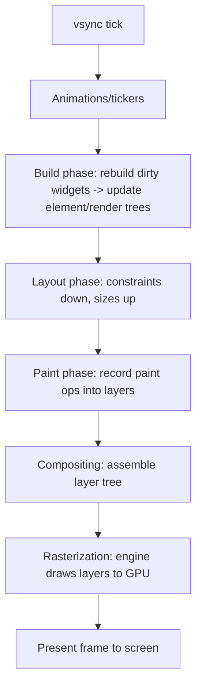
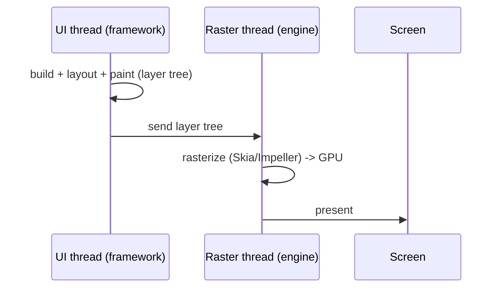

# The Rendering Pipeline (Overview)

> Every frame, Flutter runs build → layout → paint → composite → rasterize: the framework (UI thread) produces a layer tree, and the engine (raster thread) turns it into GPU pixels — all within the ~16ms (60fps) / ~8ms (120fps) budget.

## Introduction

This file is the map of a single frame. Each subsequent file drills into a phase. The key split: the **framework** does build/layout/paint on the **UI (Dart) thread**; the **engine** does compositing/rasterization on the **raster thread** ([Module 10](../10%20Flutter%20Architecture/README.md)).

## Why this concept exists

Smooth UI means finishing all phases within the frame budget. Understanding the pipeline tells you *what* happens *when* and *where*, so you can find the bottleneck (a slow `build`? expensive layout? heavy paint? shader jank?) instead of guessing.

## Real-world analogy

An **animation studio per frame**: writers decide what's in the scene (build), the set crew arranges/sizes props (layout), artists draw each cel (paint), the compositor stacks the cels/layers (composite), and the printer exposes it to film (rasterize) — all before the projector needs the next frame (vsync).

## Problem Statement

Your list scroll stutters. Is it rebuilding too much, laying out expensively, painting heavy effects, or hitting shader compilation? You'll learn the phases so you can attribute the cost.

## Internal Working



The frame steps (driven by `SchedulerBinding` — [scheduler_and_vsync.md](scheduler_and_vsync.md)):
1. **Vsync** signals a new frame.
2. **Animate:** tickers/animations advance; callbacks may mark things dirty.
3. **Build:** dirty elements rebuild; widget→element→render tree updates ([build_phase.md](build_phase.md)).
4. **Layout:** render objects compute sizes from constraints ([layout_phase.md](layout_phase.md)).
5. **Paint:** render objects record drawing commands into **layers** ([paint_phase.md](paint_phase.md)).
6. **Composite:** the layer tree is assembled ([compositing_and_repaint_boundaries.md](compositing_and_repaint_boundaries.md)).
7. **Rasterize:** the engine's raster thread converts layers to pixels via Skia/Impeller ([rasterization_skia_impeller.md](rasterization_skia_impeller.md)).
8. **Present:** the frame is shown.

**Thread split:** steps 2–6 run on the **UI thread**; step 7 on the **raster thread**. Both must fit the budget or a frame drops.

## Memory Representation

The three trees (widget/element/render) live in the Dart heap; the layer tree and GPU textures live engine-side ([06](../06%20Flutter%20Fundamentals/widgets_elements_render_objects.md), [02 · memory_and_gc](../02%20Advanced%20Dart/memory_and_gc.md)).

## Compiler Behavior

`const` widgets reduce build-phase work (skipped subtrees) ([06 · declarative_ui](../06%20Flutter%20Fundamentals/declarative_ui.md)).

## Runtime Behavior

Only **dirty** parts re-run: dirty elements rebuild, dirty render objects re-layout/re-paint. Clean subtrees are skipped — the pipeline is incremental, not full-tree every frame.

## Flutter Engine Behavior

The engine receives the layer tree and rasterizes on the raster thread; long raster times (heavy effects, shader compilation) drop frames even if the UI thread was fast ([rasterization_skia_impeller.md](rasterization_skia_impeller.md)).

## Dart VM Behavior

Build/layout/paint run as Dart on the root isolate's frame callback; blocking the isolate (heavy sync work) delays the whole pipeline ([02 · isolates](../02%20Advanced%20Dart/isolates.md)).

## Examples

```dart
// Conceptual: what each phase touches for a simple widget
// build:   Text('hi') widget -> Element -> RenderParagraph created/updated
// layout:  parent gives constraints -> RenderParagraph measures the text -> size up
// paint:   RenderParagraph records glyph-drawing ops into a layer
// composite: layer placed in the layer tree at its offset
// raster:  engine draws the glyphs to the GPU surface
```

```dart
import 'package:flutter/scheduler.dart';
// Observe frame timing (profile/release) to see UI vs raster durations:
// SchedulerBinding.instance.addTimingsCallback((timings) {
//   for (final t in timings) {
//     print('build+layout+paint: ${t.buildDuration}, raster: ${t.rasterDuration}');
//   }
// });
```

## Diagrams



## Common Mistakes

| Mistake | Why | Fix |
|---------|-----|-----|
| Assuming the whole tree rebuilds each frame | Only dirty parts do | Trust incremental phases; scope dirtiness |
| Blaming "rendering" for all jank | Could be any phase | Profile to find the slow phase |
| Heavy sync work in build/handlers | Blocks UI thread → misses budget | Offload to isolates ([02](../02%20Advanced%20Dart/isolates.md)) |
| Ignoring raster-thread cost | UI-thread-only view | Check `rasterDuration` for GPU-side jank |

## Best Practices

- Keep each phase within budget: cheap `build`, simple layout, light paint, minimal raster.
- Use DevTools **Performance/Timeline** to see UI vs raster durations per frame ([Module 21](../21%20Performance/README.md)).
- Reduce build work with `const`/scoping; reduce paint/raster with `RepaintBoundary` and simpler effects.
- Move CPU-bound work off the UI thread.

## Performance

Budget ≈ 16ms@60fps / 8ms@120fps for **UI + raster combined per frame** (they pipeline, but each must keep up). Any phase overrunning drops frames ([Module 21](../21%20Performance/README.md)).

## Advantages / Disadvantages

- **+** Incremental, phase-separated pipeline enables targeted optimization and high frame rates.
- **−** Multiple phases/threads to reason about; jank source isn't obvious without profiling.

## Interview Questions

1. **🟢 Name the rendering pipeline phases.** — Build → layout → paint → composite → rasterize (preceded by animation, followed by present), driven by vsync.
2. **🟢 Which phases run on which thread?** — Build/layout/paint/composite on the UI (Dart) thread; rasterization on the raster thread.
3. **🟡 Is the whole tree rebuilt every frame?** — No; only dirty elements rebuild and only dirty render objects re-layout/re-paint — the pipeline is incremental.
4. **🟡 What's the frame budget?** — ~16ms at 60fps (~8ms at 120fps); UI and raster work must each fit or a frame drops.
5. **🟡 How do you tell UI-thread vs raster-thread jank apart?** — Frame timings: `buildDuration` (UI) vs `rasterDuration` (raster) in DevTools/`addTimingsCallback`.
6. **🔴 Why can a fast `build` still drop frames?** — Raster-thread cost (heavy effects, shader compilation) or layout/paint cost can exceed budget independently.
7. **🔴 What triggers a frame?** — A vsync signal (via `SchedulerBinding`), or a scheduled frame after something marked the tree dirty (`setState`, animation, layout change).

## Senior Engineer Tips

- Debug jank by **phase**: profile → is it build (rebuilds), layout, paint, or raster? Fix the actual bottleneck.
- Remember two budgets (UI and raster); a `RepaintBoundary` or Impeller can fix raster-side jank a `const` won't.
- Keep the UI isolate free; the pipeline can't run while it's blocked.

## Architect Perspective

The pipeline is the performance model of Flutter. Designing for it — incremental rebuilds, bounded layout/paint cost, isolate offloading, and awareness of the raster thread — is what sustains 60/120fps at scale. It frames every decision in [Module 21 Performance](../21%20Performance/README.md).

## Summary

- A frame = build→layout→paint→composite→raster, at vsync; UI thread does build/layout/paint/composite, raster thread rasterizes.
- Only dirty parts re-run (incremental); each phase must fit the budget.
- Diagnose jank by phase and thread; keep the UI isolate free.

## Revision Notes

- Phases: (animate) → build → layout → paint → composite → rasterize → present.
- UI thread: build/layout/paint/composite; raster thread: rasterize.
- Incremental (dirty-only); budget ~16ms@60/~8ms@120.
- `buildDuration` vs `rasterDuration` to localize jank.

## Practice Questions

1. Which phases are UI-thread vs raster-thread?
2. Why doesn't the whole tree rebuild every frame?
3. How can a fast build still cause jank?

## Coding Questions

1. Add an `addTimingsCallback` to log build vs raster durations.
2. Describe, for a `Container(child: Text)`, what each phase does.
3. Identify (in DevTools) whether a janky screen is UI- or raster-bound (write findings).

## Mini Project

**Frame-phase report (Flutter + docs):** Build a moderately complex animated screen, capture per-frame `buildDuration`/`rasterDuration`, and write `PIPELINE.md` attributing time to phases and threads with a Mermaid diagram. Acceptance: correct phase/thread mapping; real timing data; diagnosis stated.
