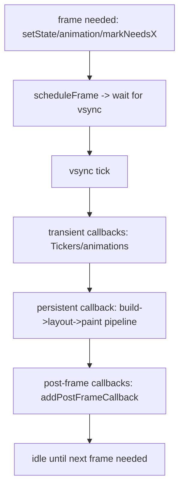
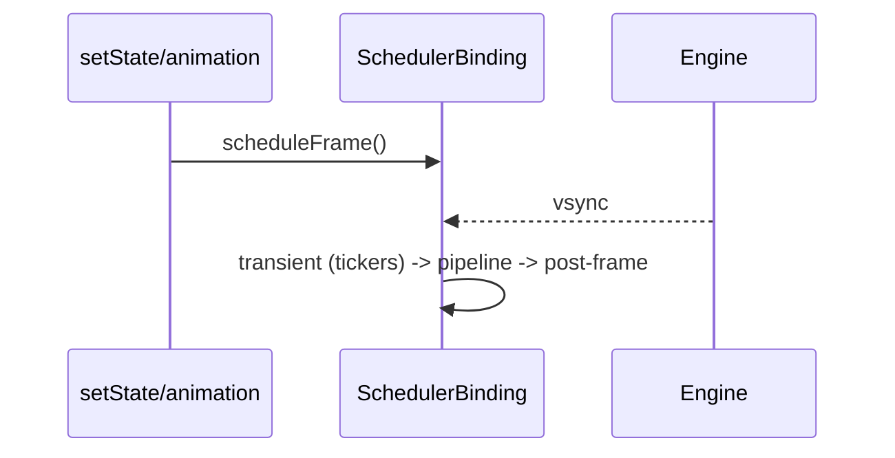

# The Scheduler & Vsync (`SchedulerBinding`, Frame Phases)

> The `SchedulerBinding` drives frames in sync with the display's **vsync** signal, running transient callbacks (animations), then the build/layout/paint pipeline, then post-frame callbacks — the clock that paces the whole pipeline.

## Introduction

Frames don't happen continuously; they're scheduled and produced in step with the screen's refresh (vsync). This file covers `SchedulerBinding`, how a frame is requested and structured (transient vs persistent vs post-frame callbacks), `Ticker`s, and how work is scheduled to keep frames on time.

## Why this concept exists

Producing frames faster than the display can show them wastes power; slower causes jank. Vsync-aligned scheduling ensures Flutter does exactly one frame's work per refresh, and gives well-defined hook points (animation ticks, post-frame callbacks) for time-based and after-layout work.

## Real-world analogy

A **metronome for an orchestra**: vsync is the beat; on each beat the conductor (`SchedulerBinding`) cues the sections in order — first the soloists warming up (animations), then the full pipeline (build/layout/paint), then the stagehands (post-frame). Everyone plays in time or the performance stutters.

## Problem Statement

You need an animation to advance each frame, run code *after* the first layout (e.g., measure a widget or show a dialog), and understand why frames drop when you block the isolate. You'll use `Ticker`/`addPostFrameCallback` and reason about scheduling.

## Internal Working



- **`SchedulerBinding`** requests a frame (`scheduleFrame`) when something needs redrawing; the engine calls back on the next **vsync**.
- Frame callback phases:
  - **Transient callbacks**: `Ticker`s driving animations (`AnimationController`) — advance animation values.
  - **Persistent callback**: the rendering pipeline (build → layout → paint → composite) ([pipeline_overview.md](pipeline_overview.md)).
  - **Post-frame callbacks** (`WidgetsBinding.instance.addPostFrameCallback`): run once after the frame — for measuring, navigation, showing dialogs after first layout.
- **`Ticker`**: fires once per frame with elapsed time; `AnimationController` uses it (needs a `vsync` provider — `SingleTickerProviderStateMixin`).
- Frames are **scheduled on demand**; if nothing changes, no frames are produced (idle → power-efficient).
- Blocking the UI isolate delays the frame callback → dropped frames ([02 · event_loop](../02%20Advanced%20Dart/event_loop.md)).

## Memory Representation

Callbacks are closures held by the binding; one-shot post-frame callbacks are cleared after running. Persistent tickers must be disposed ([08 · dispose_and_leaks](../08%20Widget%20Lifecycle/dispose_and_leaks.md)).

## Compiler Behavior

Not applicable.

## Runtime Behavior

`addPostFrameCallback` runs **once** after the current/next frame. Animations advance in the transient phase each frame while running. Scheduling more work than fits the budget drops frames.

## Flutter Engine Behavior

The engine's vsync waiter triggers the Dart frame callback; UI-thread frame work must finish before the raster thread can present on time ([rasterization_skia_impeller.md](rasterization_skia_impeller.md)).

## Dart VM Behavior

Frame callbacks run on the root isolate's event loop; long synchronous tasks there block frame production — offload to isolates ([02 · isolates](../02%20Advanced%20Dart/isolates.md)).

## Examples

```dart
import 'package:flutter/material.dart';

class SchedulerDemo extends StatefulWidget {
  const SchedulerDemo({super.key});
  @override
  State<SchedulerDemo> createState() => _SchedulerDemoState();
}
class _SchedulerDemoState extends State<SchedulerDemo>
    with SingleTickerProviderStateMixin {
  late final AnimationController _c =
      AnimationController(vsync: this, duration: const Duration(seconds: 2))..repeat();
  Size? _measured;

  @override
  void initState() {
    super.initState();
    // Run AFTER the first frame (layout done) — e.g., measure or show a dialog:
    WidgetsBinding.instance.addPostFrameCallback((_) {
      final size = context.size; // safe now: layout has happened
      setState(() => _measured = size);
    });
  }

  @override
  void dispose() { _c.dispose(); super.dispose(); }

  @override
  Widget build(BuildContext context) {
    return Column(
      mainAxisSize: MainAxisSize.min,
      children: [
        RotationTransition(turns: _c, child: const Icon(Icons.sync, size: 48)),
        Text('measured after first frame: $_measured'),
      ],
    );
  }
}
```

## Diagrams



## Common Mistakes

| Mistake | Why | Fix |
|---------|-----|-----|
| Reading `context.size`/showing dialogs in `build`/`initState` | Layout not done yet | Use `addPostFrameCallback` |
| Blocking the isolate in a frame callback | Drops frames | Offload heavy work to isolates |
| Not disposing `AnimationController`/tickers | Leaks; keeps frames scheduled | `dispose()` them ([08](../08%20Widget%20Lifecycle/dispose_and_leaks.md)) |
| Assuming frames run continuously | They're on-demand | Trigger via animation/`setState`/`markNeedsX` |
| Doing per-frame allocations in tickers | GC pressure | Reuse objects; keep tick work light |

## Best Practices

- Use `addPostFrameCallback` for after-first-layout work (measure, navigate, show overlays).
- Drive animations with `AnimationController`/`Ticker` (vsync-aligned); dispose them.
- Keep frame-callback work within budget; offload CPU-bound tasks to isolates.
- Don't force continuous frames; let scheduling be on-demand for power efficiency.

## Performance

On-demand, vsync-aligned scheduling maximizes smoothness and battery life; the enemy is UI-isolate blocking and over-budget frame work ([Module 21](../21%20Performance/README.md)).

## Advantages / Disadvantages

- **+** Vsync-synced, on-demand frames (smooth + power-efficient); clear hook phases for time-based/after-layout work.
- **−** Must respect the budget; blocking the isolate stalls everything; lifecycle of tickers to manage.

## Interview Questions

1. **🟢 What drives frames in Flutter?** — `SchedulerBinding`, in sync with the display's vsync signal; frames are scheduled on demand.
2. **🟢 What is `addPostFrameCallback` for?** — Running code once after a frame completes (e.g., measuring a widget or showing a dialog after first layout).
3. **🟡 Name the frame callback phases.** — Transient (tickers/animations), persistent (build/layout/paint pipeline), post-frame callbacks.
4. **🟡 What is a `Ticker` and who uses it?** — A per-frame callback with elapsed time; `AnimationController` uses it (needs a `vsync` provider).
5. **🟡 Why can't you read `context.size` in `initState`?** — Layout hasn't run; use `addPostFrameCallback` after the first frame.
6. **🔴 Are frames produced continuously?** — No; only when work is scheduled (animation/`setState`/`markNeedsX`); idle means no frames (power-efficient).
7. **🔴 Why does blocking the UI isolate drop frames?** — The frame callback runs on that isolate's event loop; a blocked loop can't run build/layout/paint in time.

## Senior Engineer Tips

- "Do it after layout" → `addPostFrameCallback`; "do it every frame with time" → `Ticker`/`AnimationController`.
- If frames drop with simple UI, suspect isolate-blocking work in a callback; move it off-thread.
- Avoid scheduling perpetual frames (e.g., a never-ending repaint) unless truly animating — it drains battery.

## Architect Perspective

The scheduler is the heartbeat that ties animation, layout, and rasterization to the display. Designing time-based work around its phases (and keeping the isolate free) is fundamental to smooth, efficient apps and to correct animation architecture ([Module 22](../22%20Animations/README.md), [Module 21](../21%20Performance/README.md)).

## Summary

- `SchedulerBinding` schedules frames on demand, aligned to vsync; each frame runs transient (animations) → pipeline → post-frame callbacks.
- Use `addPostFrameCallback` for after-layout work and `Ticker`/`AnimationController` for per-frame animation; dispose tickers.
- Keep the isolate free and within budget; frames are on-demand, not continuous.

## Revision Notes

- `SchedulerBinding` + vsync; frames on-demand (scheduleFrame).
- Phases: transient (tickers) → persistent (build/layout/paint) → post-frame.
- `addPostFrameCallback` = after layout; `Ticker`/`AnimationController` = per-frame (needs vsync, dispose).
- Blocking isolate → dropped frames; idle = no frames (power).

## Practice Questions

1. Where do you run code that needs a widget's measured size?
2. Why are frames produced on demand rather than continuously?
3. Why does isolate-blocking cause dropped frames?

## Coding Questions

1. Use `addPostFrameCallback` to measure a widget after first layout.
2. Drive a repeating animation with `AnimationController` and dispose it.
3. Show that blocking the isolate for 500ms drops a periodic animation's frames.

## Mini Project

**Scheduler demo (Flutter):** Build a screen with a vsync-driven animation, an after-first-layout measurement via `addPostFrameCallback`, and a button that deliberately blocks the isolate to demonstrate dropped frames (then a fixed version offloading to `Isolate.run`). Acceptance: post-frame measurement works; animation smooth until blocked; fix demonstrated; tickers disposed; app runs.
