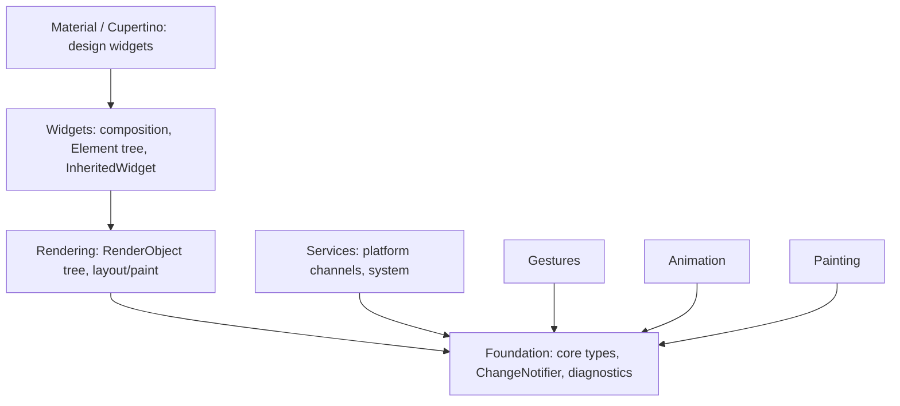
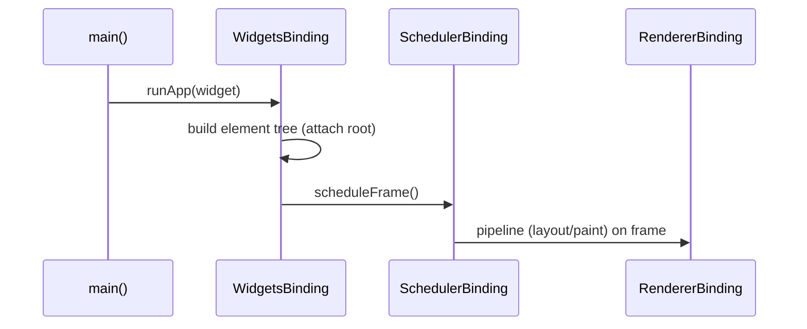

# The Framework Stack (foundation → rendering → widgets → Material) + Bindings

> The Dart framework is a layered stack — Foundation at the base, then Rendering, then Widgets, then Material/Cupertino on top — glued to the engine by **bindings** (`WidgetsBinding`, `RenderingBinding`, `SchedulerBinding`, `GestureBinding`, `ServicesBinding`).

## Introduction

Everything you import from `package:flutter` sits in a layered Dart stack. This file details those sub-layers, what each provides, and the **bindings** singletons that connect the framework to the engine and drive the app.

## Why this concept exists

Understanding the stack explains *where APIs come from* and *how the framework boots and runs*: `runApp` attaches the widget tree via `WidgetsBinding`; the `SchedulerBinding` drives frames; the `RenderingBinding` owns the render tree. It demystifies "what is `WidgetsFlutterBinding.ensureInitialized()`?"

## Real-world analogy

A **layered cake**: Foundation is the base sponge (core utilities), Rendering is the filling (layout/paint), Widgets is the frosting you interact with, and Material/Cupertino are the decorations. **Bindings** are the cake stand + turntable that hold it together and make it spin (drive frames/events).

## Problem Statement

Where does `Offset`/`Listenable` come from vs `RenderBox` vs `Column` vs `AppBar`? And what wires the tree to the engine so frames happen? You'll place each in the stack and name the binding.

## Internal Working



**Layers (bottom → top):**
- **Foundation**: core primitives — `Key`, `ChangeNotifier`/`Listenable`, `Diagnosticable`, collections, `Offset`/`Size` (via `dart:ui`).
- **Painting/Animation/Gestures/Services**: cross-cutting subsystems (drawing helpers, `AnimationController`/`Tween`, gesture recognizers, platform `MethodChannel`).
- **Rendering**: the `RenderObject` tree, `BoxConstraints`, layout/paint ([09](../09%20Rendering%20Pipeline/README.md)).
- **Widgets**: the composition layer — `Widget`/`Element`, `StatelessWidget`/`StatefulWidget`, `InheritedWidget`, `BuildContext` ([06](../06%20Flutter%20Fundamentals/04_widgets_elements_render_objects.md)).
- **Material / Cupertino**: opinionated design-system widgets (`Scaffold`, `AppBar`, `CupertinoButton`).

**Bindings** (singletons mixed into `WidgetsFlutterBinding`, the engine glue):

| Binding | Role |
|---------|------|
| `SchedulerBinding` | Frame scheduling / vsync callbacks ([09 · scheduler](../09%20Rendering%20Pipeline/07_scheduler_and_vsync.md)) |
| `GestureBinding` | Pointer/gesture event dispatch |
| `RendererBinding` | Owns the render tree + pipeline owner; connects to the engine's `dart:ui` window |
| `WidgetsBinding` | Owns the element tree; `runApp` attaches here; lifecycle observers |
| `ServicesBinding` | Platform channels / system services |
| `PaintingBinding` | Image cache / shader warm-up |

`WidgetsFlutterBinding.ensureInitialized()` instantiates this combined binding (needed before async pre-`runApp` work — [06 · app_entry_point](../06%20Flutter%20Fundamentals/07_app_entry_point.md)).

## Memory Representation

Bindings are process-wide singletons; the trees live in the Dart heap ([02 · memory_and_gc](../02%20Advanced%20Dart/13_memory_and_gc.md)).

## Compiler Behavior

Not applicable.

## Runtime Behavior

`runApp(widget)` → `WidgetsBinding.attachRootWidget` builds the element tree and schedules the first frame via `SchedulerBinding`. Frames flow through `RendererBinding`'s pipeline owner ([09](../09%20Rendering%20Pipeline/01_pipeline_overview.md)).

## Flutter Engine Behavior

`RendererBinding` connects to the engine's window (`dart:ui`); the engine drives vsync into `SchedulerBinding` and delivers input into `GestureBinding`.

## Dart VM Behavior

All framework code runs on the root isolate; bindings coordinate with the engine over that isolate's event loop ([02 · event_loop](../02%20Advanced%20Dart/01_event_loop.md)).

## Examples

```dart
import 'package:flutter/material.dart';
import 'package:flutter/foundation.dart';

// Foundation: ChangeNotifier lives here (not widgets)
class CounterModel extends ChangeNotifier {
  int value = 0;
  void inc() { value++; notifyListeners(); }
}

Future<void> main() async {
  WidgetsFlutterBinding.ensureInitialized(); // instantiate the combined binding
  // Access a binding directly (rarely needed):
  // WidgetsBinding.instance.addObserver(...); SchedulerBinding.instance.addPostFrameCallback(...)
  runApp(const MyApp()); // WidgetsBinding attaches the tree + schedules first frame
}

class MyApp extends StatelessWidget {
  const MyApp({super.key});
  @override
  Widget build(BuildContext context) => MaterialApp( // Material layer
        home: Scaffold(                                // Material layer
          body: const Center(child: Text('Stack demo')), // Widgets layer
        ),
      );
}
```

## Diagrams



## Common Mistakes

| Mistake | Why | Fix |
|---------|-----|-----|
| Async work before `ensureInitialized()` | Bindings not ready | Call it first in `main` |
| Importing `ChangeNotifier` expecting it in widgets | It's in foundation | Know the layer (`package:flutter/foundation.dart`) |
| Reaching for a binding when a widget suffices | Overcomplication | Use widgets/`context`; bindings rarely needed directly |
| Confusing render vs widget vs element APIs | Different layers | Map API → layer (RenderBox=rendering, Element=widgets) |

## Best Practices

- Know which layer an API lives in (Foundation vs Rendering vs Widgets vs Material) — it clarifies imports and intent.
- Call `WidgetsFlutterBinding.ensureInitialized()` before pre-`runApp` async setup.
- Use bindings directly only when necessary (`addPostFrameCallback`, lifecycle observers, timings); prefer widgets/`context` otherwise.
- Build on the composition (Widgets) layer; drop to Rendering only for custom layout/paint ([09 · layout_phase](../09%20Rendering%20Pipeline/03_layout_phase.md), [Module 23](../23%20Custom%20Painting/README.md)).

## Performance

Not a direct perf lever, but knowing the stack helps you target optimizations (rendering-layer for layout/paint; scheduler for frame timing) ([Module 21](../21%20Performance/README.md)).

## Advantages / Disadvantages

- **+** Clean layering, reusable subsystems, single glue point (bindings), clear API provenance.
- **−** Many layers to learn; binding internals are advanced and rarely touched.

## Interview Questions

1. **🟢 Name the framework stack layers bottom-to-top.** — Foundation → Rendering → Widgets → Material/Cupertino (with Painting/Animation/Gestures/Services as cross-cutting subsystems).
2. **🟢 What does `runApp` do at the binding level?** — `WidgetsBinding` attaches the root widget (builds the element tree) and schedules the first frame.
3. **🟡 What is `WidgetsFlutterBinding.ensureInitialized()` for?** — Instantiates the combined binding singleton so you can do async/platform work before `runApp`.
4. **🟡 What does `SchedulerBinding` vs `RendererBinding` do?** — Scheduler drives frames/vsync callbacks; Renderer owns the render tree + pipeline and connects to the engine window.
5. **🟡 Which layer is `ChangeNotifier` in?** — Foundation (not Widgets).
6. **🔴 How do input events reach your widgets?** — The engine delivers pointer events to `GestureBinding`, which dispatches them through the render/widget hit-test tree.
7. **🔴 Which binding manages the element tree vs the render tree?** — `WidgetsBinding` (element tree) and `RendererBinding` (render tree/pipeline).

## Senior Engineer Tips

- Map any Flutter type to its layer — it tells you its role and where to look for related APIs.
- You rarely touch bindings directly; when you do (`addPostFrameCallback`, `addTimingsCallback`, lifecycle observers), it's for cross-cutting hooks.
- For custom layout/paint, you're consciously dropping to the Rendering layer — a deliberate, advanced move.

## Architect Perspective

The framework stack is a textbook layered architecture ([Module 40](../40%20Clean%20Architecture/README.md)): each layer depends only downward, subsystems are cross-cutting, and one binding layer integrates with the engine. Recognizing it helps you structure your own app in layers and know exactly where framework features come from.

## Summary

- Dart framework: Foundation → Rendering → Widgets → Material/Cupertino, plus Painting/Animation/Gestures/Services.
- **Bindings** (in `WidgetsFlutterBinding`) glue the framework to the engine and drive frames/events; `ensureInitialized()` sets them up.
- Know each API's layer; build on Widgets, drop to Rendering only for custom layout/paint.

## Revision Notes

- Stack: Foundation → Rendering → Widgets → Material/Cupertino (+ Painting/Animation/Gestures/Services).
- Bindings: Scheduler(frames), Renderer(render tree), Widgets(element tree/runApp), Gestures(input), Services(channels), Painting(image cache).
- `WidgetsFlutterBinding.ensureInitialized()` before pre-`runApp` async.
- `ChangeNotifier` = foundation; RenderBox=rendering; Element=widgets.

## Practice Questions

1. Which binding attaches the tree in `runApp`?
2. Which layer provides `BoxConstraints` vs `Scaffold`?
3. Why call `ensureInitialized()` before async setup?

## Coding Questions

1. Use `SchedulerBinding.instance.addPostFrameCallback` and `addTimingsCallback`.
2. Classify 8 Flutter APIs by their stack layer.
3. Build a `ChangeNotifier` model (foundation) consumed by a widget.

## Mini Project

**Stack map (docs + app):** Build a small app and write `STACK.md` mapping each used API to its framework layer, plus a diagram of the bindings driving a frame. Acceptance: correct layer/binding attribution; `ensureInitialized` used correctly; app runs.
