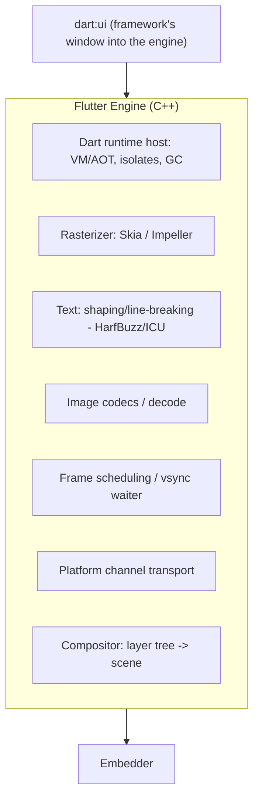
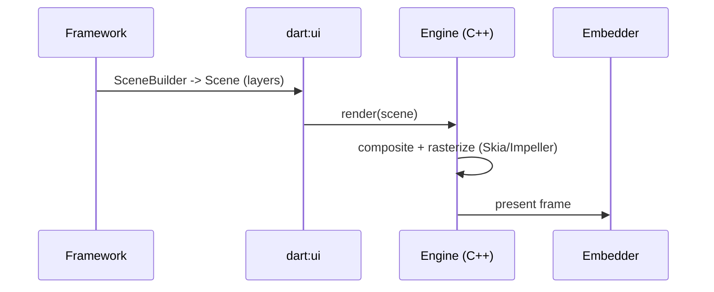

# Engine Internals (C++: Dart Runtime, Skia/Impeller, Text, Channels)

> The Flutter Engine is a C++ runtime that **hosts the Dart VM/runtime**, **rasterizes** the layer tree (Skia/Impeller), does **text shaping** and **image decoding**, and transports **platform-channel** messages — the native heart beneath your Dart framework.

## Introduction

The engine is what makes a Flutter app *native and fast*. It embeds the Dart runtime (so your code runs), owns rendering (`dart:ui` ↔ rasterizer), handles text/image, drives frame scheduling, and plumbs platform messages. This file surveys its major subsystems and how they serve the framework.

## Why this concept exists

Rendering, text, and running Dart at native speed require C++ + GPU access the framework can't do alone. Centralizing these in a reusable engine gives every platform the same fast core, and gives the framework a stable `dart:ui` interface to build on.

## Real-world analogy

The engine is a **car's engine + drivetrain**: you (framework) steer and choose the route (widgets), but the engine converts fuel to motion (Dart→pixels), and standardized parts (Skia/Impeller, text shaper) work in any chassis (platform).

## Problem Statement

What actually runs your Dart, turns layers into pixels, lays out text, decodes images, and carries plugin messages? You'll map each to an engine subsystem and to `dart:ui`.

## Internal Working



**Major subsystems:**
- **Dart runtime host**: embeds the VM (JIT in debug) / AOT runtime (release), runs isolates, performs GC ([02 · dart_compilation](../02%20Advanced%20Dart/14_dart_compilation.md), [02 · memory_and_gc](../02%20Advanced%20Dart/13_memory_and_gc.md)).
- **`dart:ui`**: the low-level Dart library exposing the engine to the framework (`Canvas`, `Picture`, `Scene`, `Window`/`PlatformDispatcher`, `Paragraph`).
- **Rasterizer**: Skia or **Impeller** converts the compositor's scene into GPU draw calls ([09 · rasterization](../09%20Rendering%20Pipeline/06_rasterization_skia_impeller.md)).
- **Compositor**: assembles the layer tree into a `Scene` for rasterization ([09 · compositing](../09%20Rendering%20Pipeline/05_compositing_and_repaint_boundaries.md)).
- **Text**: shaping, bidi, line breaking (HarfBuzz/ICU) — turns strings + styles into positioned glyphs.
- **Image**: decoding various formats to textures (on the IO runner — [03_threading_model.md](03_threading_model.md)).
- **Scheduling**: waits on vsync and drives the framework's frame callback ([09 · scheduler](../09%20Rendering%20Pipeline/07_scheduler_and_vsync.md)).
- **Platform channels**: serializes/transports messages between Dart and the embedder ([Module 26](../26%20Platform%20Channels/README.md)).

## Memory Representation

The Dart heap is managed by the embedded runtime; GPU textures/buffers and decoded images live in engine/GPU memory. Large images/layers pressure GPU memory ([09 · compositing](../09%20Rendering%20Pipeline/05_compositing_and_repaint_boundaries.md)).

## Compiler Behavior

The engine ships precompiled (C++). Your Dart is JIT/AOT-compiled and executed by the engine's hosted runtime ([02 · dart_compilation](../02%20Advanced%20Dart/14_dart_compilation.md)).

## Runtime Behavior

The framework calls `dart:ui` (e.g., builds a `Scene` via `SceneBuilder`); the engine rasterizes and presents. Text/image work is delegated to engine subsystems; channel messages are marshaled to the embedder.

## Flutter Engine Behavior

This file *is* the engine. Key point: it's shared and native — your leverage is through `dart:ui`/framework APIs and by respecting engine constraints (AOT, threads, raster cost).

## Dart VM Behavior

The engine hosts the VM/AOT runtime; your app runs on the root isolate. Background isolates you spawn also run under this runtime ([02 · isolates](../02%20Advanced%20Dart/04_isolates.md)).

## Examples

```dart
import 'dart:ui' as ui; // the engine's low-level interface (framework builds on this)
import 'package:flutter/material.dart';

// Most code never touches dart:ui directly; the framework wraps it.
// Example: measure/lay out text via the engine's Paragraph (what Text uses under the hood).
double measureTextWidth(String text, double fontSize) {
  final builder = ui.ParagraphBuilder(ui.ParagraphStyle())
    ..pushStyle(ui.TextStyle(fontSize: fontSize))
    ..addText(text);
  final paragraph = builder.build()
    ..layout(const ui.ParagraphConstraints(width: double.infinity));
  return paragraph.maxIntrinsicWidth; // engine text subsystem did the shaping
}

void main() => runApp(MaterialApp(
      home: Scaffold(
        body: Center(child: Text('Engine width: ${measureTextWidth("Hi", 24).toStringAsFixed(1)}')),
      ),
    ));
```

## Diagrams



## Common Mistakes

| Mistake | Why | Fix |
|---------|-----|-----|
| Trying to "modify the engine" from Dart | It's precompiled native | Use `dart:ui`/framework APIs; contribute upstream if needed |
| Expecting reflection at runtime | AOT engine + tree shaking | Use codegen ([02 · dart_compilation](../02%20Advanced%20Dart/14_dart_compilation.md)) |
| Ignoring engine-side costs (text/raster/decode) | They're real budget | Measure raster/text/image cost ([Module 21](../21%20Performance/README.md)) |
| Assuming channels are synchronous | They're async transport | Await; keep messages small ([Module 26](../26%20Platform%20Channels/README.md)) |

## Best Practices

- Build on framework/`dart:ui` APIs; treat the engine as a fast, fixed native core.
- Respect engine constraints: AOT (no reflection), raster/text/image cost, GPU memory.
- Prefer Impeller where available for predictable rasterization ([09 · rasterization](../09%20Rendering%20Pipeline/06_rasterization_skia_impeller.md)).
- Keep platform-channel messages small/async; do native heavy-lifting on the native side.

## Performance

Engine subsystems each cost: rasterization (effects/shaders), text shaping (complex scripts/large text), image decode (size), compositing (layers). Profile per subsystem; many fixes are framework-side choices (fewer effects, sized decodes) ([Module 21](../21%20Performance/README.md)).

## Advantages / Disadvantages

- **+** Native speed, consistent rendering, shared across platforms, rich text/image support.
- **−** Opaque/native (can't tweak from Dart), constrains Dart features (no reflection), adds app size.

## Interview Questions

1. **🟢 What are the engine's main jobs?** — Host the Dart runtime, rasterize (Skia/Impeller), do text shaping and image decode, schedule frames, and transport platform-channel messages.
2. **🟢 What is `dart:ui`?** — The low-level Dart library exposing the engine (Canvas/Picture/Scene/PlatformDispatcher/Paragraph) that the framework builds upon.
3. **🟡 How does the framework hand a frame to the engine?** — It builds a `Scene` (via `SceneBuilder`) from the layer tree and calls the engine to render it.
4. **🟡 Skia vs Impeller in the engine?** — Both are the rasterizer; Skia compiles shaders lazily (first-run jank), Impeller precompiles them for predictable frames ([09](../09%20Rendering%20Pipeline/06_rasterization_skia_impeller.md)).
5. **🟡 Where does the Dart VM live?** — Embedded in the engine; it hosts and runs your isolates.
6. **🔴 Why is `dart:mirrors` unavailable?** — The AOT engine + whole-program tree shaking can't support runtime reflection; use codegen.
7. **🔴 What engine subsystems have per-frame cost?** — Rasterizer (effects/shaders), text shaping, image decode, compositing — each part of the frame budget.

## Senior Engineer Tips

- You optimize the engine indirectly: fewer layer-creating effects, sized image decodes, simpler text/clips, Impeller.
- `dart:ui` is a valuable mental anchor — `Text`/`Canvas`/`Image` all bottom out there.
- For deep native work, do it natively (plugin) and pass small results over channels rather than fighting the engine boundary.

## Architect Perspective

The engine is the fixed, high-performance substrate; your architecture works *with* it: minimize per-subsystem cost, respect AOT constraints (codegen over reflection), and localize native work behind channels. This informs performance budgets, dependency choices (no reflection-based libs), and platform strategy ([Modules 21, 26, 53, 54](../21%20Performance/README.md)).

## Summary

- The engine (C++) hosts the Dart runtime, rasterizes via Skia/Impeller, shapes text, decodes images, schedules frames, and carries channel messages, exposed to the framework via `dart:ui`.
- It's native and fixed; you influence it through framework choices and by respecting its constraints.
- Each subsystem has real per-frame cost to budget and profile.

## Revision Notes

- Engine (C++): Dart runtime host + rasterizer (Skia/Impeller) + text (HarfBuzz/ICU) + image decode + scheduler + channels + compositor.
- `dart:ui` = framework↔engine interface (Canvas/Scene/Paragraph/PlatformDispatcher).
- AOT ⇒ no reflection (codegen). Impeller = predictable raster.
- Costs: raster/text/decode/composite — profile per subsystem.

## Practice Questions

1. What runs your Dart code, and in what language is the engine written?
2. What is `dart:ui` and what sits on top of it?
3. Why can't you use runtime reflection?

## Coding Questions

1. Use `dart:ui` `ParagraphBuilder` to measure text width.
2. Identify which engine subsystem each of {Text, Image, Opacity, MethodChannel} exercises.
3. Explain (comments) the framework→`dart:ui`→engine frame handoff.

## Mini Project

**Engine subsystem map (docs + snippet):** Write `ENGINE.md` mapping framework features (text, images, effects, channels, animation) to engine subsystems and their per-frame costs, with a `dart:ui` text-measurement snippet as evidence. Acceptance: correct subsystem mapping; cost notes; runnable snippet.
