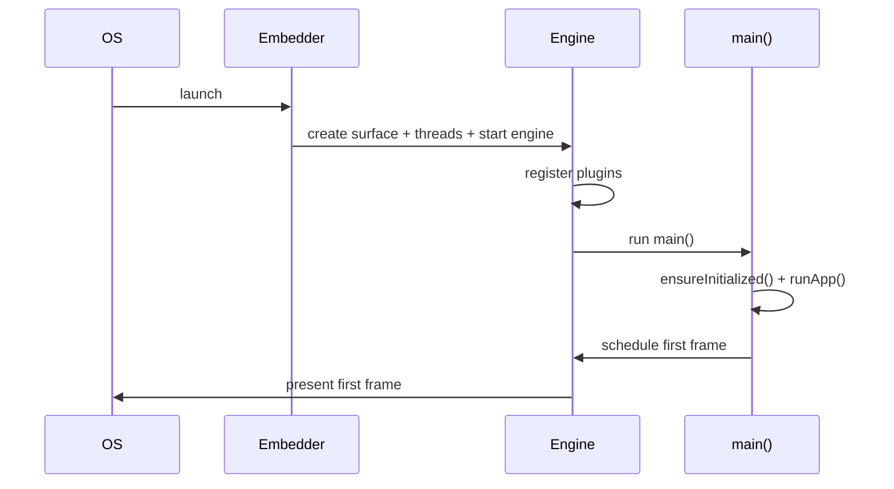

# The Embedder & App Startup Sequence

> The **embedder** is the platform-native host that creates the render surface, wires input/lifecycle, sets up the engine's threads, and registers plugins — and it's the first thing that runs when the app launches, before your `main()`.

## Introduction

The embedder is the per-OS glue between the engine and the platform (Android's `FlutterActivity`, iOS's `FlutterViewController`, the web bootstrap, desktop runners). This file details its responsibilities and traces the full **startup sequence** from process launch to your first frame.

## Why this concept exists

Every platform has its own windowing, input, lifecycle, and threading. The embedder isolates that so the shared engine + framework stay portable. Understanding startup explains cold-start latency, where plugins register, and why `WidgetsFlutterBinding.ensureInitialized()` matters.

## Real-world analogy

The embedder is the **venue crew** for a touring show: they hook up power (surface/GPU), set up the stage and mics (input), manage doors/curtain times (lifecycle), and connect local vendors (plugins) — all before the performers (your `main`) take the stage.

## Problem Statement

What runs before `main()`? Where do plugins get registered? Why is cold start slow, and what can you defer? You'll trace launch → engine init → `main` → first frame.

## Internal Working

```mermaid
flowchart TD
    Launch[OS launches process] --> EmbInit[Embedder init: FlutterActivity/ViewController/web bootstrap]
    EmbInit --> Surface[create render surface + task runners/threads]
    EmbInit --> EngInit[start engine + Dart runtime]
    EngInit --> Plugins[register plugins - GeneratedPluginRegistrant]
    Plugins --> MainDart[run Dart entrypoint: main()]
    MainDart --> Ensure[WidgetsFlutterBinding.ensureInitialized()]
    Ensure --> RunApp[runApp(rootWidget)]
    RunApp --> FirstFrame[schedule + render first frame]
```

**Embedder responsibilities:**
- Create and manage the **render surface** (GL/Metal/Vulkan/Canvas) the engine draws into.
- Set up the engine's **task runners/threads** ([threading_model.md](threading_model.md)).
- Feed **input events** (touch/keyboard/mouse) into the engine → `GestureBinding`.
- Manage **app lifecycle** signals (foreground/background) → `AppLifecycleState` ([08 · app_lifecycle](../08%20Widget%20Lifecycle/app_lifecycle.md)).
- **Register plugins** (e.g., `GeneratedPluginRegistrant`) so platform channels resolve.
- Host the engine and start the **Dart entrypoint** (`main`).

**Startup sequence (cold start):**
1. OS launches the process; embedder (`FlutterActivity`/`FlutterViewController`/web loader) initializes.
2. Embedder creates the surface + task runners and **starts the engine** (loads the Dart runtime + your AOT snapshot).
3. Plugins register with the embedder.
4. Engine runs your **`main()`** on the UI runner.
5. `WidgetsFlutterBinding.ensureInitialized()` sets up bindings ([framework_stack.md](framework_stack.md)).
6. `runApp(widget)` attaches the tree and schedules the first frame.
7. First frame builds/lays out/paints → engine rasterizes → embedder presents.

## Memory Representation

Embedder holds the platform surface/window handles; engine + Dart heap initialized during startup ([engine_internals.md](engine_internals.md)).

## Compiler Behavior

Release apps load an **AOT snapshot**; the embedder starts the engine which executes it ([02 · dart_compilation](../02%20Advanced%20Dart/dart_compilation.md)).

## Runtime Behavior

Cold start pays engine init + snapshot load + first-frame build; warm start reuses a running engine. Pre-`runApp` synchronous work delays the first frame.

## Flutter Engine Behavior

The engine is created/hosted by the embedder; it begins the frame loop once `runApp` schedules a frame ([09 · scheduler](../09%20Rendering%20Pipeline/scheduler_and_vsync.md)).

## Dart VM Behavior

The embedder/engine initializes the Dart runtime; `main` runs on the root isolate's event loop ([02 · event_loop](../02%20Advanced%20Dart/event_loop.md)).

## Examples

```dart
import 'package:flutter/material.dart';

Future<void> main() async {
  // Everything before runApp adds to cold-start time — keep it lean.
  WidgetsFlutterBinding.ensureInitialized(); // bindings ready (needed for plugins/DI)

  // ✅ Defer non-critical init to AFTER first frame to render fast:
  runApp(const MyApp());
  WidgetsBinding.instance.addPostFrameCallback((_) async {
    // await warmUpCaches(); await analytics.init(); // non-blocking to first frame
  });

  // ❌ Anti-pattern: heavy await before runApp delays the first frame:
  // await loadEverything();  // blocks startup
  // runApp(const MyApp());
}

class MyApp extends StatelessWidget {
  const MyApp({super.key});
  @override
  Widget build(BuildContext context) =>
      const MaterialApp(home: Scaffold(body: Center(child: Text('Booted'))));
}
```

```text
Platform registration (generated):
  Android: GeneratedPluginRegistrant.registerWith(...) in FlutterActivity flow
  iOS:     GeneratedPluginRegistrant.register(with:) in AppDelegate
These wire platform channels so plugins work (Module 26).
```

## Diagrams



## Common Mistakes

| Mistake | Why | Fix |
|---------|-----|-----|
| Heavy `await` before `runApp` | Delays first frame (slow cold start) | Defer to `addPostFrameCallback`/after first frame |
| Async plugin use before `ensureInitialized()` | Bindings/channels not ready | Call `ensureInitialized()` first |
| Assuming plugins auto-work in custom entrypoints | Registration needed | Ensure plugins are registered by the embedder |
| Ignoring cold vs warm start | Different budgets | Optimize cold start; measure both |
| Blocking `main` for analytics/DB | Slow launch | Initialize lazily/post-frame |

## Best Practices

- Keep pre-`runApp` work **minimal**; render a first frame (splash) fast, then finish init post-frame.
- Call `WidgetsFlutterBinding.ensureInitialized()` before any async/plugin/DI setup in `main`.
- Defer non-critical initialization (analytics, warm-ups, prefetch) with `addPostFrameCallback` or lazy loading.
- Measure **cold start** (TTID/TTFD) and reduce snapshot/init work ([Module 21](../21%20Performance/README.md), [Module 51](../51%20Deployment/README.md)).
- Keep native/plugin setup in the embedder minimal and fast.

## Performance

Cold start = engine init + snapshot load + pre-`runApp` work + first-frame render. Deferring non-critical init and shrinking startup work are the main levers; a lightweight first frame improves perceived speed ([Module 21](../21%20Performance/README.md)).

## Advantages / Disadvantages

- **+** Portable startup via thin per-platform embedder; clear plugin/lifecycle integration point; controllable cold-start budget.
- **−** Cold-start cost (engine + snapshot); platform-specific embedder details; easy to bloat `main`.

## Interview Questions

1. **🟢 What is the embedder?** — The platform-native host that creates the render surface, sets up threads, feeds input/lifecycle, registers plugins, and starts the engine + Dart entrypoint.
2. **🟢 What runs before your `main()`?** — Embedder init, surface/thread setup, engine + Dart runtime startup, and plugin registration.
3. **🟡 Where and why do plugins register?** — In the embedder (e.g., `GeneratedPluginRegistrant`) so platform channels resolve to native implementations.
4. **🟡 Why keep work out of `main` before `runApp`?** — It delays the first frame; defer non-critical init (post-frame/lazy) for faster cold start.
5. **🟡 Cold vs warm start?** — Cold start pays full engine init + snapshot load + first frame; warm start reuses a running engine and is faster.
6. **🔴 Trace launch → first frame.** — OS launch → embedder init → surface/threads + engine start → plugin registration → `main` → `ensureInitialized` → `runApp` → first frame rasterized + presented.
7. **🔴 How would you improve cold start?** — Minimize/defer pre-`runApp` work, lazy-init services, reduce startup dependencies, show a fast first frame, and measure TTID/TTFD.

## Senior Engineer Tips

- Put only critical wiring before `runApp`; move everything else to post-first-frame or lazy init.
- Treat the embedder as the native integration seam (plugins, deep links, lifecycle) — keep it thin and fast.
- Measure cold start on low-end devices; startup regressions are easy to introduce via `main` bloat.

## Architect Perspective

Startup and the embedder define first-impression performance and the native-integration boundary. Architecting a lean `main` (composition root that defers non-critical work — [05 · dependency_injection](../05%20Design%20Patterns/dependency_injection.md)), disciplined plugin registration, and measured cold-start budgets is a cross-cutting decision affecting UX, deployment, and platform strategy ([Modules 21, 51, 26](../21%20Performance/README.md)).

## Summary

- The embedder hosts the engine per platform: surface, threads, input, lifecycle, plugin registration, and launching `main`.
- Startup: OS → embedder → engine/runtime → plugins → `main` → `ensureInitialized` → `runApp` → first frame.
- Keep pre-`runApp` work minimal; defer non-critical init; measure and optimize cold start.

## Revision Notes

- Embedder = platform host: surface + task runners + input + lifecycle + plugin registration + start engine/`main`.
- Boot: launch → embedder → engine+runtime → plugins → main → ensureInitialized → runApp → first frame.
- Cold start = engine init + snapshot + pre-runApp + first frame; defer non-critical work (post-frame/lazy).
- `ensureInitialized()` before async/plugins; keep `main` lean.

## Practice Questions

1. What happens between process launch and your `main()` running?
2. Why does heavy work in `main` hurt cold start?
3. Where do plugins get registered and why does it matter?

## Coding Questions

1. Structure `main` to render a first frame fast, deferring analytics/warm-ups post-frame.
2. Add a post-frame callback that initializes non-critical services.
3. Identify which startup steps are embedder vs engine vs Dart.

## Mini Project

**Fast-boot skeleton (Flutter + docs):** Build an app whose `main` does only critical wiring + `runApp`, defers a simulated heavy init to `addPostFrameCallback`, and shows a fast first frame. Write `STARTUP.md` tracing the boot sequence and cold-start levers. Acceptance: fast first frame; non-critical init deferred; correct boot-sequence narrative; app runs.
