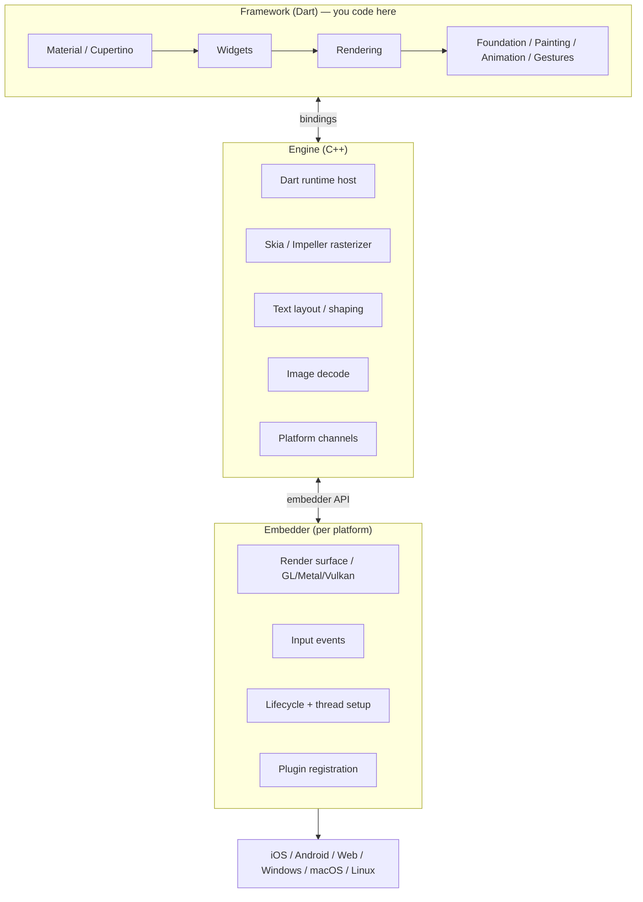
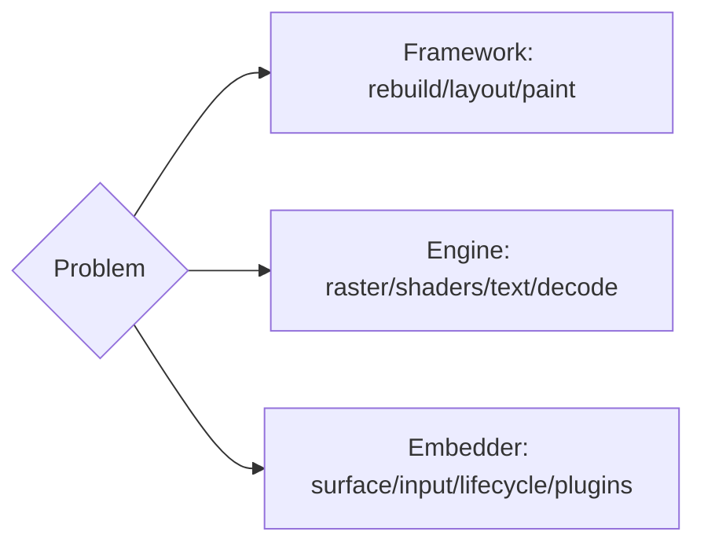

# Layered Architecture (Framework / Engine / Embedder, In Depth)

> Flutter is three layers with clean boundaries: a **Dart Framework** (what you code), a C++ **Engine** (rasterization + Dart runtime + platform plumbing), and a per-platform **Embedder** (host integration) — each replaceable, together forming a portable, fast UI system.

## Introduction

Module 06 introduced the three layers; here we detail their internal structure, boundaries, and how they collaborate per frame and at startup. This is the mental model senior engineers use to place any concern (rebuild cost, shader jank, plugin call, startup time) in the right layer.

## Why this concept exists

Clean layering makes Flutter **portable** (same framework everywhere), **fast** (native engine), and **integrable** (thin embedder per OS). Knowing the boundaries tells you where a problem lives and where a fix belongs — and why some things (reflection, direct native calls) are constrained.

## Real-world analogy

A **global restaurant franchise**: the **recipes + menu** (Framework) are identical worldwide; the **industrial kitchen equipment** (Engine) is a standardized rig shipped to each location; the **local building/utilities hookup** (Embedder) differs per city. Same food anywhere, powered by a shared kitchen, hosted in a local venue.

## Problem Statement

For a given concern — a slow rebuild, a blur that janks, a camera plugin, slow cold start — which layer owns it? By the end you'll route each precisely.

## Internal Working



| Layer | Language | Internal structure / responsibilities |
|-------|----------|----------------------------------------|
| **Framework** | Dart | Sub-layers: Material/Cupertino → Widgets → Rendering → Foundation (+ Animation, Painting, Gestures, Services). See [framework_stack.md](framework_stack.md). |
| **Engine** | C++ | Hosts the Dart runtime; rasterizes (Skia/Impeller); text shaping; image decode; platform-channel transport; frame scheduling. See [engine_internals.md](engine_internals.md). |
| **Embedder** | Platform-native (Kotlin/Swift/JS/C++) | Creates the render surface, feeds input, manages lifecycle + thread/task-runner setup, registers plugins. See [embedder_and_startup.md](embedder_and_startup.md). |

- **Boundaries**: Framework↔Engine via **bindings** (Dart↔engine bridge) and **platform channels** (async message passing); Engine↔Embedder via the **embedder API**.
- **Replaceability**: alternate embedders enable new platforms (e.g., embedded devices); the framework and much of the engine are shared.

## Memory Representation

Framework objects (three trees) in the Dart heap; engine manages GPU textures/layer resources; embedder holds the platform surface ([09 · rasterization](../09%20Rendering%20Pipeline/rasterization_skia_impeller.md), [02 · memory_and_gc](../02%20Advanced%20Dart/memory_and_gc.md)).

## Compiler Behavior

Framework Dart is JIT (debug) / AOT (release); the engine is precompiled C++ shipped in the app ([02 · dart_compilation](../02%20Advanced%20Dart/dart_compilation.md)).

## Runtime Behavior

Per frame: framework produces a layer tree (UI thread) → engine rasterizes (raster thread) → embedder presents ([09 · pipeline_overview](../09%20Rendering%20Pipeline/pipeline_overview.md)). Platform calls cross Framework→Engine→Embedder via channels.

## Flutter Engine Behavior

Covered in [engine_internals.md](engine_internals.md); the engine also owns the threading/task-runner model ([threading_model.md](threading_model.md)).

## Dart VM Behavior

The engine embeds the Dart runtime; app code runs on the root isolate ([02 · isolates](../02%20Advanced%20Dart/isolates.md)).

## Examples

```dart
// Routing a concern to a layer (mental model):
// - "Widget rebuilds too much"        -> Framework (widgets/rendering) — Module 09 build phase
// - "Blur/gradient stutters"          -> Engine (raster/shaders)       — Module 09 rasterization
// - "Need battery level from OS"      -> Embedder via platform channel — Module 26
// - "Slow cold start"                 -> Embedder/startup + engine init — embedder_and_startup.md
// - "Which thread ran this?"          -> Engine task runners           — threading_model.md
```

## Diagrams



## Common Mistakes

| Mistake | Why | Fix |
|---------|-----|-----|
| Blaming "the engine" for rebuild jank | That's the framework | Profile by phase/layer ([09](../09%20Rendering%20Pipeline/pipeline_overview.md)) |
| Expecting to modify the engine from Dart | You work in the framework | Use framework APIs/plugins |
| Doing native work without channels | Embedder boundary | Platform channels/plugins ([Module 26](../26%20Platform%20Channels/README.md)) |
| Assuming one thread | Engine is multi-threaded | Learn the task runners ([threading_model.md](threading_model.md)) |

## Best Practices

- Route every performance/integration question to a **layer** first.
- Work in the framework; cross to native only through channels; keep that boundary thin.
- Understand which layer a fix belongs to before optimizing (rebuild vs raster vs startup).

## Performance

Framework cost = rebuild/layout/paint; engine cost = raster/shaders/decode; embedder cost = surface/startup. Different fixes per layer ([Module 21](../21%20Performance/README.md)).

## Advantages / Disadvantages

- **+** Portability, speed, integrability, replaceable embedders, clear boundaries.
- **−** Native integration must cross the embedder boundary; engine adds app size; multi-layer reasoning required.

## Interview Questions

1. **🟢 Name Flutter's three layers and their languages.** — Framework (Dart), Engine (C++), Embedder (platform-native).
2. **🟢 Which layer do you write in, and what's below it?** — The Framework; below is the Engine (rasterizer + Dart runtime) and the Embedder (platform host).
3. **🟡 How do the Framework and Engine communicate?** — Via bindings (the Dart↔engine bridge) and platform channels (async messaging).
4. **🟡 What does the Embedder do that the Engine doesn't?** — Provides the OS-specific render surface, input, lifecycle, thread/task-runner setup, and plugin registration.
5. **🟡 Why is Flutter portable to new platforms?** — The framework and most of the engine are shared; only a thin embedder is platform-specific (and replaceable).
6. **🔴 Where does each of {rebuild jank, shader jank, camera access, slow startup} live?** — Framework, Engine, Embedder(channels), Embedder+engine-init respectively.
7. **🔴 Why can't you use `dart:mirrors`/reflection?** — AOT + tree shaking (engine/compilation constraints) disallow it; use codegen ([02 · dart_compilation](../02%20Advanced%20Dart/dart_compilation.md)).

## Senior Engineer Tips

- Keep a layer map in your head; it turns vague "it's slow/broken" into a precise, layer-scoped diagnosis.
- Treat the embedder/channel boundary as an integration seam — isolate native dependencies there.
- Remember the engine is shared and native; your leverage is mostly in the framework and how you use engine features.

## Architect Perspective

The layered model localizes platform risk (embedder/channels), keeps app logic portable (framework), and delivers native speed (engine). Architecting integrations around the embedder boundary and understanding engine constraints (AOT, threads, raster) shapes multi-platform strategy, plugin design, and performance budgets ([Modules 26, 21, 53, 54](../26%20Platform%20Channels/README.md)).

## Summary

- Three layers: Framework (Dart, you) → Engine (C++, raster + Dart runtime) → Embedder (platform host), joined by bindings + channels + embedder API.
- Route concerns to the owning layer; work in the framework; integrate via channels.
- Portability comes from a shared framework/engine + thin, replaceable embedders.

## Revision Notes

- Framework (Dart) / Engine (C++: raster + Dart runtime + text/decode/channels) / Embedder (surface/input/lifecycle/plugins).
- Boundaries: bindings + platform channels (FW↔Engine), embedder API (Engine↔Embedder).
- Route problems by layer: rebuild=FW, raster/shader=Engine, native=Embedder/channels, startup=Embedder+engine.
- Engine multi-threaded ([threading_model.md]); AOT ⇒ no reflection.

## Practice Questions

1. Which layer owns shader-compilation jank?
2. How does native platform data reach Dart?
3. Why is a thin embedder key to portability?

## Coding Questions

1. Map five hypothetical bugs to their owning layer with justification.
2. Sketch (comments/Mermaid) the per-frame data flow across layers.
3. Identify where a `MethodChannel` call crosses each layer.

## Mini Project

**Layer map artifact (docs):** Produce `ARCHITECTURE.md` for a sample app: a Mermaid diagram of the three layers + sub-structures, a table of responsibilities, and five real concerns routed to their layer with fixes. Acceptance: correct layer attribution; clear boundaries; concerns mapped with rationale.
