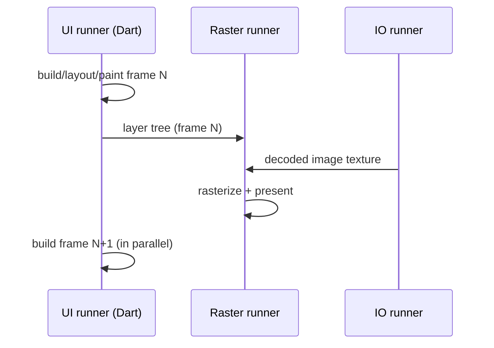

# The Threading Model (Platform / UI / Raster / IO Task Runners)

> A Flutter engine instance runs on **four task runners** — Platform, UI (Dart), Raster, and IO — each typically bound to a thread; knowing which work runs where is how you reason about jank, plugin calls, and image loading.

## Introduction

The engine organizes work into **task runners** (queues of tasks, each usually on its own thread). Your Dart UI code runs on the **UI task runner**; rasterization on the **Raster** runner; platform/plugin messaging on the **Platform** runner; image/IO work on the **IO** runner. This file details each and their interactions.

## Why this concept exists

Separating concerns across threads keeps the UI responsive: rasterization can proceed while the next frame builds; image decode/IO won't block drawing; platform calls are marshaled safely. Understanding the split lets you correctly attribute and fix performance and threading issues.

## Real-world analogy

A **restaurant with specialized stations**: the **host** greets/coordinates with the outside world (Platform), the **line cook** prepares each plate to spec (UI/Dart), the **plating/expediter** finishes and sends dishes out (Raster), and the **prep cook** washes/chops ingredients in the back (IO). Each works in parallel; if the line cook stalls, plates back up.

## Problem Statement

Why does blocking Dart freeze the UI but not necessarily rasterization mid-flight? Why must some plugin results hop threads? Where does image decoding happen? You'll answer via the four runners.

## Internal Working

```mermaid
flowchart LR
    Plat[Platform runner\nplugin/channel calls, embedder] 
    UI[UI runner (Dart)\nbuild/layout/paint, your code, animations]
    Ras[Raster runner\nGPU rasterization of layer tree]
    IO[IO runner\nimage decode, asset/file IO]
    Plat <-->|channels| UI
    UI -->|layer tree| Ras
    IO -->|decoded textures| Ras
```

| Task runner | Thread (typical) | Runs |
|-------------|------------------|------|
| **Platform** | platform/main thread | Embedder + engine setup, platform channel message handling, plugin calls (often must run here) |
| **UI** | UI thread (root isolate) | Your Dart code: build/layout/paint, animations, gesture callbacks, `main` |
| **Raster** (GPU) | raster thread | Rasterizing the layer tree to the GPU (Skia/Impeller) |
| **IO** | IO thread | Reading/decoding images/assets off the UI thread; uploads textures for the raster thread |

- The **UI runner** and **Raster runner** pipeline: while the UI builds frame N+1, the raster thread can rasterize frame N.
- **Platform channels** hop between the Platform runner and the UI runner (async, serialized messages) ([Module 26](../26%20Platform%20Channels/README.md)).
- **Background isolates** you spawn (`Isolate.run`/`compute`) are separate from these engine runners — used for your CPU-bound Dart work ([02 · isolates](../02%20Advanced%20Dart/isolates.md)).
- Blocking the **UI runner** (heavy sync Dart) stalls build/layout/paint → dropped frames; it does not necessarily stop an in-flight raster.

## Memory Representation

Each isolate/runner has its own stack; the Dart heap belongs to the root isolate (UI runner). GPU resources live on the raster/IO side ([02 · memory_and_gc](../02%20Advanced%20Dart/memory_and_gc.md)).

## Compiler Behavior

Not applicable.

## Runtime Behavior

Tasks are queued per runner and executed in order; cross-runner communication is via messages/callbacks. Plugin method results are delivered back to the UI runner asynchronously.

## Flutter Engine Behavior

The engine owns and schedules these runners; the embedder sets up the threads/task runners at startup ([embedder_and_startup.md](embedder_and_startup.md)). Some embedders may merge runners (e.g., platform+UI) in certain configs.

## Dart VM Behavior

Your Dart runs on the UI runner's root isolate event loop; `compute`/`Isolate.spawn` create additional Dart isolates (not the engine runners) for parallel CPU work ([02 · isolates](../02%20Advanced%20Dart/isolates.md)).

## Examples

```dart
import 'dart:isolate';
import 'package:flutter/material.dart';
import 'package:flutter/services.dart';

// UI runner: your build code + a heavy task offloaded to a background isolate
class ThreadDemo extends StatelessWidget {
  const ThreadDemo({super.key});

  Future<void> _heavy() async {
    // CPU-bound work OFF the UI runner (separate Dart isolate), keeping frames smooth:
    final sum = await Isolate.run(() {
      var s = 0;
      for (var i = 0; i < 100000000; i++) s += i;
      return s;
    });
    debugPrint('sum=$sum');
  }

  Future<void> _platformCall() async {
    // Platform channel: message hops UI runner <-> Platform runner (async)
    const channel = MethodChannel('demo/info');
    // final v = await channel.invokeMethod('getInfo'); // handled on Platform runner
  }

  @override
  Widget build(BuildContext context) => ElevatedButton(
        onPressed: _heavy, // UI stays responsive because work is offloaded
        child: const Text('Run heavy (offloaded)'),
      );
}
```

## Diagrams



## Common Mistakes

| Mistake | Why | Fix |
|---------|-----|-----|
| Heavy CPU work on the UI runner | Blocks build/layout/paint → jank | Offload to a background isolate (`compute`/`Isolate.run`) |
| Expecting isolates to share the engine runners | They're separate Dart isolates | Communicate via messages/ports |
| Decoding huge images on the UI runner | Blocks frames | Let the framework/IO runner decode; size decodes ([07 · images](../07%20Widgets/images_and_assets.md)) |
| Calling plugins from a background isolate without setup | No channel wired there | `RootIsolateToken` + background messenger ([02 · isolates](../02%20Advanced%20Dart/isolates.md)) |
| Assuming raster jank = UI-thread problem | Different runner | Check `rasterDuration` ([09 · rasterization](../09%20Rendering%20Pipeline/rasterization_skia_impeller.md)) |

## Best Practices

- Keep the **UI runner** free: offload CPU-bound Dart to background isolates.
- Let the framework handle image decode/IO (via the IO runner); size decodes to bound memory.
- Treat platform-channel calls as async cross-runner hops; keep payloads small, off hot paths.
- Diagnose jank by **runner**: UI (build/layout/paint) vs Raster (GPU) vs Platform (channels) vs IO (decode).

## Performance

Parallel UI/Raster pipelining sustains high frame rates; the common failure is UI-runner blocking. Raster-runner jank needs raster fixes (effects/shaders/Impeller — [09](../09%20Rendering%20Pipeline/rasterization_skia_impeller.md), [Module 21](../21%20Performance/README.md)).

## Advantages / Disadvantages

- **+** Responsive UI via parallelism; IO/decode off the UI thread; safe platform marshaling.
- **−** Cross-thread reasoning needed; plugin/thread pitfalls; background isolates need setup for channels.

## Interview Questions

1. **🟢 What are the engine's task runners?** — Platform, UI (Dart), Raster (GPU), and IO — each typically on its own thread.
2. **🟢 Which runner runs your Dart UI code?** — The UI task runner (root isolate).
3. **🟡 Why does blocking Dart cause jank but rasterization can proceed?** — Build/layout/paint run on the UI runner; rasterization runs on the separate Raster runner (they pipeline), so a blocked UI runner stops producing frames.
4. **🟡 Where does image decoding happen?** — On the IO runner (off the UI thread), uploading textures for the Raster runner.
5. **🟡 How do platform-channel calls relate to threads?** — They hop asynchronously between the UI runner and the Platform runner (where plugin code runs).
6. **🔴 Are `compute`/`Isolate.run` the same as the engine runners?** — No; they're separate Dart isolates you spawn for CPU work, distinct from the engine's four runners.
7. **🔴 How do you diagnose which runner is the bottleneck?** — Frame timings/DevTools: `buildDuration` (UI) vs `rasterDuration` (Raster); plugin latency (Platform); slow images (IO).

## Senior Engineer Tips

- First question for any jank: *which runner?* UI-bound and raster-bound jank have completely different fixes.
- Offload CPU work to isolates; never sneak heavy synchronous loops into build/gesture callbacks on the UI runner.
- For plugins in background isolates, wire `RootIsolateToken`/background messenger deliberately.

## Architect Perspective

The multi-runner model is Flutter's concurrency backbone. Architecting a clear "compute offload" boundary (isolates for CPU work), disciplined channel usage (Platform runner), and image/IO strategy keeps the UI runner free and frames smooth at scale — central to performance and background-work design ([Modules 21, 33, 26](../21%20Performance/README.md)).

## Summary

- Four engine task runners: Platform, UI (Dart), Raster (GPU), IO — mostly one thread each, pipelined.
- Your code runs on the UI runner; offload CPU work to background isolates; decode/IO on the IO runner; channels hop to the Platform runner.
- Diagnose jank by runner; keep the UI runner free.

## Revision Notes

- Runners: Platform (channels/embedder), UI (your Dart/build/layout/paint), Raster (GPU), IO (image decode).
- UI ∥ Raster pipeline; blocking UI runner → dropped frames.
- `compute`/`Isolate.run` = separate Dart isolates (not engine runners).
- Diagnose: `buildDuration`(UI) vs `rasterDuration`(Raster); channels=Platform; images=IO.

## Practice Questions

1. Why does a 500ms Dart loop freeze the UI?
2. Where is image decoding done and why?
3. How do plugin calls cross threads?

## Coding Questions

1. Offload a heavy computation with `Isolate.run` and keep an animation smooth.
2. Add frame-timing logging to classify UI- vs raster-bound frames.
3. Show a plugin call and note which runner handles it.

## Mini Project

**Runner diagnosis (Flutter + docs):** Build a screen with an animation, a heavy computation button, and an image grid; demonstrate UI-runner blocking (then fix with `Isolate.run`), and capture UI vs raster timings. Write `THREADS.md` attributing work to runners. Acceptance: offload keeps frames smooth; timings classified by runner; correct attribution.
