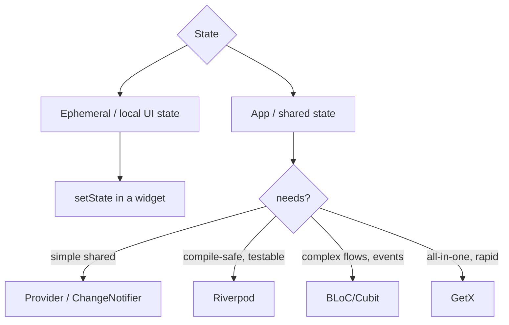
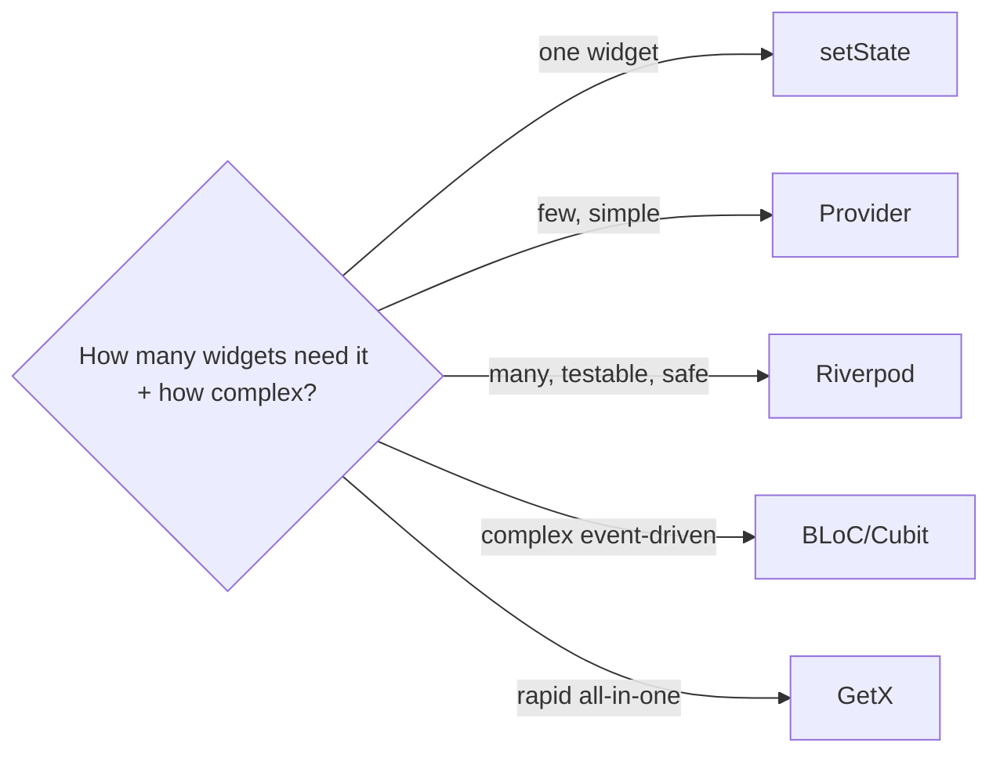

# State Management Overview & How to Choose

> State is any data that changes over time and affects the UI; **ephemeral (local UI) state** belongs in a widget's `State`, while **app (shared) state** needs a management solution — and the right choice depends on scope, testability, and team, not hype.

## Introduction

Before learning tools, you need the mental model: what *is* state, the ephemeral-vs-app distinction, and a decision framework. This file gives you that so the tool files (Provider/Riverpod/BLoC/…) become "how" not "whether."

## Why this concept exists

Teams waste enormous energy arguing over state solutions without first classifying their state. Most apps need *both* local `setState` and a shared-state solution. A clear framework prevents over-engineering (BLoC for a toggle) and under-engineering (global mutable singletons).

## Real-world analogy

State is a **household's information**: a sticky note on your own desk (ephemeral — only you use it) vs the shared family calendar on the fridge (app state — everyone reads/updates it). You don't put every personal note on the fridge, nor keep the shared calendar only in your head.

## Problem Statement

You have: a form field's text (local), a bottom-nav index (local-ish), the logged-in user (app-wide), and a cart (app-wide, complex). Which needs a state solution, and which one? By the end you'll route each.

## Internal Working



**Two kinds of state (Flutter's own framing):**
- **Ephemeral (UI/local) state**: lives in one widget, no one else needs it (animation progress, current tab, a text field, expanded/collapsed). → `setState` ([02_setstate_and_lifting_state.md](02_setstate_and_lifting_state.md)).
- **App (shared) state**: used across widgets/screens or persisted (auth, cart, settings, cached data, feature state). → a management solution.

**The decision axes:**

| Axis | Ask |
|------|-----|
| **Scope** | One widget? → local. Many widgets/screens? → shared. |
| **Complexity** | Simple value? Complex flows with many transitions/events? |
| **Testability** | Must logic be unit-testable independent of UI? |
| **Rebuild control** | Need fine-grained, minimal rebuilds? |
| **Team/ecosystem** | Team familiarity; existing codebase conventions. |
| **Boilerplate tolerance** | Rapid prototyping vs strict structure. |

- All shared solutions are, under the hood, **Observer** ([05 · observer](../05%20Design%20Patterns/12_observer.md)) + often DI ([05 · dependency_injection](../05%20Design%20Patterns/21_dependency_injection.md)) built on `InheritedWidget` or a container.

## Memory Representation

Shared state objects live outside the widget tree (in providers/containers) and are observed by widgets; lifecycle/disposal matters ([08 · dispose_and_leaks](../08%20Widget%20Lifecycle/05_dispose_and_leaks.md)).

## Compiler Behavior / Runtime Behavior

Compile-safety varies: Riverpod catches missing providers at compile/analysis time; `Provider.of<T>` can throw at runtime if not found. Rebuild granularity varies by solution and how you subscribe (whole-object vs selector).

## Flutter Engine Behavior

Not applicable directly; state changes trigger rebuilds feeding the pipeline ([09](../09%20Rendering%20Pipeline/02_build_phase.md)).

## Dart VM Behavior

Not applicable.

## Examples

```dart
// Routing state to a solution (mental model):
// - TextField content while typing      -> ephemeral -> setState/controller
// - Selected bottom-nav tab             -> ephemeral (usually) -> setState
// - Logged-in user / auth status        -> app state -> Provider/Riverpod/BLoC
// - Shopping cart (add/remove/total)     -> app state, moderate complexity -> Provider/Riverpod
// - Multi-step checkout with many states -> complex -> BLoC (events->states)
// - Rapid MVP, one dev                   -> GetX or Provider
```

## Diagrams



## Common Mistakes

| Mistake | Why | Fix |
|---------|-----|-----|
| BLoC for a toggle | Over-engineering | Use `setState` for ephemeral state |
| Global mutable singletons for shared state | Untestable, uncontrolled rebuilds | Use a proper solution + DI |
| Putting business logic in widgets | Coupled, untestable | Move to notifier/bloc/viewmodel |
| Choosing by hype, not needs | Wrong fit | Use the decision axes |
| One giant provider for everything | Broad rebuilds, low cohesion | Split by feature; use selectors |

## Best Practices

- Classify each piece of state: **ephemeral → `setState`**, **shared → a solution**.
- Keep **business logic out of widgets**; widgets render + dispatch.
- Prefer **fine-grained subscriptions** (selectors) to minimize rebuilds ([09 · build_phase](../09%20Rendering%20Pipeline/02_build_phase.md)).
- Pick by scope/complexity/testability/team — and be consistent across the codebase.
- Don't mix many solutions arbitrarily; standardize.

## Performance

Rebuild scope is the key perf factor: whole-object listening rebuilds broadly; selectors/`select`/`buildWhen` rebuild only dependents. Covered per solution and in [10_comparison_and_selection.md](10_comparison_and_selection.md).

## Advantages / Disadvantages

- **+** A clear framework prevents over/under-engineering and guides consistent choices.
- **−** No universal "best"; context-dependent; requires understanding tradeoffs.

## Interview Questions

1. **🟢 What's the difference between ephemeral and app state?** — Ephemeral is local to one widget (no one else needs it) → `setState`; app state is shared across widgets/screens or persisted → a state solution.
2. **🟢 Give examples of each.** — Ephemeral: current tab, animation, text field. App: auth/user, cart, settings, cached data.
3. **🟡 How do you decide on a state solution?** — By scope, complexity, testability needs, rebuild-control needs, and team/ecosystem — not by popularity.
4. **🟡 What do all shared-state solutions have in common under the hood?** — The Observer pattern (notify dependents) plus dependency provision (often via `InheritedWidget`/a container).
5. **🟡 Why keep business logic out of widgets?** — Testability and reuse; widgets should render and dispatch, with logic in notifiers/blocs/viewmodels.
6. **🔴 What's the main performance lever across solutions?** — Rebuild granularity: subscribe narrowly (selectors) so only dependent widgets rebuild.
7. **🔴 When is `setState` the right choice even in a large app?** — For genuinely local, ephemeral UI state; not everything needs global management.

## Senior Engineer Tips

- Start by drawing where each state *lives* and *who reads it*; the solution follows.
- Prefer a solution with strong testability and fine-grained rebuilds for shared state; keep `setState` for local UI.
- Standardize one primary solution per codebase; document the convention.

## Architect Perspective

State architecture determines testability, performance, and scalability of the whole UI layer. The durable decision is *separation* — UI vs state vs domain — more than the specific package. A clear ephemeral/app split plus a consistent shared-state solution (with fine-grained rebuilds and DI) scales across teams ([Modules 40, 43](../40%20Clean%20Architecture/README.md)).

## Summary

- Classify state: ephemeral (`setState`) vs app (a solution).
- Choose by scope/complexity/testability/rebuild-control/team.
- All shared solutions are Observer + DI at heart; the win is separation + fine-grained rebuilds.

## Revision Notes

- Ephemeral (local) → `setState`; app (shared) → solution.
- Decide by scope/complexity/testability/rebuild-control/team.
- Logic out of widgets; subscribe narrowly (selectors).
- All shared solutions = Observer (+DI); no universal best.

## Practice Questions

1. Classify five pieces of state as ephemeral or app.
2. Why is a global mutable singleton a poor shared-state choice?
3. What single factor most affects rebuild performance?

## Coding Questions

1. Take a widget mixing UI + logic; separate the logic out.
2. Route a list of app features to appropriate state solutions with justification.
3. Identify an over-engineered BLoC that should be `setState`.

## Mini Project

**State classification exercise (docs):** For a described app (auth, cart, settings, feed, checkout), write `STATE.md` classifying each state as ephemeral/app, recommending a solution per item with rationale using the decision axes. Acceptance: correct classification; justified choices; no over/under-engineering.
